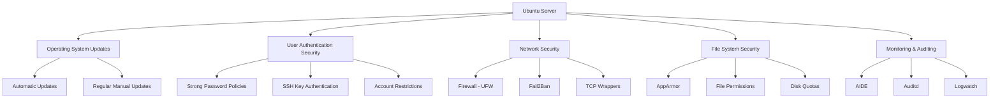

# Ubuntu Server Security

## Introduction

Security is a critical aspect of server administration, especially for systems that are publicly accessible or host sensitive data. Ubuntu Server provides a robust foundation for building secure systems, but proper configuration and maintenance are essential to protect against threats. This guide will walk you through the fundamental security concepts and practical steps to secure your Ubuntu Server deployment.

## Why Security Matters

An insecure server can be compromised, leading to:

- Data theft or loss
- Service disruptions
- Use of your server resources for malicious purposes (crypto mining, botnet participation, etc.)
- Damage to your reputation
- Potential legal and financial consequences

By implementing proper security measures from the beginning, you significantly reduce these risks.

## Security Updates and Patching

### Keeping Your System Updated

Regular updates are your first line of defense against security vulnerabilities. Ubuntu's package management system makes this process straightforward.

```bash
# Update package lists
sudo apt update

# Install available updates
sudo apt upgrade

# Alternative: combine both commands
sudo apt update && sudo apt upgrade -y
```

For kernel updates, you'll need to reboot your system:

```bash
sudo apt full-upgrade
sudo reboot
```

### Enabling Automatic Security Updates

For servers where manual updates aren't always feasible, configure automatic security updates:

```bash
# Install the unattended-upgrades package
sudo apt install unattended-upgrades

# Enable automatic updates
sudo dpkg-reconfigure unattended-upgrades
```

You can customize the behavior by editing `/etc/apt/apt.conf.d/50unattended-upgrades`. For example, to automatically reboot when necessary:

```bash
Unattended-Upgrade::Automatic-Reboot "true";
Unattended-Upgrade::Automatic-Reboot-Time "02:00";
```

## User and Authentication Security

### Password Policies

Enforce strong password policies to protect user accounts:

1. Install the password quality checking library:

```bash
sudo apt install libpam-pwquality
```

2. Edit the PAM configuration:

```bash
sudo nano /etc/pam.d/common-password
```

3. Add or modify the password requirement line:

```
password requisite pam_pwquality.so retry=3 minlen=12 difok=3 ucredit=-1 lcredit=-1 dcredit=-1 ocredit=-1 reject_username enforce_for_root
```

This configuration:
- Requires passwords to be at least 12 characters long
- Requires uppercase, lowercase, digit, and special characters
- Prevents using the username in the password
- Applies these rules to the root user as well

### SSH Security

Secure Shell (SSH) is the primary method for remote administration. Securing it is crucial:

1. Edit the SSH configuration:

```bash
sudo nano /etc/ssh/sshd_config
```

2. Make these recommended changes:

```
# Use protocol 2 only
Protocol 2

# Disable root login
PermitRootLogin no

# Restrict access to specific users
AllowUsers your_username

# Use public key authentication instead of passwords
PasswordAuthentication no

# Change default port (optional but recommended)
Port 2222

# Disable empty passwords
PermitEmptyPasswords no

# Set idle timeout interval
ClientAliveInterval 300
ClientAliveCountMax 2
```

3. Restart SSH to apply changes:

```bash
sudo systemctl restart sshd
```

### Setting Up SSH Key Authentication

SSH keys provide stronger security than passwords:

1. Generate an SSH key pair on your client machine:

```bash
ssh-keygen -t ed25519 -C "your_email@example.com"
```

2. Copy your public key to the server:

```bash
ssh-copy-id -i ~/.ssh/id_ed25519.pub username@server_ip
```

3. After confirming key-based login works, disable password authentication as shown above.

## Firewall Configuration

### Configuring UFW (Uncomplicated Firewall)

Ubuntu includes UFW, a user-friendly interface for managing iptables:

1. Install UFW if not already present:

```bash
sudo apt install ufw
```

2. Set up basic rules:

```bash
# Deny all incoming traffic by default
sudo ufw default deny incoming

# Allow all outgoing traffic
sudo ufw default allow outgoing

# Allow SSH (adjust port if you changed it)
sudo ufw allow 22/tcp

# Allow other services as needed (examples)
sudo ufw allow 80/tcp   # HTTP
sudo ufw allow 443/tcp  # HTTPS
```

3. Enable the firewall:

```bash
sudo ufw enable
```

4. Check status:

```bash
sudo ufw status verbose
```

Example output:

```
Status: active
Logging: on (low)
Default: deny (incoming), allow (outgoing), disabled (routed)
New profiles: skip

To                         Action      From
--                         ------      ----
22/tcp                     ALLOW IN    Anywhere
80/tcp                     ALLOW IN    Anywhere
443/tcp                    ALLOW IN    Anywhere
22/tcp (v6)                ALLOW IN    Anywhere (v6)
80/tcp (v6)                ALLOW IN    Anywhere (v6)
443/tcp (v6)               ALLOW IN    Anywhere (v6)
```

### Configuring Fail2Ban to Prevent Brute Force Attacks

Fail2Ban monitors log files and temporarily bans IP addresses that show malicious signs:

1. Install Fail2Ban:

```bash
sudo apt install fail2ban
```

2. Create a local configuration file:

```bash
sudo cp /etc/fail2ban/jail.conf /etc/fail2ban/jail.local
sudo nano /etc/fail2ban/jail.local
```

3. Configure SSH protection:

```
[sshd]
enabled = true
port = ssh
filter = sshd
logpath = /var/log/auth.log
maxretry = 3
bantime = 3600
```

4. Start the service:

```bash
sudo systemctl enable fail2ban
sudo systemctl start fail2ban
```

5. Check its status:

```bash
sudo fail2ban-client status sshd
```

Example output:

```
Status for the jail: sshd
|- Filter
|  |- Currently failed: 0
|  |- Total failed: 0
|  `- Journal matches: _SYSTEMD_UNIT=sshd.service + _COMM=sshd
`- Actions
   |- Currently banned: 0
   |- Total banned: 0
   `- Banned IP list:
```

## System Hardening

### Secure Shared Memory

The `/run/shm` is a temporary file storage that can be used to access shared memory segments. Secure it by adding to `/etc/fstab`:

```bash
sudo nano /etc/fstab
```

Add this line:

```
tmpfs     /run/shm     tmpfs     defaults,noexec,nosuid,nodev     0     0
```

### Disable Unused Services

Minimize attack surface by disabling unnecessary services:

```bash
# List running services
systemctl list-units --type=service --state=running

# Disable an unused service
sudo systemctl stop service_name
sudo systemctl disable service_name
```

### Restrict Access to Cron

Limit who can schedule tasks:

```bash
sudo nano /etc/cron.allow
```

Add only users who need cron access. All others will be automatically denied.

### Set Up Process Accounting

Monitor user activities by enabling process accounting:

```bash
sudo apt install acct
sudo touch /var/log/wtmp
sudo accton /var/log/wtmp
```

View user activity:

```bash
sudo lastcomm username
```

## File System Security

### Implement Disk Quotas

Prevent disk space abuse by setting up quotas:

1. Install quota tools:

```bash
sudo apt install quota
```

2. Modify `/etc/fstab` to enable quotas. Add `usrquota,grpquota` to the mount options:

```
UUID=xxxxx / ext4 defaults,usrquota,grpquota 0 1
```

3. Remount and create quota database:

```bash
sudo mount -o remount /
sudo quotacheck -ugm /
sudo quotaon -v /
```

4. Set quotas for users:

```bash
sudo setquota -u username 5000000 6000000 0 0 /
```

This sets a soft limit of approximately 5GB and a hard limit of 6GB.

### Configure AppArmor

AppArmor provides Mandatory Access Control (MAC) for programs:

1. Verify AppArmor is running:

```bash
sudo aa-status
```

2. Install AppArmor utilities:

```bash
sudo apt install apparmor-utils
```

3. List profiles:

```bash
sudo aa-status
```

4. Set a profile to enforce mode:

```bash
sudo aa-enforce /path/to/profile
```

## Network Security

### TCP Wrappers

Control access to services based on hostname or IP address:

1. Edit the hosts.allow file to specify allowed connections:

```bash
sudo nano /etc/hosts.allow
```

Add rules like:

```
sshd: 192.168.1.0/24 10.0.0.0/8
```

2. Deny all other connections in hosts.deny:

```bash
sudo nano /etc/hosts.deny
```

Add:

```
ALL: ALL
```

### IP Spoofing Protection

Edit `/etc/host.conf`:

```bash
sudo nano /etc/host.conf
```

Ensure it contains:

```
order bind,hosts
nospoof on
```

## Security Monitoring and Intrusion Detection

### Install and Configure Audit Daemon

Audit daemon logs system calls and file accesses:

```bash
sudo apt install auditd
sudo systemctl enable auditd
sudo systemctl start auditd
```

Create a basic audit rule:

```bash
sudo nano /etc/audit/rules.d/audit.rules
```

Add rules like:

```
# Monitor changes to authentication configuration
-w /etc/pam.d/ -p wa -k auth_changes
-w /etc/nsswitch.conf -p wa -k auth_changes

# Monitor system user/group changes
-w /etc/passwd -p wa -k user_changes
-w /etc/group -p wa -k group_changes
-w /etc/shadow -p wa -k shadow_changes
```

Restart the service:

```bash
sudo systemctl restart auditd
```

### Install AIDE (Advanced Intrusion Detection Environment)

AIDE monitors file changes on your system:

```bash
sudo apt install aide
```

Initialize the database:

```bash
sudo aideinit
```

This will take some time as it creates checksums of files.

Configure daily checks by editing `/etc/default/aide`:

```bash
sudo nano /etc/default/aide
```

Set:

```
CRON_DAILY_RUN=yes
```

### Set Up Logwatch for Log Monitoring

Logwatch summarizes log activity:

```bash
sudo apt install logwatch
```

Configure it to email daily reports:

```bash
sudo nano /etc/cron.daily/00logwatch
```

Modify the script to include:

```
/usr/sbin/logwatch --output mail --mailto your_email@example.com --detail high
```

## Security Best Practices Visualization

Here's a visualization of the layered security approach:



## Summary

Securing an Ubuntu Server involves multiple layers of protection:

1. **Keep your system updated** to patch known vulnerabilities
2. **Implement strong authentication** policies and SSH hardening
3. **Configure a firewall** to control incoming and outgoing traffic
4. **Disable unnecessary services** to reduce attack surface
5. **Monitor system activities** and detect intrusions
6. **Regularly audit your security** measures to ensure they remain effective

Remember that security is an ongoing process, not a one-time setup. Regular reviews and updates to your security posture are essential to maintain protection against evolving threats.

## Additional Resources

- [Ubuntu Server Guide - Security](https://ubuntu.com/server/docs/security-introduction)
- [Center for Internet Security (CIS) Benchmarks](https://www.cisecurity.org/benchmark/ubuntu_linux/)
- [NIST Special Publication 800-123: Guide to General Server Security](https://csrc.nist.gov/publications/detail/sp/800-123/final)

## Exercises

1. Set up SSH key-based authentication and disable password authentication.
2. Configure UFW to allow only necessary services.
3. Install and configure Fail2Ban with custom jails for services you're running.
4. Create a security update schedule and documentation process.
5. Perform a security audit using `lynis` (install with `sudo apt install lynis`).