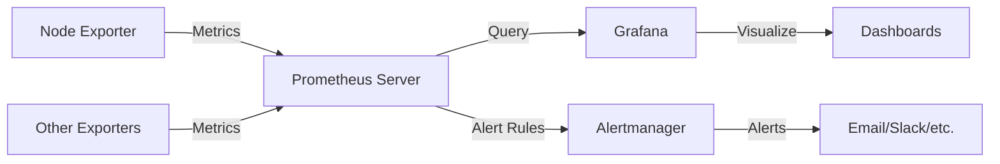
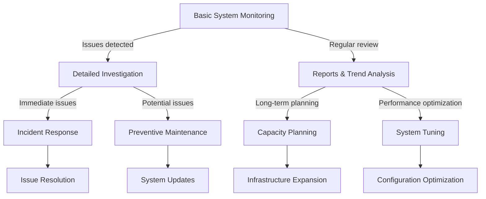

# Ubuntu Server Monitoring

## Introduction

Effective server monitoring is a critical aspect of maintaining a healthy and reliable Ubuntu server environment. Monitoring enables you to track system performance, identify potential issues before they become critical, and ensure optimal operation of your services. This guide will introduce you to the fundamentals of Ubuntu server monitoring, essential tools, and practical implementations to help you establish a robust monitoring strategy.

Server monitoring involves tracking various metrics and aspects of your system:

- **Resource utilization**: CPU, memory, disk, and network usage
- **Service availability**: Ensuring critical services remain operational
- **Performance metrics**: Response times and throughput
- **Security monitoring**: Detecting suspicious activities
- **Log analysis**: Tracking system and application logs

Whether you're managing a single server or a fleet of machines, understanding these monitoring concepts and tools will help you maintain a reliable infrastructure.

## Basic System Monitoring Tools

Ubuntu comes with several built-in tools that provide immediate insights into your system's health.

### The `top` Command

The `top` command provides a real-time, dynamic view of system performance:

```bash
top
```

**Example output:**

```
top - 14:23:45 up 23 days, 21:52, 1 user, load average: 0.08, 0.03, 0.01
Tasks: 128 total,   1 running, 127 sleeping,   0 stopped,   0 zombie
%Cpu(s):  1.7 us,  0.3 sy,  0.0 ni, 97.9 id,  0.0 wa,  0.0 hi,  0.1 si,  0.0 st
MiB Mem :   3959.7 total,    190.1 free,   1536.3 used,   2233.3 buff/cache
MiB Swap:   2048.0 total,   2047.7 free,      0.3 used.   2138.6 avail Mem 

  PID USER      PR  NI    VIRT    RES    SHR S  %CPU  %MEM     TIME+ COMMAND
 1022 root      20   0  725204  41672  21592 S   0.7   1.0 107:34.83 systemd-journald
 1536 mysql     20   0 1755972 352072  41464 S   0.7   8.7  60:24.51 mysqld
 2104 www-data  20   0  705984  68464  42416 S   0.7   1.7   1:12.64 apache2
```

Understanding this output:
- **Load average**: Numbers representing system load over 1, 5, and 15 minutes
- **CPU usage**: Broken down by user processes, system processes, idle time, etc.
- **Memory usage**: Total, free, used, and cached memory
- **Process information**: PID, user, CPU and memory usage per process

### The `htop` Tool

A more user-friendly alternative to `top` is `htop`, which you can install with:

```bash
sudo apt install htop
```

Run it with:

```bash
htop
```

`htop` provides color-coding, visual meters for CPU/memory usage, and easier process management with function key shortcuts displayed at the bottom.

### Disk Usage Monitoring

Monitor disk space with the `df` command:

```bash
df -h
```

**Example output:**

```
Filesystem      Size  Used Avail Use% Mounted on
/dev/sda1        30G   12G   17G  42% /
/dev/sda2       915G  253G  616G  30% /data
tmpfs           2.0G     0  2.0G   0% /dev/shm
```

For detailed disk usage by directory, use `du`:

```bash
du -sh /var/log
```

**Output example:**
```
126M    /var/log
```

### System Resource Usage with `vmstat`

The `vmstat` command gives you information about system memory, processes, paging, block I/O, and CPU activity:

```bash
vmstat 1 5
```

This runs `vmstat` every second for 5 iterations.

**Example output:**

```
procs -----------memory---------- ---swap-- -----io---- -system-- ------cpu-----
 r  b   swpd   free   buff  cache   si   so    bi    bo   in   cs us sy id wa st
 0  0      0 194348  96168 2188608    0    0     0     5    1    1  2  0 98  0  0
 0  0      0 194348  96168 2188608    0    0     0     0  102  168  1  0 99  0  0
 0  0      0 194348  96168 2188608    0    0     0     0  107  162  1  0 99  0  0
 0  0      0 194348  96168 2188608    0    0     0     0  117  180  1  0 99  0  0
 0  0      0 194348  96168 2188608    0    0     0    24  106  177  1  0 99  0  0
```

### Network Statistics with `netstat` and `ss`

Monitor network connections with:

```bash
ss -tuln
```

**Example output:**

```
Netid  State   Recv-Q  Send-Q     Local Address:Port     Peer Address:Port  Process
udp    UNCONN  0       0            127.0.0.1:323           0.0.0.0:*
udp    UNCONN  0       0                [::1]:323              [::]:*
tcp    LISTEN  0       4096         127.0.0.1:3306          0.0.0.0:*
tcp    LISTEN  0       128            0.0.0.0:22            0.0.0.0:*
tcp    LISTEN  0       511            0.0.0.0:80            0.0.0.0:*
tcp    LISTEN  0       128               [::]:22               [::]:*
tcp    LISTEN  0       511               [::]:80               [::]:*
```

## Advanced Monitoring with Specialized Tools

For more comprehensive monitoring, several dedicated tools are available:

### Prometheus and Grafana

These tools provide powerful monitoring and visualization capabilities:

1. **Install Prometheus:**

```bash
sudo apt install prometheus prometheus-node-exporter
```

2. **Install Grafana:**

```bash
sudo apt-get install -y software-properties-common
sudo add-apt-repository "deb https://packages.grafana.com/oss/deb stable main"
wget -q -O - https://packages.grafana.com/gpg.key | sudo apt-key add -
sudo apt-get update
sudo apt-get install grafana
```

3. **Start the services:**

```bash
sudo systemctl enable prometheus prometheus-node-exporter grafana-server
sudo systemctl start prometheus prometheus-node-exporter grafana-server
```

With these tools, you can create customized dashboards to monitor virtually any aspect of your Ubuntu server.

Here's a simplified view of how Prometheus and Grafana work together:



### Netdata

Netdata is a lightweight, real-time performance monitoring tool:

```bash
# Install dependencies
sudo apt install -y zlib1g-dev uuid-dev libuv1-dev liblz4-dev libjudy-dev libssl-dev libmnl-dev gcc make autoconf autoconf-archive autogen automake pkg-config curl

# Install Netdata
bash <(curl -Ss https://my-netdata.io/kickstart.sh)
```

After installation, access Netdata's web interface at `http://your-server-ip:19999`.

### Nagios Core

Nagios is a powerful monitoring system for servers, networks, and infrastructure:

```bash
# Install dependencies
sudo apt install -y build-essential libgd-dev openssl libssl-dev unzip apache2 php libapache2-mod-php php-gd libgd-dev

# Download and install Nagios
cd /tmp
wget https://github.com/NagiosEnterprises/nagioscore/archive/nagios-4.4.6.tar.gz
tar xzf nagios-4.4.6.tar.gz
cd nagioscore-nagios-4.4.6/
./configure --with-httpd-conf=/etc/apache2/sites-enabled
make all
sudo make install
```

Configure Nagios according to your needs, set up monitoring targets, and access its web interface for a comprehensive view of your server environment.

## Log Monitoring and Analysis

Logs provide critical information about system events. Here's how to effectively monitor them:

### Basic Log Viewing

The most straightforward way to view logs is using the `cat`, `less`, or `tail` commands:

```bash
# View the entire log
less /var/log/syslog

# View the last 50 lines
tail -n 50 /var/log/syslog

# Follow new log entries in real-time
tail -f /var/log/syslog
```

### Using `journalctl` for Systemd Logs

Modern Ubuntu systems use systemd, which has its own logging system accessed through `journalctl`:

```bash
# View all logs
journalctl

# View logs for a specific service
journalctl -u apache2

# View logs from the current boot
journalctl -b

# View logs since a specific time
journalctl --since "2023-03-20 10:00:00"
```

### Log Monitoring with `logwatch`

`logwatch` provides a daily report of log activities:

```bash
sudo apt install logwatch

# Generate a report for the past day
sudo logwatch --output stdout --format html --range yesterday --detail high > ~/log_report.html
```

## Setting Up Automated Monitoring and Alerts

To be proactive about server issues, set up automated monitoring and alerting:

### Monitoring Disk Space and Sending Email Alerts

Create a simple shell script to monitor disk usage:

```bash
#!/bin/bash
# disk_monitor.sh

THRESHOLD=90
EMAIL="admin@example.com"

df -h | grep -vE '^Filesystem|tmpfs|cdrom' | awk '{ print $5 " " $1 }' | while read output;
do
  usep=$(echo $output | awk '{ print $1}' | cut -d'%' -f1 )
  partition=$(echo $output | awk '{ print $2 }' )
  if [ $usep -ge $THRESHOLD ]; then
    echo "Running out of space \"$partition ($usep%)\" on $(hostname) as on $(date)" | 
    mail -s "Disk Space Alert: $partition on $(hostname) is $usep% full" $EMAIL
  fi
done
```

Make it executable and add to crontab:

```bash
chmod +x disk_monitor.sh
crontab -e

# Add this line to run it every hour
0 * * * * /path/to/disk_monitor.sh
```

### Setting Up Server Monitoring with Monit

Monit is a simple yet powerful tool for monitoring services:

```bash
sudo apt install monit
```

Configure Monit by editing `/etc/monit/monitrc`:

```
set daemon 120            # Check services every 2 minutes
set logfile /var/log/monit.log
set idfile /var/lib/monit/id
set statefile /var/lib/monit/state

set httpd port 2812 and
    use address localhost  # Only accept connection from localhost
    allow localhost        # Allow localhost to connect

check system $HOST
    if loadavg (5min) > 3 then alert
    if memory usage > 80% then alert
    if cpu usage (user) > 70% then alert

check process apache with pidfile /var/run/apache2/apache2.pid
    start program = "/etc/init.d/apache2 start"
    stop program  = "/etc/init.d/apache2 stop"
    if failed host 127.0.0.1 port 80 protocol http then restart
    if cpu > 60% for 2 cycles then alert
    if cpu > 80% for 5 cycles then restart
```

Start Monit:

```bash
sudo systemctl enable monit
sudo systemctl start monit
```

## Best Practices for Server Monitoring

To establish an effective monitoring strategy:

1. **Define critical metrics**: Identify what's most important for your specific server use case.

2. **Set appropriate thresholds**: Configure alerts based on realistic thresholds to avoid alert fatigue.

3. **Implement a centralized monitoring solution**: For multiple servers, use a centralized tool like Prometheus or Nagios.

4. **Create a response plan**: Have clear procedures for when alerts are triggered.

5. **Regular review**: Periodically review your monitoring setup to ensure it meets your evolving needs.

6. **Combine monitoring tools**: Different tools have different strengths; use them in combination.

7. **Implement log rotation**: Prevent logs from consuming all disk space.

```bash
sudo nano /etc/logrotate.conf
```

8. **Monitor from outside your network**: External monitoring can detect issues that internal monitoring might miss.

## Monitoring Workflow

Here's a typical monitoring workflow for an Ubuntu server:



## Summary

Ubuntu server monitoring is essential for maintaining system health and preventing downtime. By utilizing built-in tools like `top`, `htop`, and `df`, along with specialized solutions like Prometheus, Grafana, and Monit, you can establish comprehensive visibility into your server's performance.

Remember to:
- Monitor key resources: CPU, memory, disk, and network
- Analyze logs for troubleshooting and security
- Set up automated alerts for proactive management
- Follow best practices for effective monitoring

Effective monitoring transforms server administration from a reactive to a proactive discipline, ensuring your Ubuntu server provides reliable service to your users.

## Additional Resources

- [Ubuntu Server Guide](https://ubuntu.com/server/docs)
- [Prometheus Documentation](https://prometheus.io/docs/introduction/overview/)
- [Grafana Documentation](https://grafana.com/docs/)
- [Netdata Documentation](https://learn.netdata.cloud/)

## Practice Exercises

1. Set up Netdata on your Ubuntu server and create a custom dashboard focused on web server metrics.

2. Write a bash script that monitors memory usage and sends an alert when it exceeds 80%.

3. Configure log rotation for a custom application log file.

4. Set up Prometheus and Grafana to monitor multiple Ubuntu servers simultaneously.

5. Create a comprehensive monitoring plan for a web server hosting a high-traffic website, detailing which metrics to track and appropriate thresholds.