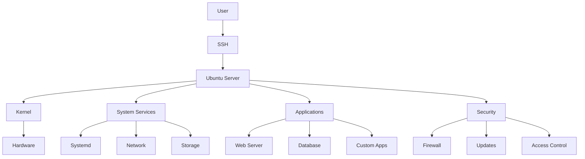

# Ubuntu Server Management

## Introduction

Ubuntu Server is a popular Linux distribution optimized for server environments. Learning to manage an Ubuntu Server is a valuable skill for system administrators, DevOps engineers, and developers who need to deploy and maintain applications in production environments.

This guide walks you through the essential aspects of Ubuntu Server management, from initial setup to everyday administrative tasks. By the end of this tutorial, you'll have a solid foundation in Ubuntu Server administration and be ready to manage your own servers with confidence.

## Getting Started with Ubuntu Server

### Installing Ubuntu Server

Before managing an Ubuntu Server, you need to install it. The installation process is straightforward:

1. Download the latest Ubuntu Server ISO from the [official Ubuntu website](https://ubuntu.com/download/server)
2. Create a bootable USB drive or DVD
3. Boot your server from the installation media
4. Follow the installation wizard

The Ubuntu Server installer provides a text-based interface that guides you through the installation process.

```bash
# After booting from installation media, you'll see a menu like this:
# Ubuntu Server 22.04 LTS
# Install
# OEM installation (for manufacturers)
# Check disc for defects
# Test memory
# Boot from first hard disk
# ...
```

Select "Install" and follow the prompts to configure your language, keyboard layout, network connections, and disk partitioning.

### Initial System Configuration

After installation, connect to your server using SSH:

```bash
ssh username@server_ip_address
```

For example:

```bash
ssh ubuntu@192.168.1.100
```

Once logged in, it's good practice to update your system:

```bash
sudo apt update
sudo apt upgrade
```

Output:
```
Reading package lists... Done
Building dependency tree... Done
Reading state information... Done
Calculating upgrade... Done
The following packages will be upgraded:
  ... (list of packages) ...
Do you want to continue? [Y/n] y
```

## User Management

### Creating and Managing Users

Ubuntu Server user management is crucial for security and access control.

#### Adding a New User

```bash
sudo adduser newusername
```

Output:
```
Adding user `newusername' ...
Adding new group `newusername' (1001) ...
Adding new user `newusername' (1001) with group `newusername' ...
Creating home directory `/home/newusername' ...
Copying files from `/etc/skel' ...
New password: 
Retype new password: 
passwd: password updated successfully
Changing the user information for newusername
Enter the new value, or press ENTER for the default
	Full Name []: New User
	Room Number []: 
	Work Phone []: 
	Home Phone []: 
	Other []: 
Is the information correct? [Y/n] Y
```

#### Granting Administrative Privileges

To allow a user to execute commands with root privileges:

```bash
sudo usermod -aG sudo username
```

#### Removing a User

```bash
sudo deluser username
```

To also remove the user's home directory:

```bash
sudo deluser --remove-home username
```

### SSH Key Authentication

Using SSH keys is more secure than password authentication.

#### Generating SSH Keys on Your Local Machine

```bash
ssh-keygen -t ed25519 -C "your_email@example.com"
```

#### Copying the Public Key to Your Server

```bash
ssh-copy-id username@server_ip_address
```

Alternatively, you can manually add the public key:

```bash
cat ~/.ssh/id_ed25519.pub | ssh username@server_ip_address "mkdir -p ~/.ssh && cat >> ~/.ssh/authorized_keys"
```

#### Disabling Password Authentication

Edit the SSH configuration file:

```bash
sudo nano /etc/ssh/sshd_config
```

Find and modify these lines:

```
PasswordAuthentication no
ChallengeResponseAuthentication no
```

Restart the SSH service:

```bash
sudo systemctl restart sshd
```

## Package Management

Ubuntu uses the APT (Advanced Package Tool) for managing software packages.

### Installing Software

To install a package:

```bash
sudo apt install package_name
```

For example, to install the NGINX web server:

```bash
sudo apt install nginx
```

### Removing Software

To remove a package:

```bash
sudo apt remove package_name
```

To remove a package and its configuration files:

```bash
sudo apt purge package_name
```

### Updating the System

To update the package list:

```bash
sudo apt update
```

To upgrade all packages:

```bash
sudo apt upgrade
```

To upgrade to a new Ubuntu release:

```bash
sudo do-release-upgrade
```

### Finding Packages

To search for packages:

```bash
apt search search_term
```

For example:

```bash
apt search python3
```

Output:
```
Sorting... Done
Full Text Search... Done
python3/jammy,now 3.10.6-1~22.04 amd64 [installed]
  interactive high-level object-oriented language (default python3 version)
python3-all/jammy 3.10.6-1~22.04 amd64
  package depending on all supported Python 3 runtime versions
...
```

### Repository Management

Add a repository:

```bash
sudo add-apt-repository ppa:repository_name/ppa
```

Remove a repository:

```bash
sudo add-apt-repository --remove ppa:repository_name/ppa
```

## Service Management with Systemd

Ubuntu Server uses systemd to manage system services.

### Checking Service Status

```bash
sudo systemctl status service_name
```

Example with NGINX:

```bash
sudo systemctl status nginx
```

Output:
```
● nginx.service - A high performance web server and a reverse proxy server
     Loaded: loaded (/lib/systemd/system/nginx.service; enabled; vendor preset: enabled)
     Active: active (running) since Mon 2023-05-01 12:34:56 UTC; 2h 15min ago
       Docs: man:nginx(8)
   Main PID: 1234 (nginx)
      Tasks: 3 (limit: 4915)
     Memory: 3.6M
        CPU: 250ms
     CGroup: /system.slice/nginx.service
             ├─1234 "nginx: master process /usr/sbin/nginx -g daemon on; master_process on;"
             ├─1235 "nginx: worker process" "" "" "" "" "" "" "" "" "" "" "" "" "" "" "" "" "" ""
             └─1236 "nginx: worker process" "" "" "" "" "" "" "" "" "" "" "" "" "" "" "" "" "" ""
```

### Starting, Stopping, and Restarting Services

Start a service:

```bash
sudo systemctl start service_name
```

Stop a service:

```bash
sudo systemctl stop service_name
```

Restart a service:

```bash
sudo systemctl restart service_name
```

Reload service configuration without stopping:

```bash
sudo systemctl reload service_name
```

### Enabling and Disabling Services

Enable a service to start at boot:

```bash
sudo systemctl enable service_name
```

Disable a service from starting at boot:

```bash
sudo systemctl disable service_name
```

### Creating Custom Services

You can create custom systemd services by creating `.service` files in `/etc/systemd/system/`:

```bash
sudo nano /etc/systemd/system/myapp.service
```

Example service file:

```ini
[Unit]
Description=My Custom Application
After=network.target

[Service]
User=myapp
WorkingDirectory=/opt/myapp
ExecStart=/usr/bin/node /opt/myapp/server.js
Restart=on-failure

[Install]
WantedBy=multi-user.target
```

After creating the service file:

```bash
sudo systemctl daemon-reload
sudo systemctl enable myapp
sudo systemctl start myapp
```

## File System Management

### Navigating the File System

Ubuntu Server's file system hierarchy follows the Linux Filesystem Hierarchy Standard.

Key directories include:

- `/etc`: System configuration files
- `/var`: Variable data like logs
- `/home`: User home directories
- `/opt`: Optional software
- `/usr`: User binaries and read-only data
- `/srv`: Service data

### File Permissions

List files with detailed permissions:

```bash
ls -l
```

Output:
```
total 16
drwxr-xr-x 2 user user 4096 May  1 10:00 directory
-rw-r--r-- 1 user user  123 May  1 10:01 file.txt
```

Change file ownership:

```bash
sudo chown user:group filename
```

Change file permissions:

```bash
chmod 755 filename
```

Permission breakdown:
- `r` (read): 4
- `w` (write): 2
- `x` (execute): 1

Common permission patterns:
- 755 (`rwxr-xr-x`): Owner can read/write/execute, others can read/execute
- 644 (`rw-r--r--`): Owner can read/write, others can only read
- 700 (`rwx------`): Owner can read/write/execute, others have no access

### Disk Management

Check disk space:

```bash
df -h
```

Output:
```
Filesystem      Size  Used Avail Use% Mounted on
/dev/sda1        98G   12G   82G  13% /
tmpfs           2.0G     0  2.0G   0% /dev/shm
/dev/sda2       457G  199G  235G  46% /home
```

Check directory sizes:

```bash
du -sh /path/to/directory
```

Mount a file system:

```bash
sudo mount /dev/device /mount/point
```

Unmount a file system:

```bash
sudo umount /mount/point
```

## Network Configuration

### Basic Network Information

Display network interfaces:

```bash
ip a
```

Output:
```
1: lo: <LOOPBACK,UP,LOWER_UP> mtu 65536 qdisc noqueue state UNKNOWN group default qlen 1000
    link/loopback 00:00:00:00:00:00 brd 00:00:00:00:00:00
    inet 127.0.0.1/8 scope host lo
       valid_lft forever preferred_lft forever
    inet6 ::1/128 scope host 
       valid_lft forever preferred_lft forever
2: ens33: <BROADCAST,MULTICAST,UP,LOWER_UP> mtu 1500 qdisc fq_codel state UP group default qlen 1000
    link/ether 00:0c:29:b0:12:34 brd ff:ff:ff:ff:ff:ff
    inet 192.168.1.100/24 brd 192.168.1.255 scope global dynamic ens33
       valid_lft 86390sec preferred_lft 86390sec
    inet6 fe80::20c:29ff:feb0:1234/64 scope link 
       valid_lft forever preferred_lft forever
```

Check network connectivity:

```bash
ping -c 4 google.com
```

### Configuring Network Interfaces

In Ubuntu Server, network interfaces are configured using Netplan. Configuration files are located in `/etc/netplan/`.

Example configuration file (`/etc/netplan/00-installer-config.yaml`):

```yaml
network:
  version: 2
  ethernets:
    ens33:
      dhcp4: no
      addresses:
        - 192.168.1.100/24
      gateway4: 192.168.1.1
      nameservers:
          addresses: [8.8.8.8, 8.8.4.4]
```

Apply configuration:

```bash
sudo netplan apply
```

### Firewall Configuration with UFW

Ubuntu Server comes with UFW (Uncomplicated Firewall), which simplifies firewall management.

Enable UFW:

```bash
sudo ufw enable
```

Allow SSH connections:

```bash
sudo ufw allow ssh
```

Allow specific ports:

```bash
sudo ufw allow 80/tcp  # HTTP
sudo ufw allow 443/tcp  # HTTPS
```

Check status:

```bash
sudo ufw status
```

Output:
```
Status: active

To                         Action      From
--                         ------      ----
22/tcp                     ALLOW       Anywhere
80/tcp                     ALLOW       Anywhere
443/tcp                    ALLOW       Anywhere
22/tcp (v6)                ALLOW       Anywhere (v6)
80/tcp (v6)                ALLOW       Anywhere (v6)
443/tcp (v6)               ALLOW       Anywhere (v6)
```

## Monitoring and Logging

### System Monitoring

Check system resources:

```bash
top
```

Alternative resource monitoring with htop (install if needed):

```bash
sudo apt install htop
htop
```

Check running processes:

```bash
ps aux
```

Monitor disk I/O:

```bash
iostat
```

### Log Management

Most system logs are stored in the `/var/log` directory.

View system logs:

```bash
less /var/log/syslog
```

Monitor logs in real-time:

```bash
tail -f /var/log/syslog
```

Search logs:

```bash
grep "error" /var/log/syslog
```

### Logrotate

Ubuntu uses logrotate to manage log files. Configuration is in `/etc/logrotate.d/`.

Example configuration for a custom application:

```
/var/log/myapp/*.log {
    daily
    missingok
    rotate 7
    compress
    delaycompress
    notifempty
    create 0640 myapp myapp
    sharedscripts
    postrotate
        systemctl reload myapp
    endscript
}
```

## Backup and Recovery

### Creating System Backups

Using `rsync` for backups:

```bash
rsync -avz --delete /source/directory/ /backup/directory/
```

Backing up to a remote server:

```bash
rsync -avz -e ssh /source/directory/ user@remote_server:/backup/directory/
```

### Automating Backups with Cron

Edit the crontab:

```bash
crontab -e
```

Add a schedule for daily backups at 2 AM:

```
0 2 * * * rsync -avz --delete /source/directory/ /backup/directory/ >> /var/log/backup.log 2>&1
```

### System Snapshots with LVM

If using LVM, you can create logical volume snapshots:

```bash
sudo lvcreate -L 5G -s -n snap_root /dev/vg0/root
```

Mount the snapshot for access:

```bash
sudo mkdir /mnt/snapshot
sudo mount /dev/vg0/snap_root /mnt/snapshot
```

Remove the snapshot after use:

```bash
sudo umount /mnt/snapshot
sudo lvremove /dev/vg0/snap_root
```

## Server Security

### Security Updates

Keep your system updated:

```bash
sudo apt update && sudo apt upgrade
```

Enable automatic security updates:

```bash
sudo apt install unattended-upgrades
sudo dpkg-reconfigure -plow unattended-upgrades
```

### Securing SSH

Edit the SSH configuration:

```bash
sudo nano /etc/ssh/sshd_config
```

Recommended settings:

```
# Disable root login
PermitRootLogin no

# Use SSH key authentication only
PasswordAuthentication no

# Set maximum authentication attempts
MaxAuthTries 3

# Change default SSH port (optional)
Port 2222
```

Restart SSH after changes:

```bash
sudo systemctl restart sshd
```

### Fail2Ban for Intrusion Prevention

Install Fail2Ban:

```bash
sudo apt install fail2ban
```

Create a custom jail configuration:

```bash
sudo nano /etc/fail2ban/jail.local
```

Example configuration:

```
[sshd]
enabled = true
port = ssh
filter = sshd
logpath = /var/log/auth.log
maxretry = 3
bantime = 3600
```

Start Fail2Ban:

```bash
sudo systemctl enable fail2ban
sudo systemctl start fail2ban
```

Check Fail2Ban status:

```bash
sudo fail2ban-client status sshd
```

## Advanced Server Management

### Automating Tasks with Bash Scripts

Create a bash script:

```bash
nano backup_script.sh
```

Script content:

```bash
#!/bin/bash

# Backup important directories
BACKUP_DIR="/backup"
DATE=$(date +%Y-%m-%d)
mkdir -p "$BACKUP_DIR/$DATE"

# Backup config files
tar -czf "$BACKUP_DIR/$DATE/etc_backup.tar.gz" /etc

# Backup databases
mysqldump -u root -p --all-databases > "$BACKUP_DIR/$DATE/all_databases.sql"

# Log success
echo "Backup completed on $DATE" >> "$BACKUP_DIR/backup.log"
```

Make the script executable:

```bash
chmod +x backup_script.sh
```

### Setting Up a LAMP Stack

Install Apache, MySQL, and PHP:

```bash
sudo apt install apache2 mysql-server php libapache2-mod-php php-mysql
```

Secure MySQL installation:

```bash
sudo mysql_secure_installation
```

Create a PHP test file:

```bash
echo "<?php phpinfo(); ?>" | sudo tee /var/www/html/info.php
```

### Containerization with Docker

Install Docker:

```bash
sudo apt install docker.io
```

Start and enable Docker:

```bash
sudo systemctl start docker
sudo systemctl enable docker
```

Add your user to the Docker group:

```bash
sudo usermod -aG docker $USER
```

Test Docker installation:

```bash
docker run hello-world
```

## System Architecture Diagram

Here's a high-level overview of Ubuntu Server architecture:



## Summary

In this guide, we've covered the essential aspects of Ubuntu Server management:

1. Installation and initial configuration
2. User management and SSH key authentication
3. Package management with APT
4. Service management with systemd
5. File system management and permissions
6. Network configuration and firewall setup
7. Monitoring and logging
8. Backup and recovery strategies
9. Server security best practices
10. Advanced management techniques

By mastering these fundamentals, you're well on your way to becoming proficient in Ubuntu Server administration. Remember that server management is both an art and a science—while following best practices is important, experience and problem-solving skills are equally valuable.

## Additional Resources

Here are some resources to continue your Ubuntu Server learning journey:

- **Documentation**: The official Ubuntu Server documentation
- **Practice**: Set up a virtual machine for experimenting without risk
- **Community**: Join the Ubuntu community forums for help and discussion

## Exercises

1. **Basic Setup**: Install Ubuntu Server on a virtual machine and secure SSH access.
2. **Web Server**: Configure a web server with NGINX or Apache and deploy a simple website.
3. **Database**: Set up MySQL or PostgreSQL and create a database with tables.
4. **Automation**: Write a bash script to automate a daily backup of important files.
5. **Security**: Configure UFW to allow only necessary services and set up Fail2Ban.
6. **Monitoring**: Install and configure a monitoring tool like Prometheus or Grafana.
7. **High Availability**: Research and implement a high-availability solution for a web application.