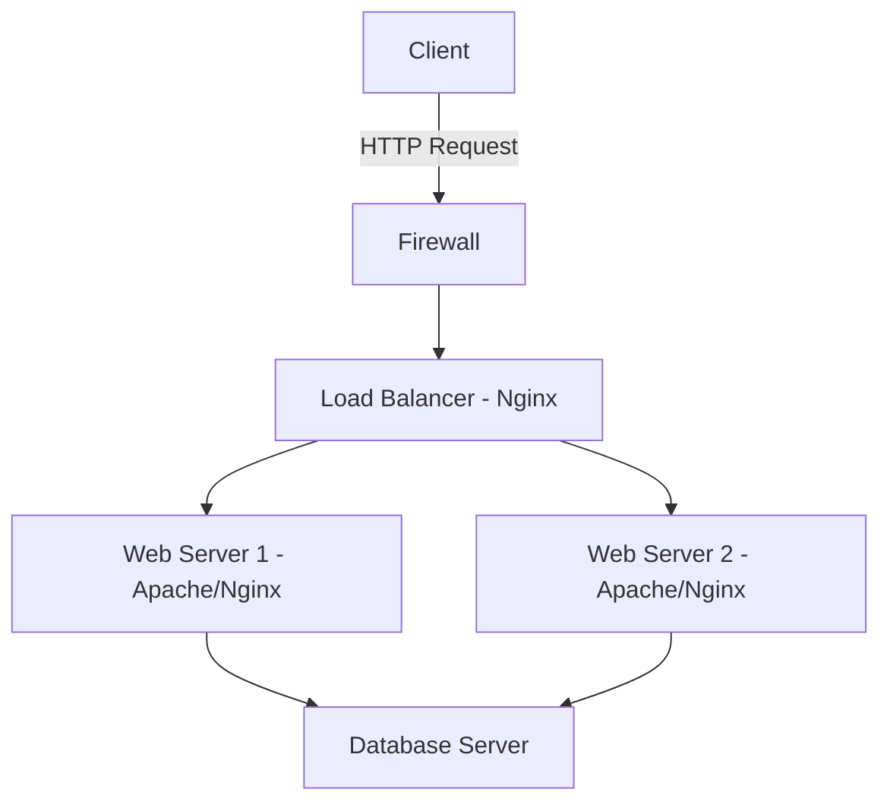

# Ubuntu Web Servers

## Introduction

Web servers are the backbone of the internet, serving websites and applications to users worldwide. Ubuntu Server provides an excellent platform for hosting web servers due to its stability, security, and extensive community support. This guide will walk you through everything you need to know about setting up and managing web servers on Ubuntu, from installation to configuration and maintenance.

A web server is software that processes requests via HTTP (Hypertext Transfer Protocol) to serve web content to users. On Ubuntu, you have several robust options for web server software, with Apache and Nginx being the most popular choices.

## Popular Web Server Options on Ubuntu

Ubuntu supports various web server solutions. Let's explore the two most widely used options:

### Apache HTTP Server

Apache is the most widely used web server software globally. It's known for its reliability, flexibility, and extensive module support.

### Nginx

Nginx (pronounced "engine-x") is known for its high performance, stability, and low resource consumption. It's particularly efficient at serving static content and handling concurrent connections.

## Setting Up Apache Web Server

Let's start by setting up the Apache web server on Ubuntu:

### Installation

To install Apache on Ubuntu, use the following commands:

```bash
sudo apt update
sudo apt install apache2
```

After installation, Apache will start automatically. You can verify it's running with:

```bash
sudo systemctl status apache2
```

Output:
```
● apache2.service - The Apache HTTP Server
     Loaded: loaded (/lib/systemd/system/apache2.service; enabled; vendor preset: enabled)
     Active: active (running) since Mon 2023-07-10 15:30:45 UTC; 5s ago
       Docs: https://httpd.apache.org/docs/2.4/
   Main PID: 12345 (apache2)
      Tasks: 55 (limit: 4674)
     Memory: 5.0M
        CPU: 67ms
     CGroup: /system.slice/apache2.service
             ├─12345 /usr/sbin/apache2 -k start
             ├─12346 /usr/sbin/apache2 -k start
             └─12347 /usr/sbin/apache2 -k start
```

### Basic Configuration

Apache's main configuration file is located at `/etc/apache2/apache2.conf`. The site-specific configurations are found in `/etc/apache2/sites-available/`.

To create a new virtual host (website), follow these steps:

1. Create a configuration file in `/etc/apache2/sites-available/`:

```bash
sudo nano /etc/apache2/sites-available/mywebsite.conf
```

2. Add the following configuration (adjust according to your needs):

```apache
<VirtualHost *:80>
    ServerAdmin webmaster@localhost
    ServerName mywebsite.local
    DocumentRoot /var/www/mywebsite
    
    ErrorLog ${APACHE_LOG_DIR}/mywebsite_error.log
    CustomLog ${APACHE_LOG_DIR}/mywebsite_access.log combined
    
    <Directory /var/www/mywebsite>
        Options Indexes FollowSymLinks
        AllowOverride All
        Require all granted
    </Directory>
</VirtualHost>
```

3. Create the document root directory:

```bash
sudo mkdir -p /var/www/mywebsite
```

4. Create a sample index.html file:

```bash
sudo nano /var/www/mywebsite/index.html
```

Add some HTML content:

```html
<!DOCTYPE html>
<html>
<head>
    <title>Welcome to My Website</title>
</head>
<body>
    <h1>Success! My Ubuntu web server is working!</h1>
</body>
</html>
```

5. Enable the site and restart Apache:

```bash
sudo a2ensite mywebsite.conf
sudo systemctl reload apache2
```

### Apache Common Tasks

#### Managing Apache Service

```bash
# Start Apache
sudo systemctl start apache2

# Stop Apache
sudo systemctl stop apache2

# Restart Apache
sudo systemctl restart apache2

# Reload configuration without stopping
sudo systemctl reload apache2

# Enable Apache to start on boot
sudo systemctl enable apache2
```

#### Enabling Modules

Apache's functionality can be extended with modules:

```bash
# Enable mod_rewrite for URL rewriting
sudo a2enmod rewrite

# Enable SSL for HTTPS
sudo a2enmod ssl

# After enabling modules, restart Apache
sudo systemctl restart apache2
```

## Setting Up Nginx Web Server

Nginx is another popular web server option, especially known for its performance:

### Installation

```bash
sudo apt update
sudo apt install nginx
```

Verify that Nginx is running:

```bash
sudo systemctl status nginx
```

Output:
```
● nginx.service - A high performance web server and a reverse proxy server
     Loaded: loaded (/lib/systemd/system/nginx.service; enabled; vendor preset: enabled)
     Active: active (running) since Mon 2023-07-10 16:00:12 UTC; 5s ago
       Docs: man:nginx(8)
   Main PID: 12345 (nginx)
      Tasks: 2 (limit: 4674)
     Memory: 3.5M
        CPU: 46ms
     CGroup: /system.slice/nginx.service
             ├─12345 "nginx: master process /usr/sbin/nginx -g daemon on; master_process on;"
             └─12346 "nginx: worker process"
```

### Basic Configuration

Nginx's main configuration file is located at `/etc/nginx/nginx.conf`. Site-specific configurations are stored in `/etc/nginx/sites-available/`.

To create a new server block (similar to Apache's virtual host):

1. Create a configuration file:

```bash
sudo nano /etc/nginx/sites-available/mywebsite
```

2. Add the following configuration:

```nginx
server {
    listen 80;
    server_name mywebsite.local;
    root /var/www/mywebsite;
    index index.html index.htm;
    
    location / {
        try_files $uri $uri/ =404;
    }
    
    error_log /var/log/nginx/mywebsite_error.log;
    access_log /var/log/nginx/mywebsite_access.log;
}
```

3. Create the document root directory:

```bash
sudo mkdir -p /var/www/mywebsite
```

4. Create a sample index.html file:

```bash
sudo nano /var/www/mywebsite/index.html
```

Add some HTML content:

```html
<!DOCTYPE html>
<html>
<head>
    <title>Welcome to My Website with Nginx</title>
</head>
<body>
    <h1>Success! My Nginx server on Ubuntu is working!</h1>
</body>
</html>
```

5. Enable the site by creating a symbolic link and restart Nginx:

```bash
sudo ln -s /etc/nginx/sites-available/mywebsite /etc/nginx/sites-enabled/
sudo systemctl reload nginx
```

### Nginx Common Tasks

#### Managing Nginx Service

```bash
# Start Nginx
sudo systemctl start nginx

# Stop Nginx
sudo systemctl stop nginx

# Restart Nginx
sudo systemctl restart nginx

# Reload configuration without stopping
sudo systemctl reload nginx

# Enable Nginx to start on boot
sudo systemctl enable nginx
```

## Web Server Security Best Practices

Security is crucial for web servers. Here are some best practices:

### Firewall Configuration

Ubuntu comes with `ufw` (Uncomplicated Firewall) which makes firewall management easier:

```bash
# Allow HTTP traffic
sudo ufw allow 80/tcp

# Allow HTTPS traffic
sudo ufw allow 443/tcp

# Enable the firewall
sudo ufw enable
```

### Implementing HTTPS with Let's Encrypt

HTTPS is essential for secure websites. Let's Encrypt provides free SSL certificates:

For Apache:

```bash
sudo apt install certbot python3-certbot-apache
sudo certbot --apache -d example.com -d www.example.com
```

For Nginx:

```bash
sudo apt install certbot python3-certbot-nginx
sudo certbot --nginx -d example.com -d www.example.com
```

Follow the interactive prompts to complete the setup.

### Regular Updates

Keeping your system updated is crucial for security:

```bash
sudo apt update
sudo apt upgrade
```

## Serving Different Types of Content

### Static Websites

Both Apache and Nginx excel at serving static content like HTML, CSS, and JavaScript files. They are configured to serve files from the document root directory by default.

### PHP Applications

To serve PHP applications (like WordPress, Drupal, etc.), you need to install PHP:

For Apache:

```bash
sudo apt install php libapache2-mod-php php-mysql
sudo systemctl restart apache2
```

For Nginx:

```bash
sudo apt install php-fpm php-mysql
sudo systemctl restart php7.4-fpm  # Version may vary
```

Then configure Nginx to use PHP-FPM:

```nginx
server {
    # ... other configurations ...
    
    location ~ \.php$ {
        include snippets/fastcgi-php.conf;
        fastcgi_pass unix:/var/run/php/php7.4-fpm.sock;  # Version may vary
    }
}
```

### Node.js Applications

To serve Node.js applications, you'll typically use Nginx as a reverse proxy:

1. Install Node.js:

```bash
sudo apt install nodejs npm
```

2. Create a simple Node.js app (app.js):

```javascript
const http = require('http');

const server = http.createServer((req, res) => {
  res.statusCode = 200;
  res.setHeader('Content-Type', 'text/plain');
  res.end('Hello from Node.js on Ubuntu Server!');
});

server.listen(3000, '127.0.0.1', () => {
  console.log('Server running at http://127.0.0.1:3000/');
});
```

3. Configure Nginx as a reverse proxy:

```nginx
server {
    listen 80;
    server_name example.com;

    location / {
        proxy_pass http://127.0.0.1:3000;
        proxy_http_version 1.1;
        proxy_set_header Upgrade $http_upgrade;
        proxy_set_header Connection 'upgrade';
        proxy_set_header Host $host;
        proxy_cache_bypass $http_upgrade;
    }
}
```

## Load Balancing with Nginx

Nginx can be configured as a load balancer to distribute traffic across multiple servers:

```nginx
upstream backend_servers {
    server backend1.example.com;
    server backend2.example.com;
    server backend3.example.com;
}

server {
    listen 80;
    server_name example.com;

    location / {
        proxy_pass http://backend_servers;
        proxy_set_header Host $host;
        proxy_set_header X-Real-IP $remote_addr;
    }
}
```

## Web Server Architecture

Here's a simple diagram showing typical web server architecture:



## Performance Tuning

### Apache Performance Tuning

Edit the `/etc/apache2/mods-available/mpm_prefork.conf` file:

```apache
<IfModule mpm_prefork_module>
    StartServers             5
    MinSpareServers          5
    MaxSpareServers         10
    MaxRequestWorkers       150
    MaxConnectionsPerChild    0
</IfModule>
```

### Nginx Performance Tuning

Edit the `/etc/nginx/nginx.conf` file:

```nginx
worker_processes auto;
worker_connections 1024;
keepalive_timeout 65;
gzip on;
```

## Monitoring Web Servers

### Basic Monitoring

Check the status of your web server:

```bash
# For Apache
sudo systemctl status apache2

# For Nginx
sudo systemctl status nginx
```

View log files:

```bash
# Apache access logs
sudo tail -f /var/log/apache2/access.log

# Apache error logs
sudo tail -f /var/log/apache2/error.log

# Nginx access logs
sudo tail -f /var/log/nginx/access.log

# Nginx error logs
sudo tail -f /var/log/nginx/error.log
```

### Advanced Monitoring Tools

Install and use monitoring tools for more detailed insights:

```bash
# Install Netdata for real-time monitoring
sudo apt install netdata

# Access Netdata dashboard at http://your-server-ip:19999
```

## Troubleshooting Common Issues

### Apache Won't Start

```bash
# Check for syntax errors in configuration
sudo apache2ctl configtest

# Check error logs
sudo tail -f /var/log/apache2/error.log
```

### Nginx Won't Start

```bash
# Check for syntax errors in configuration
sudo nginx -t

# Check error logs
sudo tail -f /var/log/nginx/error.log
```

### Permission Issues

If you encounter 403 Forbidden errors, check directory and file permissions:

```bash
# For Apache
sudo chown -R www-data:www-data /var/www/mywebsite
sudo chmod -R 755 /var/www/mywebsite

# For Nginx (Ubuntu usually uses www-data as well)
sudo chown -R www-data:www-data /var/www/mywebsite
sudo chmod -R 755 /var/www/mywebsite
```

## Summary

Setting up and managing web servers on Ubuntu is a fundamental skill for web developers and system administrators. In this guide, we've covered:

- Installing and configuring Apache and Nginx web servers
- Creating virtual hosts/server blocks for hosting multiple websites
- Implementing security best practices
- Serving different types of content (static, PHP, Node.js)
- Load balancing with Nginx
- Performance tuning
- Monitoring and troubleshooting

Web servers are the foundation of web application deployment, and Ubuntu provides a robust platform for hosting these services. By following the best practices outlined in this guide, you can ensure your web applications are secure, performant, and reliable.

## Additional Resources

- [Official Apache Documentation](https://httpd.apache.org/docs/)
- [Official Nginx Documentation](https://nginx.org/en/docs/)
- [Ubuntu Server Guide](https://ubuntu.com/server/docs)
- [Let's Encrypt Documentation](https://letsencrypt.org/docs/)

## Exercises

1. Set up a basic Apache web server and create a simple HTML website.
2. Configure Nginx as a reverse proxy for a Node.js application.
3. Implement HTTPS for your website using Let's Encrypt.
4. Set up a load balancer with Nginx to distribute traffic between two Apache instances.
5. Configure a PHP application (like WordPress) to run on your web server.