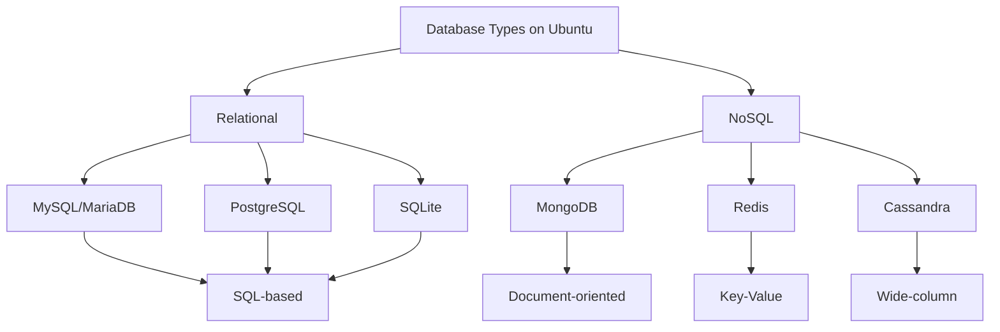

# Ubuntu Database Servers

## Introduction

Database servers are essential components of modern web applications and services. They provide organized storage, efficient data retrieval, and mechanisms for data integrity and security. Ubuntu Server provides an excellent platform for hosting various database systems due to its stability, security features, and wide community support.

In this guide, we'll explore how to set up, configure, and manage the most popular database servers on Ubuntu. Whether you're building a personal project or preparing for enterprise deployment, understanding database servers on Ubuntu is a valuable skill for any developer or system administrator.

## Database Options for Ubuntu Server

Ubuntu supports a wide range of database management systems. Here are the most commonly used options:

### Relational Database Management Systems (RDBMS)
- **MySQL/MariaDB**: Open-source relational databases that use SQL
- **PostgreSQL**: Advanced open-source relational database with powerful features
- **SQLite**: Lightweight file-based relational database

### NoSQL Databases
- **MongoDB**: Document-oriented database for flexible, schema-less data storage
- **Redis**: In-memory key-value store for high-performance caching and messaging
- **Cassandra**: Distributed NoSQL database for handling large amounts of data

Let's visualize the database options and their characteristics:



## Setting Up MySQL on Ubuntu

MySQL is one of the most popular database systems and is an excellent starting point for beginners. Let's walk through the process of installing and configuring MySQL on Ubuntu Server.

### Installation

First, update your package lists:

```bash
sudo apt update
```

Now install the MySQL server package:

```bash
sudo apt install mysql-server -y
```

After installation completes, the MySQL service will start automatically. Verify it's running with:

```bash
sudo systemctl status mysql
```

You should see output indicating that the service is active (running).

### Securing MySQL

MySQL includes a security script to improve the security of your installation:

```bash
sudo mysql_secure_installation
```

Follow the prompts to:
1. Set up the VALIDATE PASSWORD component
2. Choose a secure password for the root user
3. Remove anonymous users
4. Disallow root login remotely
5. Remove the test database
6. Reload privilege tables

### Accessing MySQL

You can access the MySQL shell using:

```bash
sudo mysql
```

This will connect you to the MySQL server as the root user. You'll see a prompt like this:

```
mysql>
```

Let's create a new database and user:

```sql
CREATE DATABASE myproject;
CREATE USER 'myuser'@'localhost' IDENTIFIED BY 'password';
GRANT ALL PRIVILEGES ON myproject.* TO 'myuser'@'localhost';
FLUSH PRIVILEGES;
```

You can now exit the MySQL shell:

```sql
EXIT;
```

And connect with your new user:

```bash
mysql -u myuser -p
```

When prompted, enter the password you set.

## Setting Up PostgreSQL on Ubuntu

PostgreSQL is an advanced, open-source relational database system with a strong reputation for reliability, feature robustness, and performance.

### Installation

Update your package lists and install PostgreSQL:

```bash
sudo apt update
sudo apt install postgresql postgresql-contrib -y
```

Verify the installation:

```bash
sudo systemctl status postgresql
```

### Basic PostgreSQL Configuration

PostgreSQL uses a different authentication model than MySQL. By default, it creates a user called "postgres" during installation.

To access the PostgreSQL prompt, switch to the postgres user:

```bash
sudo -i -u postgres
```

Then access the PostgreSQL shell:

```bash
psql
```

You'll see a prompt like:

```
postgres=#
```

Create a new user and database:

```sql
CREATE USER myuser WITH PASSWORD 'password';
CREATE DATABASE myproject;
GRANT ALL PRIVILEGES ON DATABASE myproject TO myuser;
```

Exit the PostgreSQL shell:

```sql
\q
```

And exit the postgres user session:

```bash
exit
```

### Accessing PostgreSQL

To connect to your database as the new user:

```bash
psql -U myuser -d myproject -h localhost
```

When prompted, enter the password you set.

## Setting Up MongoDB on Ubuntu

MongoDB is a popular NoSQL database that stores data in flexible, JSON-like documents.

### Installation

MongoDB is not included in the default Ubuntu repositories. You'll need to add MongoDB's official repository:

```bash
# Import MongoDB public GPG key
wget -qO - https://www.mongodb.org/static/pgp/server-6.0.asc | sudo apt-key add -

# Create a list file for MongoDB
echo "deb [ arch=amd64,arm64 ] https://repo.mongodb.org/apt/ubuntu $(lsb_release -cs)/mongodb-org/6.0 multiverse" | sudo tee /etc/apt/sources.list.d/mongodb-org-6.0.list

# Update package lists
sudo apt update

# Install MongoDB
sudo apt install mongodb-org -y
```

Start and enable MongoDB:

```bash
sudo systemctl start mongod
sudo systemctl enable mongod
```

Verify it's running:

```bash
sudo systemctl status mongod
```

### Basic MongoDB Usage

Access the MongoDB shell:

```bash
mongosh
```

You'll see a prompt like:

```
>
```

Let's create a database and collection, and insert a document:

```javascript
use myproject
db.createCollection("users")
db.users.insertOne({
  name: "John Doe",
  email: "john@example.com",
  age: 30,
  created_at: new Date()
})
```

You can query the data:

```javascript
db.users.find()
```

This will return the document you just inserted.

Exit the MongoDB shell:

```javascript
exit
```

## Database Backup and Restore

Regular backups are crucial for any production database. Here's how to back up and restore data for each database system.

### MySQL/MariaDB Backup and Restore

**Backup:**

```bash
mysqldump -u username -p database_name > backup.sql
```

**Restore:**

```bash
mysql -u username -p database_name < backup.sql
```

### PostgreSQL Backup and Restore

**Backup:**

```bash
pg_dump -U username -d database_name -f backup.sql
```

**Restore:**

```bash
psql -U username -d database_name -f backup.sql
```

### MongoDB Backup and Restore

**Backup:**

```bash
mongodump --db=database_name --out=backup_directory
```

**Restore:**

```bash
mongorestore --db=database_name backup_directory/database_name
```

## Performance Tuning Basics

Each database system can be tuned for optimal performance based on your server's resources and workload patterns.

### MySQL Performance Tuning

Edit the MySQL configuration file:

```bash
sudo nano /etc/mysql/mysql.conf.d/mysqld.cnf
```

Common settings to adjust:

```
# InnoDB buffer pool size (70-80% of RAM for dedicated DB servers)
innodb_buffer_pool_size = 1G

# Query cache size
query_cache_size = 128M

# Maximum connections
max_connections = 150
```

After making changes, restart MySQL:

```bash
sudo systemctl restart mysql
```

### PostgreSQL Performance Tuning

Edit the PostgreSQL configuration file:

```bash
sudo nano /etc/postgresql/14/main/postgresql.conf
```

Common settings to adjust:

```
# Memory for shared buffers (25% of RAM)
shared_buffers = 1GB

# Effective cache size (50-75% of RAM)
effective_cache_size = 3GB

# Work memory per connection
work_mem = 16MB
```

After making changes, restart PostgreSQL:

```bash
sudo systemctl restart postgresql
```

### MongoDB Performance Tuning

Edit the MongoDB configuration file:

```bash
sudo nano /etc/mongod.conf
```

Common settings to adjust:

```yaml
# Storage engine cache size
storage:
  wiredTiger:
    engineConfig:
      cacheSizeGB: 1
```

After making changes, restart MongoDB:

```bash
sudo systemctl restart mongod
```

## Real-World Example: Setting Up a Database for a Web Application

Let's walk through a practical example of setting up a database for a simple web application using MySQL and a Python Flask application.

### 1. Setup the Database and User

```bash
sudo mysql
```

```sql
CREATE DATABASE webapp;
CREATE USER 'webuser'@'localhost' IDENTIFIED BY 'secure_password';
GRANT ALL PRIVILEGES ON webapp.* TO 'webuser'@'localhost';
FLUSH PRIVILEGES;
EXIT;
```

### 2. Create Tables

Connect to the database:

```bash
mysql -u webuser -p webapp
```

Create a users table:

```sql
CREATE TABLE users (
    id INT AUTO_INCREMENT PRIMARY KEY,
    username VARCHAR(50) NOT NULL UNIQUE,
    email VARCHAR(100) NOT NULL UNIQUE,
    password_hash VARCHAR(255) NOT NULL,
    created_at TIMESTAMP DEFAULT CURRENT_TIMESTAMP
);

CREATE TABLE posts (
    id INT AUTO_INCREMENT PRIMARY KEY,
    user_id INT NOT NULL,
    title VARCHAR(100) NOT NULL,
    content TEXT NOT NULL,
    created_at TIMESTAMP DEFAULT CURRENT_TIMESTAMP,
    FOREIGN KEY (user_id) REFERENCES users(id)
);
```

### 3. Sample Python Code to Connect to the Database

Here's how you might connect to this database from a Flask application:

```python
from flask import Flask
import mysql.connector

app = Flask(__name__)

def get_db_connection():
    conn = mysql.connector.connect(
        host='localhost',
        user='webuser',
        password='secure_password',
        database='webapp'
    )
    return conn

@app.route('/users')
def get_users():
    conn = get_db_connection()
    cursor = conn.cursor(dictionary=True)
    cursor.execute('SELECT id, username, email, created_at FROM users')
    users = cursor.fetchall()
    cursor.close()
    conn.close()
    return {'users': users}

if __name__ == '__main__':
    app.run(debug=True)
```

To use this code, you would need to install the necessary packages:

```bash
pip install flask mysql-connector-python
```

## Summary

In this guide, we've explored:

1. The various database options available for Ubuntu Server
2. Step-by-step installation and configuration of MySQL, PostgreSQL, and MongoDB
3. Basic database operations for each system
4. Backup and restore procedures
5. Performance tuning basics
6. A real-world example of setting up a database for a web application

Ubuntu Server provides an excellent platform for running database servers, whether for development, testing, or production environments. The choice of database system depends on your specific requirements, such as data structure, scalability needs, and performance considerations.

## Additional Resources

Here are some resources to further expand your knowledge:

- **MySQL**: [MySQL Documentation](https://dev.mysql.com/doc/)
- **PostgreSQL**: [PostgreSQL Documentation](https://www.postgresql.org/docs/)
- **MongoDB**: [MongoDB Documentation](https://docs.mongodb.com/)

## Practice Exercises

1. Set up a MySQL database and create tables for a simple inventory management system
2. Create a PostgreSQL database with user authentication and role-based access control
3. Design a MongoDB schema for a blog application and implement CRUD operations
4. Compare the performance of equivalent queries between MySQL and PostgreSQL
5. Set up automated daily backups for your database server