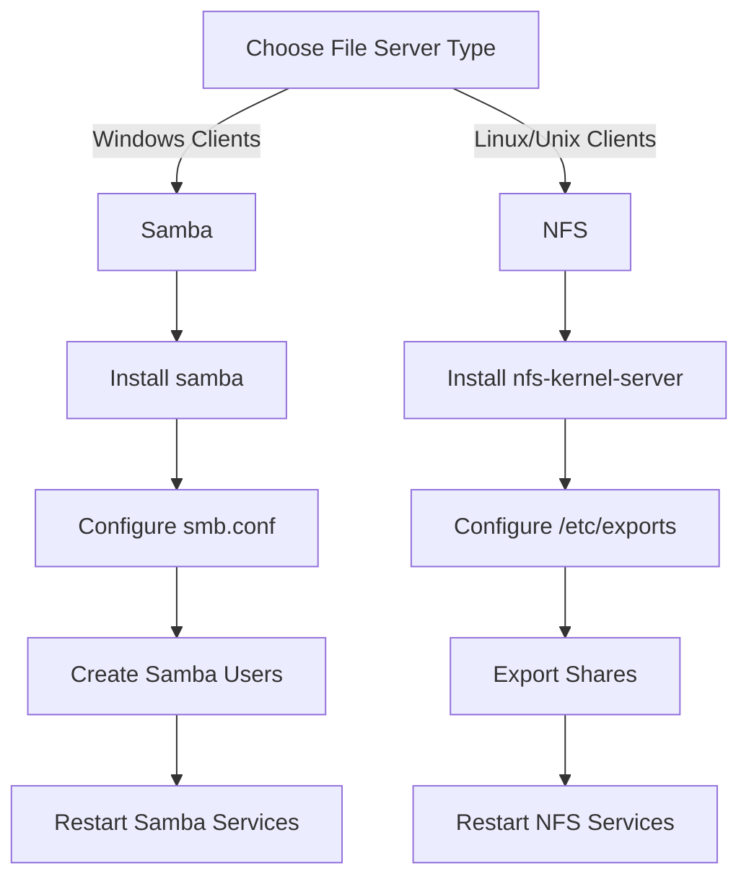

# Ubuntu File Servers

## Introduction

File servers are the backbone of network file sharing, allowing multiple users and devices to access, store, and manage files from a centralized location. In this guide, we'll explore how to set up and manage file servers on Ubuntu Server, providing your network with reliable file sharing capabilities.

A file server centralizes file storage and management, offering several advantages:

- **Centralized storage** - All files are stored in one location
- **Improved collaboration** - Multiple users can access the same files
- **Better security** - Permissions can be managed from a single point
- **Simplified backups** - Only one system needs to be backed up

This tutorial covers setting up the two most common file server protocols on Ubuntu: Samba (for Windows compatibility) and NFS (for Unix/Linux systems).

## Prerequisites

Before we begin, make sure you have:

- Ubuntu Server installed (20.04 LTS or newer)
- A user with sudo privileges
- Basic familiarity with terminal commands
- A network with other devices that need to access files

## Setting Up Samba File Server

Samba allows Linux systems to share files with Windows clients using the SMB/CIFS protocol.

### Installing Samba

First, update your package lists and install Samba:

```bash
sudo apt update
sudo apt install samba
```

You can verify the installation by checking the Samba version:

```bash
smbd --version
```

Output:
```
Version 4.13.17-Ubuntu
```

### Configuring Samba

1. Back up the original configuration file:

```bash
sudo cp /etc/samba/smb.conf /etc/samba/smb.conf.bak
```

2. Create a directory to share:

```bash
sudo mkdir -p /srv/samba/share
```

3. Set appropriate permissions:

```bash
sudo chmod -R 0775 /srv/samba/share
sudo chown -R nobody:nogroup /srv/samba/share
```

4. Edit the Samba configuration file:

```bash
sudo nano /etc/samba/smb.conf
```

5. Add the following at the end of the file:

```
[share]
   comment = Ubuntu File Server Share
   path = /srv/samba/share
   browsable = yes
   guest ok = yes
   read only = no
   create mask = 0755
```

This configuration creates a simple share with the following settings:
- **comment**: A description of the share
- **path**: The directory being shared
- **browsable**: Makes the share visible in network browsing
- **guest ok**: Allows guest access without authentication
- **read only**: When set to "no", it allows write access
- **create mask**: Sets permissions for new files

### Setting Up Samba Users

Create a Samba user (this example uses an existing system user):

```bash
sudo smbpasswd -a username
```

You'll be prompted to enter and confirm a password.

### Starting and Enabling Samba

Restart Samba to apply the changes:

```bash
sudo systemctl restart smbd nmbd
```

Enable Samba to start on boot:

```bash
sudo systemctl enable smbd nmbd
```

### Configuring Firewall for Samba

If you have UFW (Uncomplicated Firewall) enabled, allow Samba traffic:

```bash
sudo ufw allow samba
```

### Testing Samba Configuration

You can check if your configuration has any syntax errors:

```bash
testparm
```

## Setting Up NFS File Server

NFS (Network File System) is ideal for sharing files between Linux/Unix systems.

### Installing NFS Server

Update package lists and install the NFS server:

```bash
sudo apt update
sudo apt install nfs-kernel-server
```

### Configuring NFS Shares

1. Create a directory to share:

```bash
sudo mkdir -p /srv/nfs/share
```

2. Set appropriate permissions:

```bash
sudo chown nobody:nogroup /srv/nfs/share
sudo chmod 0777 /srv/nfs/share
```

3. Configure the exports file:

```bash
sudo nano /etc/exports
```

4. Add the following line to share with all clients on your local network (assuming 192.168.1.0/24 is your network):

```
/srv/nfs/share 192.168.1.0/24(rw,sync,no_subtree_check)
```

Parameters explained:
- **rw**: Allows both read and write operations
- **sync**: Forces NFS to write changes before replying
- **no_subtree_check**: Prevents subtree checking, improving reliability

### Applying NFS Configuration

Export the shares:

```bash
sudo exportfs -a
```

Restart the NFS server:

```bash
sudo systemctl restart nfs-kernel-server
```

### Configuring Firewall for NFS

If UFW is enabled, allow NFS traffic:

```bash
sudo ufw allow from 192.168.1.0/24 to any port nfs
```

## Comparing Samba and NFS



### When to Use Samba
- Mixed environments with Windows clients
- When authentication is required
- When you need more granular permissions

### When to Use NFS
- Linux/Unix-only environments
- When performance is critical
- For simpler configuration needs
- In data centers and high-performance computing

## Advanced Configuration

### Setting Up Access Controls in Samba

For more secure Samba configurations, modify your share definition:

```
[secure_share]
   path = /srv/samba/secure
   valid users = @smbgroup
   guest ok = no
   writable = yes
   browsable = yes
```

Create the group and add users:

```bash
sudo groupadd smbgroup
sudo usermod -aG smbgroup username
sudo smbpasswd -a username
```

### Configuring NFS Access Control

For more secure NFS configurations, use IP restrictions and read-only options:

```
/srv/nfs/readonly 192.168.1.0/24(ro,sync,no_subtree_check)
```

### Performance Tuning

For Samba performance, consider adding these parameters to the `[global]` section of `smb.conf`:

```
socket options = TCP_NODELAY IPTOS_LOWDELAY
read raw = yes
write raw = yes
oplocks = yes
max xmit = 65535
dead time = 15
getwd cache = yes
```

For NFS performance, consider these export options:

```
/srv/nfs/share 192.168.1.0/24(rw,sync,no_subtree_check,no_wdelay)
```

## Mounting Shared Folders on Clients

### Mounting Samba Shares on Linux

Install the client utilities:

```bash
sudo apt install smbclient cifs-utils
```

Create a mount point and mount the share:

```bash
sudo mkdir -p /mnt/samba
sudo mount -t cifs //server-ip/share /mnt/samba -o username=smbuser
```

To mount at boot, add to `/etc/fstab`:

```
//server-ip/share /mnt/samba cifs username=smbuser,password=password,iocharset=utf8 0 0
```

### Mounting NFS Shares on Linux

Install the NFS client:

```bash
sudo apt install nfs-common
```

Create a mount point and mount the share:

```bash
sudo mkdir -p /mnt/nfs
sudo mount server-ip:/srv/nfs/share /mnt/nfs
```

To mount at boot, add to `/etc/fstab`:

```
server-ip:/srv/nfs/share /mnt/nfs nfs defaults 0 0
```

## Monitoring and Maintenance

### Checking Samba Connections

View current Samba connections:

```bash
sudo smbstatus
```

### Checking NFS Connections

View current NFS connections:

```bash
sudo showmount -a
```

### Backing Up Configuration Files

Create a backup script (`backup-configs.sh`):

```bash
#!/bin/bash
BACKUP_DIR="/root/config-backups/$(date +%Y%m%d)"
mkdir -p $BACKUP_DIR
cp /etc/samba/smb.conf $BACKUP_DIR/
cp /etc/exports $BACKUP_DIR/
echo "Backup completed to $BACKUP_DIR"
```

Make it executable:

```bash
sudo chmod +x backup-configs.sh
```

## Troubleshooting

### Common Samba Issues

1. **Can't access share from Windows**
   - Check if the Samba service is running: `sudo systemctl status smbd`
   - Verify firewall settings: `sudo ufw status`
   - Test connectivity: `telnet server-ip 445`

2. **Permission denied errors**
   - Check file permissions on the shared directory
   - Verify Samba user credentials: `sudo pdbedit -L -v`

### Common NFS Issues

1. **Mount fails with "access denied"**
   - Check exports configuration: `cat /etc/exports`
   - Verify the client's IP is allowed
   - Restart the NFS server: `sudo systemctl restart nfs-kernel-server`

2. **Performance issues**
   - Check network connectivity: `ping server-ip`
   - Verify there are no network bottlenecks: `iperf3 -c server-ip`

## Summary

Setting up file servers on Ubuntu provides a robust way to share and manage files across your network. In this guide, we've covered:

- Installing and configuring Samba for Windows compatibility
- Setting up NFS for Linux/Unix environments
- Basic and advanced configurations for both protocols
- Client-side mounting procedures
- Monitoring and troubleshooting tips

Both Samba and NFS have their strengths, and the choice between them depends on your network environment and requirements.

## Additional Resources

- [Ubuntu Server Guide - File Sharing](https://ubuntu.com/server/docs)
- [Samba Official Documentation](https://www.samba.org/samba/docs/)
- [NFS How-To Guide](https://help.ubuntu.com/community/NFSv4Howto)

## Exercises

1. Set up a Samba server with three different shares: one public, one requiring user authentication, and one read-only.

2. Configure an NFS server with different export options for different client networks.

3. Create a script that monitors and logs connections to your file server.

4. Implement automatic backups of shared directories using rsync or another backup solution.

5. Test file transfer speeds between different protocols and configurations to find the optimal setup for your network.