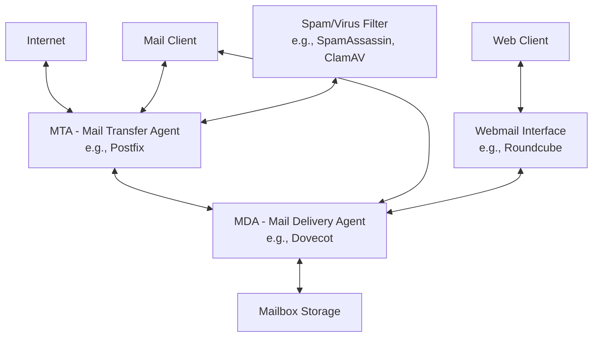

# Ubuntu Mail Servers

## Introduction

Mail servers are essential components of internet infrastructure, handling the sending, receiving, and storage of email messages. In the Ubuntu Server ecosystem, you can set up robust and secure mail servers using open-source software. This guide will walk you through understanding mail server fundamentals and implementing your own mail server on Ubuntu.

A mail server typically consists of multiple components working together:

1. **SMTP (Simple Mail Transfer Protocol)** server - handles sending emails
2. **IMAP/POP3** server - allows users to retrieve their emails
3. **Email filtering** - for spam prevention and security
4. **Webmail interface** - for accessing emails through a web browser

By the end of this guide, you'll understand how these components interact and how to set up a functional mail server on Ubuntu.

## Mail Server Architecture

Before diving into implementation, let's understand the architecture of a mail server system:



The main components include:

- **MTA (Mail Transfer Agent)**: Handles SMTP and is responsible for sending and receiving emails between servers.
- **MDA (Mail Delivery Agent)**: Delivers messages to local mailboxes and provides IMAP/POP3 services for retrieving emails.
- **Mailbox Storage**: Where the actual email messages are stored.
- **Webmail Interface**: Provides web-based access to emails.
- **Filtering Systems**: Protect against spam and malicious content.

## Setting Up Postfix (SMTP Server)

Postfix is one of the most popular MTAs for Ubuntu Server. Let's set it up:

### 1. Installation

```bash
sudo apt update
sudo apt install postfix
```

During installation, you'll be prompted to select a configuration type. For most cases, choose "Internet Site."

### 2. Basic Configuration

The main configuration file for Postfix is located at `/etc/postfix/main.cf`. Here's a basic configuration:

```
# Basic Settings
myhostname = mail.yourdomain.com
mydomain = yourdomain.com
myorigin = $mydomain
mydestination = $myhostname, localhost.$mydomain, localhost, $mydomain
relay_domains = $mydestination
mynetworks = 127.0.0.0/8 [::ffff:127.0.0.0]/104 [::1]/128

# Mail Directory
mail_owner = postfix
mail_spool_directory = /var/mail
```

After making changes, restart Postfix:

```bash
sudo systemctl restart postfix
```

### 3. Verifying SMTP Setup

You can test your SMTP server using the `telnet` command:

```bash
telnet localhost 25
```

Expected output:

```
Trying 127.0.0.1...
Connected to localhost.
Escape character is '^]'.
220 mail.yourdomain.com ESMTP Postfix (Ubuntu)
```

Type `quit` to exit the telnet session.

## Setting Up Dovecot (IMAP/POP3 Server)

Dovecot provides IMAP and POP3 protocols for email retrieval:

### 1. Installation

```bash
sudo apt install dovecot-core dovecot-imapd dovecot-pop3d
```

### 2. Basic Configuration

The main configuration files are in `/etc/dovecot/`:

**Edit `/etc/dovecot/dovecot.conf`:**

```
protocols = imap pop3
```

**Edit `/etc/dovecot/conf.d/10-mail.conf`:**

```
mail_location = mbox:~/mail:INBOX=/var/mail/%u
```

**Edit `/etc/dovecot/conf.d/10-auth.conf`:**

```
disable_plaintext_auth = no
auth_mechanisms = plain login
```

After making changes, restart Dovecot:

```bash
sudo systemctl restart dovecot
```

### 3. Verifying IMAP Setup

Test the IMAP connection:

```bash
telnet localhost 143
```

Expected output:

```
Trying 127.0.0.1...
Connected to localhost.
Escape character is '^]'.
* OK [CAPABILITY IMAP4rev1 LITERAL+ SASL-IR LOGIN-REFERRALS ID ENABLE IDLE STARTTLS AUTH=PLAIN AUTH=LOGIN] Dovecot ready.
```

Type `a logout` to exit the session.

## Adding Security with TLS/SSL

Secure your mail server with encryption:

### 1. Install SSL Certificates

```bash
sudo apt install certbot
sudo certbot certonly --standalone -d mail.yourdomain.com
```

### 2. Configure Postfix for TLS

Edit `/etc/postfix/main.cf`:

```
# TLS parameters
smtpd_tls_cert_file = /etc/letsencrypt/live/mail.yourdomain.com/fullchain.pem
smtpd_tls_key_file = /etc/letsencrypt/live/mail.yourdomain.com/privkey.pem
smtpd_tls_security_level = may
smtp_tls_security_level = may
smtpd_tls_loglevel = 1
```

### 3. Configure Dovecot for TLS

Edit `/etc/dovecot/conf.d/10-ssl.conf`:

```
ssl = required
ssl_cert = </etc/letsencrypt/live/mail.yourdomain.com/fullchain.pem
ssl_key = </etc/letsencrypt/live/mail.yourdomain.com/privkey.pem
```

Restart both services:

```bash
sudo systemctl restart postfix dovecot
```

## Setting Up Webmail (Roundcube)

To provide web-based email access:

### 1. Install Dependencies

```bash
sudo apt install apache2 php php-mysql php-curl php-intl php-mbstring php-imagick php-xml php-zip mysql-server
```

### 2. Install Roundcube

```bash
sudo apt install roundcube
```

During installation, configure the database when prompted.

### 3. Configure Apache

Create a symlink to make Roundcube accessible from your web server:

```bash
sudo ln -s /usr/share/roundcube /var/www/html/webmail
```

### 4. Configure Roundcube

Edit `/etc/roundcube/config.inc.php`:

```php
$config['default_host'] = 'localhost';
$config['smtp_server'] = 'localhost';
$config['smtp_port'] = 25;
$config['smtp_user'] = '';
$config['smtp_pass'] = '';
```

## Spam and Virus Filtering

Add protection against unwanted mail:

### 1. Install SpamAssassin and ClamAV

```bash
sudo apt install spamassassin clamav clamav-daemon amavisd-new
```

### 2. Configure Postfix to Use the Filters

Edit `/etc/postfix/main.cf`:

```
content_filter = smtp-amavis:[127.0.0.1]:10024
```

Add to `/etc/postfix/master.cf`:

```
smtp-amavis unix -    -    -     -     2  smtp
  -o smtp_data_done_timeout=1200
  -o smtp_send_xforward_command=yes
  -o disable_dns_lookups=yes
  -o max_use=20

127.0.0.1:10025 inet n  -    -     -     -  smtpd
  -o content_filter=
  -o local_recipient_maps=
  -o relay_recipient_maps=
  -o smtpd_restriction_classes=
  -o smtpd_delay_reject=no
  -o smtpd_client_restrictions=permit_mynetworks,reject
  -o smtpd_helo_restrictions=
  -o smtpd_sender_restrictions=
  -o smtpd_recipient_restrictions=permit_mynetworks,reject
  -o smtpd_data_restrictions=reject_unauth_pipelining
  -o smtpd_end_of_data_restrictions=
  -o mynetworks=127.0.0.0/8
  -o smtpd_error_sleep_time=0
  -o smtpd_soft_error_limit=1001
  -o smtpd_hard_error_limit=1000
  -o smtpd_client_connection_count_limit=0
  -o smtpd_client_connection_rate_limit=0
  -o receive_override_options=no_header_body_checks,no_unknown_recipient_checks
```

Restart the services:

```bash
sudo systemctl restart spamassassin clamav-daemon amavis postfix
```

## Email User Management

Create and manage users for your mail server:

### 1. Add a New Mail User

```bash
sudo adduser mailuser
```

This creates a new system user who can receive emails.

### 2. Set Email Quotas (Optional)

Install quota support:

```bash
sudo apt install quota quotatool
```

Edit `/etc/fstab` to enable quotas on your filesystem, adding `usrquota,grpquota` to the mount options.

Initialize the quota database:

```bash
sudo mount -o remount /
sudo quotacheck -ugm /
sudo quotaon -v /
```

Set a quota for a user:

```bash
sudo setquota -u mailuser 1000000 1200000 0 0 /
```

This sets a soft limit of ~1GB and a hard limit of ~1.2GB.

## Mail Server Maintenance

Regular maintenance is essential for a healthy mail server:

### 1. Log Monitoring

Mail server logs are typically found in:

```
/var/log/mail.log
/var/log/mail.err
/var/log/mail.warn
```

Monitor these logs regularly:

```bash
sudo tail -f /var/log/mail.log
```

### 2. Queue Management

View the current mail queue:

```bash
mailq
```

Force processing of the mail queue:

```bash
sudo postfix flush
```

Delete all queued messages:

```bash
sudo postsuper -d ALL
```

### 3. Backup Configuration

Regularly backup your configuration files:

```bash
sudo cp -r /etc/postfix /etc/postfix.bak
sudo cp -r /etc/dovecot /etc/dovecot.bak
```

## Troubleshooting Common Issues

### SMTP Connection Issues

If you can't connect to the SMTP server:

```bash
# Check if Postfix is running
sudo systemctl status postfix

# Check port 25 is open
sudo netstat -tuln | grep 25

# Check firewall settings
sudo ufw status
```

### Mail Delivery Problems

If emails aren't being delivered:

```bash
# Check mail queue
mailq

# View specific message in queue
sudo postcat -q MESSAGE_ID

# Check DNS records
dig MX yourdomain.com
```

### Authentication Failures

If users can't authenticate:

```bash
# Check Dovecot authentication logs
sudo grep "auth" /var/log/mail.log

# Test authentication manually
telnet localhost 143
a login username password
```

## Real-World Application: Multi-Domain Mail Server

Here's how to set up your mail server to handle multiple domains:

### 1. Add Virtual Domains

Edit `/etc/postfix/main.cf`:

```
virtual_mailbox_domains = example.com, example.org
virtual_mailbox_base = /var/mail/vhosts
virtual_mailbox_maps = hash:/etc/postfix/vmailbox
virtual_alias_maps = hash:/etc/postfix/virtual
```

### 2. Create Virtual Mailboxes

Edit `/etc/postfix/vmailbox`:

```
info@example.com example.com/info/
admin@example.com example.com/admin/
sales@example.org example.org/sales/
```

Update the database:

```bash
sudo postmap /etc/postfix/vmailbox
```

### 3. Create Mail Directories

```bash
sudo mkdir -p /var/mail/vhosts/example.com/{info,admin}
sudo mkdir -p /var/mail/vhosts/example.org/sales
```

Set proper permissions:

```bash
sudo chown -R vmail:vmail /var/mail/vhosts
```

## Summary

In this guide, we've covered the fundamentals of setting up and managing a mail server on Ubuntu Server. You've learned how to:

- Install and configure Postfix for SMTP functionality
- Set up Dovecot for IMAP/POP3 access
- Secure your mail server with TLS/SSL
- Implement webmail access with Roundcube
- Add spam and virus filtering
- Manage email users and quotas
- Perform basic maintenance and troubleshooting
- Configure a multi-domain mail server setup

Setting up a mail server requires careful configuration and regular maintenance, but the Ubuntu Server ecosystem provides all the necessary tools to create a robust and secure email infrastructure.

## Additional Resources

Here are some exercises to enhance your learning:

1. **Exercise**: Set up a test mail server in a virtual machine and send emails between local users.
2. **Exercise**: Configure SPF, DKIM, and DMARC records to improve email deliverability.
3. **Exercise**: Implement server-side email filtering rules using Sieve scripts.

To continue your learning journey:

- Explore more advanced mail server configurations in the official [Postfix documentation](http://www.postfix.org/documentation.html)
- Learn about [Dovecot's capabilities](https://doc.dovecot.org/)
- Practice hardening your mail server against common security threats