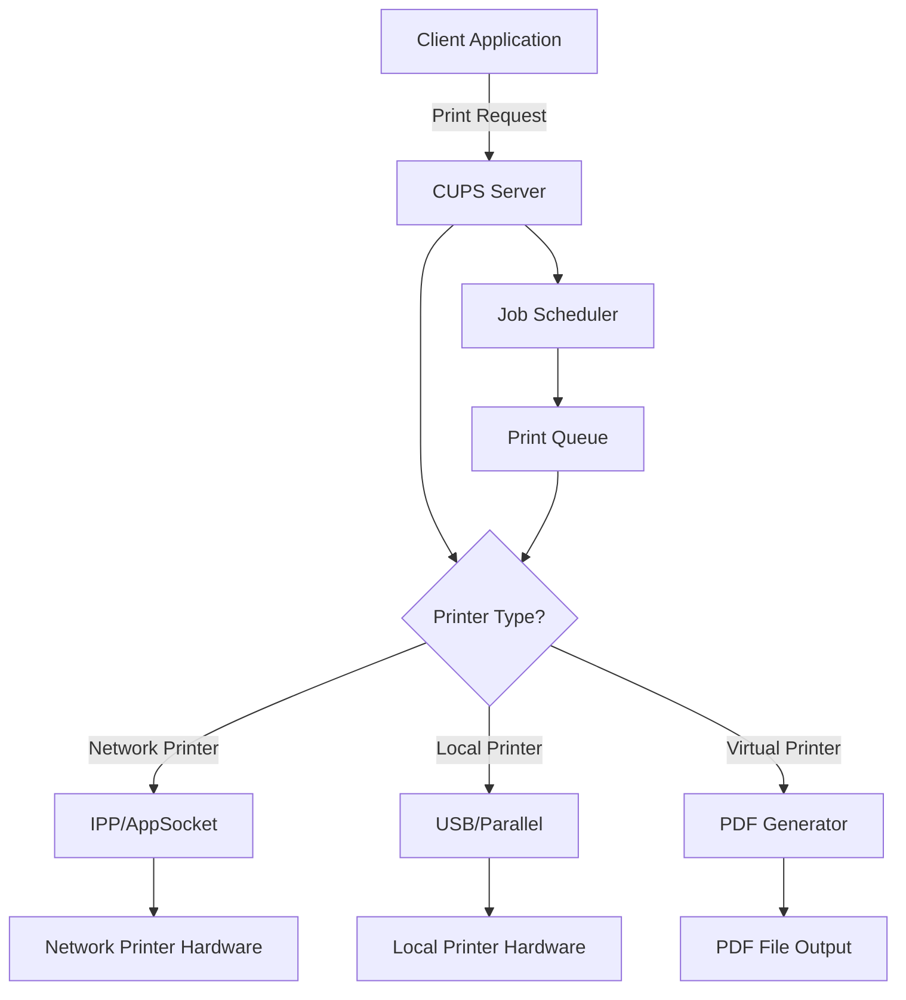

# Ubuntu Print Servers

## Introduction

A print server acts as a central hub for managing printers on a network, allowing multiple users to share printing resources efficiently. In Ubuntu Server environments, setting up a print server enables you to:

- Centralize printer management across your network
- Reduce hardware costs by sharing printers among multiple users
- Control printer access and monitor usage
- Create a standardized printing environment

Ubuntu Server uses CUPS (Common Unix Printing System) as its printing architecture, providing a powerful and flexible solution for handling print services. This guide will walk you through setting up, configuring, and managing an Ubuntu print server for your network.

## Prerequisites

Before setting up your Ubuntu print server, ensure you have:

- Ubuntu Server installed (this guide uses Ubuntu Server 22.04 LTS)
- Administrator (sudo) privileges
- Network connectivity 
- Printer hardware compatible with Linux (most modern printers)

## Installing CUPS Print Server

Let's start by installing CUPS, the foundation of our print server:

```bash
sudo apt update
sudo apt install cups cups-pdf
```

The `cups-pdf` package also installs a virtual PDF printer that converts print jobs to PDF files.

## Basic CUPS Configuration

After installation, we need to configure CUPS for network access:

1. Open the CUPS configuration file:

```bash
sudo nano /etc/cups/cupsd.conf
```

2. Allow network access by editing the following sections:

```
# Listen on all interfaces
Listen *:631

# Allow remote administration
<Location />
  Order allow,deny
  Allow @LOCAL
</Location>

# Allow remote administration
<Location /admin>
  Order allow,deny
  Allow @LOCAL
</Location>

# Allow remote access to the configuration files...
<Location /admin/conf>
  AuthType Default
  Require valid-user
  Order allow,deny
  Allow @LOCAL
</Location>
```

3. Restart CUPS to apply changes:

```bash
sudo systemctl restart cups
```

## Configuring Firewall for CUPS

If you're using UFW (Ubuntu's default firewall), allow CUPS traffic:

```bash
sudo ufw allow 631/tcp
sudo ufw allow 631/udp
```

## Adding Printers to CUPS

You can add printers via:

1. **Web Interface (recommended for beginners)**:
   - Open a browser and navigate to `http://your-server-ip:631`
   - Click "Administration" > "Add Printer"
   - Log in with a username that belongs to the `lpadmin` group
   - Follow the wizard to complete printer setup

2. **Command Line**:
   - For a USB printer:
   ```bash
   sudo lpadmin -p PrinterName -E -v usb://make/model -m ppd-file
   ```
   - For a network printer:
   ```bash
   sudo lpadmin -p PrinterName -E -v socket://printer-ip-address -m ppd-file
   ```

### Adding Users to the Printing Group

To allow users to manage printers, add them to the `lpadmin` group:

```bash
sudo usermod -aG lpadmin username
```

## Managing Print Queues

Here are some common commands for managing print queues:

```bash
# List all printers
lpstat -p -d

# View printer status
lpstat -p PrinterName

# Set default printer
lpoptions -d PrinterName

# Check print queue
lpq -P PrinterName

# Remove a job from the print queue
lprm -P PrinterName job-id

# Pause a printer
cupsdisable PrinterName

# Resume a printer
cupsenable PrinterName
```

## Printer Sharing and Discovery

### Enabling Printer Sharing

1. Open the CUPS web interface: `http://your-server-ip:631`
2. Go to Administration > Server Settings
3. Check "Share printers connected to this system"
4. Click "Change Settings"

### Configuring Avahi for Printer Discovery

Install Avahi for automatic printer discovery (Bonjour/mDNS):

```bash
sudo apt install avahi-daemon
```

Edit the CUPS configuration to work with Avahi:

```bash
sudo nano /etc/cups/cupsd.conf
```

Add or modify:

```
BrowseLocalProtocols dnssd
```

Restart services:

```bash
sudo systemctl restart avahi-daemon
sudo systemctl restart cups
```

## Creating Printer Classes

Printer classes allow multiple printers to act as a single logical printer, providing load balancing and failover capabilities.

To create a printer class via the command line:

```bash
sudo lpadmin -p ClassA -c PrinterOne,PrinterTwo -E
```

Or through the CUPS web interface:
1. Go to "Classes" > "Add Class"
2. Provide a name and select member printers
3. Click "Add Class"

## Print Server Monitoring and Management

### Viewing Logs

CUPS logs are typically located in `/var/log/cups/`:

```bash
# View error log
sudo less /var/log/cups/error_log

# View access log
sudo less /var/log/cups/access_log
```

### Setting Up Print Quotas

For print quotas, you'll need additional software:

```bash
sudo apt install printer-driver-cups-pdf quotatool
```

Configure quotas in `/etc/cups/quotas.conf`.

## CUPS Architecture Diagram

Here's a diagram showing how CUPS processes print jobs:



## Troubleshooting Common Issues

### Printer Not Detected

If your printer isn't detected:

```bash
# Check if printer is recognized by the system
sudo lpinfo -v

# Check for driver availability
sudo lpinfo -m | grep manufacturer
```

### Failed Print Jobs

For failed print jobs:

1. Check CUPS error log:
```bash
sudo less /var/log/cups/error_log
```

2. Verify printer connectivity:
```bash
ping printer-ip-address
```

3. Check printer status:
```bash
lpstat -p -l
```

### Permission Issues

For permission problems:

```bash
# Correct ownership of CUPS config files
sudo chown -R root:lp /etc/cups

# Set appropriate permissions
sudo chmod 640 /etc/cups/cupsd.conf
sudo chmod 640 /etc/cups/printers.conf
```

## Client Configuration

### Connecting Ubuntu Clients

On Ubuntu desktop clients:

```bash
sudo apt install cups-client

# Point to the print server
sudo lpadmin -p RemotePrinter -E -v ipp://print-server:631/printers/PrinterName
```

### Connecting Windows Clients

For Windows clients:
1. Go to "Devices and Printers" > "Add a printer"
2. Select "The printer that I want isn't listed"
3. Choose "Select a shared printer by name"
4. Enter: `http://print-server:631/printers/PrinterName`

### Connecting macOS Clients

For macOS clients:
1. Open System Preferences > Printers & Scanners
2. Click "+"
3. Select the printer (should appear automatically via Bonjour/mDNS)
4. Or add IP Printer: `ipp://print-server:631/printers/PrinterName`

## Practical Print Server Examples

### Example 1: Small Office Setup

```bash
# Install CUPS
sudo apt update && sudo apt install cups cups-pdf

# Configure network access
sudo sed -i 's/Listen localhost:631/Listen *:631/' /etc/cups/cupsd.conf

# Allow access from office subnet
sudo bash -c 'cat >> /etc/cups/cupsd.conf << EOF
<Location />
  Order allow,deny
  Allow from 192.168.1.0/24
  Allow from localhost
</Location>
EOF'

# Restart CUPS
sudo systemctl restart cups

# Add office printer
sudo lpadmin -p OfficePrinter -E -v socket://192.168.1.100 -m everywhere
```

### Example 2: School Lab Environment

```bash
# Create student print queue with quota
sudo lpadmin -p StudentPrinter -E -v socket://192.168.2.10 -m everywhere
sudo lpadmin -p StudentPrinter -o job-quota-period=weekly
sudo lpadmin -p StudentPrinter -o job-page-limit=50

# Create teacher print queue without quota
sudo lpadmin -p TeacherPrinter -E -v socket://192.168.2.10 -o printer-is-shared=false

# Set default paper size and duplex printing
sudo lpadmin -p StudentPrinter -o media=a4 -o sides=two-sided-long-edge
```

## Summary

In this guide, we've covered how to:
- Install and configure CUPS as a print server on Ubuntu
- Add and manage printers and print queues
- Share printers across a network
- Monitor and troubleshoot printing issues
- Connect different client operating systems
- Implement real-world print server scenarios

A properly configured Ubuntu print server provides a robust, centralized printing solution that can significantly improve resource utilization and simplify printer management in any networked environment.

## Additional Resources

- [Official CUPS Documentation](https://www.cups.org/documentation.html)
- [Ubuntu Server Documentation](https://ubuntu.com/server/docs)
- [CUPS API Reference](https://www.cups.org/doc/api-cups.html)

## Exercises

1. Set up a basic CUPS print server with a PDF virtual printer
2. Configure a physical printer and share it on your network
3. Create a printer class with load balancing between two printers
4. Implement basic print quotas for a group of users
5. Configure automatic email notifications for print job failures