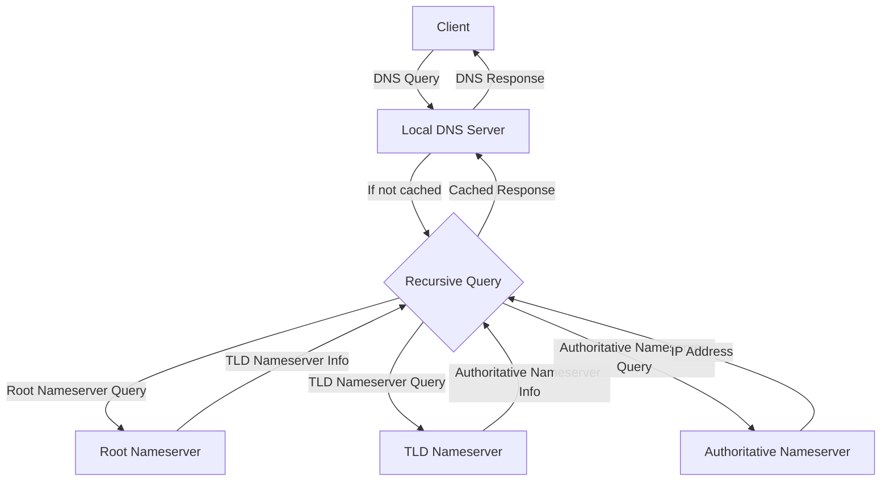

# Ubuntu DNS Servers

## Introduction

Domain Name System (DNS) is a fundamental part of modern networking, acting as the internet's phonebook by translating human-readable domain names (like `example.com`) into computer-readable IP addresses (like `192.168.1.1`). Ubuntu Server provides robust tools for setting up your own DNS servers, which can enhance your network's performance, reliability, and security.

In this guide, we'll explore how to implement DNS servers on Ubuntu, focusing on BIND9 (Berkeley Internet Name Domain), the most widely-used DNS software on the internet. Whether you're setting up a small home lab or managing enterprise infrastructure, understanding DNS configuration on Ubuntu is an essential skill for any system administrator.

## Understanding DNS Fundamentals

Before diving into installation and configuration, let's establish a clear understanding of key DNS concepts:

### What is DNS?

DNS translates domain names into IP addresses, enabling users to access websites and services using memorable names instead of numerical addresses.

### Types of DNS Servers

1. **Authoritative DNS Servers**: Store and provide official DNS records for specific domains
2. **Recursive DNS Servers**: Query other servers to resolve DNS lookups for clients
3. **Caching DNS Servers**: Store recently accessed DNS information to speed up future requests
4. **Forwarding DNS Servers**: Pass DNS queries to specified upstream servers

### DNS Record Types

- **A Record**: Maps a domain name to an IPv4 address
- **AAAA Record**: Maps a domain name to an IPv6 address
- **CNAME Record**: Creates an alias pointing to another domain name
- **MX Record**: Specifies mail servers for the domain
- **TXT Record**: Stores text information (often used for verification)
- **NS Record**: Delegates a DNS zone to use the given authoritative nameservers

## Installing BIND9 on Ubuntu

Let's begin with installing BIND9, the most common DNS server implementation on Ubuntu:

```bash
sudo apt update
sudo apt install bind9 bind9utils bind9-doc
```

After installation, the BIND9 service should start automatically. You can verify its status with:

```bash
sudo systemctl status bind9
```

Expected output:
```
● named.service - BIND Domain Name Server
     Loaded: loaded (/lib/systemd/system/named.service; enabled; vendor preset: enabled)
     Active: active (running) since Thu 2023-03-09 15:23:42 UTC; 5s ago
       Docs: man:named(8)
    Process: 12538 ExecStart=/usr/sbin/named -f -u bind (code=exited, status=0/SUCCESS)
   Main PID: 12539 (named)
      Tasks: 5 (limit: 4915)
     Memory: 13.8M
        CPU: 40ms
     CGroup: /system.slice/named.service
             └─12539 /usr/sbin/named -f -u bind
```

## Basic BIND9 Configuration

BIND9 configuration files are stored in the `/etc/bind/` directory. The main configuration file is `/etc/bind/named.conf`, which includes other configuration files:

```bash
sudo nano /etc/bind/named.conf
```

This file typically includes:

```
// This is the primary configuration file for the BIND DNS server named.
//
include "/etc/bind/named.conf.options";
include "/etc/bind/named.conf.local";
include "/etc/bind/named.conf.default-zones";
```

### Setting Up a Caching DNS Server

For a basic caching DNS server, we need to modify the `/etc/bind/named.conf.options` file:

```bash
sudo nano /etc/bind/named.conf.options
```

Add or modify the following configuration:

```
options {
        directory "/var/cache/bind";

        // Forward DNS queries to Google's public DNS servers
        forwarders {
                8.8.8.8;
                8.8.4.4;
        };
        
        // Accept queries from local network only
        listen-on { 127.0.0.1; 192.168.1.0/24; };
        
        // Disable recursive DNS for external clients
        allow-recursion { localhost; 192.168.1.0/24; };
        
        // Disable zone transfers for security
        allow-transfer { none; };
        
        // Enable DNSSec validation (recommended)
        dnssec-validation auto;
        
        // Disable IPv6
        listen-on-v6 { none; };
};
```

After modifying the configuration, check the syntax for errors:

```bash
sudo named-checkconf
```

If there's no output, the configuration is valid. Now restart BIND9:

```bash
sudo systemctl restart bind9
```

## Creating Forward and Reverse Zones

To set up your Ubuntu server as an authoritative DNS server for your domain, you'll need to create forward and reverse zones.

### Step 1: Configure named.conf.local

```bash
sudo nano /etc/bind/named.conf.local
```

Add the forward and reverse zone declarations:

```
// Forward zone for example.com
zone "example.com" {
    type master;
    file "/etc/bind/zones/db.example.com";
    allow-transfer { none; };
};

// Reverse zone for 192.168.1.0/24
zone "1.168.192.in-addr.arpa" {
    type master;
    file "/etc/bind/zones/db.192.168.1";
    allow-transfer { none; };
};
```

### Step 2: Create the Zones Directory

```bash
sudo mkdir -p /etc/bind/zones
```

### Step 3: Create the Forward Zone File

```bash
sudo nano /etc/bind/zones/db.example.com
```

Add the following content:

```
$TTL    86400
@       IN      SOA     ns1.example.com. admin.example.com. (
                    2023030901      ; Serial
                    3600            ; Refresh
                    1800            ; Retry
                    604800          ; Expire
                    86400           ; Minimum TTL
)

; Name servers
@       IN      NS      ns1.example.com.

; A records for name servers
ns1     IN      A       192.168.1.10

; A records for other servers
www     IN      A       192.168.1.20
mail    IN      A       192.168.1.30

; Mail server MX record
@       IN      MX      10 mail.example.com.
```

### Step 4: Create the Reverse Zone File

```bash
sudo nano /etc/bind/zones/db.192.168.1
```

Add the following content:

```
$TTL    86400
@       IN      SOA     ns1.example.com. admin.example.com. (
                    2023030901      ; Serial
                    3600            ; Refresh
                    1800            ; Retry
                    604800          ; Expire
                    86400           ; Minimum TTL
)

; Name servers
@       IN      NS      ns1.example.com.

; PTR Records
10      IN      PTR     ns1.example.com.
20      IN      PTR     www.example.com.
30      IN      PTR     mail.example.com.
```

### Step 5: Check the Zone Files

Verify the syntax of your zone files:

```bash
sudo named-checkzone example.com /etc/bind/zones/db.example.com
sudo named-checkzone 1.168.192.in-addr.arpa /etc/bind/zones/db.192.168.1
```

### Step 6: Restart BIND9

```bash
sudo systemctl restart bind9
```

## Configuring DNS Client for Testing

To test your DNS server, you'll need to configure a client to use it. On Ubuntu, edit the `/etc/resolv.conf` file or configure NetworkManager to use your DNS server IP.

For temporary testing, modify `/etc/resolv.conf`:

```bash
sudo nano /etc/resolv.conf
```

Add or modify the nameserver line:

```
nameserver 192.168.1.10  # Your DNS server IP
```

## DNS Server Architecture Diagram

Here's a visual representation of a typical DNS server architecture:



## Advanced Configuration Options

### Split-Horizon DNS

Split-horizon DNS allows you to serve different answers to DNS queries based on the source of the request. This is useful for providing different views of your network to internal and external clients.

Edit `/etc/bind/named.conf.local`:

```bash
sudo nano /etc/bind/named.conf.local
```

Add view configurations:

```
view "internal" {
    match-clients { 192.168.1.0/24; localhost; };
    
    zone "example.com" {
        type master;
        file "/etc/bind/zones/internal/db.example.com";
    };
};

view "external" {
    match-clients { any; };
    
    zone "example.com" {
        type master;
        file "/etc/bind/zones/external/db.example.com";
    };
};
```

### DNSSEC Configuration

DNSSEC adds a layer of security to DNS by digitally signing records. To enable DNSSEC for your zones:

1. Generate zone signing keys:

```bash
sudo cd /etc/bind/zones
sudo dnssec-keygen -a NSEC3RSASHA1 -b 2048 -n ZONE example.com
sudo dnssec-keygen -f KSK -a NSEC3RSASHA1 -b 4096 -n ZONE example.com
```

2. Sign your zone:

```bash
sudo dnssec-signzone -A -3 $(head -c 16 /dev/random | od -e -An | tr -d ' 
') -N INCREMENT -o example.com -t db.example.com
```

3. Update your zone configuration to use the signed zone file.

## Troubleshooting DNS Issues

### Common DNS Troubleshooting Tools

#### `dig` - DNS lookup utility

Check if a domain resolves to the correct IP:

```bash
dig example.com @192.168.1.10
```

Expected output:
```
; <<>> DiG 9.16.1-Ubuntu <<>> example.com @192.168.1.10
;; global options: +cmd
;; Got answer:
;; ->>HEADER<<- opcode: QUERY, status: NOERROR, id: 62580
;; flags: qr aa rd ra; QUERY: 1, ANSWER: 1, AUTHORITY: 1, ADDITIONAL: 2

;; QUESTION SECTION:
;example.com.                   IN      A

;; ANSWER SECTION:
example.com.            86400   IN      A       192.168.1.20
```

#### `nslookup` - Query DNS records

```bash
nslookup example.com 192.168.1.10
```

Expected output:
```
Server:         192.168.1.10
Address:        192.168.1.10#53

Name:   example.com
Address: 192.168.1.20
```

#### `host` - Simple DNS lookup utility

```bash
host example.com 192.168.1.10
```

Expected output:
```
Using domain server:
Name: 192.168.1.10
Address: 192.168.1.10#53
Aliases: 

example.com has address 192.168.1.20
```

### Common DNS Issues and Solutions

| Problem | Symptoms | Solutions |
|---------|----------|-----------|
| DNS server not responding | `dig` or `nslookup` timeouts | Check if BIND9 is running with `systemctl status bind9` |
| Zone file syntax errors | BIND9 fails to start | Use `named-checkzone` to validate zone files |
| Permission issues | Error in syslog about permissions | Check ownership with `ls -la /etc/bind/` and correct with `chown` |
| Cache poisoning | Unexpected DNS results | Enable DNSSEC and implement proper ACLs |
| Network firewall blocking | Cannot access DNS from external networks | Check firewall rules with `sudo ufw status` and allow UDP/TCP port 53 |

## DNS Logging and Monitoring

Enable DNS query logging by adding the following to `/etc/bind/named.conf.options`:

```
logging {
    channel query_log {
        file "/var/log/named/query.log";
        severity info;
        print-time yes;
    };
    category queries { query_log; };
};
```

Create the log directory:

```bash
sudo mkdir -p /var/log/named
sudo chown bind:bind /var/log/named
```

## Real-World Applications

### Case Study 1: Local Development Environment

For developers working on multiple projects, a local DNS server can map different project domains to localhost or development servers:

```
// In db.example.com zone file
project1.dev    IN      A       127.0.0.1
project2.dev    IN      A       192.168.1.50
api.project2.dev IN     A       192.168.1.51
```

### Case Study 2: Corporate Network DNS

In a corporate environment, DNS can:
- Map internal service names to IP addresses
- Implement split-horizon DNS (different internal/external views)
- Block malicious domains through DNS blacklisting
- Load balance traffic with round-robin DNS

```
// Round-robin DNS for load balancing web servers
www     IN      A       192.168.1.101
www     IN      A       192.168.1.102
www     IN      A       192.168.1.103
```

## Summary

Setting up DNS servers on Ubuntu using BIND9 allows you to take control of your network's domain name resolution. We've covered:

- Basic DNS concepts and server types
- Installing and configuring BIND9 on Ubuntu
- Creating forward and reverse zones
- Implementing advanced features like split-horizon DNS and DNSSEC
- Troubleshooting common DNS issues
- Real-world applications for DNS servers

By mastering these concepts, you can improve your network's performance, security, and flexibility while gaining valuable skills for system administration and network management.

## Additional Resources

- [Ubuntu Server Documentation](https://ubuntu.com/server/docs) - Official Ubuntu Server documentation
- [BIND9 Administrator Reference Manual](https://bind9.readthedocs.io/) - Comprehensive BIND9 reference
- [DNS and BIND](https://www.oreilly.com/library/view/dns-and-bind/0596100574/) - The definitive guide to DNS and BIND

## Practice Exercises

1. Set up a caching DNS server for your home or development network.
2. Create forward and reverse zones for a test domain.
3. Implement split-horizon DNS to provide different views for internal and external users.
4. Configure DNSSEC to secure your DNS zones.
5. Use round-robin DNS to implement basic load balancing for a web application.