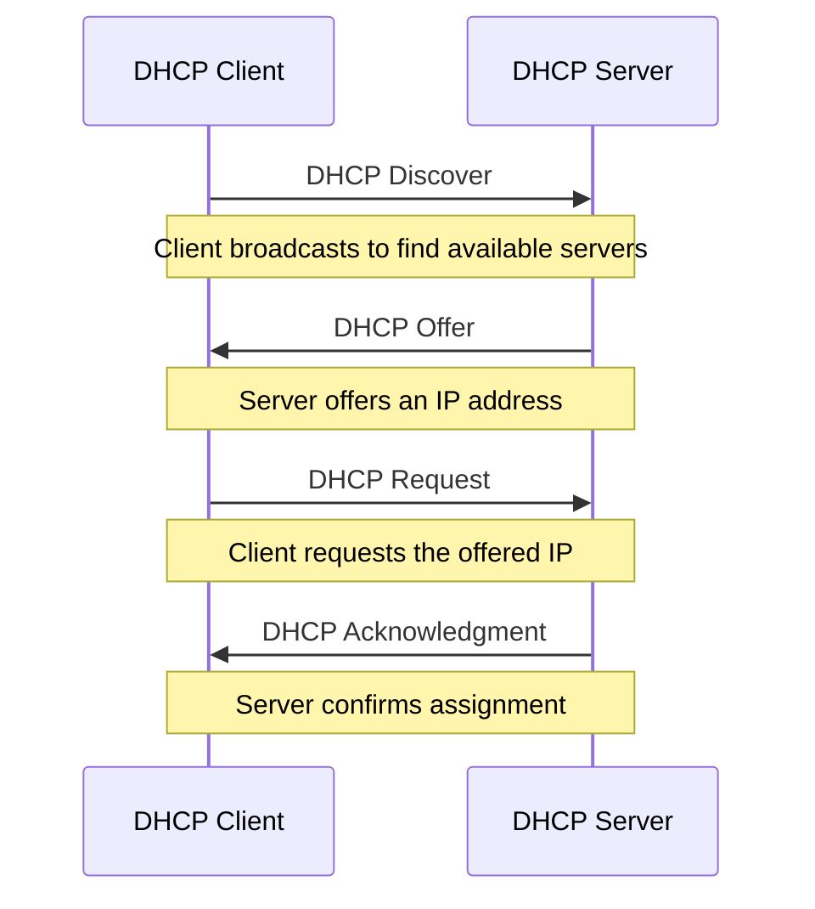

# Ubuntu DHCP Servers

## Introduction

A Dynamic Host Configuration Protocol (DHCP) server plays a crucial role in modern networks by automatically assigning IP addresses and network configuration parameters to devices. This eliminates the need for manual IP configuration and simplifies network administration.

In this guide, we'll explore how to set up, configure, and manage a DHCP server on Ubuntu. By the end, you'll be able to implement a working DHCP server that can efficiently handle IP address allocation for your network.

## What is DHCP?

DHCP is a network management protocol that dynamically assigns IP addresses and other network configuration parameters to devices on a network. When a device connects to a network, it sends a broadcast message requesting network configuration. A DHCP server responds with the necessary information, including:

- IP address
- Subnet mask
- Default gateway
- DNS servers
- Lease time (duration for which the IP address is valid)



## Installing a DHCP Server on Ubuntu

The most common DHCP server for Ubuntu is `isc-dhcp-server`. Let's install it:

```bash
sudo apt update
sudo apt install isc-dhcp-server -y
```

## Configuring the DHCP Server

### Step 1: Specify the Network Interface

First, we need to specify which network interface the DHCP server will listen on:

```bash
sudo nano /etc/default/isc-dhcp-server
```

Edit the file to specify your network interface (e.g., `eth0` or `ens33`):

```
INTERFACESv4="eth0"
INTERFACESv6=""
```

### Step 2: Configure the DHCP Settings

Next, we'll configure the main DHCP settings file:

```bash
sudo nano /etc/dhcp/dhcpd.conf
```

A basic configuration might look like this:

```
# Global options
default-lease-time 600;
max-lease-time 7200;
authoritative;

# Configure a subnet
subnet 192.168.1.0 netmask 255.255.255.0 {
  range 192.168.1.100 192.168.1.200;
  option routers 192.168.1.1;
  option domain-name-servers 8.8.8.8, 8.8.4.4;
  option domain-name "example.local";
}
```

This configuration:
- Sets the default lease time to 600 seconds (10 minutes)
- Sets the maximum lease time to 7200 seconds (2 hours)
- Declares this server as authoritative for the network
- Creates a subnet for the 192.168.1.0/24 network
- Allocates IP addresses between 192.168.1.100 and 192.168.1.200
- Sets the default gateway (router) to 192.168.1.1
- Uses Google's DNS servers

### Step 3: Start and Enable the DHCP Server

Now, start the DHCP server and enable it to start on boot:

```bash
sudo systemctl restart isc-dhcp-server
sudo systemctl enable isc-dhcp-server
sudo systemctl status isc-dhcp-server
```

If everything is configured correctly, you should see that the service is active and running.

## Advanced DHCP Configuration

### Static IP Assignments

You can assign static IPs to specific devices using their MAC addresses:

```
host workstation1 {
  hardware ethernet 00:11:22:33:44:55;
  fixed-address 192.168.1.50;
}
```

### Multiple Subnets

You can configure DHCP for multiple subnets:

```
subnet 192.168.1.0 netmask 255.255.255.0 {
  range 192.168.1.100 192.168.1.200;
  option routers 192.168.1.1;
  option domain-name-servers 8.8.8.8, 8.8.4.4;
}

subnet 192.168.2.0 netmask 255.255.255.0 {
  range 192.168.2.100 192.168.2.200;
  option routers 192.168.2.1;
  option domain-name-servers 8.8.8.8, 8.8.4.4;
}
```

### DHCP Options

You can set various DHCP options to provide additional network configuration:

```
option ntp-servers 192.168.1.5;
option time-offset -18000;  # Eastern Standard Time (UTC-5)
option tftp-server-name "192.168.1.10";
```

## Troubleshooting DHCP Issues

### Checking Service Status

To check if the DHCP server is running:

```bash
sudo systemctl status isc-dhcp-server
```

### Viewing DHCP Leases

To see current DHCP leases:

```bash
cat /var/lib/dhcp/dhcpd.leases
```

### Monitoring DHCP Traffic

To monitor DHCP traffic in real-time:

```bash
sudo tcpdump -i eth0 port 67 or port 68 -n
```

### Common Issues and Solutions

1. **DHCP server won't start**
   - Check for configuration errors:
   ```bash
   sudo dhcpd -t -cf /etc/dhcp/dhcpd.conf
   ```

2. **IP address conflicts**
   - Make sure the DHCP range doesn't overlap with static IPs:
   ```bash
   sudo arp-scan --interface=eth0 --localnet
   ```

3. **Clients not receiving IPs**
   - Check firewall settings:
   ```bash
   sudo ufw status
   ```
   - Ensure the network interface is correctly specified

## Setting Up a DHCP Relay

If you have multiple network segments but want to use a single DHCP server, you can set up DHCP relay agents:

```bash
sudo apt install isc-dhcp-relay
```

Configure the relay with the IP address of your DHCP server:

```bash
sudo nano /etc/default/isc-dhcp-relay
```

Edit the configuration:

```
# What servers should the DHCP relay forward requests to?
SERVERS="192.168.1.1"

# On what interfaces should the DHCP relay (dhrelay) serve DHCP requests?
INTERFACES="eth0 eth1"

# Additional options that are passed to the DHCP relay daemon?
OPTIONS=""
```

Start and enable the relay service:

```bash
sudo systemctl restart isc-dhcp-relay
sudo systemctl enable isc-dhcp-relay
```

## Practical Example: Setting Up a Complete DHCP Infrastructure

Let's walk through a practical example of setting up a DHCP server for a small office with different departments:

### Network Requirements
- Admin department: 192.168.10.0/24
- Development department: 192.168.20.0/24
- Marketing department: 192.168.30.0/24
- Each department needs different DNS servers
- Some servers need static IPs

### Configuration

```
# Global options
default-lease-time 3600;  # 1 hour
max-lease-time 86400;     # 24 hours
authoritative;
log-facility local7;

# Shared network for the entire office
shared-network "office" {
  # Admin subnet
  subnet 192.168.10.0 netmask 255.255.255.0 {
    range 192.168.10.50 192.168.10.200;
    option routers 192.168.10.1;
    option domain-name-servers 192.168.10.5, 8.8.8.8;
    option domain-name "admin.company.local";
  }

  # Development subnet
  subnet 192.168.20.0 netmask 255.255.255.0 {
    range 192.168.20.50 192.168.20.200;
    option routers 192.168.20.1;
    option domain-name-servers 192.168.20.5, 8.8.8.8;
    option domain-name "dev.company.local";
  }

  # Marketing subnet
  subnet 192.168.30.0 netmask 255.255.255.0 {
    range 192.168.30.50 192.168.30.200;
    option routers 192.168.30.1;
    option domain-name-servers 192.168.30.5, 8.8.8.8;
    option domain-name "marketing.company.local";
  }
}

# Static IP assignments
group {
  # Web servers
  host webserver1 {
    hardware ethernet 00:11:22:33:44:55;
    fixed-address 192.168.20.10;
  }
  
  host webserver2 {
    hardware ethernet 00:11:22:33:44:56;
    fixed-address 192.168.20.11;
  }
  
  # Database server
  host dbserver {
    hardware ethernet 00:11:22:33:44:57;
    fixed-address 192.168.20.20;
  }
  
  # File server
  host fileserver {
    hardware ethernet 00:11:22:33:44:58;
    fixed-address 192.168.10.10;
  }
}
```

## Security Considerations

### Restricting Access

You can restrict which clients are allowed to get IPs:

```
subnet 192.168.1.0 netmask 255.255.255.0 {
  deny unknown-clients;
  # Only specified clients will receive IPs
}
```

### DHCP Snooping

Consider implementing DHCP snooping on your switches to prevent rogue DHCP servers from distributing incorrect network information.

### Regular Log Monitoring

Regularly monitor DHCP logs for unusual activities:

```bash
sudo tail -f /var/log/syslog | grep dhcpd
```

## Performance Tuning

For larger networks, you might want to adjust these parameters:

```
# Increase for larger networks
db-time-format local;
ping-check true;
lease-file-name "/var/lib/dhcp/dhcpd.leases";
pid-file-name "/var/run/dhcpd.pid";
```

## Summary

In this guide, we've covered:

1. The basics of DHCP and how it works
2. Installing and configuring a DHCP server on Ubuntu
3. Advanced configurations including static IP assignments and multiple subnets
4. Setting up DHCP relay for complex networks
5. Troubleshooting common DHCP issues
6. Security and performance considerations

DHCP servers are essential components of network infrastructure that greatly simplify IP management and network administration. By automating the IP assignment process, they reduce the administrative burden and potential for configuration errors.

## Additional Resources and Exercises

### Resources
- [ISC DHCP Server Documentation](https://kb.isc.org/docs/isc-dhcp-44-manual-pages-dhcpd)
- [Ubuntu Server Guide - DHCP](https://ubuntu.com/server/docs)

### Exercises

1. **Basic Setup**: Configure a DHCP server for a home network with 192.168.0.0/24 subnet and allocate IPs from 192.168.0.100 to 192.168.0.200.

2. **Advanced Configuration**: Set up a DHCP server with two subnets and configure static IP assignments for at least three devices.

3. **Troubleshooting**: Intentionally introduce an error in your DHCP configuration file and practice using the troubleshooting commands to identify and fix the issue.

4. **DHCP Relay**: If you have access to multiple network interfaces or virtual machines, set up a DHCP relay configuration.

5. **Monitoring**: Create a simple bash script that monitors the DHCP leases file and sends an alert when a new device joins the network.