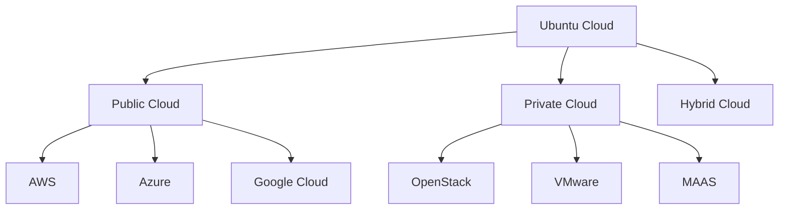

# Ubuntu Cloud Basics

## Introduction

Ubuntu Cloud is Canonical's solution for deploying and managing Ubuntu in various cloud environments. It provides optimized Ubuntu images and tools that make it easier to deploy, scale, and manage Ubuntu-based infrastructure in public, private, and hybrid cloud settings. Whether you're working with AWS, Azure, Google Cloud, or setting up your own OpenStack environment, Ubuntu Cloud offers consistent experiences and powerful management capabilities.

In this guide, we'll explore the fundamental concepts of Ubuntu Cloud, understand its core components, and learn how to get started with basic deployments.

## Key Components of Ubuntu Cloud

Ubuntu Cloud consists of several key components that work together to provide a comprehensive cloud solution:

### 1. Cloud Images

Ubuntu Cloud Images are pre-built Ubuntu server images optimized for cloud environments. They are:
- **Lightweight**: Minimal installation to reduce storage and deployment time
- **Cloud-init enabled**: Automatically configures on first boot
- **Regularly updated**: Security patches and updates are applied frequently

### 2. Juju 

Juju is Canonical's service orchestration tool that simplifies the deployment and management of applications across multiple cloud environments.

### 3. MAAS (Metal as a Service)

MAAS allows you to treat physical servers like virtual machines in the cloud, enabling you to quickly provision and repurpose bare-metal servers.

### 4. LXD

LXD is a container hypervisor that offers a user experience similar to virtual machines but with the performance of containers.

## Cloud Compatibility

Ubuntu Cloud images and tools are compatible with major cloud providers:



## Getting Started with Ubuntu Cloud

### Finding Ubuntu Cloud Images

Ubuntu provides regularly updated cloud images for different environments. You can find these images at:

```
https://cloud-images.ubuntu.com/
```

These images are available in various formats depending on the target platform (QCOW2, VMDK, AMI, etc.).

### Using Cloud-Init for Instance Initialization

Cloud-init is a standard for customizing cloud instances during their initial boot. With cloud-init, you can:
- Set up users and SSH keys
- Configure networking
- Install packages
- Run custom scripts

Here's a basic cloud-init configuration example:

```yaml
#cloud-config
hostname: ubuntu-cloud-server
users:
  - name: ubuntu
    sudo: ALL=(ALL) NOPASSWD:ALL
    shell: /bin/bash
    ssh_authorized_keys:
      - ssh-rsa AAAAB3NzaC1yc2E...user@example.com

packages:
  - nginx
  - python3-pip

runcmd:
  - systemctl enable nginx
  - systemctl start nginx
```

This configuration:
1. Sets the hostname to "ubuntu-cloud-server"
2. Creates an "ubuntu" user with sudo privileges
3. Adds an SSH key for authentication
4. Installs nginx and python3-pip packages
5. Enables and starts the nginx service

### Launching Ubuntu on AWS

Here's how to launch an Ubuntu instance on AWS using the AWS CLI:

```bash
# Find the latest Ubuntu 22.04 LTS AMI
aws ec2 describe-images \
    --owners 099720109477 \
    --filters "Name=name,Values=ubuntu/images/hvm-ssd/ubuntu-jammy-22.04-amd64-server-*" \
    --query 'sort_by(Images, &CreationDate)[-1].ImageId' \
    --output text

# Launch an instance using the AMI
aws ec2 run-instances \
    --image-id ami-0123456789abcdef \
    --instance-type t2.micro \
    --key-name your-key-pair \
    --security-group-ids sg-0123456789abcdef \
    --subnet-id subnet-0123456789abcdef
```

Output:
```
{
    "Groups": [],
    "Instances": [
        {
            "AmiLaunchIndex": 0,
            "ImageId": "ami-0123456789abcdef",
            "InstanceId": "i-0123456789abcdef",
            "InstanceType": "t2.micro",
            "KeyName": "your-key-pair",
            ...
        }
    ],
    ...
}
```

### Using Juju for Application Deployment

Juju allows you to deploy complex applications using pre-configured "charms." Here's how to get started:

First, install Juju:

```bash
sudo snap install juju --classic
```

Initialize Juju with a cloud provider (AWS in this example):

```bash
juju add-credential aws
juju bootstrap aws my-cloud-controller
```

Deploy a simple web application:

```bash
juju deploy ubuntu
juju deploy nginx
juju add-relation nginx ubuntu
juju expose nginx
```

This will:
1. Deploy Ubuntu and nginx containers
2. Create a relation between them
3. Make nginx publicly accessible

## Ubuntu Cloud in Practice: Real-World Example

Let's walk through a complete example of setting up a scalable web application using Ubuntu Cloud components.

### Scenario: Deploying a Load-Balanced Web Application

In this scenario, we'll deploy a simple web application with multiple backend servers and a load balancer.

1. First, create a cloud-init configuration file called `web-server-config.yaml`:

```yaml
#cloud-config
packages:
  - nginx
  - nodejs
  - npm

write_files:
  - path: /var/www/html/index.html
    content: |
      <!DOCTYPE html>
      <html>
      <head>
          <title>Ubuntu Cloud Demo</title>
      </head>
      <body>
          <h1>Hello from Ubuntu Cloud!</h1>
          <p>Server ID: $(hostname)</p>
      </body>
      </html>
    permissions: '0644'

runcmd:
  - systemctl enable nginx
  - systemctl start nginx
```

2. Launch multiple instances using this configuration:

```bash
# For AWS
aws ec2 run-instances \
    --image-id ami-0123456789abcdef \
    --instance-type t2.micro \
    --key-name your-key-pair \
    --security-group-ids sg-0123456789abcdef \
    --subnet-id subnet-0123456789abcdef \
    --user-data file://web-server-config.yaml \
    --count 3 \
    --tag-specifications 'ResourceType=instance,Tags=[{Key=Name,Value=web-server}]'
```

3. Create a load balancer and register the instances:

```bash
# Create load balancer
aws elbv2 create-load-balancer \
    --name ubuntu-web-lb \
    --subnets subnet-0123456789abcdef subnet-fedcba9876543210 \
    --security-groups sg-0123456789abcdef

# Create target group
aws elbv2 create-target-group \
    --name ubuntu-web-targets \
    --protocol HTTP \
    --port 80 \
    --vpc-id vpc-0123456789abcdef \
    --health-check-path /index.html

# Register instances with target group
aws elbv2 register-targets \
    --target-group-arn arn:aws:elasticloadbalancing:region:account-id:targetgroup/ubuntu-web-targets/0123456789abcdef \
    --targets Id=i-0123456789abcdef Id=i-fedcba9876543210 Id=i-abcdef0123456789
```

This deployment demonstrates:
- How Ubuntu Cloud images work with cloud-init for configuration
- The ability to quickly deploy multiple identical servers
- Integration with cloud-native services like load balancers

## Monitoring Ubuntu Cloud Instances

Ubuntu provides several options for monitoring cloud instances:

### Using Canonical Landscape

Landscape offers comprehensive monitoring and management for Ubuntu systems:

```bash
sudo apt install landscape-client
sudo landscape-config --computer-title "Web Server 1" --account-name "my-account" --url "https://landscape.canonical.com/message-system" --ping-url "http://landscape.canonical.com/ping"
```

### Using Prometheus and Grafana

For a more customizable monitoring solution:

```bash
# Install Prometheus Node Exporter
sudo apt install prometheus-node-exporter

# Configure firewall to allow Prometheus server access
sudo ufw allow from prometheus-server-ip to any port 9100
```

Then on your Prometheus server, add the target in the configuration file.

## Summary

In this guide, we've covered the fundamentals of Ubuntu Cloud:

- Core components including Cloud Images, Juju, MAAS, and LXD
- How to find and use Ubuntu Cloud Images
- Configuring instances with cloud-init
- Launching instances on AWS
- Using Juju for application deployment
- A practical example of deploying a load-balanced web application
- Basic monitoring options

Ubuntu Cloud provides a flexible, powerful foundation for your cloud infrastructure. Its compatibility with major cloud providers and rich ecosystem of tools make it an excellent choice for organizations of all sizes.

## Additional Resources

To continue learning about Ubuntu Cloud, check out these resources:

- Ubuntu Cloud documentation
- Juju documentation and charm store
- MAAS documentation
- OpenStack with Ubuntu tutorial
- Canonical's webinars and tutorials on cloud deployment

## Exercises

1. **Basic Deployment**:
   Try deploying an Ubuntu instance on a cloud provider of your choice (AWS, Azure, GCP) using the cloud-init example provided.

2. **Juju Exploration**:
   Install Juju locally and experiment with deploying a simple application using charms.

3. **Multi-Cloud Deployment**:
   Try deploying the same application on two different cloud providers and compare the experience.

4. **Custom Cloud-Init**:
   Create a custom cloud-init configuration that installs and configures a LAMP stack (Linux, Apache, MySQL, PHP).

5. **Load Balancing Practice**:
   Implement the load-balanced web application example and test it with increasing loads to observe its behavior.