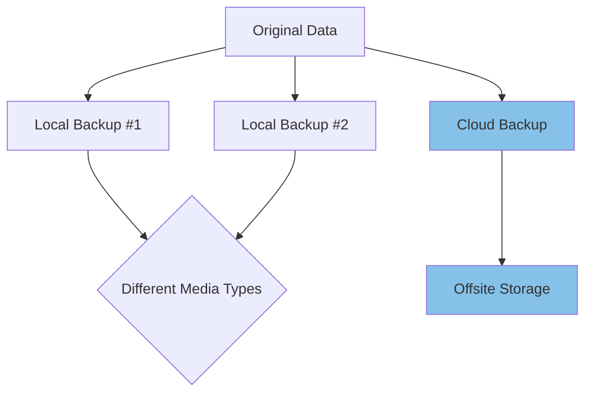

# Ubuntu Cloud Backup

## Introduction

Data loss can be catastrophic for individuals and businesses alike. Whether due to hardware failure, accidental deletion, security breaches, or natural disasters, losing critical information can disrupt operations and lead to significant financial losses. Ubuntu Cloud Backup provides robust solutions to protect your valuable data by storing copies securely in the cloud.

In this guide, we'll explore various approaches to setting up cloud backups in Ubuntu systems. You'll learn how to configure automated backup solutions that integrate with major cloud providers, understand the principles behind efficient backup strategies, and implement practical backup workflows.

## Understanding Cloud Backup Concepts

Before diving into implementation, let's understand some key concepts:

### What is Cloud Backup?

Cloud backup refers to the process of copying data to an off-site storage system maintained by a third-party cloud service provider. Unlike local backups, cloud backups offer:

- **Geographical redundancy**: Your data survives even if your physical location is compromised
- **Scalability**: Easily increase storage as your data grows
- **Accessibility**: Retrieve your data from anywhere with internet access
- **Cost-effectiveness**: Pay only for the storage you use without investing in hardware

### Types of Backups

- **Full Backup**: Complete copy of all selected data
- **Incremental Backup**: Only backs up changes since the last backup
- **Differential Backup**: Backs up changes since the last full backup
- **Continuous Backup**: Automatically backs up files as they're modified

### The 3-2-1 Backup Strategy

A recommended approach is the 3-2-1 backup strategy:

- Keep **3** copies of your data
- Store them on **2** different media types
- Keep **1** copy offsite (cloud)



## Setting Up Ubuntu Cloud Backup

Let's explore several methods to implement cloud backups on Ubuntu systems.

### Method 1: Using Duplicity with Cloud Storage

[Duplicity](http://duplicity.nongnu.org/) is a powerful backup tool that supports various cloud providers including AWS S3, Google Cloud Storage, and Dropbox.

#### Installation

```bash
sudo apt update
sudo apt install duplicity python3-boto
```

#### Basic Configuration

For backing up to Amazon S3:

```bash
# Install AWS CLI and configure credentials
sudo apt install awscli
aws configure
# Enter your AWS Access Key ID, Secret Access Key, default region, and output format
```

#### Creating Your First Backup

```bash
# Syntax
# duplicity [options] source s3://bucket-name/path

# Example: Back up /home/user/documents to S3
duplicity /home/user/documents s3://my-backup-bucket/documents

# Output:
# Local and Remote metadata are synchronized, no sync needed.
# Last full backup date: none
# No signatures found, switching to full backup.
# --------------[ Backup Statistics ]--------------
# StartTime 1616521468.13 (Wed Mar 24 10:11:08 2021)
# EndTime 1616521489.26 (Wed Mar 24 10:11:29 2021)
# ElapsedTime 21.13 (21.13 seconds)
# SourceFiles 256
# SourceFileSize 74824335 (71.4 MB)
# NewFiles 256
# NewFileSize 74824335 (71.4 MB)
# DeletedFiles 0
# ChangedFiles 0
# ChangedFileSize 0 (0 bytes)
# ChangedDeltaSize 0 (0 bytes)
# DeltaEntries 256
# RawDeltaSize 74808315 (71.3 MB)
# TotalDestinationSizeChange 28316374 (27.0 MB)
# Errors 0
```

#### Setting Up Incremental Backups

```bash
# Create an incremental backup
duplicity incremental /home/user/documents s3://my-backup-bucket/documents

# Output shows only changed files are transferred
# --------------[ Backup Statistics ]--------------
# StartTime 1616607868.42 (Thu Mar 25 10:11:08 2021)
# EndTime 1616607872.26 (Thu Mar 25 10:11:12 2021)
# ElapsedTime 3.84 (3.84 seconds)
# SourceFiles 256
# SourceFileSize 74824335 (71.4 MB)
# NewFiles 2
# NewFileSize 12500 (12.2 KB)
# DeletedFiles 0
# ChangedFiles 1
# ChangedFileSize 25000 (24.4 KB)
# ChangedDeltaSize 3500 (3.42 KB)
# DeltaEntries 3
# RawDeltaSize 16000 (15.6 KB)
# TotalDestinationSizeChange 8200 (8.01 KB)
# Errors 0
```

#### Restoring Files

```bash
# Restore the entire backup
duplicity restore s3://my-backup-bucket/documents /home/user/restored

# Restore a specific file or directory
duplicity restore --file-to-restore documents/important.txt s3://my-backup-bucket/documents /home/user/restored-file.txt
```

#### Automating Backups with Cron

Create a backup script (e.g., `/usr/local/bin/backup-to-cloud.sh`):

```bash
#!/bin/bash
# Cloud backup script

# Set your variables
SOURCE_DIR="/home/user/documents"
DEST="s3://my-backup-bucket/documents"
LOG_FILE="/var/log/cloud-backup.log"

# Export AWS credentials
export AWS_ACCESS_KEY_ID="your-access-key"
export AWS_SECRET_ACCESS_KEY="your-secret-key"

# Run backup
echo "Starting backup at $(date)" >> $LOG_FILE
duplicity --full-if-older-than 1M $SOURCE_DIR $DEST >> $LOG_FILE 2>&1
echo "Backup completed at $(date)" >> $LOG_FILE

# Cleanup old backups (keep last 6 months)
duplicity remove-older-than 6M $DEST --force >> $LOG_FILE 2>&1
```

Make the script executable:

```bash
sudo chmod +x /usr/local/bin/backup-to-cloud.sh
```

Add to crontab for daily execution at 2 AM:

```bash
sudo crontab -e
```

Add this line:

```
0 2 * * * /usr/local/bin/backup-to-cloud.sh
```

### Method 2: Using Restic for Efficient Backups

[Restic](https://restic.net/) is a modern backup program that supports deduplication and works with multiple cloud providers.

#### Installation

```bash
sudo apt update
sudo apt install restic
```

#### Initialize Repository

For Amazon S3:

```bash
# Set AWS credentials
export AWS_ACCESS_KEY_ID="your-access-key"
export AWS_SECRET_ACCESS_KEY="your-secret-key"

# Initialize repository
restic -r s3:s3.amazonaws.com/my-backup-bucket init

# Output:
# enter password for new repository: 
# enter password again: 
# created restic repository fee8bdb74b at s3:s3.amazonaws.com/my-backup-bucket
# Please note that knowledge of your password is required to access the repository.
# Losing your password means that your data is irretrievably lost.
```

#### Creating Backups

```bash
# Back up /home/user/documents
restic -r s3:s3.amazonaws.com/my-backup-bucket backup /home/user/documents

# Output:
# enter password for repository:
# repository fee8bdb74b opened successfully, password is correct
# scan [/home/user/documents]
# scanned 256 files in 0:03
# [0:00] 100.00%  71.4 MiB / 71.4 MiB  256 / 256 items  0 errors  ETA 0:00
# duration: 0:08
# snapshot 4b5c92c0 saved
```

#### Listing Backups

```bash
restic -r s3:s3.amazonaws.com/my-backup-bucket snapshots

# Output:
# enter password for repository:
# repository fee8bdb74b opened successfully, password is correct
# ID        Time                 Host             Tags        Paths
# ----------------------------------------------------------------------
# 4b5c92c0  2021-03-24 10:15:12  ubuntu-server                /home/user/documents
```

#### Restoring Data

```bash
# Restore the entire backup
restic -r s3:s3.amazonaws.com/my-backup-bucket restore 4b5c92c0 --target /home/user/restored

# Restore specific files
restic -r s3:s3.amazonaws.com/my-backup-bucket restore 4b5c92c0 --include /home/user/documents/important-file.txt --target /home/user/restored
```

#### Automating with Systemd

Create a service file (`/etc/systemd/system/restic-backup.service`):

```ini
[Unit]
Description=Restic backup service
After=network.target

[Service]
Type=oneshot
ExecStart=/usr/bin/restic -r s3:s3.amazonaws.com/my-backup-bucket backup /home/user/documents
Environment="AWS_ACCESS_KEY_ID=your-access-key"
Environment="AWS_SECRET_ACCESS_KEY=your-secret-key"
Environment="RESTIC_PASSWORD=your-repository-password"
```

Create a timer file (`/etc/systemd/system/restic-backup.timer`):

```ini
[Unit]
Description=Run restic backup daily

[Timer]
OnCalendar=*-*-* 02:00:00
Persistent=true

[Install]
WantedBy=timers.target
```

Enable and start the timer:

```bash
sudo systemctl enable restic-backup.timer
sudo systemctl start restic-backup.timer
```

### Method 3: Using Rclone for Cloud Sync

[Rclone](https://rclone.org/) is a command-line program to manage files on cloud storage. While not a traditional backup tool, it's excellent for syncing directories to the cloud.

#### Installation

```bash
sudo apt update
sudo curl https://rclone.org/install.sh | sudo bash
```

#### Configuration

```bash
# Run the configuration wizard
rclone config

# Output:
# No remotes found - make a new one
# n) New remote
# s) Set configuration password
# q) Quit config
# n/s/q> n
# name> my-s3
# Type of storage> 4 (for Amazon S3)
# ... follow the prompts to enter your credentials ...
```

#### Syncing Directories

```bash
# Sync a directory to S3
rclone sync /home/user/documents my-s3:my-backup-bucket/documents

# Output:
# 2021/03/24 10:30:31 INFO  : document1.txt: Copied (new)
# 2021/03/24 10:30:32 INFO  : document2.txt: Copied (new)
# ...
# 2021/03/24 10:30:45 INFO  : Transferred: 71.4 MiB / 71.4 MiB, 100%, 5.953 MiB/s, ETA 0s
# 2021/03/24 10:30:45 INFO  : Transferred: 256 / 256, 100%
# 2021/03/24 10:30:45 INFO  : Elapsed time: 12.0s
```

#### Setting Up Scheduled Sync

Create a script (`/usr/local/bin/cloud-sync.sh`):

```bash
#!/bin/bash
# Sync documents to cloud

rclone sync /home/user/documents my-s3:my-backup-bucket/documents --log-file=/var/log/rclone-sync.log
```

Make executable and add to crontab:

```bash
sudo chmod +x /usr/local/bin/cloud-sync.sh
sudo crontab -e
```

Add this line for daily sync at 3 AM:

```
0 3 * * * /usr/local/bin/cloud-sync.sh
```

## Integrating with Major Cloud Providers

### AWS S3

AWS S3 (Simple Storage Service) is one of the most popular cloud storage solutions. The examples above demonstrate working with S3. Here are additional considerations:

#### Setting Up S3 Lifecycle Rules

Configure S3 bucket lifecycle rules to automatically transition older backups to cheaper storage classes:

1. Recent backups: S3 Standard
2. 30+ days old: S3 Standard-IA (Infrequent Access)
3. 90+ days old: S3 Glacier
4. 1+ year old: S3 Glacier Deep Archive

#### IAM User Configuration

Create a dedicated IAM user with limited permissions for backup operations:

```json
{
  "Version": "2012-10-17",
  "Statement": [
    {
      "Sid": "BackupPermissions",
      "Effect": "Allow",
      "Action": [
        "s3:PutObject",
        "s3:GetObject",
        "s3:DeleteObject",
        "s3:ListBucket"
      ],
      "Resource": [
        "arn:aws:s3:::my-backup-bucket",
        "arn:aws:s3:::my-backup-bucket/*"
      ]
    }
  ]
}
```

### Google Cloud Storage

For backing up to Google Cloud Storage:

#### Installation and Configuration

```bash
# Install required packages
sudo apt install python3-pip
pip3 install gsutil

# Authenticate with Google Cloud
gcloud auth login
```

#### Using Duplicity with GCS

```bash
# Syntax
duplicity /path/to/backup gs://bucket-name/path

# Example
duplicity /home/user/documents gs://my-backup-bucket/documents
```

#### Using Restic with GCS

```bash
# Create a service account JSON key file and download it
export GOOGLE_APPLICATION_CREDENTIALS="/path/to/service-account.json"

# Initialize repository
restic -r gs:my-backup-bucket:/backups init

# Create backup
restic -r gs:my-backup-bucket:/backups backup /home/user/documents
```

### Microsoft Azure

For backing up to Microsoft Azure Blob Storage:

#### Setup with Azure CLI

```bash
# Install Azure CLI
curl -sL https://aka.ms/InstallAzureCLIDeb | sudo bash

# Login to Azure
az login

# Create storage account and container
az storage account create --name mystorageaccount --resource-group myresourcegroup --kind StorageV2
az storage container create --name backups --account-name mystorageaccount
```

#### Using Restic with Azure

```bash
# Set environment variables
export AZURE_ACCOUNT_NAME="mystorageaccount"
export AZURE_ACCOUNT_KEY="your-account-key"

# Initialize repository
restic -r azure:backups:/ubuntu-backups init

# Create backup
restic -r azure:backups:/ubuntu-backups backup /home/user/documents
```

## Best Practices for Ubuntu Cloud Backup

### 1. Encryption

Always encrypt your backups, especially when storing them in the cloud:

```bash
# Using duplicity with encryption
duplicity --encrypt-key your-gpg-key-id /path/to/backup s3://bucket-name/path

# Using restic (already encrypted by default)
restic -r s3:s3.amazonaws.com/my-backup-bucket backup /path/to/backup
```

### 2. Testing Restoration

Regularly test the restoration process to ensure your backups are valid:

```bash
# Create a test directory
mkdir /tmp/restore-test

# Restore a small subset of files to test
duplicity restore --file-to-restore some/important/files s3://bucket-name/path /tmp/restore-test

# Verify the files match the original
diff -r /path/to/original /tmp/restore-test
```

### 3. Monitoring and Alerts

Set up monitoring to alert you when backups fail:

```bash
#!/bin/bash
# backup-monitor.sh

if ! /usr/local/bin/backup-to-cloud.sh; then
  echo "Backup failed on $(date)" | mail -s "Backup Failure Alert" admin@example.com
fi
```

### 4. Documentation

Maintain clear documentation of your backup strategy and recovery procedures:

```bash
# Example recovery procedure document
cat > /etc/backup-recovery-procedure.md << EOF
# Recovery Procedure

## Prerequisites
- AWS credentials
- Duplicity installation
- Recovery key: stored in password manager

## Steps
1. Install required packages:
   \`\`\`
   sudo apt update && sudo apt install duplicity python3-boto
   \`\`\`

2. Configure AWS access:
   \`\`\`
   export AWS_ACCESS_KEY_ID="your-access-key"
   export AWS_SECRET_ACCESS_KEY="your-secret-key"
   \`\`\`

3. Restore data:
   \`\`\`
   duplicity restore s3://my-backup-bucket/documents /recovery/path
   \`\`\`
EOF
```

## Real-World Example: Backing Up a Database Server

Let's create a practical example for backing up a PostgreSQL database to the cloud.

### Step 1: Create a Backup Script

```bash
#!/bin/bash
# /usr/local/bin/backup-postgres.sh

# Variables
DATE=$(date +%Y-%m-%d_%H-%M-%S)
BACKUP_DIR="/var/backups/postgres"
S3_BUCKET="s3://my-database-backups"
DB_NAME="myapplication"
DB_USER="postgres"
LOG_FILE="/var/log/postgres-backup.log"

# Create backup directory if it doesn't exist
mkdir -p $BACKUP_DIR

# Log start time
echo "Starting database backup at $(date)" >> $LOG_FILE

# Create database dump
echo "Creating PostgreSQL dump..." >> $LOG_FILE
pg_dump -U $DB_USER $DB_NAME | gzip > $BACKUP_DIR/$DB_NAME-$DATE.sql.gz

# Check if dump was successful
if [ $? -eq 0 ]; then
  echo "Database dump completed successfully." >> $LOG_FILE
else
  echo "ERROR: Database dump failed!" >> $LOG_FILE
  exit 1
fi

# Upload to S3
echo "Uploading to S3..." >> $LOG_FILE
aws s3 cp $BACKUP_DIR/$DB_NAME-$DATE.sql.gz $S3_BUCKET/postgres/$DB_NAME-$DATE.sql.gz

# Check if upload was successful
if [ $? -eq 0 ]; then
  echo "Upload to S3 completed successfully." >> $LOG_FILE
else
  echo "ERROR: Upload to S3 failed!" >> $LOG_FILE
  exit 1
fi

# Clean up old local backups (keep last 7 days)
find $BACKUP_DIR -type f -name "*.sql.gz" -mtime +7 -delete

# Log completion
echo "Backup completed at $(date)" >> $LOG_FILE
```

### Step 2: Set Permissions and Schedule

```bash
# Make script executable
sudo chmod +x /usr/local/bin/backup-postgres.sh

# Schedule daily backups at 1 AM
sudo crontab -e
```

Add this line:

```
0 1 * * * /usr/local/bin/backup-postgres.sh
```

### Step 3: Set Up S3 Lifecycle Rules

Set up S3 lifecycle rules to manage backup storage costs:

1. Move backups older than 30 days to S3 Glacier
2. Delete backups older than 365 days

### Step 4: Create a Recovery Plan

Document the recovery process:

```bash
# To restore a specific backup
gzip -dc /path/to/backup/myapplication-2021-03-24_01-00-00.sql.gz | psql -U postgres myapplication
```

## Real-World Example: Backing Up a Web Server

Let's create another practical example for backing up a web server with user content.

### Step 1: Create a Comprehensive Backup Script

```bash
#!/bin/bash
# /usr/local/bin/backup-webserver.sh

# Variables
DATE=$(date +%Y-%m-%d)
BACKUP_DIR="/var/backups/webserver"
CLOUD_DIR="gs://my-webserver-backups"
LOG_FILE="/var/log/webserver-backup.log"

# Create backup directory
mkdir -p $BACKUP_DIR
mkdir -p $BACKUP_DIR/files
mkdir -p $BACKUP_DIR/database

# Log start
echo "==== Starting webserver backup at $(date) ====" >> $LOG_FILE

# Backup website files
echo "Backing up website files..." >> $LOG_FILE
tar -czf $BACKUP_DIR/files/website-$DATE.tar.gz /var/www/html

# Backup configurations
echo "Backing up server configurations..." >> $LOG_FILE
tar -czf $BACKUP_DIR/files/configs-$DATE.tar.gz /etc/nginx /etc/apache2 /etc/php

# Backup database
echo "Backing up MySQL database..." >> $LOG_FILE
mysqldump --all-databases -u root -p"$(cat /root/.mysql_password)" | gzip > $BACKUP_DIR/database/mysql-all-$DATE.sql.gz

# Create checksums
cd $BACKUP_DIR
find . -type f -name "*.gz" -o -name "*.sql.gz" | xargs md5sum > $BACKUP_DIR/checksums-$DATE.md5

# Upload to Cloud Storage
echo "Uploading backups to cloud storage..." >> $LOG_FILE
gsutil -m cp -r $BACKUP_DIR/* $CLOUD_DIR/$DATE/

# Verify upload
CLOUD_FILES=$(gsutil ls $CLOUD_DIR/$DATE/ | wc -l)
LOCAL_FILES=$(find $BACKUP_DIR -type f | wc -l)

if [ "$CLOUD_FILES" -eq "$LOCAL_FILES" ]; then
  echo "Cloud upload verified successfully." >> $LOG_FILE
else
  echo "ERROR: Cloud upload verification failed! Local files: $LOCAL_FILES, Cloud files: $CLOUD_FILES" >> $LOG_FILE
  exit 1
fi

# Clean up old local backups (keep only last 3 days)
find $BACKUP_DIR -type f -mtime +3 -delete

# Log completion
echo "Backup completed at $(date)" >> $LOG_FILE
echo "Total size: $(du -sh $BACKUP_DIR | cut -f1)" >> $LOG_FILE
```

### Step 2: Set Up Scheduled Backups

```bash
# Make script executable
sudo chmod +x /usr/local/bin/backup-webserver.sh

# Schedule daily backups at 2 AM
sudo crontab -e
```

Add this line:

```
0 2 * * * /usr/local/bin/backup-webserver.sh
```

### Step 3: Set Up Monitoring

Create a simple monitoring script:

```bash
#!/bin/bash
# /usr/local/bin/check-backup.sh

YESTERDAY=$(date -d "yesterday" +%Y-%m-%d)
CLOUD_DIR="gs://my-webserver-backups"

# Check if yesterday's backup exists
if ! gsutil ls $CLOUD_DIR/$YESTERDAY/ &> /dev/null; then
  echo "ALERT: No backup found for $YESTERDAY" | mail -s "Backup Failure" admin@example.com
fi
```

Add to crontab:

```
0 9 * * * /usr/local/bin/check-backup.sh
```

## Summary

In this guide, we've explored comprehensive cloud backup solutions for Ubuntu systems:

1. **Understanding Cloud Backup**: We learned the importance of cloud backups and best practices like the 3-2-1 strategy.

2. **Tools and Methods**: We covered three powerful tools:
   - **Duplicity**: Great for encrypted, incremental backups
   - **Restic**: Modern tool with deduplication support
   - **Rclone**: Excellent for syncing directories to cloud storage

3. **Cloud Provider Integration**: We provided specific instructions for AWS S3, Google Cloud Storage, and Microsoft Azure.

4. **Best Practices**: We discussed encryption, testing restorations, monitoring, and documentation.

5. **Real-World Examples**: We created practical backup solutions for database and web servers.

By implementing these cloud backup strategies, you can ensure your Ubuntu systems' data remains safe and recoverable, even in the worst disaster scenarios.

## Additional Resources

- [Ubuntu Server Guide - Backups](https://ubuntu.com/server/docs)
- [AWS S3 Documentation](https://docs.aws.amazon.com/s3/)
- [Google Cloud Storage Documentation](https://cloud.google.com/storage/docs)
- [Microsoft Azure Blob Storage Documentation](https://docs.microsoft.com/en-us/azure/storage/blobs/)
- [Duplicity Documentation](http://duplicity.nongnu.org/duplicity.1.html)
- [Restic Documentation](https://restic.readthedocs.io/)
- [Rclone Documentation](https://rclone.org/docs/)

## Exercises

1. Set up a basic Duplicity backup of your home directory to an S3 bucket.
2. Create a Restic backup repository on Google Cloud Storage and configure scheduled backups.
3. Implement the 3-2-1 backup strategy for a personal project using the tools discussed.
4. Write a script that backs up a local MySQL database to the cloud and test the restoration process.
5. Set up a monitoring system that alerts you when backups fail or when backup sizes change dramatically.