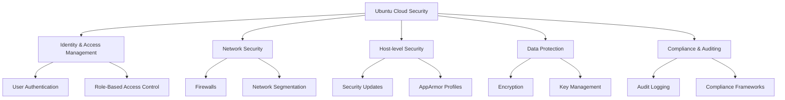

# Ubuntu Cloud Security

## Introduction

Ubuntu Cloud Security refers to the set of practices, tools, and methodologies used to protect Ubuntu-based cloud deployments from security threats and vulnerabilities. As organizations increasingly move their infrastructure to cloud environments, securing these deployments becomes critical to protect sensitive data and ensure service availability.

Ubuntu, as one of the most popular Linux distributions for cloud deployments, offers robust security features specifically designed for cloud environments. This guide will walk you through the fundamental concepts and best practices for securing your Ubuntu cloud infrastructure.

## Why Security Matters in the Cloud

Cloud environments present unique security challenges compared to traditional on-premises deployments:

1. **Shared Responsibility Model**: In cloud computing, security is a shared responsibility between the cloud provider and the customer.
2. **Expanded Attack Surface**: Cloud deployments often have multiple entry points and interfaces.
3. **Dynamic Infrastructure**: Cloud resources are frequently created, modified, and destroyed.
4. **Multi-tenancy Concerns**: Resources may be shared among different tenants.

## Core Ubuntu Cloud Security Components



## 1. Setting Up Basic Security Measures

### Keeping Your System Updated

Regular updates are your first line of defense. Ubuntu provides several ways to keep your system up-to-date:

```bash
# Update package lists
sudo apt update

# Upgrade installed packages
sudo apt upgrade

# Enable automatic security updates
sudo apt install unattended-upgrades
sudo dpkg-reconfigure unattended-upgrades
```

### Configuring the Ubuntu Firewall (UFW)

Ubuntu's Uncomplicated Firewall (UFW) provides a user-friendly way to configure firewall rules:

```bash
# Enable the firewall
sudo ufw enable

# Allow SSH connections
sudo ufw allow ssh

# Allow specific ports (example: web server)
sudo ufw allow 80/tcp
sudo ufw allow 443/tcp

# Check status
sudo ufw status verbose
```

Output:
```
Status: active
Logging: on (low)
Default: deny (incoming), allow (outgoing), disabled (routed)
New profiles: skip

To                         Action      From
--                         ------      ----
22/tcp                     ALLOW IN    Anywhere
80/tcp                     ALLOW IN    Anywhere
443/tcp                    ALLOW IN    Anywhere
22/tcp (v6)                ALLOW IN    Anywhere (v6)
80/tcp (v6)                ALLOW IN    Anywhere (v6)
443/tcp (v6)               ALLOW IN    Anywhere (v6)
```

## 2. Identity and Access Management

### Creating and Managing Users

```bash
# Create a new user
sudo adduser newuser

# Add user to sudo group
sudo usermod -aG sudo newuser

# Set up SSH key authentication
sudo mkdir -p /home/newuser/.ssh
sudo cp /path/to/authorized_keys /home/newuser/.ssh/
sudo chown -R newuser:newuser /home/newuser/.ssh
sudo chmod 700 /home/newuser/.ssh
sudo chmod 600 /home/newuser/.ssh/authorized_keys
```

### Implementing Strong SSH Security

Edit the SSH configuration file to enhance security:

```bash
sudo nano /etc/ssh/sshd_config
```

Recommended settings:
```
# Disable root login
PermitRootLogin no

# Use SSH key authentication only
PasswordAuthentication no

# Restrict SSH to specific users
AllowUsers newuser admin

# Set idle timeout (5 minutes)
ClientAliveInterval 300
ClientAliveCountMax 0
```

Restart SSH service to apply changes:
```bash
sudo systemctl restart ssh
```

## 3. Network Security in Ubuntu Cloud

### Implementing Network Segmentation with nftables

For more advanced network security, Ubuntu supports nftables:

```bash
# Install nftables
sudo apt install nftables

# Create a basic ruleset
sudo nano /etc/nftables.conf
```

Example configuration:
```
#!/usr/sbin/nft -f

flush ruleset

table inet filter {
    chain input {
        type filter hook input priority 0; policy drop;
        
        # Accept loopback traffic
        iif lo accept
        
        # Accept established connections
        ct state established,related accept
        
        # Allow SSH, HTTP, and HTTPS
        tcp dport {22, 80, 443} accept
        
        # Allow ICMP
        ip protocol icmp accept
        
        # Log and drop everything else
        log prefix "nftables dropped: " limit rate 3/minute
        drop
    }
    
    chain forward {
        type filter hook forward priority 0; policy drop;
    }
    
    chain output {
        type filter hook output priority 0; policy accept;
    }
}
```

Apply the rules:
```bash
sudo nft -f /etc/nftables.conf
sudo systemctl enable nftables
```

### Securing Container Networks

If you're using containers in your Ubuntu cloud environment, isolate container networks:

```bash
# For Docker, create a custom network
sudo docker network create --driver bridge isolated_network

# Run containers on the isolated network
sudo docker run --network=isolated_network ubuntu:latest
```

## 4. Encryption and Data Protection

### Implementing Disk Encryption

For new installations, you can enable full disk encryption during the Ubuntu installation process. For existing systems, you can encrypt individual directories:

```bash
# Install encryption tools
sudo apt install cryptsetup

# Create an encrypted container
sudo dd if=/dev/urandom of=/root/container.img bs=1M count=1024
sudo cryptsetup -y luksFormat /root/container.img

# Open the encrypted container
sudo cryptsetup luksOpen /root/container.img secure-data

# Create a filesystem
sudo mkfs.ext4 /dev/mapper/secure-data

# Mount the filesystem
sudo mkdir /mnt/secure-data
sudo mount /dev/mapper/secure-data /mnt/secure-data
```

### Setting Up TLS/SSL for Web Services

Install Certbot to obtain free SSL certificates from Let's Encrypt:

```bash
sudo apt install certbot python3-certbot-nginx

# For Nginx
sudo certbot --nginx -d yourdomain.com

# For Apache
sudo apt install python3-certbot-apache
sudo certbot --apache -d yourdomain.com
```

## 5. Intrusion Detection and Prevention

### Setting Up Fail2ban

Fail2ban is a powerful tool that helps protect your server from brute force attacks:

```bash
# Install fail2ban
sudo apt install fail2ban

# Create a custom configuration
sudo nano /etc/fail2ban/jail.local
```

Example configuration:
```
[DEFAULT]
bantime = 3600
findtime = 600
maxretry = 5

[sshd]
enabled = true
port = ssh
filter = sshd
logpath = /var/log/auth.log
maxretry = 3
```

Restart the service:
```bash
sudo systemctl restart fail2ban
```

Check the status:
```bash
sudo fail2ban-client status sshd
```

Output:
```
Status for the jail: sshd
|- Filter
|  |- Currently failed: 0
|  |- Total failed: 0
|  `- File list: /var/log/auth.log
`- Actions
   |- Currently banned: 0
   |- Total banned: 0
   `- Banned IP list:
```

### Implementing AppArmor Profiles

AppArmor is a Mandatory Access Control system that restricts programs' capabilities:

```bash
# Check AppArmor status
sudo aa-status

# Install AppArmor profiles
sudo apt install apparmor-profiles apparmor-utils

# Enable a profile in enforcing mode
sudo aa-enforce /etc/apparmor.d/usr.bin.firefox

# Create a custom profile
sudo aa-genprof /path/to/application
```

## 6. Security Monitoring and Logging

### Centralized Logging with Rsyslog

Configure centralized logging to collect logs from all your Ubuntu cloud instances:

```bash
# On the log server, edit rsyslog configuration
sudo nano /etc/rsyslog.conf
```

Add these lines to enable receiving logs:
```
# Provide UDP syslog reception
module(load="imudp")
input(type="imudp" port="514")

# Provide TCP syslog reception
module(load="imtcp")
input(type="imtcp" port="514")

# Create a template for remote logs
template(name="RemoteHost" type="string" string="/var/log/remote/%HOSTNAME%/%PROGRAMNAME%.log")
if $fromhost-ip startswith '10.' then ?RemoteHost
```

Restart rsyslog:
```bash
sudo systemctl restart rsyslog
```

On client machines:
```bash
# Edit rsyslog configuration
sudo nano /etc/rsyslog.conf
```

Add this line to forward logs (replace with your log server IP):
```
*.* @192.168.1.100:514
```

### Implementing Auditd for System Auditing

Auditd helps you track system calls and security events:

```bash
# Install auditd
sudo apt install auditd

# Configure basic audit rules
sudo nano /etc/audit/rules.d/audit.rules
```

Example audit rules:
```
# Monitor changes to authentication configuration
-w /etc/pam.d/ -p wa -k auth_changes
-w /etc/nsswitch.conf -p wa -k auth_changes

# Monitor system user/group changes
-w /etc/passwd -p wa -k user_group_changes
-w /etc/group -p wa -k user_group_changes
-w /etc/shadow -p wa -k user_group_changes
-w /etc/gshadow -p wa -k user_group_changes

# Monitor sudo usage
-w /etc/sudoers -p wa -k sudo_changes
-w /etc/sudoers.d/ -p wa -k sudo_changes
```

Apply new rules:
```bash
sudo service auditd restart
```

Check the logs:
```bash
sudo ausearch -k auth_changes
```

## 7. Cloud-Specific Security for Ubuntu

### Securing Ubuntu on AWS

```bash
# Install AWS CLI
sudo apt install awscli

# Configure AWS identity management
aws configure

# Use AWS security groups as additional firewall
aws ec2 create-security-group --group-name ubuntu-secure --description "Security group for Ubuntu instances"

# Add rules to the security group
aws ec2 authorize-security-group-ingress --group-name ubuntu-secure --protocol tcp --port 22 --cidr 203.0.113.0/24
```

### Securing Ubuntu on Azure

```bash
# Install Azure CLI
curl -sL https://aka.ms/InstallAzureCLIDeb | sudo bash

# Login to Azure
az login

# Create a Network Security Group
az network nsg create --name ubuntu-secure-nsg --resource-group myResourceGroup

# Add security rules
az network nsg rule create --name allow-ssh --nsg-name ubuntu-secure-nsg --priority 100 --resource-group myResourceGroup --access Allow --protocol Tcp --direction Inbound --source-address-prefixes '203.0.113.0/24' --source-port-ranges '*' --destination-address-prefixes '*' --destination-port-ranges 22
```

## 8. Automated Security with Ansible

Create an Ansible playbook for consistent security configurations:

```yaml
---
- name: Ubuntu Cloud Security Hardening
  hosts: ubuntu_cloud_servers
  become: yes
  
  tasks:
    - name: Update all packages
      apt:
        update_cache: yes
        upgrade: dist
      
    - name: Install security packages
      apt:
        name:
          - ufw
          - fail2ban
          - apparmor-utils
          - auditd
        state: present
      
    - name: Configure UFW
      ufw:
        state: enabled
        policy: deny
        rule: allow
        port: "{{ item }}"
      loop:
        - 22
        - 80
        - 443
      
    - name: Set up fail2ban
      copy:
        content: |
          [DEFAULT]
          bantime = 3600
          findtime = 600
          maxretry = 5
          
          [sshd]
          enabled = true
          port = ssh
          filter = sshd
          logpath = /var/log/auth.log
          maxretry = 3
        dest: /etc/fail2ban/jail.local
      notify: restart fail2ban
  
  handlers:
    - name: restart fail2ban
      service:
        name: fail2ban
        state: restarted
```

Save this as `ubuntu-security.yml` and run it with:

```bash
ansible-playbook -i inventory.ini ubuntu-security.yml
```

## 9. Compliance and Auditing

### Implementing Security Benchmark Scanning

Install and run CIS-CAT Lite to check compliance with security benchmarks:

```bash
# Install OpenSCAP
sudo apt install libopenscap8 openscap-scanner scap-security-guide

# Run a scan against Ubuntu security profile
sudo oscap xccdf eval --profile xccdf_org.ssgproject.content_profile_standard --results scan-results.xml --report scan-report.html /usr/share/xml/scap/ssg/content/ssg-ubuntu2004-ds.xml
```

The HTML report will provide detailed information about security compliance and recommendations for improvements.

## 10. Security Best Practices for Container Deployments

### Securing Docker Containers

```bash
# Create a dedicated user for running containers
sudo adduser --system --no-create-home docker-user

# Run containers with limited privileges
sudo docker run --user docker-user --cap-drop=ALL --security-opt=no-new-privileges ubuntu:latest

# Scan container images for vulnerabilities
sudo apt install trivy
trivy image ubuntu:latest
```

### Implementing Kubernetes Security

For Ubuntu-based Kubernetes clusters, implement these security measures:

```bash
# Use Network Policies to restrict pod communication
cat <<EOF | kubectl apply -f -
apiVersion: networking.k8s.io/v1
kind: NetworkPolicy
metadata:
  name: default-deny
spec:
  podSelector: {}
  policyTypes:
  - Ingress
  - Egress
EOF

# Enable Role-Based Access Control
kubectl create role read-only --verb=get,list,watch --resource=pods,services
kubectl create rolebinding read-only-binding --role=read-only --user=restricted-user
```

## Summary

Security in Ubuntu cloud environments requires a multi-layered approach that addresses:

1. **System-level security**: Regular updates, firewall configurations, and user management
2. **Network security**: Segmentation, encryption, and traffic control
3. **Data protection**: Encryption at rest and in transit
4. **Monitoring and auditing**: Centralized logging and intrusion detection
5. **Compliance and automation**: Regular security scanning and automated configuration

By implementing the practices outlined in this guide, you can significantly enhance the security posture of your Ubuntu cloud deployments and protect your organization's data and services from potential threats.

## Additional Resources

Here are some exercises to help reinforce your understanding of Ubuntu Cloud Security:

1. **Basic Security Audit**: Run a security audit on your Ubuntu cloud instance using OpenSCAP and address at least three high-priority findings.

2. **AppArmor Profile Creation**: Create a custom AppArmor profile for a web application running on your Ubuntu cloud instance.

3. **Security Automation**: Develop an Ansible playbook that implements at least five security controls discussed in this guide.

4. **Incident Response Plan**: Create a basic incident response plan for your Ubuntu cloud environment, including detection, containment, and recovery procedures.

5. **Security Monitoring Dashboard**: Set up a simple monitoring dashboard using Grafana and Prometheus to track security metrics on your Ubuntu cloud instances.

For further learning, explore these topics:
- Advanced AppArmor profile configuration
- SELinux as an alternative to AppArmor
- Ubuntu Pro security features
- Cloud-native security tools for Kubernetes environments
- SIEM integration for Ubuntu cloud security monitoring