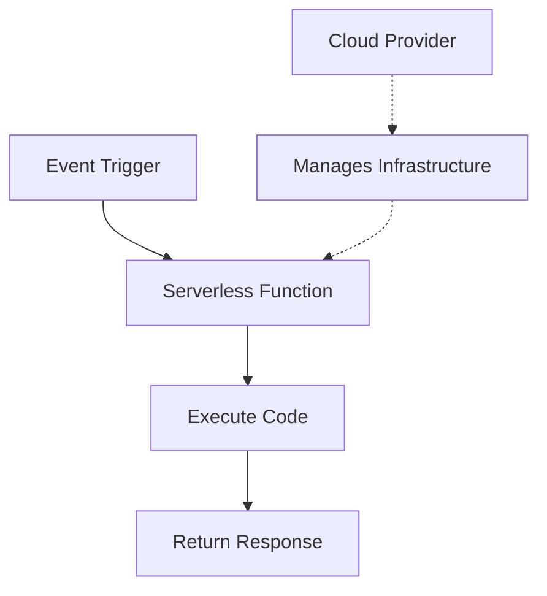

# Ubuntu Serverless Functions

## Introduction

Serverless computing has revolutionized how developers build and deploy applications by eliminating the need to manage infrastructure. Ubuntu Serverless Functions provide a powerful way to deploy code in the cloud without worrying about the underlying server management, scaling, or maintenance. 

In this guide, we'll explore how to leverage Ubuntu's ecosystem to create, deploy, and manage serverless functions. These functions are event-driven, short-lived pieces of code that perform specific tasks and automatically scale based on demand.

## What Are Serverless Functions?

Serverless functions (also known as Functions as a Service or FaaS) are single-purpose, stateless bits of code that run in response to events. Despite the name "serverless," servers still exist—they're just abstracted away from the developer.



Key characteristics of serverless functions include:

- **Event-driven execution**: Functions run in response to specific triggers
- **Automatic scaling**: The platform handles scaling without developer intervention
- **Pay-per-use**: You only pay for the compute time used during execution
- **No server management**: The underlying infrastructure is fully managed

## Setting Up Your Environment

Before we dive into creating serverless functions on Ubuntu, let's set up our development environment.

### Prerequisites

- Ubuntu 20.04 or newer
- Node.js (version 14+)
- npm or yarn
- An Ubuntu SSO account

### Installing Required Tools

First, let's install the necessary tools:

```bash
# Update package list
sudo apt update

# Install Node.js and npm
sudo apt install -y nodejs npm

# Verify installation
node --version
npm --version

# Install the Ubuntu Serverless CLI tool
npm install -g ubuntu-serverless-cli
```

## Creating Your First Serverless Function

Let's create a simple "Hello World" function to understand the basics.

### 1. Initialize a New Project

```bash
# Create a new directory and navigate into it
mkdir hello-serverless
cd hello-serverless

# Initialize a new serverless project
ubs init
```

This will generate a basic project structure:

```
hello-serverless/
├── functions/
│   └── hello.js
├── package.json
└── ubs.yaml
```

### 2. Examine the Function Code

Open `functions/hello.js` to see the default function:

```javascript
exports.handler = async (event, context) => {
  // Parse the incoming request data
  const data = event.body ? JSON.parse(event.body) : {};
  
  // Process the request
  const name = data.name || 'World';
  
  // Return a response
  return {
    statusCode: 200,
    headers: {
      'Content-Type': 'application/json',
    },
    body: JSON.stringify({
      message: `Hello, ${name}!`,
      timestamp: new Date().toISOString()
    }),
  };
};
```

### 3. Test Locally

Let's test our function locally before deploying:

```bash
# Install dependencies
npm install

# Start the local development server
ubs local
```

Now you can test your function by sending a request:

```bash
# In a new terminal window
curl -X POST http://localhost:3000/hello -H "Content-Type: application/json" -d '{"name":"Ubuntu"}'
```

Expected output:

```json
{
  "message": "Hello, Ubuntu!",
  "timestamp": "2025-03-13T10:15:30.123Z"
}
```

## Understanding the Configuration

The `ubs.yaml` file defines how your functions are configured:

```yaml
service: hello-serverless
provider:
  name: ubuntu
  runtime: nodejs14
  region: eu-west-1

functions:
  hello:
    handler: functions/hello.handler
    events:
      - http:
          path: hello
          method: post
```

Key components:
- `service`: Your project name
- `provider`: Configuration for the serverless provider
- `functions`: Definition of your functions with their handlers and triggers

## Deploying to Ubuntu Cloud

Now that we've tested our function locally, let's deploy it to the Ubuntu Cloud.

### 1. Authenticate with Ubuntu Cloud

```bash
# Login to Ubuntu Cloud
ubs login
```

Follow the prompts to authenticate with your Ubuntu SSO account.

### 2. Deploy Your Function

```bash
# Deploy to the cloud
ubs deploy
```

The deployment process will:
1. Package your code and dependencies
2. Upload the bundle to Ubuntu Cloud
3. Configure the necessary infrastructure
4. Provide you with endpoints to access your functions

Example output:

```
Deploying hello-serverless to Ubuntu Cloud...
✓ Functions packaged successfully
✓ Deployment completed

Service Information
service: hello-serverless
stage: dev
region: eu-west-1
functions:
  hello: https://api.ubuntu-cloud.io/dev/hello-serverless/hello
```

### 3. Test Your Deployed Function

Let's test our deployed function:

```bash
curl -X POST https://api.ubuntu-cloud.io/dev/hello-serverless/hello \
  -H "Content-Type: application/json" \
  -d '{"name":"Ubuntu Cloud"}'
```

Expected output:

```json
{
  "message": "Hello, Ubuntu Cloud!",
  "timestamp": "2025-03-13T10:20:45.678Z"
}
```

## Creating a More Complex Function

Let's create a more practical function that processes image metadata.

### 1. Create a New Function

Create a new file `functions/image-metadata.js`:

```javascript
const sharp = require('sharp');

exports.handler = async (event, context) => {
  try {
    // Expect base64-encoded image in the request
    const imageData = event.body ? JSON.parse(event.body).image : null;
    
    if (!imageData) {
      return {
        statusCode: 400,
        body: JSON.stringify({ error: 'No image provided' })
      };
    }
    
    // Decode the base64 image
    const buffer = Buffer.from(imageData, 'base64');
    
    // Process the image to extract metadata
    const metadata = await sharp(buffer).metadata();
    
    // Return the metadata
    return {
      statusCode: 200,
      headers: {
        'Content-Type': 'application/json',
      },
      body: JSON.stringify({
        format: metadata.format,
        width: metadata.width,
        height: metadata.height,
        space: metadata.space,
        channels: metadata.channels,
        depth: metadata.depth,
        hasAlpha: metadata.hasAlpha,
        size: `${(buffer.length / 1024).toFixed(2)} KB`
      }),
    };
  } catch (error) {
    return {
      statusCode: 500,
      body: JSON.stringify({ error: error.message })
    };
  }
};
```

### 2. Install Dependencies

We need to install the Sharp library for image processing:

```bash
npm install sharp
```

### 3. Update Configuration

Add the new function to your `ubs.yaml`:

```yaml
service: hello-serverless
provider:
  name: ubuntu
  runtime: nodejs14
  region: eu-west-1

functions:
  hello:
    handler: functions/hello.handler
    events:
      - http:
          path: hello
          method: post
  
  imageMetadata:
    handler: functions/image-metadata.handler
    events:
      - http:
          path: metadata
          method: post
```

### 4. Deploy the Updated Service

```bash
ubs deploy
```

## Function Triggers and Events

Ubuntu Serverless Functions can be triggered by various events:

### HTTP Triggers

HTTP triggers are the most common, allowing your function to respond to HTTP requests:

```yaml
functions:
  api:
    handler: functions/api.handler
    events:
      - http:
          path: users
          method: get
```

### Scheduled Events

You can run functions on a schedule:

```yaml
functions:
  cleanup:
    handler: functions/cleanup.handler
    events:
      - schedule: 'cron(0 0 * * *)'  # Run daily at midnight
```

### Storage Events

Functions can respond to storage events like file uploads:

```yaml
functions:
  processUpload:
    handler: functions/process.handler
    events:
      - storage:
          bucket: my-uploads
          event: create
```

## Advanced Configuration

### Environment Variables

You can define environment variables for your functions:

```yaml
provider:
  name: ubuntu
  runtime: nodejs14
  environment:
    GLOBAL_VAR: "Available to all functions"

functions:
  hello:
    handler: functions/hello.handler
    environment:
      FUNCTION_SPECIFIC: "Only for this function"
```

Access these variables in your code:

```javascript
exports.handler = async (event, context) => {
  const globalVar = process.env.GLOBAL_VAR;
  const functionVar = process.env.FUNCTION_SPECIFIC;
  
  return {
    statusCode: 200,
    body: JSON.stringify({ globalVar, functionVar })
  };
};
```

### Resource Allocation

You can customize CPU and memory allocation:

```yaml
functions:
  resourceIntensive:
    handler: functions/heavy.handler
    memorySize: 1024  # MB
    timeout: 30  # seconds
```

### VPC Configuration

For functions that need to access resources in a VPC:

```yaml
functions:
  databaseAccess:
    handler: functions/db.handler
    vpc:
      securityGroups:
        - sg-12345678
      subnets:
        - subnet-12345678
        - subnet-87654321
```

## Monitoring and Logging

### Viewing Logs

You can view function logs using the CLI:

```bash
# View logs for a specific function
ubs logs -f hello
```

Example output:

```
2025-03-13T10:25:30.123Z START RequestId: aa11bb22-cc33-dd44-ee55-ff6677889900
2025-03-13T10:25:30.125Z INFO  Processing request with name: Ubuntu
2025-03-13T10:25:30.130Z END RequestId: aa11bb22-cc33-dd44-ee55-ff6677889900
2025-03-13T10:25:30.132Z REPORT RequestId: aa11bb22-cc33-dd44-ee55-ff6677889900 Duration: 9.43 ms Billed Duration: 10 ms Memory Size: 128 MB Max Memory Used: 45 MB
```

### Metrics Dashboard

Ubuntu Cloud provides a metrics dashboard where you can monitor:

- Invocation count
- Error rate
- Duration statistics
- Memory usage

Access it through:

```bash
ubs dashboard
```

## Best Practices for Ubuntu Serverless Functions

1. **Keep functions focused**: Each function should do one thing well
2. **Minimize cold starts**:
   - Keep dependencies lean
   - Use language runtimes with fast startup times
3. **Handle errors gracefully**: Always include error handling
4. **Use environment variables** for configuration
5. **Set appropriate timeouts** based on expected execution time
6. **Implement proper logging** for debugging and monitoring
7. **Design for statelessness**: Don't assume function state persists
8. **Optimize package size**: Include only necessary dependencies
9. **Use connection pooling** for database operations
10. **Consider security implications** of event triggers

## Real-World Use Cases

### API Backend

```javascript
const db = require('./db-connector');

exports.handler = async (event) => {
  const userId = event.pathParameters.id;
  
  try {
    const user = await db.getUser(userId);
    return {
      statusCode: 200,
      body: JSON.stringify(user)
    };
  } catch (error) {
    return {
      statusCode: error.code || 500,
      body: JSON.stringify({ error: error.message })
    };
  }
};
```

### Data Processing Pipeline

```javascript
const processor = require('./data-processor');

exports.handler = async (event) => {
  // Get the data from the event
  const rawData = JSON.parse(event.body);
  
  // Process the data
  const processedData = await processor.transform(rawData);
  
  // Store the results
  await processor.storeResults(processedData);
  
  return {
    statusCode: 200,
    body: JSON.stringify({
      status: 'success',
      itemsProcessed: processedData.length
    })
  };
};
```

### Scheduled Report Generation

```javascript
const reporter = require('./report-generator');
const mailer = require('./email-service');

exports.handler = async (event) => {
  // Generate the weekly report
  const report = await reporter.generateWeeklyReport();
  
  // Send the report to subscribers
  const recipients = await reporter.getSubscribers();
  await mailer.sendBulk({
    to: recipients,
    subject: 'Weekly Performance Report',
    body: report.summary,
    attachments: [report.pdf]
  });
  
  return { status: 'Report sent to ' + recipients.length + ' subscribers' };
};
```

## Cleaning Up

When you're done with your serverless project, you can remove it from Ubuntu Cloud:

```bash
# Remove all deployed functions and resources
ubs remove
```

## Summary

Ubuntu Serverless Functions provide a powerful, scalable approach to cloud computing without the overhead of managing servers. In this guide, we've covered:

- The basics of serverless architecture
- Setting up your environment for Ubuntu Serverless development
- Creating, testing, and deploying functions
- Configuring function triggers and events
- Advanced configuration options
- Monitoring and logging
- Best practices and real-world use cases

By leveraging Ubuntu Serverless Functions, you can focus on writing code that delivers value rather than managing infrastructure, leading to faster development cycles and more efficient resource utilization.

## Additional Resources

- Practice creating functions with different triggers
- Build a complete serverless API
- Implement authentication for your functions
- Create a data processing pipeline
- Integrate with Ubuntu's other cloud services

## Exercises

1. Modify the "Hello World" function to accept and return additional parameters
2. Create a function that generates a PDF report from JSON data
3. Implement a function that sends email notifications
4. Build a serverless API with multiple endpoints
5. Create a function triggered by file uploads to process images