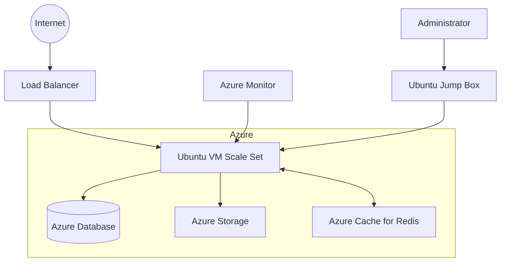

# Ubuntu Azure Integration

## Introduction

Ubuntu and Microsoft Azure have formed a powerful partnership that allows developers and organizations to deploy, manage, and scale Ubuntu workloads in the Azure cloud. This integration combines Ubuntu's reliability and security with Azure's robust cloud infrastructure, providing a flexible and efficient environment for various applications and services.

In this guide, we'll explore how Ubuntu integrates with Azure, the available tools and services, and how to effectively utilize this integration for your cloud deployments.

## Why Ubuntu on Azure?

Ubuntu is one of the most popular Linux distributions on Azure for several reasons:

- **Official Support**: Canonical (the company behind Ubuntu) and Microsoft have partnered to ensure Ubuntu runs optimally on Azure.
- **Regular Updates**: Ubuntu images on Azure receive regular security updates and maintenance.
- **Variety of Images**: Multiple Ubuntu versions are available as pre-configured VM images.
- **Performance Optimization**: Ubuntu images are optimized for Azure's infrastructure.
- **Cost Efficiency**: Ubuntu offers a cost-effective operating system option for cloud deployments.

## Getting Started with Ubuntu on Azure

### Prerequisites

Before you begin, ensure you have:

1. An active Azure subscription
2. Azure CLI installed on your local machine
3. Basic knowledge of Linux/Ubuntu and cloud concepts

### Installing Azure CLI on Ubuntu

To manage your Azure resources from your Ubuntu machine:

```bash
# Update package lists
sudo apt update

# Install required dependencies
sudo apt install -y ca-certificates curl apt-transport-https lsb-release gnupg

# Download and install the Microsoft signing key
curl -sL https://packages.microsoft.com/keys/microsoft.asc | gpg --dearmor | sudo tee /etc/apt/trusted.gpg.d/microsoft.gpg > /dev/null

# Add the Azure CLI software repository
echo "deb [arch=amd64] https://packages.microsoft.com/repos/azure-cli/ $(lsb_release -cs) main" | sudo tee /etc/apt/sources.list.d/azure-cli.list

# Update package lists and install Azure CLI
sudo apt update
sudo apt install -y azure-cli

# Verify installation
az --version
```

Output will be similar to:
```
azure-cli                         2.49.0
core                              2.49.0
telemetry                         1.0.8
...
```

### Logging into Azure

After installing Azure CLI, connect to your Azure account:

```bash
# Start the login process
az login
```

This will open a browser window where you can authenticate with your Azure credentials.

## Deploying Ubuntu VMs on Azure

### Using the Azure Portal

The simplest way to deploy an Ubuntu VM is through the Azure Portal:

1. Navigate to [portal.azure.com](https://portal.azure.com)
2. Select "Create a resource"
3. Search for "Ubuntu Server" and select the version you need
4. Follow the wizard to configure your VM settings

### Using Azure CLI

For a more programmatic approach, use Azure CLI:

```bash
# Create a resource group
az group create --name UbuntuResourceGroup --location eastus

# Create an Ubuntu VM
az vm create \
  --resource-group UbuntuResourceGroup \
  --name UbuntuVM \
  --image Canonical:0001-com-ubuntu-server-focal:20_04-lts:latest \
  --admin-username azureuser \
  --generate-ssh-keys \
  --size Standard_B2s
```

This will create an Ubuntu 20.04 LTS VM and output connection details:

```json
{
  "fqdns": "",
  "id": "/subscriptions/xxxxxxxx-xxxx-xxxx-xxxx-xxxxxxxxxxxx/resourceGroups/UbuntuResourceGroup/...",
  "location": "eastus",
  "macAddress": "00-0D-3A-XX-XX-XX",
  "powerState": "VM running",
  "privateIpAddress": "10.0.0.4",
  "publicIpAddress": "xx.xx.xx.xx",
  "resourceGroup": "UbuntuResourceGroup",
  "zones": ""
}
```

### Using ARM Templates

For infrastructure as code, Azure Resource Manager (ARM) templates provide a declarative approach:

```json
{
  "$schema": "https://schema.management.azure.com/schemas/2019-04-01/deploymentTemplate.json#",
  "contentVersion": "1.0.0.0",
  "parameters": {
    "vmName": {
      "type": "string",
      "defaultValue": "UbuntuVM"
    },
    "adminUsername": {
      "type": "string"
    },
    "adminPasswordOrKey": {
      "type": "securestring"
    }
  },
  "resources": [
    {
      "type": "Microsoft.Compute/virtualMachines",
      "apiVersion": "2021-11-01",
      "name": "[parameters('vmName')]",
      "location": "[resourceGroup().location]",
      "properties": {
        "hardwareProfile": {
          "vmSize": "Standard_B2s"
        },
        "storageProfile": {
          "imageReference": {
            "publisher": "Canonical",
            "offer": "0001-com-ubuntu-server-focal",
            "sku": "20_04-lts",
            "version": "latest"
          }
        },
        "osProfile": {
          "computerName": "[parameters('vmName')]",
          "adminUsername": "[parameters('adminUsername')]",
          "linuxConfiguration": {
            "disablePasswordAuthentication": true,
            "ssh": {
              "publicKeys": [
                {
                  "path": "[concat('/home/', parameters('adminUsername'), '/.ssh/authorized_keys')]",
                  "keyData": "[parameters('adminPasswordOrKey')]"
                }
              ]
            }
          }
        }
      }
    }
  ]
}
```

Save this template as `ubuntu-vm-template.json` and deploy it using:

```bash
az deployment group create \
  --resource-group UbuntuResourceGroup \
  --template-file ubuntu-vm-template.json \
  --parameters adminUsername=azureuser adminPasswordOrKey="$(cat ~/.ssh/id_rsa.pub)"
```

## Ubuntu's Azure Specific Features

### Cloud-Init Support

Ubuntu images on Azure fully support cloud-init, allowing you to customize VM instances at first boot:

```yaml
#cloud-config
package_upgrade: true
packages:
  - nginx
  - nodejs
  - npm
write_files:
  - path: /var/www/html/index.html
    content: |
      <!DOCTYPE html>
      <html>
        <head>
          <title>Hello from Ubuntu on Azure!</title>
        </head>
        <body>
          <h1>Hello from Ubuntu on Azure!</h1>
          <p>This server was configured using cloud-init.</p>
        </body>
      </html>
runcmd:
  - systemctl restart nginx
```

Save this as `cloud-init.yaml` and deploy a VM with it:

```bash
az vm create \
  --resource-group UbuntuResourceGroup \
  --name UbuntuCloudInitVM \
  --image Canonical:0001-com-ubuntu-server-focal:20_04-lts:latest \
  --admin-username azureuser \
  --generate-ssh-keys \
  --custom-data cloud-init.yaml \
  --size Standard_B2s
```

### Azure Virtual Machine Extensions

Ubuntu VMs support Azure VM extensions for post-deployment configuration and automation:

```bash
# Installing the Custom Script Extension
az vm extension set \
  --resource-group UbuntuResourceGroup \
  --vm-name UbuntuVM \
  --name customScript \
  --publisher Microsoft.Azure.Extensions \
  --settings '{"fileUris":["https://raw.githubusercontent.com/yourusername/scripts/master/setup.sh"],"commandToExecute":"bash setup.sh"}'
```

## Working with Azure Services from Ubuntu

### Azure Kubernetes Service (AKS)

Ubuntu is an excellent platform for managing AKS clusters:

```bash
# Create an AKS cluster
az aks create \
  --resource-group UbuntuResourceGroup \
  --name UbuntuAKSCluster \
  --node-count 2 \
  --generate-ssh-keys \
  --enable-cluster-autoscaler \
  --min-count 1 \
  --max-count 3

# Get credentials for kubectl
az aks get-credentials \
  --resource-group UbuntuResourceGroup \
  --name UbuntuAKSCluster

# Verify connection
kubectl get nodes
```

Output:
```
NAME                                STATUS   ROLES   AGE   VERSION
aks-nodepool1-12345678-vmss000000   Ready    agent   2m    v1.24.9
aks-nodepool1-12345678-vmss000001   Ready    agent   2m    v1.24.9
```

### Azure App Service

Deploy applications from Ubuntu to Azure App Service:

```bash
# Install the webapp extension
az extension add --name webapp

# Create an App Service plan
az appservice plan create \
  --name UbuntuAppServicePlan \
  --resource-group UbuntuResourceGroup \
  --sku B1 \
  --is-linux

# Create a web app with Ubuntu-based container
az webapp create \
  --resource-group UbuntuResourceGroup \
  --plan UbuntuAppServicePlan \
  --name ubuntu-webapp-demo \
  --deployment-container-image-name mcr.microsoft.com/appsvc/node:16-lts
```

## Monitoring Ubuntu on Azure

### Azure Monitor Integration

Ubuntu VMs can be monitored using Azure Monitor:

```bash
# Enable Azure Monitor for a VM
az vm monitor log-analytics workspace create \
  --resource-group UbuntuResourceGroup \
  --workspace-name UbuntuWorkspace

# Connect VM to workspace
az vm monitor log-analytics workspace link \
  --resource-group UbuntuResourceGroup \
  --workspace-name UbuntuWorkspace \
  --vm-names UbuntuVM
```

### Log Analytics

Query logs from your Ubuntu VMs:

```kql
// Sample query to find CPU usage spikes
Perf
| where ObjectName == "Processor" and CounterName == "% Processor Time"
| where Computer contains "UbuntuVM"
| where CounterValue > 90
| summarize count() by Computer, bin(TimeGenerated, 1h)
```

## Scaling Ubuntu Workloads on Azure

### Virtual Machine Scale Sets

Deploy scalable sets of identical Ubuntu VMs:

```bash
# Create a VM Scale Set with Ubuntu
az vmss create \
  --resource-group UbuntuResourceGroup \
  --name UbuntuScaleSet \
  --image Canonical:0001-com-ubuntu-server-focal:20_04-lts:latest \
  --upgrade-policy-mode automatic \
  --admin-username azureuser \
  --generate-ssh-keys \
  --instance-count 3 \
  --vm-sku Standard_B2s
```

### Auto Scaling Rules

Add autoscaling to your Ubuntu VM Scale Set:

```bash
# Create autoscale settings
az monitor autoscale create \
  --resource-group UbuntuResourceGroup \
  --resource UbuntuScaleSet \
  --resource-type Microsoft.Compute/virtualMachineScaleSets \
  --name UbuntuAutoScale \
  --min-count 2 \
  --max-count 10 \
  --count 2

# Add a scale-out rule (increase instances when CPU > 70%)
az monitor autoscale rule create \
  --resource-group UbuntuResourceGroup \
  --autoscale-name UbuntuAutoScale \
  --condition "Percentage CPU > 70 avg 5m" \
  --scale out 2

# Add a scale-in rule (decrease instances when CPU < 30%)
az monitor autoscale rule create \
  --resource-group UbuntuResourceGroup \
  --autoscale-name UbuntuAutoScale \
  --condition "Percentage CPU < 30 avg 5m" \
  --scale in 1
```

## Architecture Patterns for Ubuntu on Azure

Let's visualize a common architecture for Ubuntu workloads on Azure:



This architecture illustrates a scalable Ubuntu deployment with:
- Load-balanced Ubuntu VM Scale Set
- Managed database and storage services
- Monitoring and administration capabilities

## Security Best Practices

### Updating Ubuntu on Azure

Keep your Ubuntu VMs updated:

```bash
# Connect to your VM
ssh azureuser@your-vm-ip

# Update packages
sudo apt update && sudo apt upgrade -y

# Restart if needed
sudo shutdown -r now
```

### Azure Security Center

Enable Azure Security Center for your Ubuntu VMs:

```bash
# Enable Azure Defender for your subscription
az security pricing create -n VirtualMachines --tier "standard"

# Install the monitoring agent
az vm extension set \
  --resource-group UbuntuResourceGroup \
  --vm-name UbuntuVM \
  --name MicrosoftMonitoringAgent \
  --publisher Microsoft.EnterpriseCloud.Monitoring \
  --settings '{"workspaceId":"your-workspace-id"}' \
  --protected-settings '{"workspaceKey":"your-workspace-key"}'
```

## Managing Ubuntu VM Costs on Azure

### Reserved Instances

Save costs by purchasing reserved VM instances:

```bash
# List available reservations
az reservations reservation-order list

# Purchase a reservation
az reservations reservation-order create \
  --reserved-resource-type VirtualMachines \
  --sku Standard_B2s \
  --location eastus \
  --term P1Y \
  --quantity 5 \
  --display-name "Ubuntu VMs Reservation"
```

### Azure Cost Management

Monitor your Ubuntu VM costs:

```bash
# Get cost analysis for your resource group
az consumption usage list \
  --start-date 2023-01-01 \
  --end-date 2023-01-31 \
  --filter "resourceGroup eq 'UbuntuResourceGroup'"
```

## Real-World Application: Deploying a LAMP Stack

Let's deploy a complete LAMP (Linux, Apache, MySQL, PHP) stack on Ubuntu in Azure:

```bash
# Create a VM with proper ports
az vm create \
  --resource-group UbuntuResourceGroup \
  --name UbuntuLAMPVM \
  --image Canonical:0001-com-ubuntu-server-focal:20_04-lts:latest \
  --admin-username azureuser \
  --generate-ssh-keys \
  --size Standard_B2s \
  --public-ip-sku Standard \
  --open-port 80,443

# Connect to the VM
ssh azureuser@$(az vm show -d -g UbuntuResourceGroup -n UbuntuLAMPVM --query publicIps -o tsv)
```

Once connected, install the LAMP stack:

```bash
# Update package lists
sudo apt update

# Install Apache, MySQL, and PHP
sudo apt install -y apache2 mysql-server php libapache2-mod-php php-mysql

# Start and enable services
sudo systemctl start apache2
sudo systemctl enable apache2
sudo systemctl start mysql
sudo systemctl enable mysql

# Secure MySQL installation
sudo mysql_secure_installation

# Create a test PHP file
echo "<?php phpinfo(); ?>" | sudo tee /var/www/html/info.php

# Check Apache status
sudo systemctl status apache2
```

Output:
```
● apache2.service - The Apache HTTP Server
     Loaded: loaded (/lib/systemd/system/apache2.service; enabled; vendor preset: enabled)
     Active: active (running) since Mon 2023-01-02 14:23:45 UTC; 35s ago
```

Now you can access your LAMP stack by visiting `http://your-vm-ip/info.php` in a browser.

## Troubleshooting Common Issues

### VM Boot Diagnostics

Enable boot diagnostics to troubleshoot boot problems:

```bash
# Enable boot diagnostics
az vm boot-diagnostics enable \
  --resource-group UbuntuResourceGroup \
  --name UbuntuVM

# Get boot diagnostics
az vm boot-diagnostics get-boot-log \
  --resource-group UbuntuResourceGroup \
  --name UbuntuVM
```

### SSH Connectivity Issues

If you can't connect to your VM:

```bash
# Check VM status
az vm get-instance-view \
  --resource-group UbuntuResourceGroup \
  --name UbuntuVM \
  --query "instanceView.statuses[1].displayStatus"

# Verify network security group rules
az network nsg rule list \
  --resource-group UbuntuResourceGroup \
  --nsg-name UbuntuVMNSG \
  --query "[].{Name:name, Priority:priority, Port:destinationPortRange, Access:access}"
```

## Summary

Ubuntu and Azure integration provides a powerful platform for deploying and managing applications in the cloud. In this guide, we've explored:

- Setting up Ubuntu VMs on Azure using different methods
- Working with Azure services from Ubuntu
- Monitoring and securing your Ubuntu deployments
- Scaling Ubuntu workloads to meet demand
- Real-world applications and troubleshooting techniques

This integration combines the flexibility and reliability of Ubuntu with the robust infrastructure and services of Azure, making it an excellent choice for cloud deployments of all sizes.

## Additional Resources

- [Official Ubuntu on Azure Documentation](https://ubuntu.com/azure)
- [Microsoft Azure Documentation for Linux VMs](https://docs.microsoft.com/en-us/azure/virtual-machines/linux/)
- [Canonical's Azure Marketplace Offerings](https://azuremarketplace.microsoft.com/en-us/marketplace/apps?search=canonical)

## Exercises

1. Deploy an Ubuntu VM using Azure CLI and install a web server of your choice.
2. Create a cloud-init script that installs and configures a development environment for Node.js applications.
3. Set up auto-scaling for a VM Scale Set that increases capacity during business hours and reduces it during nights and weekends.
4. Create a backup and disaster recovery plan for your Ubuntu VMs on Azure.
5. Deploy a containerized application on an Ubuntu VM and then migrate it to Azure Kubernetes Service.