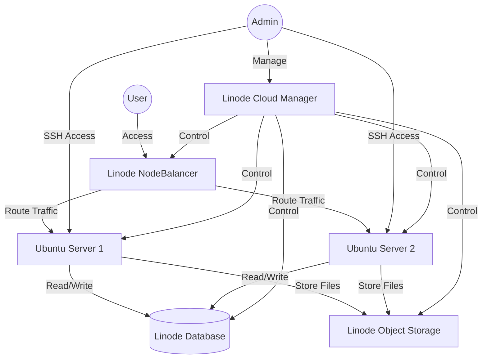

# Ubuntu Linode Integration

## Introduction

Ubuntu and Linode represent a powerful combination for cloud computing. Ubuntu, as one of the most popular Linux distributions, offers stability, security, and a vast ecosystem of software packages. Linode, on the other hand, is a cloud infrastructure provider that specializes in high-performance SSD Linux servers. By integrating Ubuntu with Linode, developers can leverage the strengths of both platforms to create robust, scalable, and cost-effective cloud solutions.

This guide will walk you through the process of integrating Ubuntu with Linode, from setting up your first Linode instance to deploying applications and implementing best practices for security and maintenance.

## What You'll Learn

- Setting up a Linode account
- Deploying Ubuntu on Linode
- Configuring and securing your Ubuntu server
- Deploying applications on your Ubuntu Linode
- Managing and scaling your infrastructure
- Automating deployment with tools like Ansible

## Prerequisites

- Basic understanding of Linux commands
- Familiarity with terminal/command line
- SSH knowledge (basics)
- A Linode account (we'll show you how to set one up)

## Setting Up a Linode Account

Before deploying Ubuntu on Linode, you need to create and configure a Linode account.

1. Visit the [Linode website](https://www.linode.com/) and click on "Sign Up"
2. Complete the registration process by providing your email and payment information
3. Verify your email address to activate your account

Once your account is set up, you'll have access to the Linode Cloud Manager, which is the control panel for managing your Linode resources.

## Deploying Ubuntu on Linode

Linode offers Ubuntu as one of its standard distributions. Here's how to deploy an Ubuntu server:

1. Log in to your Linode Cloud Manager
2. Click on "Create" to create a new Linode instance
3. Select a region (data center) that's geographically close to your users
4. Choose Ubuntu as your distribution (Linode offers multiple versions)
5. Select a plan based on your resource needs
6. Create a root password and optionally add an SSH key
7. Click "Create" to deploy your Linode

### Example: Creating an Ubuntu Server via Linode CLI

For those who prefer command-line interfaces, Linode offers a CLI tool that allows you to create and manage Linode instances from your terminal.

First, install the Linode CLI:

```bash
pip install linode-cli
```

Configure the CLI with your API token:

```bash
linode-cli configure
```

Create an Ubuntu Linode instance:

```bash
linode-cli linodes create \
  --type g6-standard-1 \
  --region us-east \
  --image linode/ubuntu22.04 \
  --root_pass YourSecurePassword \
  --label my-ubuntu-server
```

Output:
```
┌──────────┬──────────────────────────────────────┐
│ id       │ 123456                               │
│ label    │ my-ubuntu-server                     │
│ region   │ us-east                              │
│ type     │ g6-standard-1                        │
│ status   │ provisioning                         │
│ ipv4     │ ['203.0.113.1']                      │
│ ipv6     │ '2600:3c00::f03c:91ff:fe24:3a2f/128' │
└──────────┴──────────────────────────────────────┘
```

## Connecting to Your Ubuntu Linode

After deploying your Ubuntu Linode, you'll need to connect to it using SSH:

```bash
ssh root@your_linode_ip
```

Replace `your_linode_ip` with the IP address assigned to your Linode instance.

Upon first connection, you'll be asked to verify the server's fingerprint. Type "yes" to continue. Then, enter the root password you created during the Linode setup process.

## Initial Server Setup and Security

After connecting to your Ubuntu Linode, follow these steps to secure your server:

### Update System Packages

```bash
sudo apt update
sudo apt upgrade -y
```

### Create a New User with Administrative Privileges

```bash
adduser yourusername
usermod -aG sudo yourusername
```

### Configure SSH for Security

Edit the SSH configuration file:

```bash
sudo nano /etc/ssh/sshd_config
```

Make these security-focused changes:

```
PermitRootLogin no
PasswordAuthentication no
Port 2222  # Change the default SSH port
```

Set up SSH keys for the new user:

```bash
mkdir -p /home/yourusername/.ssh
nano /home/yourusername/.ssh/authorized_keys
```

Paste your public key into this file, save, and exit. Then set proper permissions:

```bash
chmod 700 /home/yourusername/.ssh
chmod 600 /home/yourusername/.ssh/authorized_keys
chown -R yourusername:yourusername /home/yourusername/.ssh
```

Restart the SSH service:

```bash
sudo systemctl restart sshd
```

### Set Up a Firewall

Ubuntu comes with UFW (Uncomplicated Firewall), which you can configure as follows:

```bash
sudo ufw allow 2222/tcp  # Allow your custom SSH port
sudo ufw allow http      # Allow HTTP traffic
sudo ufw allow https     # Allow HTTPS traffic
sudo ufw enable          # Enable the firewall
```

Output:
```
Command may disrupt existing ssh connections. Proceed with operation (y|n)? y
Firewall is active and enabled on system startup
```

Check the status:

```bash
sudo ufw status
```

Output:
```
Status: active

To                         Action      From
--                         ------      ----
2222/tcp                   ALLOW       Anywhere
80/tcp                     ALLOW       Anywhere
443/tcp                    ALLOW       Anywhere
2222/tcp (v6)              ALLOW       Anywhere (v6)
80/tcp (v6)                ALLOW       Anywhere (v6)
443/tcp (v6)               ALLOW       Anywhere (v6)
```

## System Monitoring and Management

Linode provides several tools for monitoring and managing your Ubuntu server:

### Linode Longview

Longview is Linode's server monitoring and statistics system. To install it:

```bash
curl -s https://lv.linode.com/92nj44j | sudo bash
```

### Linode Backup Service

Enable backups through the Linode Cloud Manager:

1. Navigate to your Linode
2. Click on the "Backups" tab
3. Click "Enable Backups"

This will automatically create daily, weekly, and biweekly backups of your server.

## Deploying Applications on Ubuntu Linode

Now that your Ubuntu server is set up and secured, you can deploy applications. Let's walk through a simple example of deploying a web application.

### Example: Deploying a LAMP Stack (Linux, Apache, MySQL, PHP)

Install Apache:

```bash
sudo apt install apache2 -y
```

Install MySQL:

```bash
sudo apt install mysql-server -y
sudo mysql_secure_installation
```

Install PHP:

```bash
sudo apt install php libapache2-mod-php php-mysql -y
```

Create a simple PHP info page to test the setup:

```bash
sudo nano /var/www/html/info.php
```

Add this content:

```php
<?php
phpinfo();
?>
```

Restart Apache:

```bash
sudo systemctl restart apache2
```

Now you can access your PHP info page by visiting `http://your_linode_ip/info.php` in your browser.

## Scaling Your Ubuntu Linode

As your application grows, you might need to scale your infrastructure. Linode offers several options:

### Vertical Scaling (Resizing)

1. In the Linode Cloud Manager, navigate to your Linode
2. Click on "Resize"
3. Select a larger plan
4. Click "Resize"

### Horizontal Scaling (Multiple Servers)

For horizontal scaling, you can set up load balancing with NodeBalancers:

1. In the Linode Cloud Manager, click on "NodeBalancers"
2. Click "Create"
3. Configure your NodeBalancer
4. Add your Linode instances as backend nodes

## Automating Deployment with Ansible

Ansible can automate the deployment and configuration of Ubuntu on Linode. Here's a simple example:

Install Ansible on your local machine:

```bash
sudo apt install ansible -y
```

Create an inventory file:

```bash
nano inventory.ini
```

Add your Linode servers:

```
[webservers]
server1 ansible_host=your_linode_ip ansible_user=yourusername ansible_port=2222
```

Create a playbook:

```bash
nano deploy.yml
```

Add a simple playbook for deploying a web server:

```yaml
---
- name: Deploy web server
  hosts: webservers
  become: yes
  tasks:
    - name: Update apt cache
      apt:
        update_cache: yes

    - name: Install Apache
      apt:
        name: apache2
        state: present

    - name: Start Apache
      service:
        name: apache2
        state: started
        enabled: yes

    - name: Deploy website
      copy:
        src: ./website/
        dest: /var/www/html/
```

Run the playbook:

```bash
ansible-playbook -i inventory.ini deploy.yml --key-file=/path/to/your/private/key
```

## Integration Architecture

Here's a visual representation of the Ubuntu Linode integration architecture:



## Best Practices

To get the most out of your Ubuntu Linode integration:

1. **Keep your system updated**: Regularly run `sudo apt update && sudo apt upgrade`
2. **Use SSH keys instead of passwords**: More secure and convenient
3. **Set up automatic backups**: Either use Linode's backup service or set up your own backup solution
4. **Monitor your resources**: Use Linode Longview or other monitoring tools
5. **Use a firewall**: Configure UFW to allow only necessary traffic
6. **Consider using Linode's managed services**: For databases, Kubernetes, and other applications
7. **Implement a CI/CD pipeline**: For automated deployment of your applications
8. **Use Infrastructure as Code**: Tools like Terraform can help manage your infrastructure

## Troubleshooting Common Issues

### Cannot Connect to Server via SSH

- Verify the IP address is correct
- Ensure the SSH service is running: `sudo systemctl status sshd`
- Check firewall rules: `sudo ufw status`
- Verify SSH key permissions: `chmod 600 ~/.ssh/id_rsa`

### High CPU or Memory Usage

- Use `top` or `htop` to identify resource-intensive processes
- Consider upgrading to a larger Linode plan
- Optimize your application for better resource usage

### Slow Website Performance

- Use Linode's NodeBalancers for load balancing
- Implement caching mechanisms
- Consider using a CDN for static content
- Optimize database queries

## Summary

In this guide, we've covered the essentials of Ubuntu Linode integration, from setting up your first Ubuntu server on Linode to deploying applications, securing your infrastructure, and scaling your resources. The combination of Ubuntu's stability and software ecosystem with Linode's high-performance infrastructure provides a solid foundation for a wide range of applications, from simple websites to complex, multi-tiered applications.

By following the best practices outlined in this guide, you'll be well on your way to creating a secure, scalable, and cost-effective cloud solution using Ubuntu and Linode.

## Additional Resources

- [Linode Documentation](https://www.linode.com/docs/)
- [Ubuntu Server Guide](https://ubuntu.com/server/docs)
- [Securing Ubuntu Server](https://ubuntu.com/server/docs/security-introduction)
- [Ansible Documentation](https://docs.ansible.com/)

## Exercises

1. Deploy an Ubuntu server on Linode and secure it following the steps in this guide.
2. Set up a simple web application using the LAMP stack.
3. Create a basic Ansible playbook to automate the deployment of your application.
4. Configure a NodeBalancer with multiple Ubuntu Linode instances.
5. Implement a backup strategy for your Ubuntu Linode server.