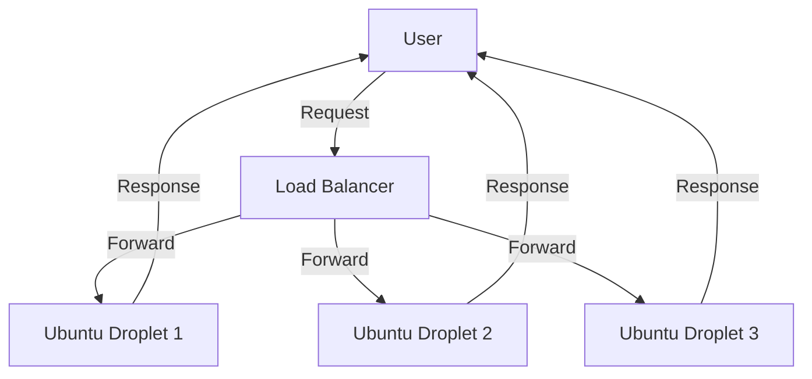

# Ubuntu Digital Ocean

## Introduction

DigitalOcean is a popular cloud infrastructure provider that offers virtual machines called "Droplets." These Droplets provide developers with scalable computing resources in the cloud without the need to maintain physical hardware. Ubuntu, being one of the most widely used Linux distributions, integrates seamlessly with DigitalOcean, making it an excellent choice for cloud deployments.

In this guide, we'll explore how to set up, configure, and manage Ubuntu-based Droplets on DigitalOcean. This knowledge is essential for developers looking to host applications, set up development environments, or learn about cloud infrastructure.

## Prerequisites

Before getting started, you should have:

- A DigitalOcean account (you can sign up at [digitalocean.com](https://www.digitalocean.com))
- Basic knowledge of Linux commands
- SSH set up on your local machine

## Creating Your First Ubuntu Droplet

Let's start by creating an Ubuntu Droplet on DigitalOcean.

### Step 1: Log in to DigitalOcean

After logging in to your DigitalOcean account, you'll be greeted with the dashboard.

### Step 2: Create a New Droplet

1. Click on the "Create" button at the top of the dashboard
2. Select "Droplets" from the dropdown menu

### Step 3: Choose Ubuntu as Your Operating System

```
Choose an image → Ubuntu
```

DigitalOcean offers various Ubuntu versions. For beginners, it's recommended to select the most recent LTS (Long Term Support) version, such as Ubuntu 22.04 LTS.

### Step 4: Select a Plan

Choose a plan that fits your needs. For learning purposes, the basic plan is sufficient:

```
Basic → Regular with SSD → $5/mo (1GB/1CPU/25GB SSD)
```

### Step 5: Choose a Datacenter Region

Select a datacenter region closest to your target audience to minimize latency.

### Step 6: Authentication Method

Choose between:

- SSH keys (recommended for security)
- Password

For SSH keys:

```bash
# If you don't have an SSH key yet, generate one locally
ssh-keygen -t rsa -b 4096

# Display your public key to copy
cat ~/.ssh/id_rsa.pub
```

Copy the output and paste it into the SSH key field in DigitalOcean.

### Step 7: Finalize and Create

1. Choose a hostname (e.g., `ubuntu-droplet-1`)
2. Select any additional options you need
3. Click "Create Droplet"

## Connecting to Your Ubuntu Droplet

Once your Droplet is created, you'll receive an IP address. Use SSH to connect to your Droplet:

```bash
ssh root@your_droplet_ip
```

If you're using password authentication, you'll be prompted to enter the password you set or the one that was emailed to you.

## Basic Server Setup and Security

After connecting to your Droplet, it's important to perform some basic security configurations.

### Update Your System

Always start by updating your system:

```bash
sudo apt update
sudo apt upgrade -y
```

### Create a Non-Root User

It's best practice not to use the root user for regular operations:

```bash
# Create a new user
adduser username

# Add user to sudo group
usermod -aG sudo username

# Switch to the new user
su - username
```

### Configure the Firewall

Ubuntu comes with `ufw` (Uncomplicated Firewall) which is easy to configure:

```bash
# Allow SSH connections
sudo ufw allow OpenSSH

# Enable the firewall
sudo ufw enable

# Check status
sudo ufw status
```

## Managing Your Ubuntu Droplet

Let's look at some common management tasks.

### Installing Web Server Software

To host a website, you'll need a web server like Nginx:

```bash
# Install Nginx
sudo apt install nginx -y

# Start and enable Nginx
sudo systemctl start nginx
sudo systemctl enable nginx
```

Once installed, you can access your web server by navigating to your Droplet's IP address in a web browser.

### Deploying a Simple Web Application

Let's deploy a simple Node.js application:

```bash
# Install Node.js and npm
sudo apt install nodejs npm -y

# Create a directory for your app
mkdir ~/myapp
cd ~/myapp

# Create a simple app
echo 'const http = require("http");
const server = http.createServer((req, res) => {
  res.writeHead(200, {"Content-Type": "text/html"});
  res.end("<h1>Hello from my Ubuntu Droplet!</h1>");
});
server.listen(3000);
console.log("Server running on port 3000");' > app.js

# Run the app
node app.js
```

To make this app accessible via HTTP, you need to configure Nginx as a reverse proxy:

```bash
sudo nano /etc/nginx/sites-available/default
```

Replace the contents with:

```
server {
    listen 80;
    server_name _;

    location / {
        proxy_pass http://localhost:3000;
        proxy_http_version 1.1;
        proxy_set_header Upgrade $http_upgrade;
        proxy_set_header Connection 'upgrade';
        proxy_set_header Host $host;
        proxy_cache_bypass $http_upgrade;
    }
}
```

Then restart Nginx:

```bash
sudo systemctl restart nginx
```

## Scaling Your Infrastructure

As your application grows, you might need to scale your infrastructure.

### Resizing Your Droplet

DigitalOcean allows you to resize your Droplet:

1. Power off your Droplet from the DigitalOcean dashboard
2. Select your Droplet and click on "Resize"
3. Choose a larger plan
4. Apply changes and power on your Droplet

### Creating Snapshots for Backup

It's important to regularly back up your Droplet:

1. Go to your Droplet in the DigitalOcean dashboard
2. Click on "Snapshots"
3. Give your snapshot a name and click "Take Snapshot"

## Advanced Ubuntu + DigitalOcean Features

### Using DigitalOcean Volumes

For applications that require additional storage, you can attach DigitalOcean Volumes:

```bash
# After creating a volume in the dashboard, attach it to your Droplet
# Format the volume (replace xvdf with your volume's device name)
sudo mkfs.ext4 /dev/disk/by-id/scsi-0DO_Volume_volume-name

# Create a mount point
sudo mkdir -p /mnt/my-volume

# Mount the volume
sudo mount -o discard,defaults /dev/disk/by-id/scsi-0DO_Volume_volume-name /mnt/my-volume

# Add to fstab for persistence (optional)
echo '/dev/disk/by-id/scsi-0DO_Volume_volume-name /mnt/my-volume ext4 defaults,nofail,discard 0 0' | sudo tee -a /etc/fstab
```

### Setting Up a Load Balancer

For high-traffic applications, set up a load balancer to distribute traffic across multiple Droplets:

1. Create multiple identical Droplets running your application
2. In the DigitalOcean dashboard, go to "Networking" → "Load Balancers"
3. Create a new load balancer
4. Select your region and add your Droplets
5. Configure forwarding rules (typically HTTP on port 80)

Here's a visual representation of a load balanced architecture:



## Monitoring Your Ubuntu Droplet

DigitalOcean provides built-in monitoring for your Droplets. Additionally, you can set up your own monitoring with tools like:

```bash
# Install and configure Prometheus Node Exporter
sudo apt install prometheus-node-exporter -y
sudo systemctl enable prometheus-node-exporter
sudo systemctl start prometheus-node-exporter
```

## Automation with DigitalOcean API

You can automate Droplet management using the DigitalOcean API and `doctl` CLI tool:

```bash
# Install doctl
sudo snap install doctl

# Authenticate with your API token
doctl auth init

# List your Droplets
doctl compute droplet list

# Create a new Droplet
doctl compute droplet create ubuntu-api-test \
  --region nyc1 \
  --image ubuntu-22-04-x64 \
  --size s-1vcpu-1gb \
  --ssh-keys your-ssh-key-id
```

## Practical Project: Deploying a LAMP Stack

Let's deploy a complete LAMP (Linux, Apache, MySQL, PHP) stack on your Ubuntu Droplet:

```bash
# Install Apache
sudo apt install apache2 -y

# Install MySQL
sudo apt install mysql-server -y

# Secure MySQL installation
sudo mysql_secure_installation

# Install PHP
sudo apt install php libapache2-mod-php php-mysql -y

# Create a test PHP file
echo '<?php
phpinfo();
?>' | sudo tee /var/www/html/info.php

# Restart Apache
sudo systemctl restart apache2
```

Now you can access your PHP info page at `http://your_droplet_ip/info.php`.

## Summary

In this guide, we've explored how to:

1. Create and set up an Ubuntu Droplet on DigitalOcean
2. Secure your Droplet with basic security measures
3. Deploy web applications
4. Scale your infrastructure
5. Use advanced DigitalOcean features
6. Monitor your Droplet
7. Automate management with the DigitalOcean API
8. Deploy a practical LAMP stack

Ubuntu and DigitalOcean together provide a powerful and flexible platform for hosting applications, learning about cloud infrastructure, and building scalable services.

## Additional Resources

- **Practice Exercises:**
  1. Try deploying a Python Flask or Django application on your Droplet
  2. Set up a database cluster using DigitalOcean's managed databases
  3. Implement automatic backups for your application data

- **Additional Learning:**
  - Explore containerization with Docker on your Ubuntu Droplet
  - Learn about CI/CD pipelines for automatic deployment to your Droplets
  - Investigate serverless functions with DigitalOcean Functions