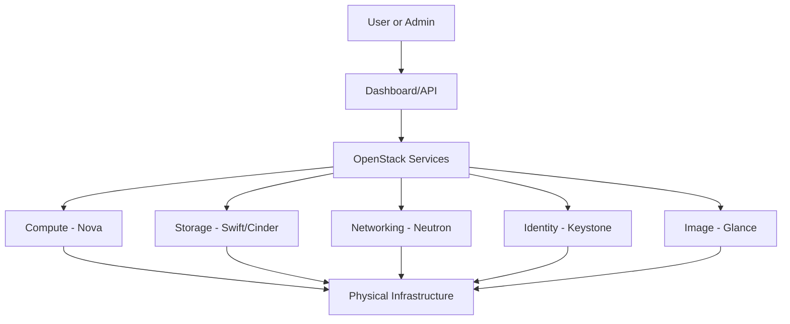

# Ubuntu OpenStack

## Introduction

Ubuntu OpenStack is a powerful combination of Ubuntu's robust operating system with OpenStack's open-source cloud computing platform. This integration enables organizations to build and manage scalable, efficient, and flexible cloud infrastructures. If you're new to cloud computing or want to set up your own private cloud environment, Ubuntu OpenStack provides a solid foundation with extensive community support and regular updates.

OpenStack itself is a collection of interrelated projects that collectively provide an Infrastructure as a Service (IaaS) solution. When deployed on Ubuntu, it benefits from Canonical's support and integration tools, making deployment and management more streamlined than vanilla OpenStack installations.

## What is OpenStack?

Before diving into Ubuntu OpenStack specifically, let's understand what OpenStack is.

OpenStack is an open-source cloud platform that controls large pools of compute, storage, and networking resources throughout a datacenter. These resources are managed through a dashboard or via the OpenStack API, giving administrators control while empowering users to provision resources through a web interface.



## Why Ubuntu for OpenStack?

Ubuntu is the reference operating system for OpenStack. Here's why this combination is particularly effective:

1. **Native Integration**: Canonical (the company behind Ubuntu) contributes heavily to OpenStack development.
2. **Regular Updates**: Both Ubuntu and OpenStack receive consistent updates and security patches.
3. **Deployment Tools**: Ubuntu offers specialized tools like MAAS (Metal as a Service) and Juju for easier deployment.
4. **Long-term Support**: Ubuntu LTS releases provide stability for production environments.
5. **Large Community**: Both Ubuntu and OpenStack have large, active communities for support.

## Core Components of OpenStack

Ubuntu OpenStack includes several key components that work together to provide cloud services:

| Component | Function       | Description                                                  |
|-----------|----------------|--------------------------------------------------------------|
| Nova      | Compute        | Manages the lifecycle of compute instances                   |
| Swift     | Object Storage | Stores and retrieves arbitrary unstructured data objects     |
| Cinder    | Block Storage  | Provides persistent block storage to running instances       |
| Neutron   | Networking     | Enables network connectivity as a service between interfaces |
| Keystone  | Identity       | Provides authentication and authorization for all services   |
| Glance    | Image Service  | Stores and retrieves virtual machine disk images             |
| Horizon   | Dashboard      | Provides a web-based user interface for OpenStack services   |

## Getting Started with Ubuntu OpenStack

Let's go through the process of setting up a basic Ubuntu OpenStack environment. For beginners, we'll use MicroStack, which is a simplified version perfect for learning and testing.

### Prerequisites

- A machine with Ubuntu 20.04 LTS or newer
- At least 8GB RAM
- 20GB free disk space
- Virtualization support enabled in BIOS

### Installing MicroStack

MicroStack is a single-node OpenStack deployment that runs all core OpenStack services. It's perfect for beginners to learn OpenStack.

```bash
# Install snapd if not already installed
sudo apt update
sudo apt install snapd

# Install MicroStack
sudo snap install microstack --beta

# Initialize MicroStack
sudo microstack init --auto
```

This will take some time as it downloads and configures all necessary components.

### Verification

Once installation completes, verify your installation:

```bash
# Check the status
sudo microstack status

# Output should show all services as 'active'
```

### Creating Your First Virtual Machine

Let's create a virtual machine to verify everything is working:

```bash
# Source the OpenStack RC file to set environment variables
sudo microstack.openrc

# List available images
openstack image list

# Create a new instance using the default image
openstack server create --flavor m1.small --image cirros myvm

# Check if the VM is running
openstack server list
```

Expected output:

```
+--------------------------------------+------+--------+------------------+------------+
| ID                                   | Name | Status | Networks         | Image Name |
+--------------------------------------+------+--------+------------------+------------+
| 5dc30891-9823-4f9e-9822-4b121231a123 | myvm | ACTIVE | 10.20.20.x       | cirros     |
+--------------------------------------+------+--------+------------------+------------+
```

### Accessing Your VM

You can access your newly created VM:

```bash
# Get the IP address
openstack server show myvm -c addresses

# SSH into the VM (username: cirros, password: gocubsgo)
ssh cirros@VM_IP_ADDRESS
```

## Production Deployment with Charmed OpenStack

For production environments, Ubuntu offers Charmed OpenStack, which provides a more robust and scalable deployment method using Juju charms.

### Components for Production Deployment

1. **MAAS (Metal as a Service)**: Provisions bare metal servers for your OpenStack cloud.
2. **Juju**: Deployment and management tool that uses "charms" to deploy services.
3. **Charmed OpenStack**: Collection of Juju charms for deploying OpenStack services.

### Deployment Steps Overview

1. Setup MAAS to manage physical hardware
2. Install Juju controller
3. Deploy OpenStack using charms
4. Configure networking and storage
5. Deploy additional services as needed

While a full production deployment is beyond the scope of a beginner tutorial, here's a simplified example of deploying a minimal OpenStack environment with Juju:

```bash
# Install Juju
sudo snap install juju --classic

# Bootstrap Juju controller on MAAS
juju bootstrap maas maas-controller

# Create model for OpenStack
juju add-model openstack

# Deploy basic OpenStack components
juju deploy openstack-base

# Watch deployment progress
juju status
```

## OpenStack Dashboard (Horizon)

Horizon is OpenStack's web interface that allows you to manage your cloud resources visually.

In MicroStack, you can access Horizon at `http://localhost/horizon` with:
- Username: admin
- Password: (found by running `sudo snap get microstack config.credentials.keystone-password`)

From the dashboard, you can:
- Create and manage virtual machines
- Set up networks and security groups
- Manage storage volumes
- Monitor resource usage

## Creating a Custom Cloud Image

You can create custom images for your cloud:

```bash
# Install tools
sudo apt install qemu-utils cloud-image-utils

# Download a base Ubuntu image
wget https://cloud-images.ubuntu.com/focal/current/focal-server-cloudimg-amd64.img

# Create a customized version with cloud-init configuration
cat > cloud-config.yml << EOF
#cloud-config
hostname: custom-ubuntu
password: mypassword
chpasswd: { expire: False }
ssh_pwauth: True
EOF

# Create disk with cloud-init configuration
cloud-localds cloud-config.iso cloud-config.yml

# Start a KVM instance to customize the image
sudo qemu-system-x86_64 -machine accel=kvm -cpu host -m 1G \
  -drive file=focal-server-cloudimg-amd64.img,format=qcow2 \
  -drive file=cloud-config.iso,format=raw \
  -net nic -net user,hostfwd=tcp::2222-:22

# After customization, upload to OpenStack
openstack image create --disk-format qcow2 --container-format bare \
  --file focal-server-cloudimg-amd64.img "Custom Ubuntu 20.04"
```

## Networking in OpenStack

OpenStack's networking component (Neutron) is powerful but can be complex. Here's a simple example of creating a private network:

```bash
# Create a private network
openstack network create private-net

# Create a subnet within the private network
openstack subnet create --network private-net \
  --subnet-range 192.168.100.0/24 \
  --dns-nameserver 8.8.8.8 private-subnet

# Create a router to connect to external network
openstack router create main-router

# Add the private subnet to the router
openstack router add subnet main-router private-subnet

# Connect the router to the external network
openstack router set --external-gateway ext-net main-router
```

## Securing Your OpenStack Deployment

Security is critical for any cloud deployment. Here are some basic security measures:

1. **Update regularly**:
```bash
sudo apt update && sudo apt upgrade
```

2. **Configure proper security groups**:
```bash
# Create a security group
openstack security group create web-servers

# Add rule to allow SSH access
openstack security group rule create --protocol tcp --dst-port 22 web-servers

# Add rule to allow HTTP access
openstack security group rule create --protocol tcp --dst-port 80 web-servers
```

3. **Use strong authentication**:
```bash
# Create a project
openstack project create --domain default secure-project

# Create a user
openstack user create --domain default --password-prompt secure-user

# Assign role to user for project
openstack role add --project secure-project --user secure-user member
```

## Volume Management

OpenStack's volume service (Cinder) allows you to attach persistent storage to your instances:

```bash
# Create a volume
openstack volume create --size 10 my-volume

# Attach volume to an instance
openstack server add volume myvm my-volume

# Inside the VM, format and mount the volume
# (SSH into the VM first)
sudo mkfs.ext4 /dev/vdb
sudo mkdir /mnt/data
sudo mount /dev/vdb /mnt/data
```

## Automating OpenStack Operations

You can automate operations using the OpenStack CLI or Python SDK:

```python
# Example Python script using OpenStack SDK
# Save as manage_instances.py

import openstack

# Initialize connection
conn = openstack.connect(cloud='microstack')

# List all instances
print("Current instances:")
for server in conn.compute.servers():
    print(f"- {server.name}: {server.status}")

# Create a new instance
print("Creating new instance...")
image = conn.compute.find_image("cirros")
flavor = conn.compute.find_flavor("m1.small")
network = conn.network.find_network("test")

server = conn.compute.create_server(
    name="auto-instance", 
    image_id=image.id,
    flavor_id=flavor.id,
    networks=[{"uuid": network.id}]
)

# Wait for server to be active
server = conn.compute.wait_for_server(server)
print(f"Created instance {server.name} with IP: {server.addresses}")
```

To run this script:

```bash
# Install the SDK
pip install openstacksdk

# Run the script
python manage_instances.py
```

## Heat: Infrastructure as Code

OpenStack Heat allows you to define your infrastructure as code using templates:

```yaml
# Basic Heat template (stack.yaml)
heat_template_version: 2018-08-31

description: Simple template to deploy a web server

resources:
  web_server:
    type: OS::Nova::Server
    properties:
      image: Ubuntu 20.04
      flavor: m1.small
      networks:
        - network: private-net
      user_data: |
        #!/bin/bash
        apt update
        apt install -y nginx
        echo "Hello from Heat!" > /var/www/html/index.html

outputs:
  server_ip:
    description: IP address of the web server
    value: { get_attr: [web_server, first_address] }
```

Deploying this template:

```bash
# Create the stack
openstack stack create -t stack.yaml web-stack

# Check stack status
openstack stack list

# Get the outputs
openstack stack output show web-stack server_ip
```

## Common Issues and Troubleshooting

Let's look at some common issues you might encounter:

### 1. Instance won't start

Check the compute service:

```bash
# Check Nova service status
sudo systemctl status nova-compute

# Check Nova logs
sudo tail -f /var/log/nova/nova-compute.log
```

### 2. Networking problems

Verify Neutron is working correctly:

```bash
# Check Neutron service status
sudo systemctl status neutron-server

# Check Neutron logs
sudo tail -f /var/log/neutron/neutron-server.log
```

### 3. Dashboard (Horizon) not accessible

Check the web server:

```bash
# Check Apache status
sudo systemctl status apache2

# Check Apache logs
sudo tail -f /var/log/apache2/error.log
```

## Integration with Other Ubuntu Services

Ubuntu OpenStack works well with other Ubuntu services:

1. **LXD**: Run system containers alongside VMs
2. **Kubernetes**: Deploy container orchestration on top of OpenStack
3. **MAAS**: Automate hardware provisioning
4. **Landscape**: Monitor and manage your Ubuntu systems

Example of deploying Kubernetes on OpenStack:

```bash
# Install the OpenStack cloud provider for Kubernetes
juju deploy kubernetes-core
juju deploy openstack-integrator

# Relate them
juju add-relation kubernetes-master openstack-integrator
juju add-relation kubernetes-worker openstack-integrator
```

## Summary

Ubuntu OpenStack provides a powerful platform for building and managing cloud infrastructure. We've covered:

- The basics of OpenStack and why Ubuntu is an excellent OS for it
- How to install and use MicroStack for learning
- Creating virtual machines and managing resources
- Production deployment considerations
- Networking, security, and storage configurations
- Automation and infrastructure as code

With this knowledge, you're ready to start exploring Ubuntu OpenStack and build your own cloud infrastructure.

## Additional Resources

Here are some resources to continue your Ubuntu OpenStack journey:

- [OpenStack Documentation](https://docs.openstack.org/)
- [Ubuntu Cloud Documentation](https://ubuntu.com/cloud/docs)
- [MicroStack Documentation](https://microstack.run/docs)
- [Charmed OpenStack Documentation](https://ubuntu.com/openstack/docs)

## Exercises

1. Set up MicroStack and create three VMs on a private network
2. Create and attach a volume to a VM
3. Configure a load balancer for two web server VMs
4. Write a Heat template to deploy a WordPress site with MySQL
5. Create a custom image with your application pre-installed