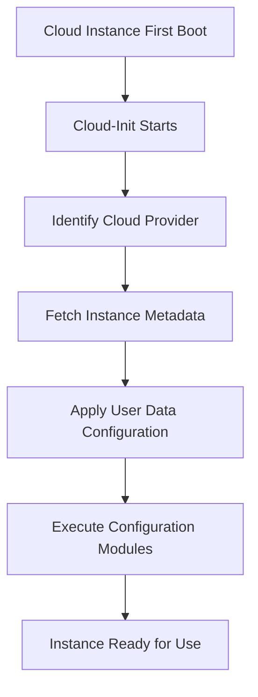

# Ubuntu Cloud-Init

## Introduction

Cloud-Init is the industry standard multi-distribution method for cross-platform cloud instance initialization. It is the default initialization tool for Ubuntu cloud images and is widely used across major cloud providers including AWS, Azure, Google Cloud, and DigitalOcean.

Cloud-Init allows you to configure your Ubuntu cloud instances on first boot by automating the initial setup process. Instead of manually configuring each server after it launches, Cloud-Init enables you to declare the desired configuration in advance, saving time and ensuring consistency across your infrastructure.

## What is Cloud-Init?

Cloud-Init is essentially the first process that runs when a new cloud instance boots. It performs a series of initialization tasks such as:

- Setting the hostname
- Generating SSH keys
- Configuring network interfaces
- Creating users and setting passwords
- Installing packages
- Running custom scripts

The beauty of Cloud-Init lies in its ability to create a repeatable, automated approach to server provisioning, making it an essential tool for modern cloud deployments.

## How Cloud-Init Works

When a cloud instance boots for the first time, Cloud-Init performs the following steps:



1. **Cloud Detection**: Cloud-Init identifies which cloud environment it's running in.
2. **Metadata Retrieval**: It fetches instance-specific metadata from the cloud provider.
3. **User Data Processing**: It interprets and applies the user-provided configuration (user-data).
4. **Module Execution**: It runs through a series of modules that handle specific configuration tasks.

## Cloud-Init Configuration Formats

Cloud-Init supports several configuration formats:

### 1. Cloud Config

This is the most common format, using YAML syntax. Files must start with `#cloud-config` to be recognized as cloud-config data.

```yaml
#cloud-config
hostname: webserver
users:
  - name: ubuntu
    groups: sudo
    shell: /bin/bash
    sudo: ['ALL=(ALL) NOPASSWD:ALL']
    ssh_authorized_keys:
      - ssh-rsa AAAAB3NzaC1yc2EAAAADAQABAAABAQ...
packages:
  - nginx
  - python3-pip
```

### 2. Shell Scripts

You can also provide a shell script to be executed at first boot:

```bash
#!/bin/bash
apt-get update
apt-get install -y nginx
echo "<h1>Hello from Cloud-Init</h1>" > /var/www/html/index.html
```

### 3. MIME Multi-part Archive

For complex configurations, you can combine multiple formats using MIME multi-part format.

## Setting Up Cloud-Init Configuration

### Local Installation and Testing

Before deploying to the cloud, you can test Cloud-Init configurations locally:

1. Install Cloud-Init on an Ubuntu system:

```bash
sudo apt-get update
sudo apt-get install -y cloud-init
```

2. Create a configuration file:

```bash
sudo nano /etc/cloud/cloud.cfg.d/99_custom.cfg
```

3. Add your Cloud-Init configuration in YAML format.

4. Test the configuration:

```bash
sudo cloud-init clean
sudo cloud-init init --local
sudo cloud-init modules
```

## Common Use Cases

### 1. Installing and Configuring a Web Server

```yaml
#cloud-config
packages:
  - nginx
write_files:
  - path: /var/www/html/index.html
    content: |
      <!DOCTYPE html>
      <html>
        <head>
          <title>Cloud-Init Demo</title>
        </head>
        <body>
          <h1>Hello, Cloud-Init!</h1>
          <p>This server was automatically configured using Cloud-Init.</p>
        </body>
      </html>
  - path: /etc/nginx/sites-available/default
    content: |
      server {
        listen 80 default_server;
        listen [::]:80 default_server;
        root /var/www/html;
        index index.html index.htm;
        server_name _;
        location / {
          try_files $uri $uri/ =404;
        }
      }
runcmd:
  - systemctl restart nginx
```

This configuration:
- Installs the Nginx web server
- Creates a custom index.html file
- Configures the Nginx server settings
- Restarts the Nginx service

### 2. Setting Up a Development Environment

```yaml
#cloud-config
packages:
  - git
  - python3
  - python3-pip
  - nodejs
  - npm
users:
  - name: developer
    groups: sudo
    shell: /bin/bash
    sudo: ['ALL=(ALL) NOPASSWD:ALL']
    ssh_authorized_keys:
      - ssh-rsa AAAAB3NzaC1yc2EAAAADAQABAAABAQ...
write_files:
  - path: /home/developer/.bashrc
    append: true
    content: |
      export PATH=$PATH:/usr/local/bin
      alias ll='ls -la'
runcmd:
  - pip3 install flask pytest
  - npm install -g express-generator
  - chown -R developer:developer /home/developer
```

This configuration sets up a development environment with:
- Common development tools and languages
- A developer user with sudo access
- SSH key for secure access
- Customized bash environment
- Pre-installed Python and Node.js packages

## Cloud-Init Modules

Cloud-Init operates through modules that perform specific tasks. Here are some key modules:

| Module | Description |
|--------|-------------|
| `cloud_init_modules` | Core modules that run first (e.g., setting hostname, generating SSH keys) |
| `cloud_config_modules` | Configuration modules (e.g., setting up users, installing packages) |
| `cloud_final_modules` | Final modules that run last (e.g., running scripts, applying configuration) |

You can view the available modules and their order in `/etc/cloud/cloud.cfg`.

## Cloud-Init on Different Cloud Providers

### AWS

On AWS, you can provide user data when launching an EC2 instance:

1. Go to the EC2 Dashboard and start the instance launch process
2. In the "Configure Instance" step, expand the "Advanced Details" section
3. Paste your Cloud-Init script or cloud-config YAML in the "User data" field

### Azure

In Azure, you can provide custom data when creating a Virtual Machine:

1. When creating a VM, go to the "Advanced" tab
2. Under "Custom data", paste your Cloud-Init configuration

### Google Cloud Platform

In GCP, you can add metadata to your instance:

1. When creating a VM, expand the "Management, security, disks, networking, sole tenancy" section
2. Go to the "Management" tab
3. Under "Automation", add your Cloud-Init script in the "Startup script" field

## Debugging Cloud-Init

If your Cloud-Init configuration isn't working as expected, you can check the logs:

```bash
sudo cat /var/log/cloud-init.log
sudo cat /var/log/cloud-init-output.log
```

You can also check the status of Cloud-Init:

```bash
cloud-init status
```

To analyze the applied Cloud-Init data:

```bash
cloud-init query userdata
cloud-init query vendordata
```

## Advanced Cloud-Init Techniques

### Conditionally Running Commands

You can use conditionals in the `runcmd` section:

```yaml
#cloud-config
runcmd:
  - if grep -q Ubuntu /etc/os-release; then apt-get update; else yum update -y; fi
```

### Integration with Configuration Management Tools

Cloud-Init works well with other configuration management tools:

```yaml
#cloud-config
packages:
  - ansible
write_files:
  - path: /etc/ansible/hosts
    content: |
      [webservers]
      localhost
  - path: /root/playbook.yml
    content: |
      ---
      - hosts: webservers
        tasks:
          - name: Install Apache
            apt:
              name: apache2
              state: present
runcmd:
  - ansible-playbook /root/playbook.yml
```

## Security Considerations

When using Cloud-Init, keep these security practices in mind:

1. **Protect Sensitive Data**: Don't include passwords or API keys in user-data (use secrets management solutions instead)
2. **Limit Permissions**: Apply the principle of least privilege when creating users and granting permissions
3. **Validate Configurations**: Test your configurations in a safe environment before deploying to production
4. **Use SSH Keys**: Prefer SSH key authentication over password authentication
5. **Update Packages**: Include steps to update system packages to ensure security patches are applied

## Summary

Cloud-Init is a powerful tool for automating the initialization of Ubuntu cloud instances. It allows you to:

- Standardize your server configurations
- Automate repetitive setup tasks
- Improve deployment consistency
- Scale your infrastructure efficiently
- Integrate with existing configuration management workflows

By mastering Cloud-Init, you can significantly streamline your cloud deployments and ensure consistent, repeatable server provisioning across your infrastructure.

## Additional Resources

- [Official Cloud-Init Documentation](https://cloudinit.readthedocs.io/)
- [Ubuntu Cloud Image Finder](https://cloud-images.ubuntu.com/)
- [Cloud-Init GitHub Repository](https://github.com/canonical/cloud-init)

## Exercises

1. Create a Cloud-Init configuration that sets up a basic LAMP stack (Linux, Apache, MySQL, PHP).
2. Modify an existing Cloud-Init configuration to include a custom user with SSH access.
3. Develop a Cloud-Init script that automatically joins a server to your monitoring system.
4. Create a multi-part MIME archive that combines a cloud-config file and a shell script.
5. Design a Cloud-Init configuration that bootstraps a Docker environment with a sample container.