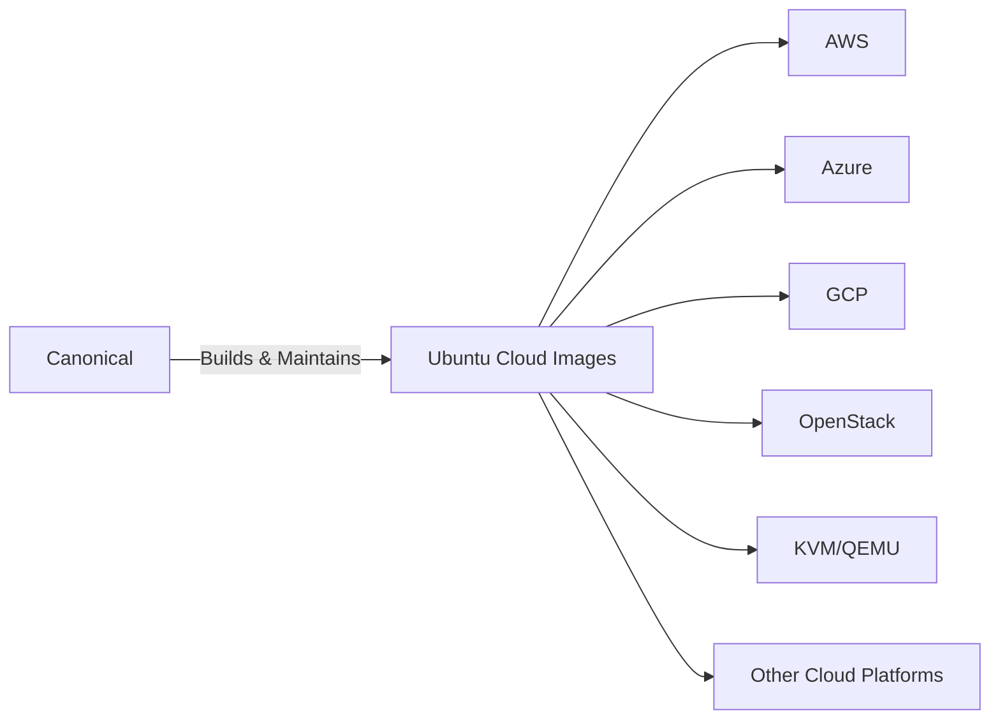

# Ubuntu Cloud Images

## Introduction

Ubuntu Cloud Images are pre-installed disk images specifically optimized for cloud environments. These official images are maintained by Canonical (the company behind Ubuntu) and come pre-configured with cloud-init, which enables seamless integration with various cloud platforms. Whether you're deploying applications on AWS, Google Cloud, Azure, or using your own private cloud infrastructure, Ubuntu Cloud Images provide a consistent, secure, and efficient starting point.

As a beginner venturing into cloud computing, understanding how to access and use these images is fundamental to successful deployments. This guide will walk you through everything you need to know about Ubuntu Cloud Images and how to utilize them effectively.

## What Are Ubuntu Cloud Images?

Ubuntu Cloud Images are pre-built, ready-to-use virtual machine images that:

- Come with minimal installation (no unnecessary packages)
- Include cloud-init for first-boot configuration
- Are regularly updated with security patches
- Support various cloud platforms out of the box
- Are available in different Ubuntu versions and architectures



## Accessing Ubuntu Cloud Images

Ubuntu Cloud Images are available through different channels:

### 1. Cloud Provider Marketplace

Most cloud providers offer Ubuntu images directly in their marketplace:

- AWS: Amazon Machine Images (AMIs)
- Azure: Azure Marketplace
- Google Cloud: Cloud Marketplace

### 2. Direct Download

You can download cloud images directly from the Ubuntu Cloud Image repository:

```bash
# Example: Downloading the latest Ubuntu 22.04 LTS cloud image
wget https://cloud-images.ubuntu.com/jammy/current/jammy-server-cloudimg-amd64.img
```

### 3. Using the Ubuntu Cloud Image Finder

Ubuntu provides a web tool to help you find the right image for your cloud platform:

1. Visit the [Ubuntu Cloud Image Finder](https://cloud-images.ubuntu.com/locator/)
2. Select your Ubuntu version, release, arch, and cloud region
3. Get the appropriate image ID or download link

## Understanding Image Types

Ubuntu Cloud Images come in several formats depending on your target platform:

| Format | Description | Primary Use |
|--------|-------------|------------|
| qcow2 | QEMU Copy-On-Write v2 format | KVM, QEMU |
| img | Raw disk image | General VM usage |
| vmdk | Virtual Machine Disk | VMware |
| vhd | Virtual Hard Disk | Hyper-V, Azure |
| uefi | Images with UEFI support | Modern cloud environments |

## Working with Ubuntu Cloud Images

### Setting Up a Local Environment for Testing

Before deploying to production clouds, you can test cloud images locally using QEMU/KVM:

```bash
# Install required packages
sudo apt update
sudo apt install -y qemu-kvm libvirt-daemon-system cloud-image-utils

# Create a cloud-init configuration file
cat > cloud-config.yaml << EOF
#cloud-config
password: ubuntu
chpasswd: { expire: False }
ssh_pwauth: True
EOF

# Create a disk with cloud-init configuration
cloud-localds cloud-config.iso cloud-config.yaml

# Launch the VM with the cloud image
qemu-system-x86_64 \
  -m 2048 \
  -net nic -net user,hostfwd=tcp::2222-:22 \
  -drive file=jammy-server-cloudimg-amd64.img,format=qcow2 \
  -drive file=cloud-config.iso,format=raw \
  -nographic
```

### Cloud-Init: The Key to Customization

Cloud-init is a set of Python scripts and utilities used to configure Ubuntu Cloud Images at first boot. It handles tasks like:

- Setting the hostname
- Adding SSH keys
- Creating users
- Running custom scripts
- Installing packages
- Mounting volumes

Here's an example cloud-init configuration file:

```yaml
#cloud-config
hostname: my-ubuntu-server
users:
  - name: ubuntu
    sudo: ALL=(ALL) NOPASSWD:ALL
    groups: users, admin
    home: /home/ubuntu
    shell: /bin/bash
    ssh_authorized_keys:
      - ssh-rsa AAAAB3NzaC1yc2EAAAADAQABAAABAQ...user@example.com
      
package_update: true
packages:
  - nginx
  - docker.io
  - docker-compose

runcmd:
  - systemctl start docker
  - systemctl enable docker
  - docker pull ubuntu:latest
```

## Real-World Deployment Examples

### Deploying on AWS

Here's how to launch an Ubuntu Cloud Image on AWS using the AWS CLI:

```bash
# Find the latest Ubuntu 22.04 LTS AMI ID
AMI_ID=$(aws ec2 describe-images \
  --owners 099720109477 \
  --filters "Name=name,Values=ubuntu/images/hvm-ssd/ubuntu-jammy-22.04-amd64-server-*" \
  --query "sort_by(Images, &CreationDate)[-1].ImageId" \
  --output text)

# Create a key pair if you don't have one
aws ec2 create-key-pair --key-name my-ubuntu-key --query 'KeyMaterial' --output text > my-ubuntu-key.pem
chmod 400 my-ubuntu-key.pem

# Launch the instance
aws ec2 run-instances \
  --image-id $AMI_ID \
  --count 1 \
  --instance-type t2.micro \
  --key-name my-ubuntu-key \
  --security-group-ids sg-12345678 \
  --user-data file://cloud-config.yaml
```

### Deploying on Azure

```bash
# Create a cloud-init configuration file
cat > cloud-init.txt << EOF
#cloud-config
package_upgrade: true
packages:
  - nginx
EOF

# Create a resource group
az group create --name MyResourceGroup --location eastus

# Create a VM with Ubuntu 22.04 LTS
az vm create \
  --resource-group MyResourceGroup \
  --name MyUbuntuVM \
  --image UbuntuLTS \
  --admin-username azureuser \
  --generate-ssh-keys \
  --custom-data cloud-init.txt
```

### Deploying on Google Cloud Platform

```bash
# Create a VM with Ubuntu 22.04 LTS
gcloud compute instances create ubuntu-instance \
  --project=my-project \
  --zone=us-central1-a \
  --machine-type=e2-medium \
  --image-project=ubuntu-os-cloud \
  --image-family=ubuntu-2204-lts \
  --metadata-from-file user-data=cloud-config.yaml
```

## Advanced Topics

### Customizing Images with Packer

For more complex customizations, you can use HashiCorp Packer to build custom images based on Ubuntu Cloud Images:

```json
{
  "builders": [
    {
      "type": "amazon-ebs",
      "region": "us-west-2",
      "source_ami_filter": {
        "filters": {
          "virtualization-type": "hvm",
          "name": "ubuntu/images/hvm-ssd/ubuntu-jammy-22.04-amd64-server-*",
          "root-device-type": "ebs"
        },
        "owners": ["099720109477"],
        "most_recent": true
      },
      "instance_type": "t2.micro",
      "ssh_username": "ubuntu",
      "ami_name": "packer-ubuntu-jammy-{{timestamp}}"
    }
  ],
  "provisioners": [
    {
      "type": "shell",
      "inline": [
        "sudo apt-get update",
        "sudo apt-get install -y nginx docker.io",
        "sudo systemctl enable nginx docker"
      ]
    }
  ]
}
```

### Multi-Cloud Deployment with Terraform

You can use Terraform to deploy the same application across multiple cloud providers using Ubuntu Cloud Images:

```hcl
# AWS Provider
provider "aws" {
  region = "us-west-2"
}

# Azure Provider
provider "azurerm" {
  features {}
}

# AWS Ubuntu Instance
resource "aws_instance" "ubuntu_aws" {
  ami           = "ami-0c55b159cbfafe1f0" # Ubuntu 22.04 LTS
  instance_type = "t2.micro"
  
  user_data = file("cloud-init.yaml")
  
  tags = {
    Name = "Ubuntu-AWS"
  }
}

# Azure Ubuntu VM
resource "azurerm_linux_virtual_machine" "ubuntu_azure" {
  name                = "ubuntu-azure"
  resource_group_name = azurerm_resource_group.example.name
  location            = azurerm_resource_group.example.location
  size                = "Standard_B1s"
  admin_username      = "adminuser"
  
  custom_data = filebase64("cloud-init.yaml")
  
  source_image_reference {
    publisher = "Canonical"
    offer     = "0001-com-ubuntu-server-jammy"
    sku       = "22_04-lts"
    version   = "latest"
  }
  
  # Other required configuration...
}
```

## Security Considerations

When using Ubuntu Cloud Images, follow these security best practices:

1. **Keep images updated**: Always use the latest images with security patches
2. **Minimize attack surface**: Install only necessary packages
3. **Use SSH keys**: Prefer SSH key authentication over passwords
4. **Apply security groups/firewalls**: Restrict network access
5. **Enable automatic updates**: Configure unattended-upgrades for security patches
6. **Use secure cloud-init configurations**: Avoid exposing sensitive data

## Troubleshooting Common Issues

### Issue: Cloud-init Not Running

**Solution**: Check cloud-init logs:

```bash
sudo cat /var/log/cloud-init.log
sudo cloud-init status
```

### Issue: Unable to Connect to Instance

**Solution**: Verify security groups/firewall settings and SSH keys.

### Issue: Disk Space Issues

**Solution**: Ubuntu Cloud Images often have small root partitions. Configure cloud-init to expand the filesystem:

```yaml
#cloud-config
growpart:
  mode: auto
  devices: ['/']
  ignore_growroot_disabled: false
```

## Summary

Ubuntu Cloud Images provide a standardized, secure foundation for cloud deployments across various platforms. Key takeaways include:

- Ubuntu Cloud Images are pre-built for multiple cloud environments
- Cloud-init enables powerful first-boot customization
- Images are regularly updated with security patches
- They can be used across public and private cloud environments
- Tools like Packer and Terraform enhance multi-cloud deployments

By mastering Ubuntu Cloud Images, you've taken a significant step toward efficient cloud infrastructure management. These skills provide the foundation for more advanced cloud engineering practices and seamless multi-cloud deployments.

## Additional Resources

- [Official Ubuntu Cloud Images Website](https://cloud-images.ubuntu.com/)
- [Cloud-init Documentation](https://cloudinit.readthedocs.io/)
- [Ubuntu Server Guide](https://ubuntu.com/server/docs)

## Exercises

1. **Basic**: Download an Ubuntu Cloud Image and boot it locally using QEMU/KVM.
2. **Intermediate**: Create a cloud-init configuration that sets up a web server with a custom index page.
3. **Advanced**: Use Packer to build a custom Ubuntu Cloud Image with your application pre-installed.
4. **Expert**: Create a Terraform configuration to deploy the same application to AWS, Azure, and Google Cloud using Ubuntu Cloud Images.