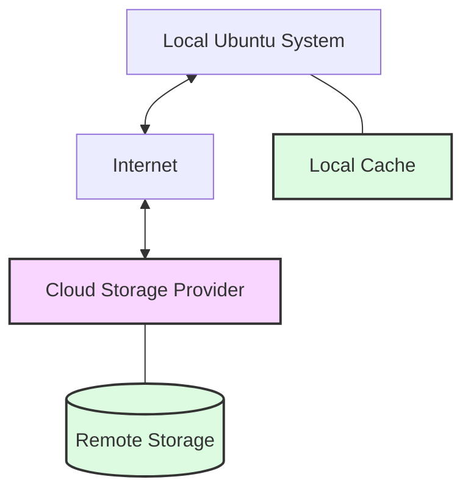

# Ubuntu Cloud Storage

## Introduction

Ubuntu Cloud Storage refers to various methods of storing and accessing data in the cloud while using Ubuntu operating systems. Cloud storage provides a convenient way to store, back up, and share files across multiple devices without needing local physical storage media. For Ubuntu users, several cloud storage options are available, from Ubuntu's own solutions to third-party services that integrate well with the Ubuntu ecosystem.

In this guide, we'll explore how to set up, configure, and use different cloud storage solutions on Ubuntu systems. Whether you're developing applications that need cloud storage capabilities or simply looking to backup your personal files, this guide will help you understand the available options and how to implement them effectively.

## Understanding Cloud Storage in Ubuntu

Before diving into specific implementations, let's understand the basic concepts of cloud storage in the Ubuntu context:

### What is Cloud Storage?

Cloud storage is a service model where data is stored on remote servers accessed from the internet (or "cloud"). It enables users to store, retrieve, and sync files across multiple devices without needing to maintain local copies.



### Types of Cloud Storage for Ubuntu

1. **Ubuntu One** (Historical) - Ubuntu's own cloud storage service (discontinued but worth mentioning for context)
2. **NextCloud** - Open-source cloud storage solution that works well with Ubuntu
3. **Integration with major providers** - Google Drive, Dropbox, OneDrive, etc.
4. **Object Storage** - S3-compatible storage services
5. **SFTP/WebDAV** - Protocol-based storage access

## Setting Up Cloud Storage on Ubuntu

Let's explore how to set up and use different cloud storage solutions on Ubuntu.

### NextCloud on Ubuntu

NextCloud is one of the most popular open-source cloud storage solutions that works excellently with Ubuntu.

#### Installing NextCloud Client

```bash
# Update your system repositories
sudo apt update

# Install NextCloud client
sudo apt install nextcloud-client
```

After installation, you can launch the NextCloud client from your application menu or using the command:

```bash
nextcloud
```

#### Configuring NextCloud Client

Upon first launch, you'll need to configure your NextCloud connection:

1. Enter your NextCloud server address
2. Input your username and password
3. Choose which folders to sync

Here's a code example of how to use the NextCloud client via the command line:

```bash
# Create a new NextCloud configuration
nextcloud --configure

# Manually sync your NextCloud folders
nextcloud --sync
```

### Integrating Google Drive with Ubuntu

While Google doesn't provide an official Linux client, there are several ways to access Google Drive on Ubuntu.

#### Method 1: Using GNOME Online Accounts

Ubuntu's default GNOME desktop provides built-in integration with Google Drive:

1. Open "Settings" > "Online Accounts"
2. Click "Add Account" > "Google"
3. Follow the authentication process
4. Enable "Files" access

Once configured, your Google Drive will appear in the file manager sidebar.

#### Method 2: Using rclone

For command-line enthusiasts, `rclone` provides a powerful way to interact with Google Drive:

```bash
# Install rclone
sudo apt install rclone

# Configure rclone for Google Drive
rclone config

# Create a new remote called "gdrive"
# Select "Google Drive" as the type
# Follow the authentication process

# List files in your Google Drive
rclone ls gdrive:

# Copy a file to Google Drive
rclone copy myfile.txt gdrive:destination/
```

Example output:

```
rclone ls gdrive:
    10487 important_document.pdf
    24836 project_notes.docx
    15724 meeting_minutes.txt
```

## Practical Examples and Use Cases

Let's explore some practical examples of how to use cloud storage in real-world Ubuntu scenarios.

### Example 1: Automatic Backup Script with rclone

Here's how to create a simple shell script that backs up important documents to your cloud storage:

```bash
#!/bin/bash

# Backup script for important documents using rclone
# Save this as ~/scripts/backup_to_cloud.sh

# Define source and destination
SOURCE_DIR="/home/user/important_documents"
DESTINATION="gdrive:backups/$(date +%Y-%m-%d)"

# Create log file
LOG_FILE="/home/user/backup_logs/backup-$(date +%Y-%m-%d).log"
mkdir -p /home/user/backup_logs

# Perform the backup
echo "Starting backup on $(date)" > "$LOG_FILE"
rclone copy "$SOURCE_DIR" "$DESTINATION" --progress >> "$LOG_FILE" 2>&1
echo "Backup completed on $(date)" >> "$LOG_FILE"

# Send notification
notify-send "Backup Completed" "Your files have been backed up to Google Drive"
```

Make the script executable and add it to your crontab for automatic backups:

```bash
# Make executable
chmod +x ~/scripts/backup_to_cloud.sh

# Add to crontab to run every day at 2 AM
crontab -e

# Add this line to your crontab:
0 2 * * * /home/user/scripts/backup_to_cloud.sh
```

### Example 2: Mounting NextCloud as a Local Filesystem

You can mount your NextCloud storage as a local filesystem using `davfs2`:

```bash
# Install davfs2
sudo apt install davfs2

# Add your user to the davfs2 group
sudo usermod -aG davfs2 $USER

# Create a mount point
mkdir ~/nextcloud

# Edit /etc/davfs2/secrets
sudo nano /etc/davfs2/secrets

# Add your NextCloud credentials
https://your-nextcloud-server.com/remote.php/webdav username password

# Mount the NextCloud storage
sudo mount -t davfs https://your-nextcloud-server.com/remote.php/webdav ~/nextcloud

# For automatic mounting, add to /etc/fstab:
# https://your-nextcloud-server.com/remote.php/webdav /home/username/nextcloud davfs user,rw,auto 0 0
```

Now you can access your NextCloud files directly through your local filesystem:

```bash
# List files
ls ~/nextcloud

# Copy a file
cp important_document.pdf ~/nextcloud/

# Edit a file directly
nano ~/nextcloud/notes.txt
```

## Programmatic Access to Cloud Storage

For developers, here's how to access cloud storage programmatically using Python:

### Example: Accessing S3-Compatible Storage with Python

```python
# Install the required package first:
# pip install boto3

import boto3
from botocore.client import Config

# Configure the connection
s3_endpoint = 'https://s3-compatible-service.com'
access_key = 'your_access_key'
secret_key = 'your_secret_key'
bucket_name = 'your-bucket'

# Create a session
session = boto3.session.Session()

# Create an S3 client
s3_client = session.client(
    service_name='s3',
    aws_access_key_id=access_key,
    aws_secret_access_key=secret_key,
    endpoint_url=s3_endpoint,
    config=Config(signature_version='s3v4')
)

# List objects in the bucket
response = s3_client.list_objects_v2(Bucket=bucket_name)

# Display the objects
print("Files in the bucket:")
for obj in response.get('Contents', []):
    print(f"- {obj['Key']} ({obj['Size']} bytes)")

# Upload a file
file_to_upload = 'local_file.txt'
s3_key = 'remote_path/file.txt'
s3_client.upload_file(file_to_upload, bucket_name, s3_key)
print(f"Uploaded {file_to_upload} to {s3_key}")

# Download a file
download_path = 'downloaded_file.txt'
s3_client.download_file(bucket_name, s3_key, download_path)
print(f"Downloaded {s3_key} to {download_path}")
```

## Troubleshooting Common Issues

### Permission Errors

If you encounter permission errors when accessing your cloud storage:

```bash
# Check and fix permissions for your configuration files
sudo chown -R $USER:$USER ~/.config/rclone
chmod 600 ~/.config/rclone/rclone.conf

# For NextCloud mounted with davfs2
sudo chown -R $USER:$USER ~/nextcloud
```

### Connection Issues

If you're having trouble connecting to your cloud storage:

```bash
# Test connectivity to the server
ping your-cloud-server.com

# For rclone, check with verbose logging
rclone lsd gdrive: -vv

# For NextCloud, test WebDAV connection
curl -u username:password https://your-nextcloud-server.com/remote.php/webdav/
```

## Performance Optimization

For better performance with cloud storage on Ubuntu:

```bash
# Configure caching for davfs2
sudo nano /etc/davfs2/davfs2.conf

# Add or modify these lines:
cache_size 256
table_size 4096
delay_upload 10
```

## Summary

In this guide, we've explored various aspects of Ubuntu Cloud Storage:

- Understanding cloud storage concepts in the Ubuntu ecosystem
- Setting up and configuring NextCloud and Google Drive
- Creating automatic backup solutions
- Mounting cloud storage as local filesystems
- Accessing cloud storage programmatically
- Troubleshooting common issues
- Optimizing performance

Cloud storage integration with Ubuntu provides flexible solutions for data backup, sharing, and synchronization, whether you're a casual user or a developer building cloud-integrated applications.

## Additional Resources and Exercises

### Further Learning

- Explore the NextCloud App Ecosystem for extending functionality
- Learn about encryption options for securing cloud-stored data
- Investigate multi-cloud management tools for Ubuntu

### Exercises

1. **Basic Exercise**: Set up rclone to connect to your preferred cloud storage provider and create a simple backup script.

2. **Intermediate Exercise**: Create a Python script that monitors a folder and automatically syncs changes to your cloud storage.

3. **Advanced Exercise**: Build a simple web interface using Flask or Django that allows browsing and managing files on your cloud storage.

By mastering Ubuntu Cloud Storage, you'll have powerful tools for managing your data across devices and applications, enabling more flexible and robust solutions for your projects.