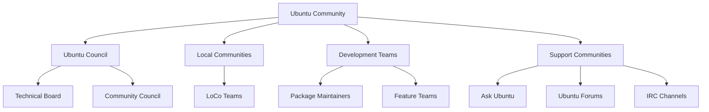

# Ubuntu Community Introduction

## What is the Ubuntu Community?

The Ubuntu community is a diverse global network of users, developers, advocates, and contributors who collectively support, develop, and promote the Ubuntu operating system. Founded on principles of collaboration, inclusion, and the spirit of "Ubuntu" (a Nguni Bantu term meaning "humanity to others"), this community transcends geographical boundaries to unite people with a shared passion for free and open-source software.

## Community Structure and Governance

The Ubuntu community operates with a well-defined structure that balances organization with openness.



### Key Community Bodies

- **Ubuntu Community Council**: The primary governance body that guides the overall direction of the community
- **Ubuntu Technical Board**: Makes technical decisions and manages Ubuntu's technical direction
- **Local Community (LoCo) Teams**: Geographically organized groups that promote Ubuntu locally
- **Ubuntu Teams**: Specialized groups focused on specific aspects of Ubuntu development and advocacy

## Community Principles

The Ubuntu community is guided by a set of core principles outlined in the Ubuntu Code of Conduct:

```bash
$ ubuntu-coc-viewer
```

```
The Ubuntu Code of Conduct:
- Be respectful
- Be considerate
- Be collaborative
- When you disagree, consult others
- When you are unsure, ask for help
- Step down considerately
```

These principles create a welcoming environment for contributors of all skill levels and backgrounds.

## Getting Involved as a Beginner

### First Steps

1. **Install Ubuntu**: Experience the operating system firsthand
2. **Explore Resources**: Familiarize yourself with the official documentation
3. **Join Community Channels**: Connect with other Ubuntu users and contributors

### Communication Channels

The Ubuntu community uses various platforms for communication:

- **Discourse**: [Ubuntu Discourse](https://discourse.ubuntu.com) (main discussion forum)
- **IRC**: Freenode channels like `#ubuntu` and `#ubuntu-devel`
- **Mailing Lists**: Topic-specific email discussions
- **Ask Ubuntu**: Q&A site for Ubuntu users

**Example**: Connecting to the Ubuntu IRC channel:

```bash
$ sudo apt install hexchat
$ # Open HexChat and configure it
$ # Join #ubuntu channel
```

## Contribution Paths

The Ubuntu community welcomes contributions in many forms, not just coding:

### Non-Technical Contributions

- **Documentation**: Improving guides and tutorials
- **Translation**: Making Ubuntu accessible in different languages
- **Support**: Helping other users solve problems
- **Advocacy**: Promoting Ubuntu in your community

### Technical Contributions

- **Bug reporting**: Identifying and documenting issues
- **Bug triaging**: Helping to organize and prioritize bugs
- **Testing**: Verifying fixes and new features
- **Development**: Writing code or packaging software

### Example: Filing Your First Bug Report

```bash
$ ubuntu-bug firefox
```

This command launches a tool that collects relevant system information and guides you through submitting a bug report about Firefox.

## The Ubuntu Release Cycle

Understanding the Ubuntu release cycle helps you participate more effectively in the community:

- **Regular releases**: Every 6 months (April and October)
- **LTS (Long-Term Support) releases**: Every 2 years, supported for 5 years
- **Development phases**: Planning, Feature Development, Feature Freeze, Beta, Release Candidate, Final Release

Each phase offers different opportunities for community involvement.

## Ubuntu Community Events

The community organizes various events to foster collaboration and learning:

- **Ubuntu Developer Summits**: Planning future development
- **Ubuntu Online Summit**: Virtual conferences
- **Local Ubuntu Hours**: Informal meetups organized by LoCo teams
- **Global Jam**: Worldwide contribution events

## Practical Example: Joining Your First Ubuntu Hour

Here's how you might participate in a local Ubuntu community event:

1. Find your local community team on the [LoCo Team Directory](https://loco.ubuntu.com/teams/)
2. Check the team's upcoming events calendar
3. Prepare by installing Ubuntu and bringing questions or experiences to share
4. Attend and introduce yourself as a new community member

```bash
$ # Example command to find nearby Ubuntu events
$ ubuntu-community-events --near="your-location"
```

## Ubuntu Membership

As you become more involved, you might consider applying for official Ubuntu Membership:

- Requires sustained and significant contribution
- Recognized with an `@ubuntu.com` email address
- Voting rights in community elections
- Demonstrates commitment to the Ubuntu project

## Summary

The Ubuntu community represents one of the largest and most active open-source communities in the world. Built on principles of collaboration, respect, and shared governance, it offers numerous paths for contribution regardless of your technical skill level.

As a beginner, the most important first step is to connect with other community members, find an area that matches your interests and skills, and start with small contributions. Remember that every contribution, whether it's helping a new user, translating documentation, or fixing a bug, strengthens the community and improves Ubuntu for everyone.

## Additional Resources

- [Ubuntu Community Hub](https://discourse.ubuntu.com)
- [Ubuntu Wiki](https://wiki.ubuntu.com)
- [Ubuntu Documentation](https://help.ubuntu.com)
- [Ask Ubuntu](https://askubuntu.com)

## Exercises for Beginners

1. Install Ubuntu in a virtual machine and explore the default applications
2. Create an account on the Ubuntu Discourse and introduce yourself
3. Find and join your local Ubuntu community team
4. Help answer a question on Ask Ubuntu or the Ubuntu Forums
5. Attend an Ubuntu Hour or online community event