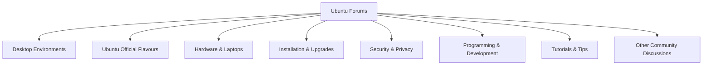

# Ubuntu Forums

## Introduction

Ubuntu Forums is one of the most valuable resources in the Ubuntu community ecosystem. It serves as a centralized platform where users of all skill levels can ask questions, share knowledge, troubleshoot problems, and connect with other Ubuntu enthusiasts. Whether you're a complete beginner facing your first installation issues or an experienced user tackling advanced configurations, Ubuntu Forums provides a structured environment for community-based support.

Launched in 2004 alongside the first Ubuntu release, the forums have grown into a massive knowledge repository with millions of threads covering virtually every aspect of the Ubuntu operating system and its derivatives. This guide will walk you through how to effectively use Ubuntu Forums, participate in the community, and contribute to this collaborative support ecosystem.

## Why Use Ubuntu Forums?

Before diving into the mechanics of using the forums, let's understand why they remain relevant even in an era of Stack Overflow, Reddit, and Discord:

- **Persistent Knowledge Base**: Unlike chat-based help, forum threads remain searchable for years, creating a vast knowledge repository.
- **Structured Problem Solving**: The forum format allows for detailed problem descriptions, troubleshooting steps, and solution verification.
- **Ubuntu-Specific Focus**: While general Linux forums exist, Ubuntu Forums provides help tailored specifically to Ubuntu and its official flavors.
- **Community Recognition**: Active participation builds reputation through the forum's karma system.
- **Direct Developer Interaction**: Sometimes Ubuntu developers themselves respond to issues, particularly in development release sections.

## Getting Started with Ubuntu Forums

### Creating an Account

To fully participate in Ubuntu Forums, you'll need to create an account:

1. Visit [Ubuntu Forums](https://ubuntuforums.org/)
2. Click on "Register" in the upper right corner
3. Complete the registration form with a username, password, and valid email
4. Read and accept the forum rules
5. Verify your email address through the confirmation link
6. Set up your profile with relevant information (optional but recommended)

### Navigating the Forum Structure

Ubuntu Forums is organized into several main sections:



Each main section contains multiple subsections for specific topics. For example, the "Installation & Upgrades" section includes dedicated areas for different installation methods, upgrade issues, and version-specific questions.

### Forum Etiquette and Guidelines

Before posting, familiarize yourself with these essential forum guidelines:

- **Search First**: Many questions have already been answered. Use the search function before creating a new thread.
- **Post in the Right Section**: Place your question in the most appropriate subforum for faster and more relevant responses.
- **Descriptive Titles**: Use clear, specific titles that summarize your issue rather than vague ones like "Help!" or "Not working."
- **Complete Information**: Include your Ubuntu version, hardware specifications, and detailed problem descriptions.
- **Format Code Properly**: Use the `[code]` tags for terminal output, error messages, and configuration files.
- **Be Patient**: Allow time for responses before bumping your thread.
- **Mark Solved Threads**: Once your issue is resolved, mark the thread as "Solved" and summarize the solution.

## Effective Forum Searching

The most efficient way to get help is often finding existing solutions. Here's how to search effectively:

### Basic Search Techniques

```
error message "exact phrase" username:person tag:beginner
```

The search box supports several advanced operators:
- **Quotation marks** for exact phrases
- **username:** to find posts by specific users
- **tag:** for posts with certain tags

### Advanced Search Options

For more precise searches, use the Advanced Search feature:
- Filter by date ranges
- Search specific subforums
- Look for threads with specific reply counts
- Search only in thread titles

### Using External Search Engines

Sometimes Google or other search engines can find forum posts more effectively:

```
site:ubuntuforums.org your search terms here
```

This limits results to Ubuntu Forums while leveraging Google's search capabilities.

## Creating Effective Help Requests

When you need to create a new thread asking for help, follow these best practices:

### Preparing Information

Before posting, gather relevant information about your system:

```bash
# Ubuntu version info
lsb_release -a

# Kernel version
uname -a

# Hardware information
sudo lshw -short

# Graphics card details
lspci | grep -i vga
```

### Structuring Your Post

An effective help request should include:

1. **Clear Title**: Summarize the specific issue concisely
2. **System Information**: Ubuntu version, hardware details
3. **Problem Description**: What you're trying to do, what's happening instead
4. **Steps to Reproduce**: Exact sequence that triggers the issue
5. **Error Messages**: Complete error text, properly formatted
6. **What You've Tried**: Previous troubleshooting attempts
7. **Relevant Logs**: Output from system logs (with sensitive information removed)

### Example Help Request

Here's a template for an effective forum post:

```
Title: WiFi disconnects randomly on Dell XPS 13 with Ubuntu 22.04

Ubuntu Version: 22.04 LTS
Laptop: Dell XPS 13 9310
WiFi Card: Intel AX201

Problem:
My WiFi connection randomly disconnects every 15-20 minutes. The network icon shows as connected, but no data transfers until I manually disconnect and reconnect.

Steps to reproduce:
1. Connect to any WiFi network
2. Use the internet normally
3. After about 15-20 minutes, all data transfer stops
4. Disconnecting and reconnecting fixes temporarily

Error messages:
In syslog, I see the following when disconnections happen:
[paste error messages here]

What I've tried:
- Rebooting the router
- Updating the kernel to 5.15.0-60
- Disabling power management with:
  sudo iwconfig wlp2s0 power off

Any suggestions would be appreciated!
```

## Participating in Discussions

Ubuntu Forums isn't just for asking questions—it's a community discussion platform. Here are ways to contribute:

### Answering Questions

When helping others:
- Provide clear, step-by-step instructions
- Explain why solutions work, not just what to do
- Use code formatting for commands and output
- Verify the problem is solved with the original poster

### Thread Etiquette

When participating in discussions:
- Stay on topic within threads
- Be respectful of different skill levels
- Avoid "me too" posts that don't add value
- Use the "Thanks" button instead of posting just to say thanks

### Building Reputation

Active, helpful participation builds your forum reputation:
- Karma points increase with quality contributions
- More karma unlocks additional forum privileges
- Special badges recognize specific contributions or milestones

## Advanced Forum Features

As you become more familiar with Ubuntu Forums, explore these advanced features:

### Private Messaging

For discussions that aren't appropriate for public threads:
- Click a username and select "Send Private Message"
- Use sparingly for specific follow-ups, not general help

### Thread Subscriptions

To follow discussions:
- Click "Thread Tools" and select "Subscribe to Thread"
- Choose email notification options or just track in your control panel

### User Control Panel

Manage your forum experience through your User CP:
- Track subscribed threads
- Edit signature and profile information
- Manage notification preferences

## Special Forum Sections

Several specialized sections serve unique purposes:

### Ubuntu Development Release

Dedicated to testing and reporting issues with pre-release Ubuntu versions:
- Structured bug reporting
- Regular updates from development team
- Higher level of technical discussion

### Tutorials & Tips

User-contributed guides on various Ubuntu topics:
- Installation walkthroughs
- Software configuration guides
- System optimization tips

### Community Cafe

For off-topic discussions among community members:
- Technology news discussions
- Linux philosophy conversations
- Community social interactions

## Troubleshooting Common Forum Issues

Even the forum itself might have issues sometimes:

### Account Problems

If experiencing login issues:
- Clear browser cookies and cache
- Use the password reset function
- Contact forum administrators through the "Contact Us" link

### Posting Limitations

New accounts have some posting restrictions:
- Cannot post links until reaching minimum post count
- May need moderator approval for first few posts
- Cannot upload attachments immediately

### Missing Posts or Threads

If content seems to disappear:
- Check if moved to a more appropriate section
- Verify if it violated forum guidelines (check your messages)
- Search using exact title text

## Contributing to Forum Improvement

Long-term forum users can contribute to improving the platform:

### Reporting Forum Issues

For technical problems with the forum itself:
- Use the "Forum Feedback" section
- Provide browser and OS details
- Describe steps to reproduce issues

### Suggesting New Features

Ideas for forum improvements:
- Post in the "Forum Suggestions" area
- Explain benefits to the community
- Be realistic about implementation complexity

### Volunteer Opportunities

As you gain experience, consider:
- Applying to become a forum moderator
- Creating tutorials for common questions
- Organizing community initiatives

## Integrating with Other Ubuntu Resources

Ubuntu Forums works best when used alongside other community resources:

### Ask Ubuntu Integration

Stack Exchange's Ubuntu-focused site complements the forums:
- Forums better for discussions and complex issues
- Ask Ubuntu better for concise Q&A
- Cross-reference between platforms when helpful

### Launchpad Bug Tracking

For confirmed bugs:
- Forums help identify issues
- Launchpad tracks official bug reports
- Link to Launchpad bugs in forum discussions when relevant

### Ubuntu Wiki Connection

The community documentation system:
- Forums discuss wiki content
- Wiki provides canonical procedures
- Consider updating wiki based on forum solutions

## Summary

Ubuntu Forums remains an essential pillar of the Ubuntu community support structure, providing:

- A searchable knowledge base spanning Ubuntu's entire history
- A platform for getting help with specific issues
- A community space for Ubuntu users to connect
- A venue for contributing back to the ecosystem

By following the guidelines in this guide, you'll be able to effectively use Ubuntu Forums to solve your own issues and help others. Remember that forums thrive on community participation—every question you answer helps not just one person but potentially thousands of future users who find that thread through searches.

## Additional Resources

To further your Ubuntu Forums experience:

- [Ubuntu Forums Code of Conduct](https://ubuntuforums.org/index.php?page=policy)
- [Ubuntu Community Help Wiki](https://help.ubuntu.com/community/)
- [Ask Ubuntu Stack Exchange](https://askubuntu.com/)
- [Ubuntu Discourse](https://discourse.ubuntu.com/)

## Practice Exercises

1. **Search Challenge**: Try to find three different solutions for enabling proprietary graphics drivers using the forum search.
2. **Profile Setup**: Complete your forum profile with relevant system information and areas of expertise.
3. **First Contribution**: Find an unanswered question that matches your knowledge and provide a helpful response.
4. **Tutorial Review**: Find a tutorial in the Tips & Tutorials section, follow it, and provide feedback.
5. **Community Engagement**: Participate in a discussion thread in the Community Cafe section to connect with other users.

By actively engaging with Ubuntu Forums, you become part of the broader Ubuntu community that makes this Linux distribution accessible and user-friendly for people around the world.