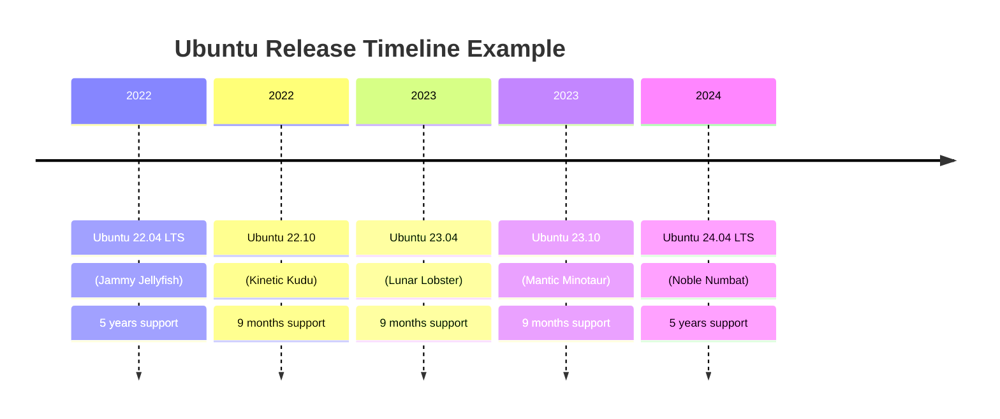
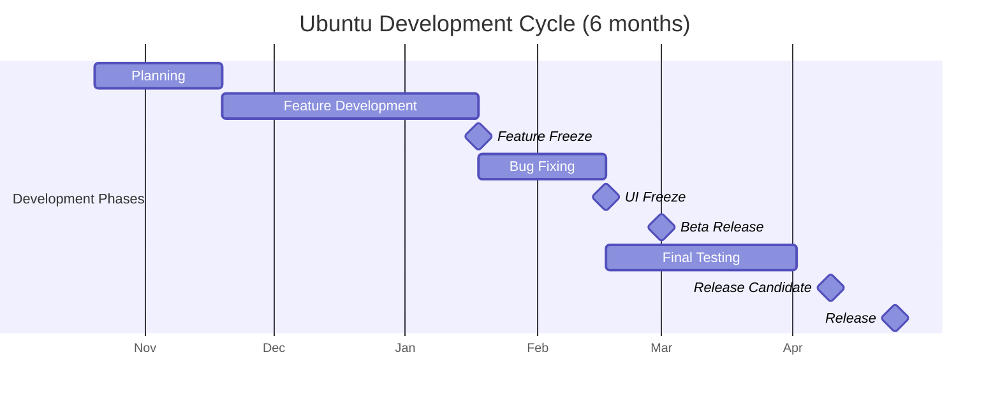

# Ubuntu Release Cycle

## Introduction

The Ubuntu release cycle is a fundamental concept to understand when working with Ubuntu Linux. Ubuntu follows a time-based release schedule that provides both stability for production environments and access to cutting-edge features for developers. In this guide, we'll explore how Ubuntu versions are released, named, and supported, which will help you make informed decisions about which Ubuntu version to use for your projects.

## Ubuntu Version Numbering System

Ubuntu follows a straightforward version numbering system based on the year and month of release.

For example:
- Ubuntu 22.04 was released in April (04) 2022 (22)
- Ubuntu 23.10 was released in October (10) 2023 (23)

This makes it easy to determine how recent an Ubuntu version is just by looking at its version number.

## Regular Releases vs. LTS Releases

Ubuntu has two types of releases:

### Regular Releases

- Released every 6 months (April and October)
- Supported for 9 months with updates and security patches
- Provide the latest features and software packages
- Best for developers who need the newest tools
- Example: Ubuntu 23.10 (Mantic Minotaur)

### Long Term Support (LTS) Releases

- Released every 2 years (even-numbered years in April)
- Supported for 5 years (or up to 10 years with Ubuntu Pro)
- Provide stability and long-term security updates
- Best for production environments, servers, and mission-critical applications
- Example: Ubuntu 22.04 LTS (Jammy Jellyfish)



## Ubuntu Naming Convention

Each Ubuntu release has both a version number and a code name. The code names follow an alliterative pattern:
- An adjective and an animal
- Both starting with the same letter
- Letters progress alphabetically with each release

For example:
- 22.04 LTS: Jammy Jellyfish
- 22.10: Kinetic Kudu
- 23.04: Lunar Lobster
- 23.10: Mantic Minotaur
- 24.04 LTS: Noble Numbat

## Ubuntu Development Cycle

Ubuntu follows a structured development cycle for each release:

### Development Phases

1. **Planning Phase**
   - Begins soon after the previous release
   - Ubuntu developers define goals and features for the upcoming release
   - Package syncing from Debian begins

2. **Feature Development Phase**
   - New features are developed and integrated
   - Alpha releases may be published for testing

3. **Feature Freeze**
   - No new features are added after this point
   - Focus shifts to bug fixing and stability improvements

4. **UI Freeze**
   - User interface changes are frozen
   - Documentation writers and translators can begin their work

5. **Beta Release**
   - A more stable testing version is released
   - Suitable for wider testing by advanced users

6. **Release Candidate**
   - Very close to the final release
   - Last-minute bug fixes only

7. **Final Release**
   - The stable version is officially released

Here's a visualization of a typical 6-month development cycle:



## Checking Your Ubuntu Version

To check which version of Ubuntu you're running, you can use the following commands in your terminal:

```bash
lsb_release -a
```

Example output:

```
No LSB modules are available.
Distributor ID: Ubuntu
Description:    Ubuntu 22.04.3 LTS
Release:        22.04
Codename:       jammy
```

Alternatively, you can use:

```bash
cat /etc/os-release
```

Example output:

```
PRETTY_NAME="Ubuntu 22.04.3 LTS"
NAME="Ubuntu"
VERSION_ID="22.04"
VERSION="22.04.3 LTS (Jammy Jellyfish)"
VERSION_CODENAME=jammy
ID=ubuntu
ID_LIKE=debian
HOME_URL="https://www.ubuntu.com/"
SUPPORT_URL="https://help.ubuntu.com/"
BUG_REPORT_URL="https://bugs.launchpad.net/ubuntu/"
PRIVACY_POLICY_URL="https://www.ubuntu.com/legal/terms-and-policies/privacy-policy"
UBUNTU_CODENAME=jammy
```

## Upgrading Between Ubuntu Versions

Ubuntu provides tools to upgrade from one version to another. The upgrade paths depend on whether you're using regular or LTS releases:

### For Desktop Users:

- Regular release users can upgrade to the next regular release every 6 months
- LTS users can either:
  - Upgrade to the next LTS release every 2 years, or
  - Upgrade to the next regular release

To upgrade your system, you can use:

```bash
sudo do-release-upgrade
```

Or via the graphical Software & Updates tool:

1. Open "Software & Updates"
2. Go to the "Updates" tab
3. Set "Notify me of a new Ubuntu version" to either:
   - "For long-term support versions" (LTS only)
   - "For any new version" (every 6 months)

## Choosing the Right Ubuntu Version

### When to Use LTS Releases:

- For production servers
- For enterprise deployment
- When you need long-term stability
- When you don't want frequent major system upgrades
- For hardware that may not support newer kernels

### When to Use Regular Releases:

- When you need newer software versions
- For development work requiring recent libraries
- To test new features
- On modern hardware that benefits from newer kernels
- When you're comfortable with more frequent system upgrades

## Working with Ubuntu Repositories

Ubuntu organizes its software packages into different repositories:

- **Main**: Officially supported software
- **Universe**: Community-maintained software
- **Restricted**: Proprietary drivers
- **Multiverse**: Software with legal or copyright restrictions

Additionally, during the development cycle, these repositories are used:

- **Proposed**: Packages being tested before being moved to updates
- **Backports**: Newer versions of packages backported to older Ubuntu versions

To check which repositories are enabled on your system:

```bash
grep -v '^#\|^$' /etc/apt/sources.list
```

## Practical Example: Setting Up a Development Environment

When setting up a development environment, you need to decide which Ubuntu version to use. Let's consider a practical example:

### Scenario: Web Development Stack

For a web development environment with Node.js, PostgreSQL, and Docker, you might choose:

**Option 1: Ubuntu 22.04 LTS**
- Pros: Stable for 5 years, less frequent updates needed
- Cons: Might need PPAs or manual installation for newer software versions

**Option 2: Ubuntu 23.10 (Regular Release)**
- Pros: More recent versions of packages available by default
- Cons: Need to upgrade in 9 months, might be less stable

**Implementation Example:**

For Ubuntu 22.04 LTS, to get newer Node.js:

```bash
# Add NodeSource repository
curl -fsSL https://deb.nodesource.com/setup_20.x | sudo -E bash -

# Install Node.js
sudo apt install -y nodejs

# Verify installation
node --version
```

Output:
```
v20.x.x
```

## Summary

Understanding the Ubuntu release cycle is crucial for effectively planning your Ubuntu-based projects:

- **Version numbers** indicate the release year and month (YY.MM)
- **LTS releases** come every 2 years with 5 years of support
- **Regular releases** come every 6 months with 9 months of support
- **Choose LTS** for stability and long-term support
- **Choose regular releases** for the latest features and packages

By understanding these concepts, you can make informed decisions about which Ubuntu version best suits your needs, whether you're setting up a production server, a development environment, or a personal workstation.

## Additional Resources

- [Ubuntu Release Wiki](https://wiki.ubuntu.com/Releases)
- [Ubuntu LTS Documentation](https://ubuntu.com/blog/what-is-an-ubuntu-lts-release)
- [Ubuntu Upgrade Guide](https://help.ubuntu.com/community/UpgradeNotes)

## Exercises

1. Check which version of Ubuntu you're currently running using the terminal commands provided in this guide.
2. Research the current Ubuntu releases and identify which ones are still supported and for how long.
3. Create a decision matrix for your next project, listing the pros and cons of using an LTS versus a regular release.
4. Practice using a virtual machine to test an upgrade from one Ubuntu version to another.