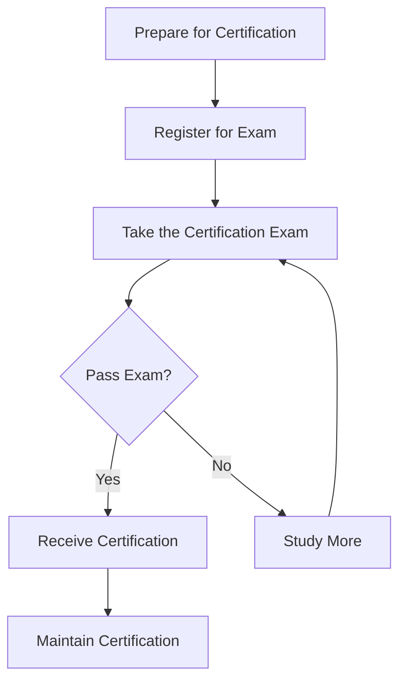

# Ubuntu Certification

## Introduction

Ubuntu certification is a professional credential system that validates your skills and knowledge in Ubuntu Linux systems. As part of the broader Ubuntu community, certification provides formal recognition of your expertise and can open doors to career opportunities in the Linux ecosystem. Whether you're a beginner looking to demonstrate your foundational knowledge or an experienced administrator aiming to validate advanced skills, Ubuntu certifications offer a structured path for professional development.

## Types of Ubuntu Certifications

Ubuntu offers several certification programs tailored to different skill levels and specializations:

### Ubuntu Certified Professional (UCP)

This entry-level certification validates your ability to install, configure, and maintain Ubuntu systems for basic server and desktop environments.

### Ubuntu Certified Engineer (UCE)

A more advanced certification focused on system administration, security implementation, and network configuration on Ubuntu systems.

### Ubuntu Certified DevOps Engineer (UCDOE)

Focuses on implementing Ubuntu in DevOps environments, containerization, cloud deployment, and automation.

## Certification Process

The path to becoming Ubuntu certified involves several key steps:



### Step 1: Preparation

Before seeking certification, you'll need to build skills through:

- Self-study using official Ubuntu documentation
- Hands-on practice with Ubuntu systems
- Community involvement and forum participation
- Training courses (optional but recommended)

### Step 2: Exam Registration

Visit the [Canonical Certification Portal](https://canonical.com) to register for your desired exam. You'll need to:

1. Create an account
2. Select your certification track
3. Choose an exam date and location (or remote proctoring)
4. Pay the examination fee

### Step 3: Taking the Exam

Most Ubuntu certification exams include:

- Multiple-choice questions
- Practical lab exercises
- Real-world problem-solving scenarios

Let's look at a sample exam question:

**Sample Question:**

*Your Ubuntu server is experiencing high CPU usage but you're not sure which process is causing it. Write the command to identify the top CPU-consuming processes.*

**Solution:**
```bash
top -o %CPU
```

Or alternatively:
```bash
ps aux --sort=-%cpu | head -n 10
```

### Step 4: Certification Maintenance

Ubuntu certifications typically remain valid for 2-3 years. To maintain your certification:

- Complete continuing education units (CEUs)
- Participate in community events
- Take update exams when major Ubuntu versions are released

## Benefits of Ubuntu Certification

Getting certified in Ubuntu offers numerous advantages:

1. **Professional Recognition**: Formal validation of your Ubuntu expertise
2. **Career Advancement**: Many employers specifically look for certified Ubuntu professionals
3. **Community Standing**: Recognition within the Ubuntu community
4. **Practical Knowledge**: The certification process builds real-world skills
5. **Networking Opportunities**: Connect with other certified professionals

## Practical Examples

### Example 1: Setting Up an Ubuntu Server

As a certified Ubuntu professional, you might need to provision a new server. Here's how you might approach it:

```bash
# Update package repositories
sudo apt update

# Install necessary server packages
sudo apt install apache2 mysql-server php

# Configure firewall for web traffic
sudo ufw allow 'Apache Full'
sudo ufw enable

# Check service status
systemctl status apache2
```

### Example 2: Troubleshooting System Issues

Certification exams often test your ability to diagnose and fix problems:

```bash
# Check system logs for errors
sudo journalctl -p err

# Inspect disk space usage
df -h

# Monitor resource utilization in real-time
top

# Check network connectivity
ping -c 4 ubuntu.com
```

### Example 3: Automating Ubuntu Tasks

Advanced certifications test your ability to automate system administration:

```bash
#!/bin/bash
# Simple backup script that might be covered in certification

# Set backup directory
BACKUP_DIR="/var/backups/$(date +%Y%m%d)"

# Create backup directory if it doesn't exist
mkdir -p $BACKUP_DIR

# Backup important configuration files
cp -r /etc $BACKUP_DIR/etc
cp -r /home $BACKUP_DIR/home

# Compress the backup
tar -czf $BACKUP_DIR.tar.gz $BACKUP_DIR

# Output success message
echo "Backup completed successfully at $(date)"
```

## Community Resources

The Ubuntu community provides extensive resources to help you prepare for certification:

- **Ubuntu Forums**: Connect with others studying for certification
- **Documentation**: The official Ubuntu documentation is comprehensive
- **IRC Channels**: Real-time help from community members
- **Local Ubuntu Meetups**: In-person learning opportunities

## Practice Exercises

To help you prepare for certification, try these exercises:

1. Install Ubuntu Server on a virtual machine without a GUI
2. Configure a basic web server with Apache, MySQL, and PHP
3. Set up user accounts with appropriate permissions
4. Configure SSH key-based authentication
5. Create a simple bash script to automate system updates

## Summary

Ubuntu certification provides formal recognition of your skills and expertise with Ubuntu systems. Whether you're looking to advance your career, contribute more effectively to the community, or simply validate your knowledge, certification offers a structured path to achievement.

The journey to certification involves preparation, hands-on practice, community engagement, and formal examination. By investing in Ubuntu certification, you're not only improving your professional prospects but also contributing to the broader Ubuntu ecosystem.

## Additional Resources

- Official Ubuntu Documentation
- Canonical Training Programs
- Ubuntu Community Forums
- Linux Professional Institute (complementary certifications)
- Practice exam repositories on GitHub

Remember that certification is just one part of your Ubuntu journey—continued learning and community participation are equally important for long-term success in the Ubuntu ecosystem.