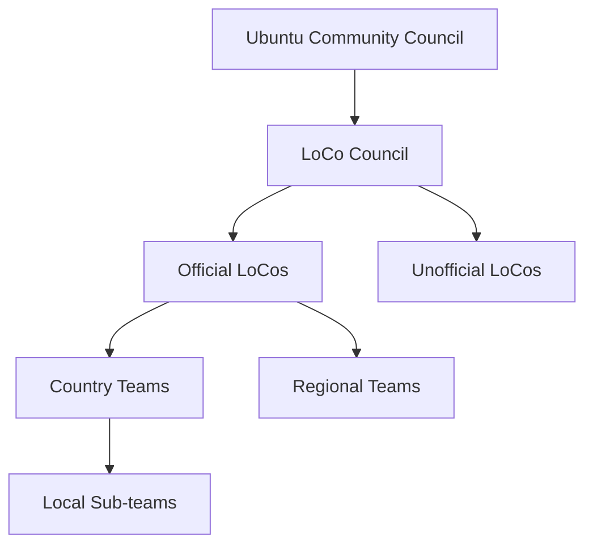

# Ubuntu Local Communities (LoCos)

## Introduction

Ubuntu Local Communities (LoCos) are grassroots groups of Ubuntu users, developers, and enthusiasts who come together to support and promote Ubuntu in their geographical regions. These communities form the backbone of the global Ubuntu ecosystem, bringing the spirit of Ubuntu—"humanity towards others"—to life in local contexts.

LoCos provide a way for people interested in Ubuntu to connect with others nearby, collaborate on projects, share knowledge, and help introduce new users to the Ubuntu operating system and philosophy. They represent Ubuntu's commitment to community-building and the idea that technology should be accessible to everyone, regardless of location or language.

## What Are LoCos?

Ubuntu Local Communities are:

- **Geographically focused**: Organized around specific regions, countries, states, or cities
- **Volunteer-driven**: Run by passionate community members rather than Canonical employees
- **Semi-autonomous**: While following Ubuntu's Code of Conduct and guidelines, each LoCo has freedom to organize activities that best suit their local context
- **Inclusive**: Open to anyone interested in Ubuntu, regardless of technical skill level

## Structure of LoCos

Most Ubuntu Local Communities follow a similar organizational structure:



- **Ubuntu Community Council**: Provides overall governance for the Ubuntu community
- **LoCo Council**: Specifically oversees LoCo teams, verifies official status, and provides guidance
- **Official vs. Unofficial LoCos**: Teams can apply for official status after demonstrating sustained activity and adherence to Ubuntu principles
- **Geographical Divisions**: Teams typically organize at country level with possible sub-teams for regions or cities

## Activities of LoCos

Ubuntu Local Communities engage in various activities to support and promote Ubuntu:

### Install Festivals

LoCos often organize events where people can bring their computers to get Ubuntu installed with help from experienced users. These events serve as perfect opportunities for newcomers to get started with Ubuntu.

Example of an install festival announcement:

```bash
## Ubuntu Install Festival
## Saturday, April 15, 2023
## Central Library, Meeting Room B
## 10:00 AM - 4:00 PM

# What to bring:
# - Your computer (laptop or desktop)
# - Power adapter
# - External backup drive (recommended)
# - A positive attitude and curiosity!

# We'll provide:
# - Ubuntu installation media
# - Technical assistance
# - Refreshments
# - Community and friendship
```

### Release Parties

When a new version of Ubuntu is released (every six months), LoCos celebrate with release parties. These events often include:

- Demonstrations of new features
- Installation help
- Talks about what's changed
- Social activities

### Bug Jams

Bug jams are collaborative events where members work together to identify, report, and sometimes fix bugs in Ubuntu software. This is a great way for beginners to learn about Ubuntu development processes.

```bash
# Basic Bug Reporting Workflow

ubuntu-bug packagename  # Starts the bug reporting process for a specific package

# Example for reporting a bug in Firefox
ubuntu-bug firefox

# The tool will automatically collect relevant system information
# and guide you through submitting the report to Launchpad
```

### Translation Sprints

Many LoCos focus on translating Ubuntu and its documentation into local languages, making the operating system more accessible to non-English speakers.

### Advocacy and Outreach

Teams represent Ubuntu at local technology events, in schools, and in community spaces to educate people about open source software and Ubuntu specifically.

## Starting or Joining a LoCo

### Finding an Existing LoCo

To find a LoCo in your area:

1. Visit the Ubuntu LoCo Team Directory at https://loco.ubuntu.com/teams/
2. Search for teams in your country or region
3. Check the team's status (official or unofficial) and activity level

### Joining a LoCo

Most LoCos have multiple communication channels:

- **Mailing Lists**: Often the primary communication method
- **IRC Channels**: Real-time chat on Libera.Chat
- **Forums**: Discussion boards on the Ubuntu Forums
- **Social Media**: Many teams maintain Twitter/X, Facebook, or Mastodon accounts
- **Matrix/Element**: Some teams use these newer chat platforms

Example of joining a mailing list:

```bash
# To subscribe to a LoCo mailing list (example for Ubuntu US California)
# Visit: https://lists.ubuntu.com/mailman/listinfo/ubuntu-us-ca
# Or send an email with subject "subscribe" to:
ubuntu-us-ca-request@lists.ubuntu.com
```

### Starting a New LoCo

If no LoCo exists in your area, you can start one by:

1. Checking the [LoCo Directory](https://loco.ubuntu.com/teams/) to confirm no team exists
2. Setting up basic infrastructure:
   - Mailing list
   - IRC channel
   - Wiki page on the Ubuntu Wiki
3. Registering your team on the LoCo Directory
4. Gathering an initial group of interested Ubuntu users
5. Planning and hosting your first event

## Tools for LoCos

LoCo teams have access to various resources:

### LoCo Directory

The [LoCo Directory](https://loco.ubuntu.com/) is a web application that helps teams organize and promote events, track membership, and share resources.

```javascript
// Example of event data structure in LoCo Directory API
{
  "name": "Ubuntu 23.04 Release Party",
  "venue": "City Library",
  "team": "ubuntu-us-ca",
  "date": "2023-04-22T14:00:00Z",
  "description": "Join us to celebrate the release of Ubuntu 23.04 Lunar Lobster!",
  "attendees": [
    "user1",
    "user2",
    "user3"
  ],
  "tags": ["release", "party", "lunar-lobster"]
}
```

### Conference Pack

Official LoCos can request a conference pack for events, which includes:

- Ubuntu installation media
- Promotional materials
- Stickers and badges
- Tablecloths and banners

### Wiki Pages

Each LoCo typically maintains a wiki page on the Ubuntu Wiki that serves as their online home base with information about:

- Team contacts
- Meeting schedules
- Past and upcoming events
- Projects and initiatives

## LoCo Council and Verification

The LoCo Council oversees all Ubuntu Local Communities and manages the verification process for official status.

### Benefits of Official Status

- Access to resources from Canonical
- Conference packs for events
- Ubuntu domain (e.g., ubuntu-us.org)
- Listing as an official team
- Mentorship from the LoCo Council

### Verification Requirements

To become an official LoCo, teams must demonstrate:

- Sustained activity for at least 6 months
- Regular meetings and events
- Good standing in the Ubuntu community
- Adherence to the Ubuntu Code of Conduct
- Healthy team governance
- Diverse activities supporting Ubuntu

## Case Study: Ubuntu UK LoCo

The Ubuntu UK LoCo is one of the most active and successful teams:

### Key Activities

- **Ubuntu Podcast**: Ran for many years, providing news and information about Ubuntu
- **OggCamp**: An annual unconference focused on open source
- **Release Parties**: Held throughout the UK for each Ubuntu release
- **Coordination with Linux User Groups**: Partners with existing LUGs for broader reach

### Success Factors

- Strong leadership and succession planning
- Diverse activities appealing to different interests
- Good communication channels
- Regional sub-teams for local coordination
- Consistent branding and visibility

## Practical Example: Organizing a LoCo Meetup

Here's a step-by-step guide to organizing a basic LoCo meetup:

1. **Choose a format**:
   - Casual social gathering (Ubuntu Hour)
   - Technical presentation
   - Hands-on workshop
   - Install festival

2. **Find a venue**:
   - Libraries often offer free meeting spaces
   - Local tech companies may sponsor space
   - Coffee shops for smaller gatherings
   - Universities for student outreach

3. **Promote the event**:
   - Add to the LoCo Directory
   - Send announcement to mailing list
   - Post on social media
   - Create a event in local tech community calendars

4. **Prepare materials**:
   - Ubuntu installation media
   - Presentation slides if needed
   - Sign-in sheet for new members
   - Name tags
   - Information flyers about Ubuntu

5. **Run the meetup**:
   - Welcome newcomers
   - Facilitate introductions
   - Follow planned agenda
   - Leave time for networking
   - Document with photos (with permission)

6. **Follow up**:
   - Send thank you message to attendees
   - Share summary and photos on team channels
   - Gather feedback for next event
   - Add new members to communication channels

## Code Example: LoCo Team Event Notifier

Here's a simple Python script a LoCo might use to send automatic reminders about upcoming events:

```python
#!/usr/bin/env python3
# loco_reminder.py - A simple script to send reminders about LoCo events

import datetime
import smtplib
import json
from email.mime.text import MIMEText

# Load events from JSON file
with open('events.json', 'r') as f:
    events = json.load(f)

# Load subscriber list
with open('subscribers.txt', 'r') as f:
    subscribers = [line.strip() for line in f]

# Email configuration
SMTP_SERVER = 'smtp.example.com'
SMTP_PORT = 587
SMTP_USER = 'ubuntu-loco@example.com'
SMTP_PASS = 'your_password'  # Better to use environment variables for this

# Check for upcoming events (within next 7 days)
today = datetime.datetime.now()
seven_days = today + datetime.timedelta(days=7)

upcoming_events = []
for event in events:
    event_date = datetime.datetime.fromisoformat(event['date'])
    if today <= event_date <= seven_days:
        upcoming_events.append(event)

# If there are upcoming events, send reminder
if upcoming_events:
    # Connect to SMTP server
    server = smtplib.SMTP(SMTP_SERVER, SMTP_PORT)
    server.starttls()
    server.login(SMTP_USER, SMTP_PASS)
    
    # Create message
    message = "Upcoming Ubuntu LoCo Events:"
    for event in upcoming_events:
        message += f"Event: {event['name']}"
        message += f"Date: {event['date']}"
        message += f"Location: {event['venue']}"
        message += f"Description: {event['description']}"
    
    message += "We hope to see you there!"
    message += "Your Ubuntu LoCo Team"
    
    # Send to each subscriber
    for subscriber in subscribers:
        msg = MIMEText(message)
        msg['Subject'] = "Upcoming Ubuntu LoCo Events"
        msg['From'] = SMTP_USER
        msg['To'] = subscriber
        
        server.send_message(msg)
    
    server.quit()
```

## Summary

Ubuntu Local Communities (LoCos) provide a vital connection between the global Ubuntu project and local users around the world. These volunteer-driven groups:

- Make Ubuntu accessible to people in their own regions and languages
- Provide face-to-face support and community for Ubuntu users
- Promote open source software and Ubuntu's philosophical principles
- Create entry points for new contributors to the Ubuntu ecosystem
- Build community and friendship around shared technological interests

Whether you're new to Ubuntu or a seasoned user, joining a LoCo can enhance your Ubuntu experience and help you connect with like-minded people in your area. If no LoCo exists near you, starting one can be a rewarding way to build community and contribute to the broader Ubuntu project.

## Additional Resources

- [Ubuntu LoCo Team Directory](https://loco.ubuntu.com/)
- [Ubuntu Community Hub](https://discourse.ubuntu.com/)
- [Ubuntu Code of Conduct](https://ubuntu.com/community/code-of-conduct)
- [Ubuntu LoCo Council Wiki](https://wiki.ubuntu.com/LoCoCouncil)
- [LoCo Team How-To Guide](https://wiki.ubuntu.com/LoCoTeamHowto)

## Exercises

1. Research whether there is an Ubuntu LoCo in your area. If there is, identify when their next meeting or event is scheduled.

2. Create a simple poster or flyer that could be used to promote an Ubuntu install festival in your community.

3. Draft an email announcement for a hypothetical Ubuntu 24.04 release party that your LoCo might organize.

4. Identify three public venues in your area that might be suitable for hosting LoCo events, and note what makes each one appropriate.

5. Design a simple webpage or wiki page layout for a new LoCo team, including all the essential information a visitor would need.