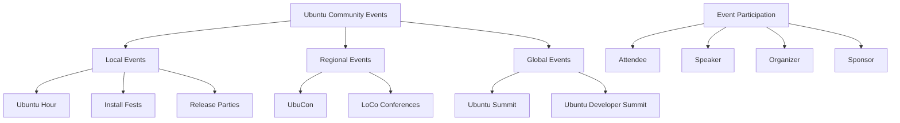

# Ubuntu Events

## Introduction

Ubuntu events are gatherings organized by and for the Ubuntu community - a global network of users, developers, advocates, and contributors who share a passion for the Ubuntu operating system and open source software. These events range from small local meetups to large international conferences, and they play a crucial role in building connections, sharing knowledge, and strengthening the Ubuntu ecosystem.

Whether you're a complete beginner curious about Ubuntu or an experienced contributor looking to deepen your involvement, Ubuntu events offer valuable opportunities for learning, networking, and collaboration. This guide will help you understand the types of events available, how to find and participate in them, and even how to organize your own.

## Types of Ubuntu Events

The Ubuntu community hosts various types of events to serve different purposes and audiences:

### Ubuntu Hour

A casual, short meetup (typically lasting about an hour) where Ubuntu users and enthusiasts gather at a local café or public space to socialize, share experiences, and help newcomers.

### Ubuntu Workshops

Hands-on sessions focused on teaching specific skills related to Ubuntu, such as installation, system administration, or development.

### Release Parties

Celebrations held when a new version of Ubuntu is released. These events often include demonstrations of new features, installation help, and social activities.

### Ubuntu Bug Jams

Collaborative sessions where participants work together to identify, triage, and fix bugs in Ubuntu software.

### UbuCon

Regional or national Ubuntu conferences featuring presentations, workshops, and networking opportunities. These are larger events that may span multiple days.

### Ubuntu Developer Summit (UDS)

The premier Ubuntu development event where plans for future releases are discussed and developed. While the format has evolved over time, these gatherings bring together core developers and community contributors.

## Finding Ubuntu Events

To discover Ubuntu events happening near you or virtually:

### 1. Ubuntu Community Hub

The Community Hub is the central place for finding information about upcoming events:

```
https://discourse.ubuntu.com/c/events/
```

### 2. LoCo Team Directory

Local Community (LoCo) teams organize events specific to their regions:

```
https://loco.ubuntu.com/events/
```

### 3. Social Media

Follow Ubuntu's official accounts and local community groups:
- Ubuntu on Mastodon: `@ubuntu@ubuntu.social`
- Ubuntu on Twitter/X: `@ubuntu`
- Facebook groups for local Ubuntu communities

### 4. Mailing Lists

Subscribe to Ubuntu announcement lists to receive notifications about events:

```
https://lists.ubuntu.com/
```

## Participating in Ubuntu Events

### Before the Event

1. **Register in advance** if required
2. **Review the agenda** to plan which sessions you want to attend
3. **Prepare questions** you'd like to ask presenters or other attendees
4. **Install or update Ubuntu** on your laptop if you plan to bring it

### During the Event

1. **Introduce yourself** to others - Ubuntu events are known for their friendly atmosphere
2. **Take notes** on key points and resources mentioned
3. **Ask questions** during Q&A portions
4. **Share your experiences** with Ubuntu where appropriate
5. **Exchange contact information** with people you meet

### After the Event

1. **Follow up** with contacts you made
2. **Share what you learned** with others online or in person
3. **Provide feedback** to organizers if requested
4. **Apply new knowledge** to your Ubuntu usage or projects

## Organizing Your Own Ubuntu Event

If there are no events in your area, consider organizing one! Here's how to get started:

### 1. Choose the Event Type

Select a format that matches your goals and resources:
- Ubuntu Hour (easiest to organize)
- Install fest
- Workshop on a specific topic
- Release party
- Local bug jam

### 2. Find a Venue

Options include:
- Cafés with reliable WiFi
- Public libraries
- Community centers
- Co-working spaces
- University classrooms (with permission)

### 3. Set a Date and Time

Consider:
- Evening hours for weekdays
- Afternoon hours for weekends
- Avoiding holiday conflicts
- Scheduling around release dates for release parties

### 4. Promote Your Event

Announce your event through:
- Ubuntu Community Hub
- Local Community (LoCo) team pages
- Social media
- Local tech meetup sites
- University bulletin boards

### 5. Prepare Materials

Depending on your event type, you might need:
- Ubuntu installation media
- Presentation slides
- Handouts or cheat sheets
- Sign-in sheets
- Name tags

### 6. Register Your Event

Make your event official by registering it on the Ubuntu Community Hub:

```javascript
// Example API request to register an event (conceptual - actual implementation differs)
const eventData = {
  name: "Ubuntu Hour - Portland",
  date: "2025-04-15T18:00:00",
  location: "TechHub Café, 123 Main St, Portland",
  description: "A casual meetup for Ubuntu users and enthusiasts",
  organizer: "your-username",
  eventType: "ubuntu-hour"
};

// Submit to Ubuntu events system
registerUbuntuEvent(eventData);
```

## Case Study: A Successful Ubuntu Workshop

### Planning Phase

The Ubuntu Oregon LoCo team wanted to introduce more students to Ubuntu. They:
1. Partnered with a local university's computer science department
2. Secured a computer lab with 25 workstations
3. Created a 3-hour workshop curriculum focused on Ubuntu basics
4. Prepared USB drives with Ubuntu 24.04 LTS

### Implementation

The workshop included:
1. A 30-minute introduction to Ubuntu and open source
2. A guided Ubuntu installation (dual-boot setup)
3. A tour of the desktop environment and key applications
4. Basic terminal commands practice
5. Q&A session

### Results

- 22 students attended
- 18 successfully installed Ubuntu
- 4 joined the local LoCo team
- The university requested quarterly workshops

### Code Example: Creating a Workshop Checklist Script

```bash
#!/bin/bash
# Ubuntu Workshop Preparation Checklist

echo "Ubuntu Workshop Preparation Checklist"
echo "====================================="

# Check for required materials
materials=("USB drives" "Handouts" "Presentation" "Sign-in sheet" "Feedback forms")
missing=0

for item in "${materials[@]}"; do
  read -p "Do you have $item prepared? (y/n): " response
  if [[ $response != "y" ]]; then
    echo "ACTION NEEDED: Prepare $item before the workshop"
    missing=$((missing+1))
  fi
done

# Check venue requirements
read -p "Have you confirmed the venue has reliable internet? (y/n): " internet
read -p "Have you tested Ubuntu installation on similar hardware? (y/n): " hardware

if [[ $internet != "y" ]]; then
  echo "ACTION NEEDED: Create an offline plan in case of internet issues"
  missing=$((missing+1))
fi

if [[ $hardware != "y" ]]; then
  echo "ACTION NEEDED: Test Ubuntu installation on similar hardware"
  missing=$((missing+1))
fi

# Summary
echo ""
echo "Summary: $missing action items remaining before your workshop is ready"
if [[ $missing -eq 0 ]]; then
  echo "Congratulations! You're prepared for a successful Ubuntu workshop."
fi

exit 0
```

Output example:
```
Ubuntu Workshop Preparation Checklist
=====================================
Do you have USB drives prepared? (y/n): y
Do you have Handouts prepared? (y/n): y
Do you have Presentation prepared? (y/n): n
ACTION NEEDED: Prepare Presentation before the workshop
Do you have Sign-in sheet prepared? (y/n): y
Do you have Feedback forms prepared? (y/n): n
ACTION NEEDED: Prepare Feedback forms before the workshop
Have you confirmed the venue has reliable internet? (y/n): y
Have you tested Ubuntu installation on similar hardware? (y/n): n
ACTION NEEDED: Test Ubuntu installation on similar hardware

Summary: 3 action items remaining before your workshop is ready
```

## Community Event Structure Visualization



## Virtual Ubuntu Events

With the rise of remote collaboration, virtual Ubuntu events have become increasingly common:

### Virtual Ubuntu Hours

Online gatherings using video conferencing platforms where participants can ask questions, share screens, and discuss Ubuntu-related topics.

### Online Workshops and Tutorials

Webinars and live-streamed sessions teaching Ubuntu skills, often with interactive elements like Q&A and polls.

### Virtual UbuCons

Full conferences moved online, with recorded presentations, live Q&A sessions, and virtual networking opportunities.

### Organizing a Virtual Ubuntu Event

When organizing a virtual event:

1. **Choose an accessible platform**:
   - Consider options like Jitsi Meet (open source), BigBlueButton, or other platforms
   - Ensure the platform works well with Ubuntu systems

2. **Structure the time carefully**:
   - Keep sessions shorter than in-person equivalents
   - Include breaks to prevent screen fatigue
   - Allow time for questions and interaction

3. **Test your setup**:
   - Check audio, video, and screen sharing in advance
   - Have a backup plan for technical issues

4. **Record with permission**:
   - Ask participants for consent to record
   - Share recordings afterward to extend the reach of your event

## Summary

Ubuntu events form the backbone of the Ubuntu community, providing vital opportunities for connection, learning, and collaboration. Whether you're attending a local Ubuntu Hour or organizing a regional UbuCon, these gatherings help strengthen the ecosystem and welcome newcomers to the world of Ubuntu and open source.

By participating in Ubuntu events, you'll not only enhance your own skills and knowledge but also contribute to a vibrant global community dedicated to free and open software.

## Additional Resources

### Official Resources

- Ubuntu Community Hub: `https://discourse.ubuntu.com/`
- Ubuntu Wiki Events Page: `https://wiki.ubuntu.com/Events`
- LoCo Team Portal: `https://loco.ubuntu.com/`

### Getting Involved

- Ubuntu Membership: `https://wiki.ubuntu.com/Membership`
- Code of Conduct: `https://ubuntu.com/community/code-of-conduct`
- Contribution Guide: `https://ubuntu.com/community/contribute`

### Next Steps

1. Find and attend an Ubuntu event in your area or online
2. Join your local Ubuntu LoCo team
3. Consider organizing a small Ubuntu Hour to meet others in your community
4. Share your Ubuntu knowledge through presentations or blog posts
5. Contribute to making Ubuntu events more accessible and inclusive