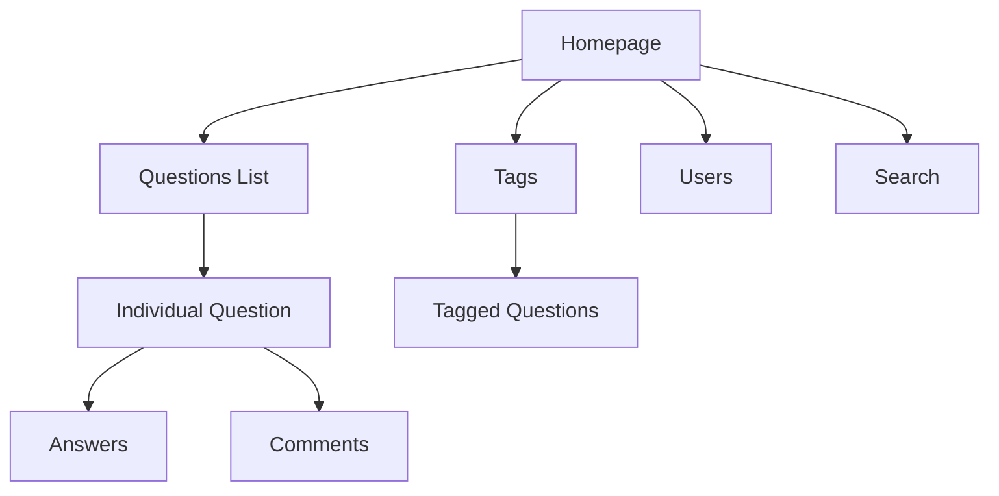

# Ubuntu Ask Ubuntu

## Introduction

Ask Ubuntu is a critical component of the Ubuntu community ecosystem - a dedicated question and answer platform built on the Stack Exchange network. It serves as a knowledge repository where Ubuntu users of all skill levels can ask questions, provide answers, and collaboratively solve problems related to the Ubuntu operating system and its derivatives.

Launched in 2010, Ask Ubuntu has grown into one of the largest and most active Ubuntu community resources, containing hundreds of thousands of questions and answers that cover everything from basic usage to advanced system administration. For beginners, it's an invaluable resource for troubleshooting, learning, and connecting with experienced Ubuntu users.

## What is Ask Ubuntu?

Ask Ubuntu is:

- A community-driven Q&A site specifically focused on Ubuntu
- Part of the Stack Exchange network of Q&A sites
- A reputation-based system where helpful contributions are rewarded
- A searchable knowledge base containing solutions to common Ubuntu problems
- A platform where Ubuntu users can get help from the community

Ask Ubuntu is **not**:

- A discussion forum or chat platform
- A place for extended troubleshooting sessions
- A substitute for official Ubuntu documentation
- A platform for general Linux questions (though Ubuntu-specific derivatives are on-topic)

## Getting Started with Ask Ubuntu

### Creating an Account

Before you can participate fully on Ask Ubuntu, you'll need to create an account:

1. Visit [Ask Ubuntu](https://askubuntu.com/)
2. Click the "Sign up" button in the top right corner
3. Create an account using your email, Google, Facebook, or Stack Exchange credentials

You can browse and search questions without an account, but you'll need one to ask or answer questions.

### Navigating the Interface

The Ask Ubuntu interface is designed to be straightforward:



- **Home page**: Shows recently active questions
- **Questions**: The full list of questions, sortable by newest, active, etc.
- **Tags**: Categories that organize questions by topic
- **Users**: Community members ranked by reputation
- **Search bar**: Find specific questions or topics

### Searching for Answers

Before asking a new question, you should search for existing solutions:

1. Use the search bar at the top of the page
2. Try different keywords related to your issue
3. Filter results by tags to narrow down topics
4. Look at questions with high vote counts for common issues

Example search techniques:

- Use quotes for exact phrases: `"cannot boot after update"`
- Add tags to search within specific topics: `[18.04] wifi not connecting`
- Combine specific error messages with general concepts: `"permission denied" usb mount`

## Asking Good Questions

The quality of your question greatly affects the likelihood of receiving helpful answers.

### Question Guidelines

1. **Be specific about your issue**
2. **Include relevant system information**
3. **Show what you've already tried**
4. **Format your question properly**
5. **Use clear, descriptive titles**

### Example of a Poor Question

```
title: Ubuntu not working
body: My Ubuntu stopped working after I updated yesterday. How do I fix it?
```

### Example of a Good Question

```
title: Ubuntu 22.04 boots to black screen after system update

body: After running `sudo apt update && sudo apt upgrade` yesterday, my Ubuntu 
22.04 LTS system no longer boots to the desktop. Instead, it shows a black 
screen with a blinking cursor in the top left corner.

System information:
- Dell XPS 13 (9380)
- Intel i5-8265U processor
- Intel UHD Graphics 620
- Ubuntu 22.04.2 LTS

What I've tried:
- Booting with an older kernel from GRUB menu
- Booting in recovery mode and running `fsck`
- Checking system logs with `journalctl -b -1`

The error message in the logs shows: `Failed to start Light Display Manager`

Any suggestions on how to recover my system?
```

### Including System Information

For most technical questions, include:

- Ubuntu version (e.g., Ubuntu 22.04 LTS)
- Desktop environment (GNOME, KDE, etc.)
- Hardware details (if relevant)
- Error messages (exact text)

You can gather system information using terminal commands:

```bash
# Ubuntu version
lsb_release -a

# Kernel version
uname -a

# Desktop environment
echo $XDG_CURRENT_DESKTOP

# Hardware info
sudo lshw -short
```

### Formatting Your Question

Ask Ubuntu uses Markdown for formatting:

- Use backticks for inline code: `sudo apt update`
- Use triple backticks for code blocks:

```bash
sudo apt update
sudo apt upgrade
```

- Use **asterisks** for **bold text**
- Use > for blockquotes
- Use - or * for bullet lists
- Use 1. 2. 3. for numbered lists

## Answering Questions

Answering questions is a great way to contribute to the community while reinforcing your own knowledge.

### Answer Guidelines

1. **Provide clear, step-by-step solutions**
2. **Explain why your solution works**
3. **Include commands or code when relevant**
4. **Be respectful and helpful**
5. **Edit your answer to improve it over time**

### Example Answer Format

```
I can help with your black screen after update issue. This is commonly caused 
by graphics driver problems after kernel updates.

Try the following steps:

1. Boot into recovery mode by holding Shift during startup and selecting 
   "Advanced options for Ubuntu" then "Recovery mode"

2. Select "Enable networking" and then "Root shell"

3. Reinstall your graphics drivers:

   ```bash
   ubuntu-drivers autoinstall
   ```

4. Reboot your system:

   ```bash
   reboot
   ```

If that doesn't work, you might need to temporarily disable your graphics driver:

1. Edit your GRUB configuration:

   ```bash
   nano /etc/default/grub
   ```

2. Find the line with `GRUB_CMDLINE_LINUX_DEFAULT` and add `nomodeset`:

   ```
   GRUB_CMDLINE_LINUX_DEFAULT="quiet splash nomodeset"
   ```

3. Update GRUB and reboot:

   ```bash
   update-grub
   reboot
   ```

This should get you back to a working display, and you can then properly 
troubleshoot the graphics driver issue.
```

## Understanding the Reputation System

Ask Ubuntu uses a reputation system to recognize helpful contributions:

- **Upvotes on questions**: +5 points
- **Upvotes on answers**: +10 points
- **Accepted answers**: +15 points
- **Downvotes on your posts**: -2 points
- **Downvoting others' answers**: -1 point

Higher reputation unlocks privileges:

| Reputation | Privileges |
|------------|------------|
| 15         | Flag posts |
| 50         | Comment everywhere |
| 125        | Downvote |
| 1500       | Create tags |
| 2000       | Edit questions and answers |
| 3000       | Close/reopen questions |

## Best Practices for the Community

### Do:

- **Search before asking** - Your question might already have an answer
- **Be specific** - Clearly describe your problem and what you need
- **Show your research** - Share what you've tried already
- **Accept answers** that solve your problem
- **Upvote helpful content** to recognize valuable contributions
- **Edit posts** to improve clarity (when you have sufficient reputation)

### Don't:

- **Ask multiple questions** in a single post
- **Create duplicate questions** that have already been asked
- **Post opinion-based questions** that can't have a definitive answer
- **Forget to mark an answer as accepted** if it solves your problem
- **Add "Thanks" as an answer** - use comments or upvotes instead

## Real-World Examples

### Example 1: Fixing Package Management Issues

Let's say you encounter this error when updating your system:

```
E: Could not get lock /var/lib/dpkg/lock-frontend - open (11: Resource temporarily unavailable)
E: Unable to acquire the dpkg frontend lock (/var/lib/dpkg/lock-frontend), is another process using it?
```

You could search Ask Ubuntu and find questions like:
- "Unable to lock the administration directory (/var/lib/dpkg/) is another process using it?"
- "E: Could not get lock /var/lib/dpkg/lock-frontend"

The accepted answers typically provide solutions such as:

```bash
# Check for running package managers
ps aux | grep -i apt

# Kill the process if needed
sudo kill -9 <process_id>

# Clean up lock files if no process is running
sudo rm /var/lib/apt/lists/lock
sudo rm /var/lib/dpkg/lock
sudo rm /var/lib/dpkg/lock-frontend
```

### Example 2: Troubleshooting Boot Problems

For boot issues, Ask Ubuntu offers systematic approaches:

1. **Identifying the problem**:
   ```bash
   # View boot logs
   journalctl -b
   
   # Check disk status
   sudo fdisk -l
   sudo fsck /dev/sda1
   ```

2. **Common solutions**:
   ```bash
   # Repair GRUB
   sudo update-grub
   
   # Reinstall GRUB
   sudo grub-install /dev/sda
   ```

## Integrating Ask Ubuntu in Your Ubuntu Journey

As you progress in your Ubuntu experience, Ask Ubuntu can be used in different ways:

- **Beginners**: Search for solutions to common problems
- **Intermediate users**: Ask more specific questions and start answering simple questions
- **Advanced users**: Contribute by answering difficult questions, editing for clarity, and flagging/moderating content

## Summary

Ask Ubuntu is an essential resource in the Ubuntu ecosystem that provides:

1. A structured Q&A platform specifically for Ubuntu users
2. A reputation system that rewards helpful contributions
3. A searchable knowledge base of Ubuntu solutions
4. A community-driven approach to problem-solving

By understanding how to effectively use Ask Ubuntu, you can:
- Find solutions to your Ubuntu problems more quickly
- Contribute to the community by sharing your knowledge
- Build your reputation as an Ubuntu user and helper
- Stay connected to the broader Ubuntu community

## Additional Resources

- [Ask Ubuntu Tour](https://askubuntu.com/tour) - A guided introduction to the platform
- [Ask Ubuntu Help Center](https://askubuntu.com/help) - Detailed guidance on using the site
- [Ask Ubuntu Meta](https://meta.askubuntu.com/) - Discussions about Ask Ubuntu itself
- [Ubuntu Forums](https://ubuntuforums.org/) - Another community resource for more discussion-based help

## Practice Exercises

1. **Search Exercise**: Try finding solutions to a problem you're facing by using different search techniques on Ask Ubuntu.
2. **Question Exercise**: Draft a practice question following the guidelines above.
3. **Answer Exercise**: Find an unanswered question that you know the answer to and write a comprehensive response.
4. **Reputation Building**: Set a goal to reach 200 reputation points by providing helpful answers to the community.