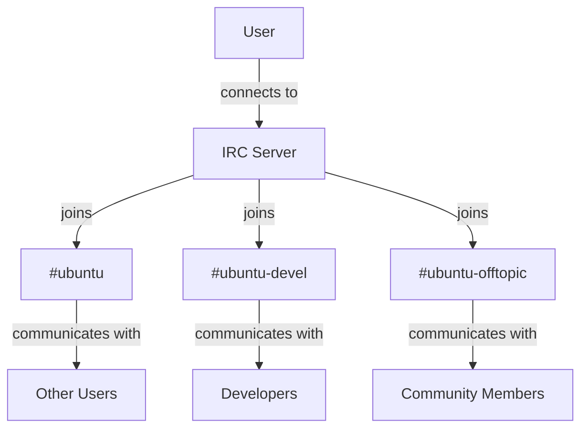
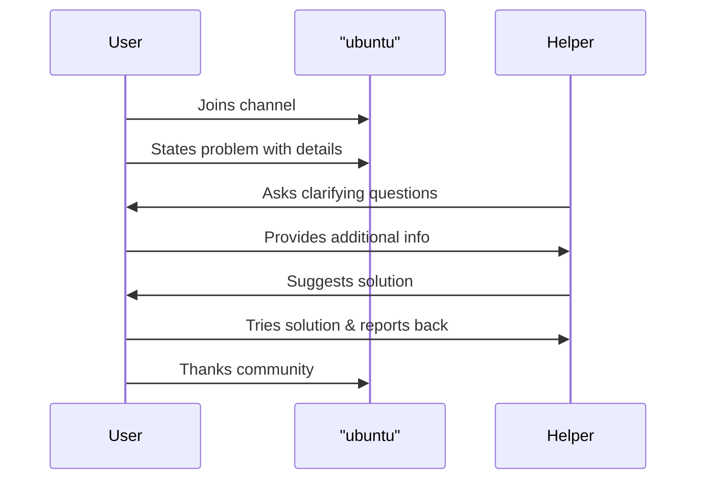

# Ubuntu IRC Channels

## Introduction

Internet Relay Chat (IRC) has been a cornerstone of the Ubuntu community since its inception. Despite the rise of modern communication platforms, IRC remains an important channel for real-time support, development discussions, and community building within the Ubuntu ecosystem. This guide will introduce you to Ubuntu's IRC channels, explain how to connect and use them effectively, and help you become an active participant in this vibrant community resource.

## What is IRC?

IRC (Internet Relay Chat) is a text-based communication protocol that enables real-time messaging through channels (chat rooms). Created in 1988, it remains popular in open-source communities for its simplicity, low bandwidth requirements, and ability to work across nearly any device or connection.



## Primary Ubuntu IRC Channels

Ubuntu's IRC presence is organized into different channels, each with a specific purpose:

- **#ubuntu** - The main support channel for Ubuntu desktop and server
- **#ubuntu-devel** - For Ubuntu development discussions
- **#ubuntu-offtopic** - For general chat and non-support Ubuntu conversations
- **#kubuntu**, **#xubuntu**, **#lubuntu** - For flavor-specific support
- **#ubuntu-server** - Focused on server-related questions
- **#ubuntu-beginners** - A friendly space specifically for newcomers

All official Ubuntu channels are hosted on the Libera.Chat IRC network (formerly on Freenode until 2021).

## Getting Started with Ubuntu IRC

### Step 1: Choose an IRC Client

There are many IRC clients available. Here are some popular options:

**For Desktop:**
- **Hexchat** - A user-friendly graphical client (cross-platform)
- **Konversation** - Integrated with KDE desktop environment
- **Polari** - GNOME's simple IRC client
- **Irssi** - A terminal-based client for advanced users

**For Web Browsers:**
- **Libera.Chat Webchat** - Access directly through your browser at [https://web.libera.chat/](https://web.libera.chat/)

You can install Hexchat on Ubuntu with:

```bash
sudo apt install hexchat
```

### Step 2: Connect to Libera.Chat

Once you've installed your IRC client, you'll need to connect to the Libera.Chat network:

1. Open your IRC client
2. Add or select Libera.Chat as your network
3. Choose a nickname (username) - this is how you'll be identified
4. Connect to the network

In Hexchat, this process looks like:

1. On first launch, you'll see the Network List
2. Find or add "Libera.Chat" in the network list
3. Enter your desired nickname
4. Click "Connect"

### Step 3: Join Ubuntu Channels

After connecting to Libera.Chat, join channels by typing:

```
/join #ubuntu
```

To join multiple channels:

```
/join #ubuntu #ubuntu-offtopic
```

## IRC Commands and Etiquette

### Essential Commands

Here are some basic commands to get you started:

```
/join #channelname    - Join a channel
/part #channelname    - Leave a channel
/nick newnickname     - Change your nickname
/msg nickname message - Send a private message
/me action            - Perform an action
/quit [message]       - Disconnect from IRC
```

### Ubuntu IRC Etiquette

1. **Don't ask to ask** - Simply state your question or issue directly
2. **Be patient** - It may take time for someone knowledgeable to respond
3. **Use pastebin** for code or terminal output longer than 3 lines
   - Use services like [paste.ubuntu.com](https://paste.ubuntu.com) and share the link
4. **Stay on topic** - Use the appropriate channel for your question
5. **Respect volunteers** - Everyone helping is donating their time

### Example Interaction

Here's an example of a proper support request in #ubuntu:

```
<NewUser> Hi, I'm having trouble updating Ubuntu 22.04. When I run sudo apt update, I get this error: https://paste.ubuntu.com/p/example/ Can someone help?

<UbuntuHelper> NewUser: Looks like you have a PPA that's no longer working. Try running: sudo add-apt-repository --remove ppa:example/example

<NewUser> UbuntuHelper: That worked! Thank you!
```

## Registering Your Nickname

To prevent others from using your nickname and to access some restricted channels, register your nickname:

1. Choose a password
2. Send a message to NickServ:

```
/msg NickServ REGISTER password youremail@example.com
```

3. Check your email and follow the verification instructions
4. For future sessions, identify yourself:

```
/msg NickServ IDENTIFY password
```

Or configure your IRC client to automatically identify.

## Using IRC for Ubuntu Support

### Effective Support Requests

When seeking help:

1. **Research first** - Check the Ubuntu documentation and forums
2. **Be specific** - Include your Ubuntu version, hardware details, and exact error messages
3. **Describe what you've tried** already
4. **One issue at a time** - Solve problems sequentially, not all at once

### Example Support Process



## Beyond Basic Support

### Ubuntu IRC Bots

Ubuntu channels use helpful bots:

- **ubottu** - Provides factoids and information
  ```
  !factoid_name
  ```
  Example: `!repositories` will make ubottu share information about Ubuntu repositories

- **meetingology** - Helps with running organized meetings in development channels

### Participating in Ubuntu Development via IRC

If you want to contribute to Ubuntu:

1. Join development-focused channels like `#ubuntu-devel`
2. Observe discussions to learn about current work
3. Ask about how to help with specific projects
4. Participate in IRC meetings (listed on the Ubuntu wiki)

### Staying Connected with Screen or Tmux

For continuous presence on IRC:

1. Install screen or tmux:
   ```bash
   sudo apt install screen
   ```

2. Start a detachable session:
   ```bash
   screen -S irc
   ```

3. Launch your terminal IRC client (like irssi)

4. Detach with `Ctrl+A` followed by `d`

5. Reattach later with:
   ```bash
   screen -r irc
   ```

## Alternative Ubuntu Community Platforms

While IRC is valuable, Ubuntu's community exists across multiple platforms:

- **Discourse** - [discourse.ubuntu.com](https://discourse.ubuntu.com) for forum-style discussions
- **Ask Ubuntu** - [askubuntu.com](https://askubuntu.com) for Q&A format help
- **Mailing Lists** - For development and technical discussions
- **Matrix** - A modern chat platform bridged with IRC channels

## Summary

IRC channels remain a vital part of the Ubuntu community ecosystem, providing real-time support and development coordination. By connecting to Libera.Chat and joining Ubuntu channels, you gain access to a wealth of knowledge and a chance to interact with experienced Ubuntu users and developers.

The skills you develop using IRC will serve you well across many open-source projects, as IRC continues to be a common communication method in the open-source world. Even as newer platforms emerge, understanding IRC is an important part of participating in the Ubuntu community.

## Additional Resources

- [Ubuntu IRC Community Wiki](https://wiki.ubuntu.com/IRC/Guidelines)
- [Libera.Chat Documentation](https://libera.chat/guides)
- [Ubuntu Code of Conduct](https://ubuntu.com/community/code-of-conduct)

## Exercises

1. Set up an IRC client of your choice and connect to Libera.Chat
2. Join #ubuntu and observe the conversations for 30 minutes
3. Register your nickname with NickServ
4. Create a list of five channels relevant to your Ubuntu interests
5. Try helping someone else with a problem you know how to solve