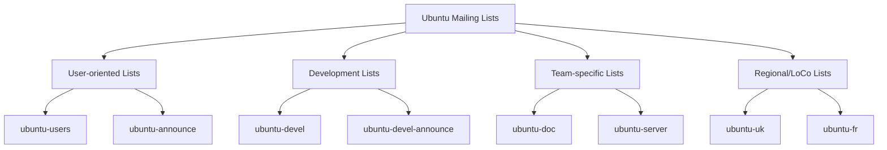

# Ubuntu Mailing Lists

## Introduction

Mailing lists are one of the oldest and most effective forms of online community communication, particularly in the open-source world. For the Ubuntu community, mailing lists serve as a central hub where users, developers, and contributors exchange ideas, provide support, coordinate development efforts, and make important announcements.

Unlike real-time chat platforms or forums, mailing lists provide a structured, asynchronous communication method that allows for thoughtful discussions and creates a searchable archive of knowledge. Whether you're a beginner seeking help or an experienced developer wanting to contribute, understanding Ubuntu mailing lists is essential for effective participation in the community.

## What Are Ubuntu Mailing Lists?

Ubuntu mailing lists are email-based discussion groups focused on various aspects of Ubuntu. Each list has a specific purpose and audience, ranging from technical support to development coordination.



## Popular Ubuntu Mailing Lists

Here are some of the most important Ubuntu mailing lists:

1. **ubuntu-announce**: Low-volume list for official Ubuntu announcements
2. **ubuntu-users**: General help and discussion for Ubuntu users
3. **ubuntu-devel**: Ubuntu development discussions
4. **ubuntu-devel-announce**: Announcements related to Ubuntu development
5. **ubuntu-security-announce**: Security updates and announcements

## How to Subscribe to Ubuntu Mailing Lists

Subscribing to an Ubuntu mailing list is straightforward. Let's walk through the process step by step:

1. Visit the Ubuntu Mailing Lists page at [lists.ubuntu.com](https://lists.ubuntu.com)
2. Find the list you want to join from the available options
3. Click on the list name to go to its information page
4. Look for the subscription section, usually at the bottom of the page
5. Enter your email address and optionally set a password
6. Click the "Subscribe" button

After subscribing, you'll receive a confirmation email. You must respond to this email to complete your subscription.

Here's an example of what the subscription form might look like:

```
Email Address: your-email@example.com
Password: [optional]
Confirm Password: [optional]

[ ] Receive list mail batched in a daily digest?

[Subscribe]
```

## Participating in Mailing List Discussions

Once subscribed, you can start participating in discussions. Here are some best practices:

### Sending Your First Email

To send an email to a mailing list, simply address it to the list's email address. For example, to send a message to the ubuntu-users list, you would email `ubuntu-users@lists.ubuntu.com`.

### Creating Effective Subject Lines

Good subject lines help others quickly understand what your message is about:

```
Good: [HELP] Cannot boot after kernel update 5.15.0-56
Bad: Ubuntu problem!!!
```

### Proper Email Formatting

When replying to messages, most email clients will automatically quote the previous message. It's good practice to trim long quotes and only include relevant parts:

```
On Mon, 2023-10-09, Jane Doe wrote:
> I'm having trouble installing the nvidia-driver package.
> The error message says:
> E: Unable to locate package nvidia-driver

Have you enabled the restricted repository? You can do this with:

sudo add-apt-repository restricted
sudo apt update
sudo apt install nvidia-driver
```

### Using Tags in Subject Lines

Many Ubuntu mailing lists use tags in subject lines to categorize messages:

- `[HELP]`: Requesting assistance
- `[SOLVED]`: Indicating a resolved issue
- `[IDEA]`: Proposing new features or changes
- `[BUG]`: Reporting a bug

## Example: Getting Support via Mailing Lists

Let's walk through a practical example of using the ubuntu-users mailing list to get help with a technical issue.

### Scenario: WiFi Not Working After Update

1. **Research**: Before posting, search the list archives to see if your issue has been discussed before
2. **Compose Email**:
   - Subject: `[HELP] WiFi not working after updating to Ubuntu 22.04`
   - Body:
   ```
   Hello Ubuntu community,
   
   I recently upgraded from Ubuntu 20.04 to 22.04, and now my WiFi is not working.
   
   System information:
   - Laptop model: Dell XPS 13 9380
   - WiFi card: Intel Wireless-AC 9560
   - Kernel version: 5.15.0-56-generic (output of `uname -r`)
   
   What I've tried:
   - Restarting the network-manager service
   - Checking if WiFi is blocked with rfkill
   
   Output of `lspci | grep -i wireless`:
   02:00.0 Network controller: Intel Corporation Wireless-AC 9560 [Jefferson Peak] (rev 10)
   
   Any help would be greatly appreciated!
   
   Thanks,
   John
   ```

3. **Follow-up**: Respond promptly to questions and provide additional information as requested

4. **Resolution**: Once the issue is resolved, consider sending a follow-up email with the solution, using `[SOLVED]` in the subject line

## Working with Mailing List Archives

One of the valuable resources of mailing lists is their searchable archives. Ubuntu maintains archives of all public mailing lists, which can be a gold mine of information.

### Searching the Archives

To search the archives:

1. Visit the list's archive page (e.g., https://lists.ubuntu.com/archives/ubuntu-users/)
2. Use the search function to find discussions related to your topic
3. Browse by thread or by date to explore conversations

### Reading Threaded Discussions

Mailing list archives typically display conversations in a threaded format, which helps follow the flow of discussion:

```
Thread: Problem with apt-get update
├── Initial message from User A
├── Response from User B
│   └── Follow-up from User A
└── Alternative solution from User C
    └── Confirmation from User A
```

## Mailing List Etiquette

Following proper etiquette ensures productive and respectful discussions:

1. **Read Before Posting**: Check if your question has been answered before
2. **Stay On-Topic**: Keep discussions relevant to the list's purpose
3. **Use Descriptive Subject Lines**: Make it easy for others to understand your topic
4. **Format Messages Properly**: Use plain text, not HTML, and format code snippets with fixed-width fonts
5. **Be Patient**: Remember that list members are volunteers
6. **Follow the Ubuntu Code of Conduct**: Remain respectful and constructive

## Managing Your Subscription

You can customize how you receive mailing list messages:

### Setting Up Digest Mode

If a list has high traffic, you might prefer to receive a single daily digest instead of individual emails:

1. Go to your subscription management page
2. Look for the digest option
3. Set your preference to digest mode

### Creating Email Filters

Most email clients allow you to create filters to organize mailing list messages:

```
Filter criteria:
- Header "List-Id" contains "ubuntu-users.lists.ubuntu.com"
Action:
- Move to folder "Ubuntu/Users"
```

### Unsubscribing

To unsubscribe from a list:

1. Find the unsubscribe link at the bottom of any list email
2. Alternatively, visit the list information page and look for the unsubscription section
3. Enter your email address and submit the unsubscribe request
4. Confirm the unsubscription when prompted via email

## Contributing to the Community via Mailing Lists

Mailing lists aren't just for getting help—they're also for giving back to the community:

1. **Answer Questions**: Share your knowledge by helping others
2. **Report Bugs**: Help improve Ubuntu by reporting issues you encounter
3. **Suggest Improvements**: Propose new features or enhancements
4. **Participate in Discussions**: Join conversations about Ubuntu's future
5. **Translate Content**: Help make Ubuntu accessible to non-English speakers

## Summary

Ubuntu mailing lists are a cornerstone of the Ubuntu community, providing a structured platform for communication, support, and collaboration. By understanding how to effectively use these mailing lists, you can:

- Get help with Ubuntu-related problems
- Stay informed about Ubuntu developments
- Contribute to Ubuntu's improvement
- Connect with other Ubuntu users and developers

Whether you're a beginner or an experienced user, mailing lists offer a valuable way to engage with the Ubuntu community and enhance your Ubuntu experience.

## Additional Resources

- [Ubuntu Mailing List Page](https://lists.ubuntu.com)
- [Ubuntu Code of Conduct](https://ubuntu.com/community/code-of-conduct)
- [Ubuntu Documentation on Communication](https://discourse.ubuntu.com)

## Exercises

1. Subscribe to the ubuntu-announce mailing list to stay informed about important Ubuntu news.
2. Search the ubuntu-users archives for solutions to a problem you're experiencing.
3. Draft a practice help request email following the guidelines in this tutorial.
4. Set up email filters in your email client to organize Ubuntu mailing list messages.
5. Identify one question in the ubuntu-users list that you can answer, and compose a helpful response.