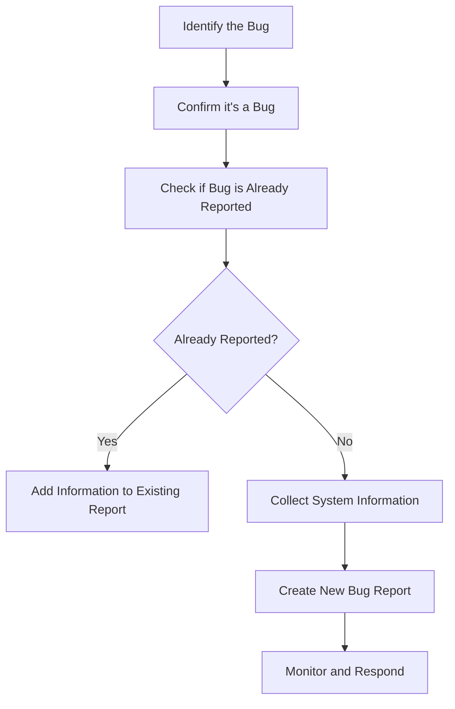

# Ubuntu Bug Reporting

## Introduction

Bug reporting is an essential part of the open-source ecosystem and a valuable way to contribute to the Ubuntu community. When you encounter an issue or unexpected behavior in Ubuntu, reporting it properly helps developers identify, understand, and fix problems. This guide will walk you through the process of effective bug reporting in Ubuntu, from identifying bugs to submitting well-documented reports that lead to solutions.

## What is a Bug?

In software terms, a bug is any unexpected behavior, error, or flaw in a program that causes it to produce incorrect results, behave in unintended ways, or crash. Bugs can range from minor inconveniences to critical issues that prevent system functionality.

A bug in Ubuntu might be:
- An application that crashes unexpectedly
- A feature that doesn't work as documented
- A graphical glitch in the user interface
- Hardware that isn't recognized correctly
- Performance issues under specific conditions

## Why Report Bugs?

Before diving into how to report bugs, let's understand why it matters:

1. **Community Improvement**: Your reports help make Ubuntu better for everyone
2. **Developer Awareness**: Developers can't fix what they don't know about
3. **Personal Growth**: You'll learn more about how Ubuntu works
4. **Recognition**: Become a valued contributor to the Ubuntu ecosystem

## Prerequisites for Bug Reporting

Before reporting a bug, make sure you have:

- An Ubuntu One account (for Launchpad access)
- A basic understanding of the issue you're experiencing
- Time to provide detailed information and follow up if needed

## The Bug Reporting Process

Let's walk through the complete process of reporting a bug in Ubuntu:



### 1. Identifying a Bug

First, you need to determine if what you're experiencing is actually a bug:

- Is the behavior inconsistent with what's documented?
- Does it happen consistently or only under certain conditions?
- Does it affect system functionality or user experience?

### 2. Collecting Information

Before reporting a bug, gather essential information about your system:

**Using the `ubuntu-bug` Tool**

The `ubuntu-bug` command is your primary tool for reporting bugs. It automatically collects relevant system information:

```bash
ubuntu-bug package-name
```

Replace `package-name` with the name of the package that contains the bug. For example:

```bash
ubuntu-bug firefox
```

**If you don't know the package name**, you can use:

```bash
ubuntu-bug
```

And follow the prompts to identify the affected application or component.

**Manual Information Collection**

If needed, you can manually collect information:

- Ubuntu version:
```bash
lsb_release -a
```

- Kernel version:
```bash
uname -a
```

- Hardware information:
```bash
sudo lshw > hardware-info.txt
```

- Package version information:
```bash
apt show package-name
```

- Application-specific logs (often found in `/var/log/` or `~/.config/`)

### 3. Checking for Existing Bug Reports

Before submitting a new bug report, check if someone has already reported the issue:

1. Visit [Launchpad](https://bugs.launchpad.net/ubuntu)
2. Use the search function with keywords related to your issue
3. Browse through related packages or projects

If you find an existing bug that matches your issue:
- Add a comment with any new information
- Click "This bug affects me too" to subscribe to updates
- Add any unique details about your specific situation

### 4. Submitting a New Bug Report

If your issue hasn't been reported yet, follow these steps to create a new bug report:

**Using ubuntu-bug (Recommended Method)**

1. Open Terminal
2. Run the ubuntu-bug command for the affected package:

```bash
ubuntu-bug firefox
```

3. This will gather system information and open a browser window to Launchpad
4. Log in with your Ubuntu One account
5. Complete the bug report form

**Direct Submission on Launchpad**

If you can't use `ubuntu-bug`, you can submit directly on Launchpad:

1. Go to [https://bugs.launchpad.net/ubuntu/+filebug](https://bugs.launchpad.net/ubuntu/+filebug)
2. Click "No, I need to report a new bug"
3. Fill in the required information

### 5. Writing an Effective Bug Report

A good bug report contains:

**Clear Title**
Create a descriptive, specific title that summarizes the issue:
- ❌ "Firefox doesn't work"  
- ✅ "Firefox 123.0 crashes when opening PDF attachments on Ubuntu 24.04"

**Detailed Description**
Include:
- What happened
- What you expected to happen
- Step-by-step reproduction instructions
- System information
- Error messages (exact text)
- Screenshots (if visual issues)

**Example Bug Report Template**

```
## What happened
When opening PDF attachments in Firefox 123.0, the browser crashes immediately.

## Steps to reproduce
1. Open Firefox
2. Go to my Gmail account
3. Open any email with a PDF attachment
4. Click on the PDF attachment
Result: Firefox closes unexpectedly

## Expected behavior
The PDF should open in Firefox's built-in PDF viewer.

## Frequency
Happens 10/10 times when attempting to open any PDF attachment.

## Additional information
- This started happening after the latest Firefox update
- I can open PDFs from local files without issues
- I've tried disabling all extensions
```

### 6. After Submitting a Bug Report

Your responsibility doesn't end with submitting the report:

1. **Monitor the report** for questions or requests for additional information
2. **Respond promptly** to developer inquiries
3. **Test proposed fixes** when they become available
4. **Update the report** with new information as you discover it

### 7. Understanding Bug Status and Priority

Bug reports go through several stages:

- **New**: Just reported, not yet confirmed
- **Confirmed**: Verified as a legitimate bug
- **Triaged**: Assessed and prioritized
- **In Progress**: Developers are working on it
- **Fix Committed**: Fix has been developed but not released
- **Fix Released**: Fix is available in a released update

Priorities range from "Critical" (system crashes, data loss) to "Wishlist" (feature requests).

## Practical Example: Reporting a Bluetooth Connection Issue

Let's walk through reporting a bug where Bluetooth headphones disconnect randomly:

1. **Identify the issue**: Bluetooth headphones disconnect every 5 minutes despite being fully charged.

2. **Collect information**:
   ```bash
   ubuntu-bug bluetooth
   ```

3. **Check for existing reports**:
   Search Launchpad for "bluetooth disconnect headphones"

4. **Submit a report** using information like:
   ```
   ## What happened
   My Sony WH-1000XM4 Bluetooth headphones disconnect approximately every 5 minutes when connected to my Ubuntu 24.04 laptop.

   ## Steps to reproduce
   1. Pair Sony WH-1000XM4 headphones with Ubuntu laptop
   2. Play audio (music, video, or conference call)
   3. Wait approximately 5 minutes
   Result: Headphones disconnect, audio switches to laptop speakers

   ## Expected behavior
   Headphones should maintain a stable connection until manually disconnected or powered off.

   ## Frequency
   Happens consistently every 4-6 minutes.

   ## Troubleshooting already attempted
   - Headphones work fine with my Android phone
   - Tried removing and re-pairing the device
   - Tested with a different pair of Bluetooth headphones (similar issue)
   - Updated to the latest system updates

   ## System information
   Ubuntu 24.04 LTS
   Kernel: 6.5.0-15-generic
   Bluetooth controller: Intel AX200
   ```

5. **Follow up**: Respond to any questions from the developers and test proposed fixes.

## Advanced Bug Reporting

As you become more comfortable with bug reporting, consider:

### Debugging Techniques

For more complex issues, developers might ask you to:

**Enable Debug Logging**
```bash
# Example for Bluetooth debugging
sudo btmon > bluetooth-log.txt
```

**Use Apport to collect crash information**
```bash
sudo systemctl enable apport
sudo systemctl start apport
```

**Run applications in debug mode**
```bash
WEBKIT_DEBUG=1 firefox
```

### Contributing to Bug Fixes

If you have programming skills, you might even contribute patches:

1. Download the source code:
   ```bash
   apt source package-name
   ```

2. Make your changes

3. Create a patch:
   ```bash
   diff -u original-file modified-file > fix.patch
   ```

4. Attach the patch to the bug report

## Bug Reporting Etiquette

Remember these guidelines for effective community interaction:

- **Be patient**: Developers are often volunteers with limited time
- **Stay factual**: Focus on observable behaviors, not assumptions
- **Be concise**: Provide necessary details without excessive information
- **Remain polite**: Even when frustrated, maintain respectful communication
- **Follow up**: Stay engaged with the process

## Summary

Bug reporting is a vital contribution to the Ubuntu ecosystem. By following the steps outlined in this guide, you can help identify, document, and ultimately resolve issues in Ubuntu. Your careful reporting helps developers understand problems and create solutions that benefit the entire community.

Remember:
1. Use `ubuntu-bug` to collect system information
2. Check for existing reports before creating new ones
3. Provide clear, detailed information with reproduction steps
4. Follow up on your reports and respond to requests
5. Be patient and courteous throughout the process

With these skills, you're now ready to contribute meaningfully to Ubuntu through effective bug reporting!

## Additional Resources

- [Ubuntu Bug Reporting Documentation](https://help.ubuntu.com/community/ReportingBugs)
- [Launchpad Bug Tracking](https://bugs.launchpad.net/ubuntu)
- [Ubuntu Community Hub](https://discourse.ubuntu.com)

## Practice Exercises

1. Identify a non-critical issue in your Ubuntu installation and practice going through the bug reporting steps (but don't submit unless it's a real issue).
  
2. Find an existing bug report on Launchpad and analyze it. What information did the reporter provide? What was helpful? What was missing?

3. Set up your Launchpad profile and configure your system for bug reporting using:
   ```bash
   sudo apt install apport-gtk
   ```