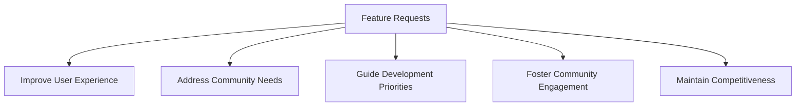
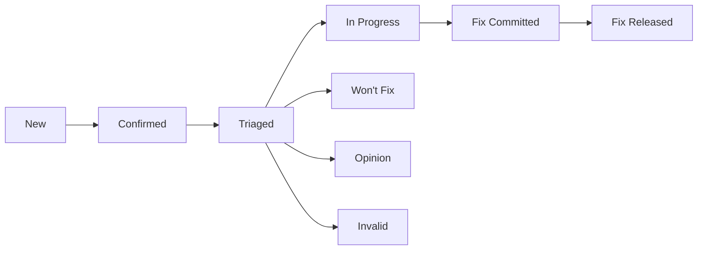

# Ubuntu Feature Requests

## Introduction

Ubuntu, one of the world's most popular Linux distributions, thrives on community input and collaboration. An important way the community helps shape Ubuntu's future is through feature requests. These are formal suggestions for new functionality, improvements, or changes to the operating system.

This guide will walk you through the process of creating, submitting, and tracking feature requests for Ubuntu. Whether you're a new Ubuntu user who has identified a missing feature or an experienced developer with ideas for enhancement, understanding how to properly channel your suggestions can significantly impact Ubuntu's evolution.

## Understanding Feature Requests

A feature request in Ubuntu is a formal suggestion submitted to the Ubuntu development team proposing new functionality or improvements to existing features.

### Why Feature Requests Matter



Feature requests serve several important purposes:

- They provide developers with insights into what users need
- They help prioritize development efforts
- They allow the community to actively participate in Ubuntu's evolution
- They facilitate the discovery of bugs or limitations in current implementations

## The Ubuntu Feature Request System

Ubuntu primarily uses Launchpad for managing feature requests. Launchpad is a web-based collaboration platform that allows users to:

- Submit feature requests as "wishlist" bugs
- Track the status of their requests
- Collaborate with other users on refining proposals
- Interact with developers handling the requests

### Types of Feature Requests

In the Ubuntu ecosystem, feature requests generally fall into several categories:

1. **Core System Enhancements**: Changes to the Ubuntu base system, kernel, or core utilities
2. **Desktop Environment Features**: Improvements to the user interface, desktop functionality, or visual elements
3. **Software Center/Package Management**: Additions or changes to how software is discovered, installed, or managed
4. **Hardware Support**: Requests for better compatibility with specific hardware components
5. **Performance Optimizations**: Suggestions for making Ubuntu faster or more resource-efficient
6. **Security Features**: Proposals for new or enhanced security capabilities

## Creating an Effective Feature Request

An effective feature request clearly communicates your idea and its value. Follow these steps to create a compelling feature request:

### Step 1: Research Existing Requests

Before submitting a new feature request, check if someone has already proposed it:

```bash
# Search for existing feature requests using Ubuntu's bug search
ubuntu-bug -w
# Then type keywords related to your feature in the web interface that opens
```

You can also search directly on Launchpad:
1. Visit [https://bugs.launchpad.net/ubuntu](https://bugs.launchpad.net/ubuntu)
2. Use the search function with keywords related to your proposed feature

### Step 2: Prepare Your Request

A good feature request includes the following elements:

1. **Clear Title**: Summarize the feature in one concise sentence
2. **Detailed Description**: Explain what the feature should do
3. **Use Case**: Describe why and how users would benefit from this feature
4. **Implementation Ideas** (optional): If you have technical insights, share them
5. **Visual Aids** (optional): Mock-ups or diagrams if relevant

### Step 3: Submit Your Request

To submit a feature request:

```bash
# Open the bug reporting tool for the specific package
# Replace [package-name] with the relevant package
ubuntu-bug [package-name]

# For example, to submit a feature request for the Ubuntu Software Center:
ubuntu-bug software-center
```

If you're unsure which package your feature pertains to:

```bash
# Open a general bug report
ubuntu-bug
```

In the bug report form:
1. Set the "Importance" to "Wishlist" (this identifies it as a feature request)
2. Include all the information you prepared in Step 2
3. Add the tag "needs-design" if your request involves UI/UX changes

### Example Feature Request

Here's an example of a well-formatted feature request:

**Title**: Add built-in screen recording functionality to screenshot tool

**Description**:
The current screenshot tool allows users to capture still images, but many users also need to record short videos of their screen for tutorials, bug reports, or demonstrations. Adding screen recording capability to the existing screenshot tool would provide a seamless experience without requiring third-party applications.

**Use Case**:
Users often need to demonstrate processes or report visual bugs that can only be captured in video form. Currently, they must install additional software like SimpleScreenRecorder or use command-line tools like FFmpeg, which can be challenging for beginners.

**Suggested Implementation**:
The screenshot tool could include a toggle between "Image" and "Video" modes. Video recording could offer options for:
- Area selection (similar to screenshot area selection)
- Audio recording toggle
- Recording duration limit
- Output format selection (MP4, WebM)

**Mockup**:
(This is where you would include a visual mockup if available)

## Tracking Your Feature Request

After submitting your feature request, you'll want to monitor its progress:

1. **Bookmark the request page** in Launchpad for easy access
2. **Subscribe to notifications** to receive updates when changes occur
3. **Respond promptly** if developers ask for clarification or additional information

### Understanding Feature Request Status

Your request will move through several potential statuses:



- **New**: Just submitted, not yet reviewed
- **Confirmed**: Verified as a valid request by developers
- **Triaged**: Evaluated and prioritized
- **In Progress**: Currently being implemented
- **Fix Committed**: Implementation completed but not yet released
- **Fix Released**: Implemented and included in a released version
- **Won't Fix**: Decided not to implement (with explanation)
- **Opinion**: Considered subjective or controversial
- **Invalid**: Not applicable or not a feature request

## Improving Feature Request Adoption Chances

To increase the likelihood of your feature request being implemented:

1. **Gather support**: Encourage other users to comment on and support your request
2. **Provide evidence**: Include data or examples showing how many users would benefit
3. **Be available**: Remain engaged in the discussion about your request
4. **Consider contributing**: Offer to help with implementation if you have the skills

### Community Voting and Discussion

Ubuntu's community often discusses feature requests on various platforms:

- **Ubuntu Discourse**: [https://discourse.ubuntu.com](https://discourse.ubuntu.com)
- **Ask Ubuntu**: [https://askubuntu.com](https://askubuntu.com)
- **IRC Channels**: #ubuntu-devel on Freenode

Participating in these discussions can help refine your proposal and build support.

## Contributing to Feature Implementation

If you have development skills, you can go beyond merely suggesting features:

### For Non-Developers

Even without coding skills, you can contribute to feature implementation by:

- Creating detailed specifications
- Designing user interfaces
- Testing proposed implementations
- Writing documentation

### For Developers

If you can code, consider implementing the feature yourself:

1. **Comment on the feature request** stating your intention to work on it
2. **Set up a development environment**:

```bash
# Install the development tools
sudo apt-get install build-essential git devscripts

# Clone the repository for the relevant package
git clone https://git.launchpad.net/ubuntu/+source/[package-name]

# Build the package
cd [package-name]
debuild -us -uc
```

3. **Create a branch** for your feature implementation
4. **Develop and test** your implementation
5. **Submit a merge proposal** through Launchpad

## Case Study: Successful Feature Requests

Let's examine a real-world example of a successful Ubuntu feature request:

### Case: Dark Mode in Ubuntu 20.04

**Original Request**: Users requested a system-wide dark theme option that could be easily toggled.

**Community Response**: The request received hundreds of votes and comments on Launchpad and community forums.

**Implementation Process**:
1. The design team created mockups
2. Developers identified affected components
3. Community members tested early implementations
4. The feature was refined based on feedback
5. Dark mode was officially included in Ubuntu 20.04

**Key Success Factors**:
- Clear use case (reducing eye strain, saving battery on OLED displays)
- Wide community support
- Technical feasibility
- Alignment with broader design trends

## Common Mistakes to Avoid

When submitting feature requests, avoid these common pitfalls:

1. **Vague descriptions**: "Make Ubuntu better" without specifics
2. **Feature overload**: Requesting too many changes in one submission
3. **Ignoring limitations**: Not considering technical or design constraints
4. **Being confrontational**: Using demanding language or criticizing developers
5. **Abandoning the request**: Not responding to questions or feedback

## Summary

Feature requests are a vital channel through which the Ubuntu community can contribute to the operating system's evolution. By following the guidelines in this guide, you can create effective feature requests that have a higher chance of being implemented.

Remember that Ubuntu's development is a collaborative process. Your feature request is not just a suggestion but an invitation to a conversation about improving Ubuntu for everyone.

## Additional Resources

- [Ubuntu Contributor Guide](https://discourse.ubuntu.com/t/contribute/26)
- [Launchpad Help](https://help.launchpad.net/)
- [Ubuntu Development Guide](https://discourse.ubuntu.com/t/ubuntu-development-guide/23830)

## Exercises

1. Search Launchpad for feature requests related to a specific aspect of Ubuntu you're interested in. How many are there? What status are they in?

2. Draft a practice feature request for an improvement you'd like to see in Ubuntu. Have a friend or community member review it for clarity and completeness.

3. Find an existing feature request that interests you and contribute to the discussion with constructive feedback or use cases.

4. Identify a feature in another operating system that Ubuntu could benefit from. Research whether it has been requested before, and if not, prepare a feature request for it.