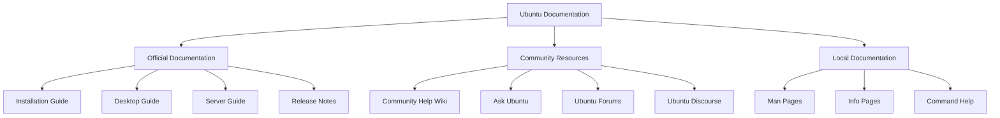

# Ubuntu Documentation

## Introduction

Ubuntu documentation is a vital resource for users at all skill levels, providing guidance on everything from installation to advanced system configuration. For beginners entering the Linux world through Ubuntu, documentation serves as both a learning tool and a reference guide when troubleshooting issues or exploring new features.

This guide will walk you through the various types of Ubuntu documentation available, how to access them, and even how you can contribute to improving these resources as part of the Ubuntu community.

## Types of Ubuntu Documentation

Ubuntu's documentation ecosystem consists of several components, each serving different purposes:

### Official Documentation

The primary resource is the [Ubuntu Documentation](https://help.ubuntu.com/), maintained by the Ubuntu Documentation Team. This comprehensive collection includes:

- **Installation guides**: Step-by-step instructions for installing Ubuntu
- **User guides**: Basic system usage and configuration information
- **Server guides**: Documentation for server deployments and administration
- **Release notes**: Details about each Ubuntu version release

### Man Pages

Man pages (short for "manual pages") are the traditional Unix/Linux documentation system, accessible directly from the terminal:

```bash
# View the manual page for a command
man ls

# Search for man pages by keyword
man -k network
```

Example output for `man ls`:

```
LS(1)                            User Commands                           LS(1)

NAME
       ls - list directory contents

SYNOPSIS
       ls [OPTION]... [FILE]...

DESCRIPTION
       List information about the FILEs (the current directory by default).
       Sort entries alphabetically if none of -cftuvSUX nor --sort is specified.
       
       ...
```

### Community Help Wiki

The [Ubuntu Community Help Wiki](https://help.ubuntu.com/community) contains user-contributed guides, tutorials, and how-tos on various topics. This resource often covers more specific use cases than the official documentation.

### Ubuntu Forums

The [Ubuntu Forums](https://ubuntuforums.org/) provide a platform for users to ask questions, share solutions, and discuss Ubuntu-related topics. The forums contain a wealth of practical information from real users.

## Accessing Ubuntu Documentation

### Offline Documentation

Ubuntu includes offline documentation accessible without an internet connection:

```bash
# Install the Ubuntu documentation package
sudo apt install ubuntu-docs

# Launch the help viewer
yelp
```

You can also access man pages offline as shown earlier.

### Terminal-Based Help

Most commands include built-in help:

```bash
# View brief help for a command
ls --help

# Access more comprehensive help via man pages
man apt
```

### Web-Based Documentation

For online resources:

1. Official Documentation: [https://help.ubuntu.com/](https://help.ubuntu.com/)
2. Community Wiki: [https://help.ubuntu.com/community](https://help.ubuntu.com/community)
3. Ubuntu Discourse: [https://discourse.ubuntu.com/](https://discourse.ubuntu.com/)

## Using Documentation Effectively

### Finding Information

Ubuntu documentation is extensive, but there are efficient ways to find what you need:

```bash
# Search for a package
apt search nginx

# Search man pages for a term
man -k partition

# Find help on a specific topic in installed documentation
apropos bluetooth
```

### Reading Man Pages Efficiently

Man pages follow a standard structure:

1. **NAME**: Command name and brief description
2. **SYNOPSIS**: Command syntax
3. **DESCRIPTION**: Detailed explanation
4. **OPTIONS**: Available command-line options
5. **EXAMPLES**: Usage examples
6. **SEE ALSO**: Related commands or documentation

Navigate within a man page using:
- <kbd>Space</kbd>: Scroll down a page
- <kbd>b</kbd>: Scroll up a page
- <kbd>/keyword</kbd>: Search for "keyword"
- <kbd>q</kbd>: Quit the man page

## Practical Examples

### Example 1: Troubleshooting Network Issues

Let's say you're having trouble connecting to Wi-Fi. Here's how to use Ubuntu documentation to solve this:

```bash
# Search for network-related commands
apropos network

# View documentation for NetworkManager
man NetworkManager

# Check the Ubuntu wiki for troubleshooting
# (You would visit the community help wiki)
```

The documentation will guide you through:
1. Checking network interface status
2. Verifying driver availability
3. Troubleshooting common Wi-Fi issues

### Example 2: Installing Software

To learn about package management:

```bash
# Read about apt
man apt

# Get help on specific apt commands
apt --help
apt install --help
```

Following the documentation, you would:

```bash
# Update package lists
sudo apt update

# Install a package
sudo apt install firefox

# Remove a package
sudo apt remove firefox
```

## Contributing to Ubuntu Documentation

As you grow more comfortable with Ubuntu, you might want to give back by improving documentation.

### How to Contribute

1. **Join the Documentation Team**: Visit the [Ubuntu Documentation Team](https://wiki.ubuntu.com/DocumentationTeam) page.

2. **Report Documentation Bugs**:

```bash
# Install the ubuntu-bug tool if not already present
sudo apt install apport

# Report a bug in documentation
ubuntu-bug ubuntu-docs
```

3. **Edit the Wiki**: For community documentation, create an account and start editing the wiki.

4. **Translate Documentation**: Help translate Ubuntu docs to other languages through the [Ubuntu Translations](https://translations.launchpad.net/ubuntu) project.

## Documentation Structure Visualization

Here's a visual overview of how Ubuntu documentation is organized:



## Summary

Ubuntu documentation is a comprehensive ecosystem of resources designed to help users at all levels. As a beginner, start with the official documentation and gradually explore the community resources as you become more comfortable.

Remember that documentation in Linux is not just something you read—it's an interactive tool. Use the terminal-based help systems, explore the man pages, and don't hesitate to contribute back to the community as your knowledge grows.

## Additional Resources

1. [Ubuntu Documentation Contributor Guide](https://wiki.ubuntu.com/DocumentationTeam/Contributing)
2. [Ask Ubuntu](https://askubuntu.com/) - Q&A site for Ubuntu users
3. [The Linux Documentation Project](https://tldp.org/) - Comprehensive Linux documentation

## Exercises for Practice

1. Use `man` to learn about three new commands you haven't used before.
2. Find and read the release notes for your current Ubuntu version.
3. Use the `apropos` command to find utilities related to file compression.
4. Visit the Ubuntu Community Help Wiki and find a tutorial that interests you.
5. Try to identify a section of documentation that could be improved, and think about how you would enhance it.