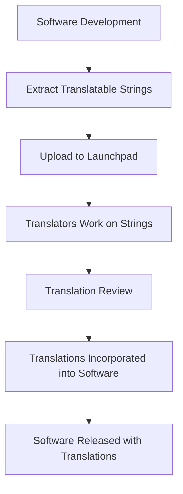

# Ubuntu Translation

## Introduction

Ubuntu is used by millions of people worldwide, speaking hundreds of different languages. For Ubuntu to be truly accessible to everyone, its interfaces, documentation, and resources need to be available in as many languages as possible. This is where the Ubuntu Translation project comes in.

The Ubuntu Translation project (also known as Ubuntu Translators) is a community-driven effort to translate Ubuntu's software, documentation, and websites into different languages. By contributing to translations, you help make Ubuntu accessible to people who might not be comfortable with English, broadening Ubuntu's reach and impact globally.

In this guide, we'll explore how the Ubuntu translation process works, how you can contribute to translations, and why this community effort is crucial for Ubuntu's mission of being "Linux for human beings."

## Understanding Translation Terms

Before diving into the process, let's clarify some commonly used terms in the translation world:

- **Localization (L10n)**: The process of adapting software for a specific region or language. The "10" represents the number of letters between 'L' and 'n'.
- **Internationalization (I18n)**: The design and development of software to support multiple languages and regional differences.
- **Translation**: The process of converting text from one language (usually English in Ubuntu's case) to another.
- **String**: A piece of text that needs to be translated.
- **PO files**: Portable Object files that contain the original strings and their translations.
- **Launchpad**: The platform used by Ubuntu for managing translations.

## How Ubuntu Translation Works

Ubuntu uses a collaborative online platform called Launchpad for managing translations. Here's a high-level overview of how the translation process works:



## Getting Started with Ubuntu Translation

### 1. Join the Ubuntu Translation Community

To start contributing to Ubuntu translations:

1. Create a Launchpad account at [https://launchpad.net/](https://launchpad.net/)
2. Join the translation team for your language
3. Subscribe to your language team's mailing list for updates and discussions

### 2. Understanding Translation Priorities

Ubuntu translation efforts focus on several areas, arranged by priority:

1. Core Ubuntu components (installer, system tools, etc.)
2. Default applications included in Ubuntu releases
3. Popular applications in the Ubuntu repositories
4. Documentation and websites

### 3. Using Launchpad for Translations

Launchpad provides a web-based interface for translating strings. Here's how to use it:

1. Navigate to the Ubuntu translations page on Launchpad
2. Select your language
3. Choose a package to translate
4. Browse through untranslated strings
5. Submit your translations

Let's see what the translation process looks like with an example:

#### Example: Translating a Simple String

Imagine you want to translate the following string from the Ubuntu installer into Spanish:

**Original (English):** "Welcome to Ubuntu Installation"

In Launchpad, you would:
1. Find this string in the 'ubiquity' package
2. Enter the translation: "Bienvenido a la instalación de Ubuntu"
3. Save your translation

## Understanding Translation Files

Ubuntu uses the GNU gettext system for translations. This system uses special files formats:

- **POT files** (Portable Object Template): The original template containing all translatable strings
- **PO files** (Portable Object): Contains the original strings and their translations for a specific language
- **MO files** (Machine Object): Compiled binary versions of PO files used by software

Let's look at how a simple PO file entry appears:

```
msgid "Welcome to Ubuntu"
msgstr "Bienvenido a Ubuntu"
```

In this example:
- `msgid` is the original English string
- `msgstr` is the translated string

## Translation Best Practices

To ensure high-quality translations:

1. **Understand the context**: Know where and how the string appears in the software
2. **Be consistent**: Use the same translations for common terms
3. **Respect language rules**: Follow proper grammar, punctuation, and style guides
4. **Keep it natural**: Translations should feel natural to native speakers
5. **Stay updated**: Follow the style guide for your language team
6. **Ask for help**: When in doubt, ask other translators in your language team

## Using Translation Tools

Besides Launchpad, several tools can help with Ubuntu translations:

### Offline Translation with Poedit

[Poedit](https://poedit.net/) is a popular editor for PO files that allows you to work offline:

1. Download PO files from Launchpad
2. Open them in Poedit
3. Translate strings
4. Save and upload back to Launchpad

Here's how to install Poedit on Ubuntu:

```bash
sudo apt install poedit
```

### Translation Memory Tools

Translation memory tools help maintain consistency by suggesting translations based on previous work:

```bash
sudo apt install translate-toolkit
```

## Testing Translations

After translating, it's important to test to ensure the translations work properly in the actual software:

1. Install the language pack:

```bash
sudo apt install language-pack-XX
```
(Replace XX with your language code, e.g., 'es' for Spanish)

2. Switch your system to the language and check how the translations appear

## Common Challenges in Translation

### 1. String Length Issues

Some languages require more space than English, which can cause UI issues:

```
English: "Save"
German: "Speichern"
```

### 2. Pluralization

Different languages handle plurals differently:

```
English: "1 file" / "2 files"
Polish: "1 plik" / "2 pliki" / "5 plików"
```

Ubuntu's translation system supports plural forms, but you need to understand how they work in your language.

### 3. Context-Dependent Translations

Sometimes the same English word needs different translations depending on context:

```
English: "Open" (verb) → Spanish: "Abrir"
English: "Open" (adjective) → Spanish: "Abierto"
```

## Real-World Impact of Translations

Let's look at a real-world example of how translations affect users:

Imagine a student in Thailand who's just starting to learn about computers. With Ubuntu properly translated to Thai, they can use a powerful operating system in their native language, making the learning curve much gentler.

By contributing to Ubuntu translations, you directly help users like this Thai student access technology in a more meaningful way.

## How to Become a Translation Reviewer

After contributing translations for a while, you might want to become a reviewer:

1. Consistently provide high-quality translations
2. Become active in your language team
3. Ask the team coordinator about the process for becoming a reviewer
4. Demonstrate a good understanding of translation guidelines

Reviewers help maintain quality by checking and approving translations from other contributors.

## Summary

Ubuntu Translation is a vital community effort that helps make Ubuntu accessible to people worldwide, regardless of their language. By contributing to translations, even beginners can make a meaningful impact on Ubuntu's global reach.

The translation process involves:
1. Joining your language's translation team
2. Using Launchpad to find and translate strings
3. Following best practices for high-quality translations
4. Testing your translations in actual software
5. Collaborating with other translators

## Additional Resources

For those who want to continue learning about Ubuntu translation:

- The official Ubuntu Translators wiki
- Your language team's guidelines and mailing list
- The gettext documentation for understanding the technical aspects
- Translation communities specific to your language

## Practice Exercises

1. Create a Launchpad account and explore the translation interface
2. Find an untranslated string in a package you're familiar with and translate it
3. Install Poedit and practice working with PO files
4. Join your language team's mailing list and introduce yourself
5. Test a recently translated application and see how the translations appear

By starting with these simple steps, you can begin your journey as an Ubuntu translator and contribute to making technology more accessible to everyone.