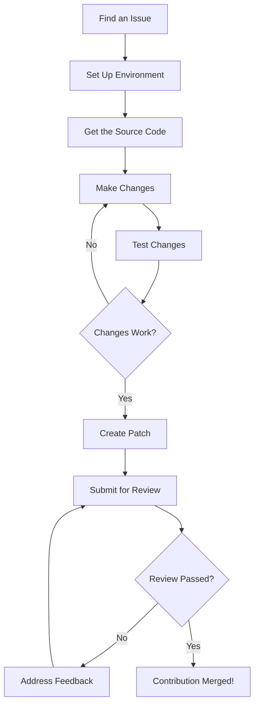

# Ubuntu Contributions

## Introduction

Ubuntu, one of the world's most popular Linux distributions, thrives on community contributions. The name "Ubuntu" comes from the Nguni Bantu term meaning "humanity to others" or "I am because we are," reflecting the collaborative spirit of the project. Contributing to Ubuntu not only helps improve the platform but also enhances your programming skills, builds your portfolio, and connects you with a global community of developers.

This guide will walk you through the various ways beginners can contribute to Ubuntu, the tools you'll need, and the process for making your first contribution.

## Why Contribute to Ubuntu?

Before diving into how to contribute, let's understand why it's beneficial:

- **Skill Development**: Working on real-world projects helps sharpen your programming skills
- **Community Recognition**: Your contributions get recognized by the global Ubuntu community
- **Portfolio Building**: Open-source contributions look great on resumes and portfolios
- **Networking**: Connect with experienced developers from around the world
- **Giving Back**: Help millions of Ubuntu users by improving their experience

## Types of Contributions

There are many ways to contribute to Ubuntu, regardless of your skill level:

### 1. Bug Reporting and Testing

One of the simplest ways to start contributing is by reporting bugs you encounter. This helps developers identify and fix issues.

```bash
# Install the bug reporting tool
sudo apt-get install apport

# Report a bug for a specific package
ubuntu-bug package-name
```

### 2. Documentation

Clear documentation is crucial for any software project. You can help improve Ubuntu's documentation even if you're not yet comfortable with coding.

### 3. Translations

If you're fluent in multiple languages, you can help translate Ubuntu to make it accessible to users worldwide.

### 4. Code Contributions

For those with programming skills, you can help fix bugs or develop new features. Ubuntu uses a variety of programming languages, including Python, C, C++, and Shell scripting.

### 5. Community Support

Answer questions on Ask Ubuntu, Ubuntu Forums, or IRC channels to help other users solve their problems.

## Getting Started with Contributions

Let's walk through the process of making your first contribution:

### Setting Up Your Environment

```bash
# Install necessary development tools
sudo apt-get install build-essential git devscripts ubuntu-dev-tools

# Configure Git with your identity
git config --global user.name "Your Name"
git config --global user.email "your.email@example.com"
```

### Understanding Launchpad

Launchpad is Ubuntu's platform for bug tracking, code hosting, and collaboration. You'll need to:

1. Create a Launchpad account at [launchpad.net](https://launchpad.net/)
2. Set up SSH keys for secure access
3. Join relevant teams based on your interests

### Finding Your First Issue

The best place to start is with "bitesize" bugs - these are issues tagged as relatively simple to fix.

```bash
# Search for bitesize bugs
ubuntu-bug-triage --team ubuntu-desktop --tag bitesize
```

## Making Your First Code Contribution

Let's walk through a simple example of fixing a documentation bug:

### 1. Find a Bug

For this example, imagine we found a typo in a package description.

### 2. Get the Source Code

```bash
# Download the source code for the package
apt-get source package-name

# Navigate to the source directory
cd package-name-version/
```

### 3. Make Your Changes

Open the files in your preferred text editor and make the necessary corrections.

### 4. Test Your Changes

Always test your changes before submitting them.

```bash
# Build the package to test your changes
debuild -us -uc

# Install and test the fixed package
sudo dpkg -i ../package-name_version_architecture.deb
```

### 5. Create a Patch

```bash
# Create a patch file with your changes
debdiff ../package-name_original-version.dsc ../package-name_modified-version.dsc > fix-typo.patch
```

### 6. Submit Your Contribution

Upload your patch to the relevant bug report on Launchpad and subscribe the appropriate team for review.

## The Contribution Workflow

Here's a diagram showing the typical contribution workflow:



## Ubuntu Contribution Guidelines

To ensure your contributions are accepted, follow these guidelines:

### Code Standards

Ubuntu follows specific coding standards depending on the project. Generally:

- Use 4 spaces for indentation (not tabs)
- Follow PEP 8 for Python code
- Include meaningful comments
- Write clear commit messages

### Documentation Standards

When contributing to documentation:

- Use clear, concise language
- Include examples when possible
- Follow the existing documentation structure
- Check for spelling and grammar errors

## Real-World Example: Fixing a Documentation Bug

Let's look at a simple example of fixing a documentation bug in a package description:

### Original package description (with error):

```
This packge provides tools for monitoring system resources.
```

### Finding and fixing the bug:

```bash
# Get the source
apt-get source example-monitor

# Navigate to the directory
cd example-monitor-1.0/

# Edit the debian/control file
nano debian/control

# Fix the typo: "packge" to "package"

# Build the package
debuild -us -uc

# Create a patch
debdiff ../example-monitor_1.0-1.dsc ../example-monitor_1.0-1ubuntu1.dsc > fix-typo.patch

# Submit the patch to Launchpad
```

### Result:

After your patch is accepted, all Ubuntu users will see the corrected description:

```
This package provides tools for monitoring system resources.
```

## Contributing to Ubuntu Applications

Besides core Ubuntu components, you can also contribute to Ubuntu-specific applications. Here's how to set up a development environment for an Ubuntu application:

```bash
# Clone the repository (example: Ubuntu Software Center)
git clone https://git.launchpad.net/ubuntu-software-center

# Install dependencies
sudo apt-get build-dep ubuntu-software-center

# Navigate to the project directory
cd ubuntu-software-center

# Run the application in development mode
./software-center
```

## Best Practices for Contributors

To make your contribution journey smooth:

1. **Start Small**: Begin with simple bugs or documentation fixes
2. **Ask Questions**: Don't hesitate to ask for help in IRC channels or forums
3. **Be Patient**: The review process can take time
4. **Be Responsive**: Respond to feedback on your contributions promptly
5. **Follow the Code of Conduct**: Ubuntu has a [Code of Conduct](https://ubuntu.com/community/code-of-conduct) all contributors must follow

## Community Recognition

As you contribute more, you may receive recognition:

- **Ubuntu Membership**: Regular contributors can apply for official Ubuntu membership
- **Upload Rights**: Consistent code contributors may receive rights to upload packages
- **Mentorship Opportunities**: Experienced contributors often mentor newcomers

## Summary

Contributing to Ubuntu is a rewarding way to improve your skills while helping millions of users worldwide. Starting with simple contributions like bug reports or documentation updates allows you to familiarize yourself with the process before tackling more complex code contributions.

Remember that every contribution matters, regardless of its size. The Ubuntu community welcomes contributors of all skill levels, and there's always someone willing to help you get started.

## Additional Resources

- [Ubuntu Contributors Documentation](https://discourse.ubuntu.com/c/contributing/23)
- [Ubuntu Developers Guide](https://discourse.ubuntu.com/t/ubuntu-development-guide/28)
- [Launchpad Help](https://help.launchpad.net/)
- [Ubuntu IRC Channels](https://wiki.ubuntu.com/IRC/ChannelList)

## Exercises

1. Create a Launchpad account and set up your development environment
2. Find and report a bug using the ubuntu-bug tool
3. Join the Ubuntu translation team and translate a small section of documentation
4. Find a "bitesize" bug and attempt to fix it
5. Participate in an Ubuntu Testing Day for upcoming releases