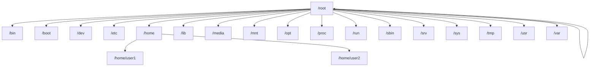

# Ubuntu Terminal Introduction

## What is the Ubuntu Terminal?

The Ubuntu Terminal (also called the command line or shell) is a powerful text-based interface that allows you to interact with your Ubuntu operating system through commands. Unlike graphical user interfaces (GUIs) where you click on icons and menus, the terminal provides direct access to the system through text commands.

Think of the terminal as having a conversation with your computer - you type commands, and the computer responds accordingly.

## Why Learn the Terminal?

You might wonder why you should learn the terminal when Ubuntu has a user-friendly graphical interface. Here are some compelling reasons:

1. **Efficiency**: Many tasks can be completed faster through the terminal than through a GUI.
2. **Power**: The terminal gives you access to the full power of your system.
3. **Automation**: You can automate repetitive tasks using scripts.
4. **Remote Access**: You can manage remote servers where a GUI isn't available.
5. **Development**: Most development tools and programming environments work better with the terminal.
6. **Troubleshooting**: When graphical interfaces fail, the terminal is often still accessible.

## Accessing the Terminal

There are several ways to open the terminal in Ubuntu:

1. Press `Ctrl + Alt + T` on your keyboard.
2. Search for "Terminal" in the Activities overview.
3. Right-click on the desktop and select "Open Terminal" (if available in your version).

## Understanding the Terminal Prompt

When you open the terminal, you'll see something like this:

```bash
username@hostname:~$
```

Let's break down what this means:

- `username`: Your Ubuntu username
- `hostname`: The name of your computer
- `~`: Your current directory (~ represents your home directory)
- `$`: Indicates you're logged in as a regular user (a `#` would indicate root/administrator privileges)

This entire line is called the "prompt," and it's where you'll type your commands.

## Your First Commands

Let's start with some basic commands:

### 1. `pwd` - Print Working Directory

The `pwd` command shows your current location in the file system:

```bash
username@hostname:~$ pwd
/home/username
```

### 2. `ls` - List Files and Directories

The `ls` command lists the contents of the current directory:

```bash
username@hostname:~$ ls
Desktop    Documents    Downloads    Music    Pictures    Videos
```

You can add options to commands using hyphens. For example, `ls -l` provides a more detailed listing:

```bash
username@hostname:~$ ls -l
total 32
drwxr-xr-x 2 username username 4096 Mar 10 15:20 Desktop
drwxr-xr-x 2 username username 4096 Mar 10 15:20 Documents
drwxr-xr-x 2 username username 4096 Mar 10 15:20 Downloads
drwxr-xr-x 2 username username 4096 Mar 10 15:20 Music
drwxr-xr-x 2 username username 4096 Mar 10 15:20 Pictures
drwxr-xr-x 2 username username 4096 Mar 10 15:20 Videos
```

### 3. `cd` - Change Directory

The `cd` command lets you navigate between directories:

```bash
username@hostname:~$ cd Documents
username@hostname:~/Documents$ pwd
/home/username/Documents
```

To go back to the previous directory:

```bash
username@hostname:~/Documents$ cd ..
username@hostname:~$
```

To return to your home directory from anywhere:

```bash
username@hostname:~/Documents$ cd
username@hostname:~$
```

### 4. `mkdir` - Make Directory

Create a new directory with the `mkdir` command:

```bash
username@hostname:~$ mkdir Projects
username@hostname:~$ ls
Desktop    Documents    Downloads    Music    Pictures    Projects    Videos
```

### 5. `touch` - Create Empty Files

Create an empty file with the `touch` command:

```bash
username@hostname:~$ touch hello.txt
username@hostname:~$ ls
Desktop    Documents    Downloads    hello.txt    Music    Pictures    Projects    Videos
```

### 6. `cat` - View File Contents

View the contents of a file with `cat`:

```bash
username@hostname:~$ echo "Hello, Ubuntu!" > hello.txt
username@hostname:~$ cat hello.txt
Hello, Ubuntu!
```

### 7. `clear` - Clear the Terminal

If your terminal gets cluttered, use `clear` to clean it up:

```bash
username@hostname:~$ clear
```

### 8. `echo` - Display Text

The `echo` command displays text or variables:

```bash
username@hostname:~$ echo "Learning the Ubuntu Terminal is fun!"
Learning the Ubuntu Terminal is fun!
```

### 9. `man` - Manual Pages

Learn about commands using the manual pages:

```bash
username@hostname:~$ man ls
```

Press `q` to exit the manual.

## Understanding the File System Structure

Ubuntu, like all Linux distributions, follows a hierarchical file system structure:



Key directories include:

- `/` - Root directory
- `/home` - User home directories
- `/bin` and `/sbin` - Essential command binaries
- `/etc` - System configuration files
- `/var` - Variable files (logs, etc.)
- `/usr` - User binaries and read-only data

## Command Structure

Most terminal commands follow a similar pattern:

```
command [options] [arguments]
```

- **Command**: The program you want to run
- **Options**: Modify the behavior of the command (usually start with `-` or `--`)
- **Arguments**: The items the command should operate on (like filenames)

Example:

```bash
username@hostname:~$ ls -la /home
```

Here, `ls` is the command, `-la` are options (l for long format, a for all files), and `/home` is the argument.

## Practical Example: Creating a Project Structure

Let's create a simple project structure using terminal commands:

```bash
username@hostname:~$ mkdir -p Projects/WebApp/{css,js,images}
username@hostname:~$ touch Projects/WebApp/index.html
username@hostname:~$ touch Projects/WebApp/css/style.css
username@hostname:~$ touch Projects/WebApp/js/script.js
username@hostname:~$ tree Projects/
Projects/
└── WebApp
    ├── css
    │   └── style.css
    ├── images
    ├── index.html
    └── js
        └── script.js

4 directories, 3 files
```

Note: You might need to install the `tree` command first with `sudo apt install tree`.

## Terminal Shortcuts

Learning these keyboard shortcuts will make you more efficient:

- `Tab`: Auto-complete commands and filenames
- `Ctrl + C`: Stop the current command
- `Ctrl + L`: Clear the screen (same as `clear`)
- `Ctrl + A`: Move cursor to the beginning of the line
- `Ctrl + E`: Move cursor to the end of the line
- `Ctrl + U`: Clear the line before the cursor
- `Ctrl + K`: Clear the line after the cursor
- `Up/Down Arrows`: Navigate through command history

## Tips for Beginners

1. **Don't be afraid to experiment**: Most commands have a `--help` option or a man page.
2. **Use Tab completion**: Save time by pressing Tab to auto-complete commands and filenames.
3. **Start with simple commands**: Master the basics before moving to complex operations.
4. **Pay attention to error messages**: They usually provide useful information about what went wrong.
5. **Use history**: Press the up arrow to recall previously executed commands.

## Summary

In this introduction, we've covered:

- What the Ubuntu Terminal is and why it's important
- How to access the terminal
- Understanding the prompt
- Basic commands: `pwd`, `ls`, `cd`, `mkdir`, `touch`, `cat`, `echo`, `man`
- The Linux file system structure
- Command structure and syntax
- Creating a project structure
- Helpful keyboard shortcuts

The terminal might seem intimidating at first, but with practice, it becomes an incredibly powerful tool that will significantly enhance your productivity and understanding of Ubuntu.

## Practice Exercises

1. Create a directory structure for a personal project.
2. Navigate between different system directories and list their contents.
3. Create a simple text file with some content, then view and modify it.
4. Use the `history` command to see your command history.
5. Try using different options with the `ls` command.

## Additional Resources

- The `man` command for any command you want to learn more about
- Ubuntu documentation: `https://help.ubuntu.com/community/UsingTheTerminal`
- Linux Command Library: `https://linuxcommandlibrary.com/`
- Interactive learning: Try `vimtutor` in the terminal to learn the Vim text editor