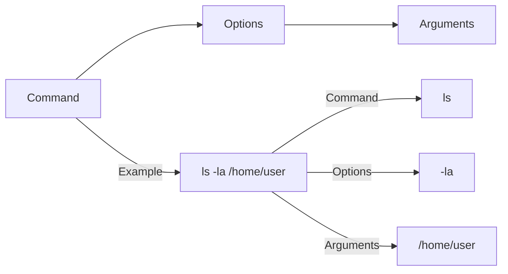

# Ubuntu Command Structure

## Introduction

The Ubuntu Terminal, also known as the command-line interface (CLI), is a powerful tool that allows you to interact with your operating system directly through text commands. Understanding the structure of these commands is fundamental to becoming proficient with the Ubuntu Terminal.

In this guide, we'll explore how commands are structured in Ubuntu, the components that make up a command, and how these elements work together to perform actions on your system.

## Basic Command Structure

At its most basic level, an Ubuntu command follows this general structure:

```
command [options] [arguments]
```

Let's break down each component:

### Command

The command is the program or utility you want to run. It's typically a single word that tells the system what action to perform.

**Example:**
```bash
ls
```

This simple command lists the contents of the current directory.

### Options (Flags)

Options, also known as flags or switches, modify the behavior of a command. They are usually preceded by a hyphen (`-`) for single-letter options or two hyphens (`--`) for full-word options.

**Examples:**
```bash
ls -l    # Long format listing
ls -a    # Show all files (including hidden)
ls --all # Same as -a but in full-word format
```

Options can often be combined:

```bash
ls -la   # Combines both long format (-l) and all files (-a)
```

### Arguments

Arguments are the targets or inputs that the command should act upon. These could be filenames, directories, text strings, or other data.

**Examples:**
```bash
ls /home/user/Documents   # Lists contents of a specific directory
cp file1.txt file2.txt    # Copies file1.txt to file2.txt
```

## Command Structure Visualization



## Real-World Examples

Let's explore some common commands with their options and arguments:

### Example 1: Finding Files

```bash
# Command structure: find [path] [options] [expression]
find /home/user -name "*.txt" -size +1M
```

**Output:**
```
/home/user/Documents/report.txt
/home/user/Downloads/instructions.txt
```

This command searches for all text files larger than 1 megabyte in the `/home/user` directory.

### Example 2: Managing Processes

```bash
# List processes with specific options
ps aux | grep firefox
```

**Output:**
```
user     1234  2.0  1.5 2345678 123456 ?     Sl   09:13   0:45 /usr/lib/firefox/firefox
user     5678  0.0  0.0   9876  1234 pts/0    S+   10:22   0:00 grep --color=auto firefox
```

This command uses `ps` with options `aux` to list all processes, then pipes (`|`) the output to `grep` to filter for Firefox-related processes.

### Example 3: Disk Usage

```bash
# Check disk usage with human-readable sizes
du -sh /var/log
```

**Output:**
```
156M    /var/log
```

The `du` command with options `-sh` shows the summarized (`-s`) disk usage in human-readable (`-h`) format for the `/var/log` directory.

## Advanced Command Structure

### Command Chaining

Commands can be combined using operators:

- `;` - Run commands sequentially
- `&&` - Run the second command only if the first one succeeds
- `||` - Run the second command only if the first one fails

**Examples:**
```bash
# Sequential execution
mkdir new_folder ; cd new_folder

# Conditional execution
mkdir new_folder && echo "Folder created successfully"

# Fallback execution
ping -c 1 google.com || echo "Internet connection unavailable"
```

### Command Substitution

You can use the output of one command as part of another command:

```bash
echo "Today is $(date +%A)"
```

**Output:**
```
Today is Wednesday
```

### Input/Output Redirection

Commands can have their input and output redirected:

```bash
# Redirect output to a file
ls -la > file_list.txt

# Append output to a file
echo "New line" >> notes.txt

# Redirect input from a file
sort < unsorted_list.txt
```

## Command Components

Most Ubuntu commands follow specific conventions:

### Standard Input/Output/Error

- **stdin (0)**: Input data for the command
- **stdout (1)**: Normal output from the command
- **stderr (2)**: Error messages from the command

```bash
# Redirect only errors to a file
ls /nonexistent 2> errors.log

# Redirect both standard output and errors
ls -la > output.txt 2>&1
```

### Exit Status

Every command returns an exit status (0-255):
- **0**: Success
- **Non-zero**: Failure or error

```bash
# Check the exit status of the last command
echo $?
```

## Practical Applications

### Creating a Simple Backup Script

```bash
#!/bin/bash
# Usage: ./backup.sh [source_directory] [destination_directory]
source_dir=$1
dest_dir=$2

# Check if arguments are provided
if [ -z "$source_dir" ] || [ -z "$dest_dir" ]; then
    echo "Error: Please provide source and destination directories"
    exit 1
fi

# Create timestamp
timestamp=$(date +%Y%m%d_%H%M%S)
backup_file="backup_${timestamp}.tar.gz"

# Create backup
tar -czf "$dest_dir/$backup_file" "$source_dir" && echo "Backup created successfully at $dest_dir/$backup_file" || echo "Backup failed"
```

This script demonstrates command structure, argument handling, command substitution, and conditional execution.

### System Information Dashboard

```bash
echo "SYSTEM INFORMATION DASHBOARD"
echo "============================"
echo "Hostname: $(hostname)"
echo "Kernel: $(uname -r)"
echo "Uptime: $(uptime -p)"
echo "CPU Usage: $(top -bn1 | grep "Cpu(s)" | awk '{print $2 + $4}')%"
echo "Memory Usage: $(free -m | awk 'NR==2{printf "%.2f%%", $3*100/$2}')"
echo "Disk Usage: $(df -h / | awk 'NR==2{print $5}')"
```

This script combines multiple commands to create a comprehensive system overview.

## Common Command Structure Patterns

Different types of commands often follow specific patterns:

### File Operations
```bash
# Pattern: command [options] source destination
cp -r source_folder/ destination_folder/
mv original.txt renamed.txt
```

### System Information
```bash
# Pattern: command [options]
uname -a
lsb_release -a
```

### Package Management
```bash
# Pattern: command action [options] package_name
apt update
apt install -y package_name
```

## Summary

Understanding Ubuntu command structure is essential for effective use of the terminal:

1. Commands follow the structure: `command [options] [arguments]`
2. Options modify command behavior and usually start with `-` or `--`
3. Arguments are the targets the command acts upon
4. Commands can be combined using operators (`;`, `&&`, `||`) and substitution
5. Input/output can be redirected using `>`, `>>`, `<`, and pipes (`|`)

This understanding forms the foundation for all terminal operations in Ubuntu, from basic file management to complex system administration tasks.

## Additional Resources

To further your understanding of Ubuntu commands:

- Run `man command_name` to access the manual page for any command
- Use `command_name --help` for a quick reference of available options
- Practice with interactive tutorials like [learnshell.org](http://www.learnshell.org/)

## Exercises

1. Create a simple bash script that takes two directory names as arguments and lists the common files between them.
2. Write a command to find all images (jpg, png, gif) in your home directory that are larger than 5MB and were modified in the last 30 days.
3. Create a one-liner command that checks if a website is online, and if not, logs the outage time to a file.
4. Experiment with command substitution by creating a command that tells you how many days until your next birthday.