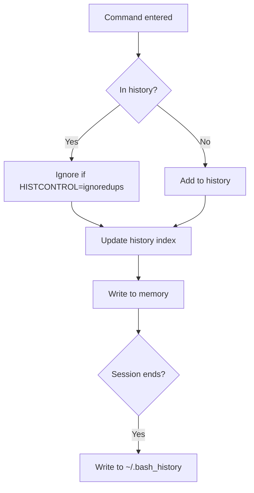

# Ubuntu Command History

## Introduction

When working with the Ubuntu Terminal, you'll often find yourself repeating commands or wanting to reference previously executed commands. Ubuntu's command history feature is a powerful tool that stores your previously executed commands, allowing you to recall, reuse, and manage them efficiently. This history mechanism saves time, reduces typing errors, and helps you maintain a record of your terminal activities.

In this guide, we'll explore how the command history works in Ubuntu Terminal, how to navigate through it, search for specific commands, and customize its behavior to improve your productivity.

## Basic Command History Navigation

### Viewing Your Command History

The simplest way to view your command history is using the `history` command:

```bash
history
```

This will output something similar to:

```
  1  ls -la
  2  cd Documents
  3  mkdir project
  4  nano hello.py
  5  python hello.py
```

Each command is displayed with a number that can be used to reference it later.

### Navigating Through History Using Arrow Keys

The most common way to access previous commands is by using the arrow keys:

- <kbd>↑</kbd> (Up Arrow) - Shows the previous command
- <kbd>↓</kbd> (Down Arrow) - Shows the next command in the history list

This allows you to quickly cycle through recent commands without typing them again.

### Executing Commands from History

There are several ways to execute commands from your history:

1. **Using the exclamation mark (!)**:

   ```bash
   !number
   ```

   Executes the command at the specified history number.

   Example:

   ```bash
   !5
   ```

   This will execute the 5th command in your history (in our example, `python hello.py`).

2. **Last command (!!)**: 

   ```bash
   !!
   ```

   Executes the most recently used command.

3. **Command starting with specific text**:

   ```bash
   !text
   ```

   Executes the most recent command that starts with "text".

   Example:

   ```bash
   !py
   ```

   This might execute `python hello.py` if that's the most recent command starting with "py".

## Advanced History Navigation and Search

### Searching Through Command History

You can search through your command history using the <kbd>Ctrl</kbd>+<kbd>r</kbd> shortcut:

1. Press <kbd>Ctrl</kbd>+<kbd>r</kbd>
2. Type part of the command you're looking for
3. The most recent matching command will appear
4. Press <kbd>Ctrl</kbd>+<kbd>r</kbd> again to go to the next match
5. Press <kbd>Enter</kbd> to execute the displayed command

Example:

```
(reverse-i-search)`git': git commit -m "Initial commit"
```

### History Expansion

Bash provides powerful history expansion features:

| Syntax             | Description                                  | Example                                    |
|--------------------|----------------------------------------------|--------------------------------------------|
| `!!`               | Last command                                 | `sudo !!` (runs last command with sudo)    |
| `!n`               | Command number n                             | `!5` (runs 5th command in history)         |
| `!-n`              | Command n lines back                         | `!-2` (runs 2nd previous command)          |
| `!string`          | Most recent command starting with string     | `!ls` (runs last ls command)               |
| `!?string`         | Most recent command containing string        | `!?py` (runs last command containing "py") |
| `^string1^string2` | Replace string1 with string2 in last command | `^typo^fixed` (corrects a typo)            |

### Command History Arguments

You can reference arguments from previous commands:

| Syntax  | Description                                   |
|---------|-----------------------------------------------|
| `!$`    | Last argument of the previous command         |
| `!^`    | First argument of the previous command        |
| `!*`    | All arguments of the previous command         |
| `!:n`   | nth argument of the previous command          |
| `!:n-m` | Arguments n through m of the previous command |

Example:

```bash
mkdir -p projects/my-new-app
cd !$
```

The second command will expand to `cd projects/my-new-app`, reusing the last argument from the previous command.

## Customizing Command History Behavior

### History File Location

By default, your command history is stored in the `~/.bash_history` file. Each line in this file represents a command that was executed in the terminal.

### History Environment Variables

You can customize history behavior using these environment variables:

| Variable         | Description                             | Example Setting                           |
|------------------|-----------------------------------------|-------------------------------------------|
| `HISTSIZE`       | Maximum number of commands in memory    | `export HISTSIZE=10000`                   |
| `HISTFILESIZE`   | Maximum number of lines in history file | `export HISTFILESIZE=20000`               |
| `HISTCONTROL`    | Controls how commands are saved         | `export HISTCONTROL=ignoredups:erasedups` |
| `HISTIGNORE`     | Patterns to exclude from history        | `export HISTIGNORE="ls:cd:exit"`          |
| `HISTTIMEFORMAT` | Format for timestamps in history        | `export HISTTIMEFORMAT="%F %T "`          |

To make these changes permanent, add them to your `~/.bashrc` file:

```bash
# Add to your ~/.bashrc file
HISTSIZE=10000
HISTFILESIZE=20000
HISTCONTROL=ignoredups:erasedups
HISTIGNORE="ls:cd:pwd:exit:clear"
HISTTIMEFORMAT="%Y-%m-%d %H:%M:%S "

# Force commands to be saved to history immediately
shopt -s histappend
PROMPT_COMMAND="history -a; history -c; history -r; $PROMPT_COMMAND"
```

Let's explore what these settings do:

1. `HISTSIZE=10000`: Keeps 10,000 commands in memory
2. `HISTFILESIZE=20000`: Stores 20,000 commands in the history file
3. `HISTCONTROL=ignoredups:erasedups`: 
   - `ignoredups`: Don't store duplicate commands consecutively
   - `erasedups`: Remove all previous duplicates of a command
4. `HISTIGNORE="ls:cd:pwd:exit:clear"`: Don't save these common commands
5. `HISTTIMEFORMAT="%Y-%m-%d %H:%M:%S "`: Add timestamps to history
6. `shopt -s histappend`: Append to history file instead of overwriting
7. `PROMPT_COMMAND="history -a; history -c; history -r; $PROMPT_COMMAND"`: 
   - `history -a`: Append current session to history file
   - `history -c`: Clear current session history
   - `history -r`: Reload history from file
   
This configuration ensures history is immediately saved and shared between terminal sessions.

## Practical Examples and Use Cases

### Example 1: Correcting Typos in Commands

If you make a typo in a command, you can quickly fix it with the `^` syntax:

```bash
$ grpe "pattern" file.txt
Command 'grpe' not found

$ ^grpe^grep
grep "pattern" file.txt
```

### Example 2: Reusing Complex Commands

For complex commands that you use frequently but are hard to remember:

```bash
$ find . -type f -name "*.log" -mtime +30 -exec rm {} \;

# Later, to run the same command
$ !find
```

### Example 3: Creating Aliases for History Commands

You can create aliases for commonly used history commands:

```bash
# Add to your ~/.bashrc file
alias h='history'
alias hg='history | grep'
```

Then use them:

```bash
$ hg docker
  125  docker ps
  143  docker images
  157  docker-compose up -d
```

### Example 4: Combining with Pipes and Grep

The history command works well with pipes and grep:

```bash
$ history | grep "git commit"
  203  git commit -m "Fix login bug"
  245  git commit -am "Update documentation"
  267  git commit -m "Add new feature"
```

### Example 5: Running Multiple Commands from History

You can execute multiple commands from history:

```bash
$ !267 && !245
```

This runs command #267 followed by command #245.

## Best Practices for Command History

1. **Regularly review your command history** to identify frequently used commands that could be turned into aliases or scripts

2. **Use comments in your commands** by starting with `#` to provide context in your history:
   ```bash
   # This command will backup the database
   mysqldump -u root -p mydatabase > backup.sql
   ```

3. **Set a reasonable history size** to balance between having enough history and consuming too much disk space

4. **Use history expansions** to save time and reduce typing errors

5. **Share your history configuration** with your team for consistent experience across systems

## Command History Flowchart

Here's a visual representation of how command history works in Ubuntu:



## Troubleshooting Command History Issues

### History Not Saving Between Sessions

If your command history isn't being saved between terminal sessions:

1. Check if bash is your default shell:
   ```bash
   echo $SHELL
   ```

2. Verify your history file exists:
   ```bash
   ls -l ~/.bash_history
   ```

3. Check the file permissions:
   ```bash
   chmod 600 ~/.bash_history
   ```

4. Ensure `HISTSIZE` and `HISTFILESIZE` are set correctly.

### Duplicate Commands Appearing

If you're seeing too many duplicate commands, add this to your `~/.bashrc`:

```bash
export HISTCONTROL=ignoredups:erasedups
```

## Summary

The Ubuntu command history feature is a powerful tool that can significantly improve your productivity in the terminal. By mastering history navigation, search capabilities, and customization options, you can:

- Reduce typing by reusing complex commands
- Correct mistakes quickly
- Keep a record of your terminal activities
- Share commands between terminal sessions

The time invested in learning these techniques will pay off in your daily work with the Ubuntu Terminal.

## Additional Resources and Exercises

### Exercises

1. Configure your bash history to ignore common commands like `ls`, `cd`, and `clear`
2. Create an alias to display your last 10 commands
3. Practice using <kbd>Ctrl</kbd>+<kbd>r</kbd> to search for a command you used earlier
4. Modify your `.bashrc` to display timestamps in the history output
5. Write a small script that backs up your command history file weekly

### Further Reading

- The Bash manual section on History: `man bash` (search for "HISTORY EXPANSION")
- GNU Bash Reference Manual: History Interaction
- Linux Command Line books by William Shotts or Mark Sobell

By mastering command history in Ubuntu Terminal, you'll become more efficient and productive in your command-line work, saving time and reducing errors in your daily tasks.