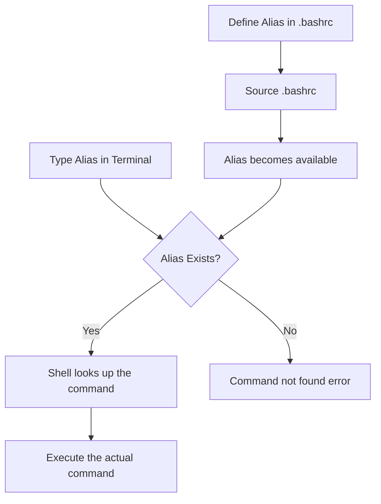

# Ubuntu Command Aliases

## Introduction

When working with the Ubuntu Terminal, you might find yourself repeatedly typing the same long commands. This is where **command aliases** come to the rescue! Aliases are shortcuts or custom commands that you define to represent longer, more complex commands. They can significantly improve your productivity and make your terminal experience more enjoyable.

In this tutorial, you'll learn how to create, manage, and use command aliases in Ubuntu. By the end, you'll be able to customize your terminal experience to suit your workflow and save valuable time.

## What Are Command Aliases?

An alias is simply a shortcut to a command or a series of commands. Instead of typing a long command with multiple options, you can create a short, memorable alias that performs the same action.

For example, instead of typing:

```bash
ls -la --color=auto
```

You could create an alias called `ll` that does the same thing:

```bash
ll
```

## Temporary Aliases

Let's start by creating a temporary alias that will only exist in your current terminal session.

### Creating a Temporary Alias

The basic syntax for creating an alias is:

```bash
alias alias_name='command'
```

For example, to create an alias called `cls` that clears the screen:

```bash
alias cls='clear'
```

Now you can type `cls` instead of `clear` to clear your terminal screen.

Let's create a few more examples:

```bash
alias update='sudo apt update && sudo apt upgrade -y'
alias ll='ls -la'
alias ..='cd ..'
alias ...='cd ../..'
```

### Testing Your Alias

Once you've created an alias, you can test it immediately:

```bash
# Input
cls

# Output
(screen clears)
```

```bash
# Input
..

# Output
(changes to parent directory)
```

### Viewing All Aliases

To see all the aliases currently defined in your session:

```bash
# Input
alias

# Output
alias cls='clear'
alias ll='ls -la'
alias ..='cd ..'
alias ...='cd ../..'
alias update='sudo apt update && sudo apt upgrade -y'
```

### Removing a Temporary Alias

To remove an alias for the current session, use the `unalias` command:

```bash
# Input
unalias cls

# Output
(no output, but cls alias is now removed)
```

## Permanent Aliases

Temporary aliases are lost when you close the terminal. To make aliases permanent, you need to add them to your shell configuration file.

### Adding Aliases to Your Bash Configuration

For Bash users, you can add aliases to your `~/.bashrc` file:

```bash
# Open the .bashrc file with a text editor
nano ~/.bashrc
```

Scroll to the bottom of the file and add your aliases:

```bash
# Custom aliases
alias update='sudo apt update && sudo apt upgrade -y'
alias ll='ls -la'
alias ..='cd ..'
alias ...='cd ../..'
alias gst='git status'
alias gl='git log --oneline'
```

Save the file and exit. To apply the changes immediately, reload your `.bashrc` file:

```bash
source ~/.bashrc
```

### For Zsh Users

If you're using Zsh, you'll need to edit the `~/.zshrc` file instead:

```bash
# Open the .zshrc file with a text editor
nano ~/.zshrc
```

Add your aliases, save the file, and reload:

```bash
source ~/.zshrc
```

## Practical Examples

Let's explore some practical examples of aliases that can boost your productivity.

### System Maintenance Aliases

```bash
# Update system packages
alias update='sudo apt update && sudo apt upgrade -y'

# Clean up apt cache
alias autoclean='sudo apt autoclean && sudo apt autoremove'

# Check disk usage in human-readable format
alias usage='du -h --max-depth=1 | sort -hr'

# Quick system info
alias sysinfo='echo "CPU:"; lscpu | grep "Model name"; echo "Memory:"; free -h; echo "Disk:"; df -h'
```

### Navigation Aliases

```bash
# Quick directory navigation
alias ..='cd ..'
alias ...='cd ../..'
alias ....='cd ../../..'

# Go to common directories
alias projects='cd ~/projects'
alias downloads='cd ~/Downloads'
alias docs='cd ~/Documents'
```

### Git Workflow Aliases

```bash
# Git status
alias gst='git status'

# Git commit with message
alias gcm='git commit -m'

# Git log in a readable format
alias gl='git log --oneline --graph --decorate'

# Git push to origin
alias gpo='git push origin'

# Git pull from origin
alias gplo='git pull origin'
```

### Network Aliases

```bash
# Check your public IP
alias myip='curl http://ipinfo.io/ip'

# List all open ports
alias ports='sudo netstat -tulanp'

# Simple HTTP server in current directory
alias webshare='python3 -m http.server 8000'
```

## Creating More Complex Aliases with Functions

For more complex commands, you can use functions in your `.bashrc` or `.zshrc` file:

```bash
# Create a new directory and navigate to it
mkcd() {
    mkdir -p "$1" && cd "$1"
}

# Extract various archive formats
extract() {
    if [ -f $1 ]; then
        case $1 in
            *.tar.bz2)   tar xjf $1     ;;
            *.tar.gz)    tar xzf $1     ;;
            *.bz2)       bunzip2 $1     ;;
            *.rar)       unrar e $1     ;;
            *.gz)        gunzip $1      ;;
            *.tar)       tar xf $1      ;;
            *.tbz2)      tar xjf $1     ;;
            *.tgz)       tar xzf $1     ;;
            *.zip)       unzip $1       ;;
            *.Z)         uncompress $1  ;;
            *.7z)        7z x $1        ;;
            *)           echo "'$1' cannot be extracted via extract()" ;;
        esac
    else
        echo "'$1' is not a valid file"
    fi
}
```

## Best Practices for Aliases

1. **Keep aliases short and memorable** - The purpose is to save time, so make them easy to type and remember.
2. **Don't override existing commands** - Avoid naming aliases with the same name as existing commands unless you specifically want to change their behavior.
3. **Document your aliases** - Add comments in your `.bashrc` or `.zshrc` file to remind yourself what each alias does.
4. **Group related aliases** - Organize your aliases by function or purpose for easier management.
5. **Use functions for complex commands** - If an alias requires arguments or conditional logic, consider using a function instead.

## Command Alias Flow

Here's a diagram showing how aliases work:



## Conclusion

Command aliases are powerful tools for customizing your Ubuntu Terminal experience and streamlining your workflow. By creating shortcuts for frequently used commands, you can save time, reduce typing errors, and make complex tasks simpler.

Remember that aliases are meant to be personal and tailored to your workflow. Start with the examples provided in this tutorial, and then create your own aliases based on the commands you use most frequently.

## Additional Resources

- **Man pages**: Type `man bash` and search for the "ALIASES" section for more information.
- **Bash documentation**: Read about aliases in the [GNU Bash manual](https://www.gnu.org/software/bash/manual/bash.html).
- **Ubuntu forums**: The [Ubuntu Forums](https://ubuntuforums.org/) are a great place to discover and share useful aliases.

## Exercises

1. Create an alias that displays system information (CPU, memory, disk usage) in a formatted way.
2. Create an alias that backs up an important configuration file before editing it.
3. Set up a function-based alias that searches for files containing specific text.
4. Create an alias that sets up a development environment with multiple terminal windows or tabs.
5. Review your command history (`history` command) and identify commands you use frequently that could benefit from aliases.