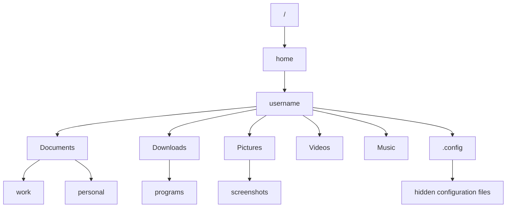

# Ubuntu Navigation Commands

## Introduction

In the Ubuntu terminal, navigation commands are fundamental for efficiently moving through the filesystem, locating files, and managing your working environment. These commands form the backbone of your interaction with the Linux filesystem, allowing you to traverse directories, search for files, and understand your current location within the system hierarchy.

This guide will walk you through the essential navigation commands that every Ubuntu user should know. Whether you're a complete beginner or looking to solidify your understanding of terminal navigation, these commands will empower you to work more efficiently in the command-line environment.

## Basic Navigation Commands

### pwd - Print Working Directory

The `pwd` command displays your current location in the filesystem (your "Present Working Directory").

```bash
pwd
```

Example output:
```
/home/username
```

This tells you that you're currently in the "username" directory, which is inside the "home" directory at the root of the filesystem.

### ls - List Directory Contents

The `ls` command lists the files and directories in your current location.

```bash
ls
```

Example output:
```
Documents  Downloads  Music  Pictures  Videos
```

#### Common ls options:

- `ls -l` - List in long format, showing permissions, owner, size, and modification date
- `ls -a` - Show all files, including hidden files (those starting with a dot)
- `ls -h` - Show file sizes in human-readable format (KB, MB, GB)

Combined example:

```bash
ls -lah
```

Example output:
```
total 112K
drwxr-xr-x 17 username username 4.0K Feb 15 14:32 .
drwxr-xr-x  3 root     root     4.0K Jan  5 09:23 ..
-rw-------  1 username username  20K Feb 15 14:32 .bash_history
-rw-r--r--  1 username username  220 Jan  5 09:23 .bash_logout
-rw-r--r--  1 username username 3.7K Jan  5 09:23 .bashrc
drwxr-xr-x  2 username username 4.0K Jan  8 12:45 Documents
drwxr-xr-x  3 username username 4.0K Jan 10 18:33 Downloads
drwxr-xr-x  2 username username 4.0K Jan  5 09:45 Music
drwxr-xr-x  2 username username 4.0K Jan  5 09:45 Pictures
drwxr-xr-x  2 username username 4.0K Jan  5 09:45 Videos
```

### cd - Change Directory

The `cd` command allows you to navigate to a different directory.

```bash
cd Documents
```

This command has no output when successful, but your prompt will typically update to show the new location.

#### Special directory references:

- `cd ~` - Navigate to your home directory
- `cd ..` - Move up one directory level (to the parent directory)
- `cd -` - Return to the previous directory
- `cd /` - Navigate to the root directory

Example sequence:

```bash
cd Documents
pwd
```

Output:
```
/home/username/Documents
```

```bash
cd ..
pwd
```

Output:
```
/home/username
```

## Advanced Navigation Commands

### find - Search for Files

The `find` command searches for files and directories based on various criteria.

Basic syntax:
```bash
find [path] [expression]
```

Example to find all `.txt` files in the current directory and its subdirectories:

```bash
find . -name "*.txt"
```

Example output:
```
./Documents/notes.txt
./Documents/project/readme.txt
./Downloads/instructions.txt
```

Find files modified in the last 7 days:

```bash
find ~/Documents -type f -mtime -7
```

### locate - Quick File Search

The `locate` command provides a faster way to search for files using a pre-built database.

```bash
locate filename.txt
```

Example output:
```
/home/username/Documents/filename.txt
/home/username/Projects/old/filename.txt
```

**Note:** You may need to install and update the database with:

```bash
sudo apt install mlocate
sudo updatedb
```

### which - Find Command Location

The `which` command shows the full path of a command.

```bash
which python3
```

Example output:
```
/usr/bin/python3
```

### whereis - Locate Binary, Source, and Manual Files

The `whereis` command locates the binary, source, and manual page files for a command.

```bash
whereis grep
```

Example output:
```
grep: /usr/bin/grep /usr/share/man/man1/grep.1.gz
```

## Directory Navigation Shortcuts

### Tab Completion

Pressing the `Tab` key while typing a path autocompletes directory and file names, saving time and preventing typing errors.

For example, typing `cd Doc` and pressing `Tab` will autocomplete to `cd Documents/` if there's only one matching directory.

### Directory Stack Commands

Ubuntu provides commands to manipulate a stack of directories, allowing you to bookmark and quickly jump between locations.

#### pushd and popd

- `pushd [directory]` - Adds a directory to the stack and changes to it
- `popd` - Removes the top directory from the stack and changes to the previous one
- `dirs` - Displays the current directory stack

Example sequence:

```bash
pushd ~/Documents
# Do some work in Documents
pushd ~/Downloads
# Do some work in Downloads
popd
# You're back in Documents
popd
# You're back where you started
```

## Real-World Applications

### Scenario 1: Project Navigation

Let's say you're working on a web development project with multiple components:

```bash
# Navigate to your project directory
cd ~/Projects/my-website

# Check what's in the directory
ls -la

# Go to the frontend code
cd frontend

# Check the source files
ls -l src/

# Return to the main project directory
cd ..

# Go to the backend code
cd backend

# Return to your home directory when finished
cd ~
```

### Scenario 2: Finding and Organizing Files

```bash
# Find all JavaScript files modified in the last 3 days
find ~/Projects -name "*.js" -mtime -3

# Count how many Python files you have in your projects
find ~/Projects -name "*.py" | wc -l

# Find large files that might need cleaning up
find ~ -type f -size +100M
```

### Scenario 3: Creating a Navigation Workflow

```bash
# Create project directories
mkdir -p ~/Projects/new-app/{frontend,backend,docs}

# Navigate to the new project
cd ~/Projects/new-app

# Check the structure
ls -la

# Move into the frontend, create some directories
cd frontend
mkdir -p src/{components,assets,styles}

# Check what we've created
ls -R
```

## Directory Structure Visualization

Let's visualize a typical Ubuntu home directory structure:



## Summary

Navigating the Ubuntu terminal efficiently is a fundamental skill for any Linux user. These commands allow you to:

- Determine your current location with `pwd`
- View directory contents with `ls` and its options
- Move between directories with `cd` and its shortcuts
- Find files and directories using `find` and `locate`
- Work with the directory stack using `pushd` and `popd`

Mastering these navigation commands will significantly improve your productivity in the terminal and provide a solid foundation for more advanced Ubuntu command-line operations.

## Additional Resources

- Try the `man` command followed by any command name (e.g., `man ls`) to access detailed documentation
- Practice with the following exercises:
  1. Create a directory structure for a mock project and practice navigating between components
  2. Use `find` to locate all image files in your home directory
  3. Set up a directory stack to jump between frequently accessed locations

## Advanced Exercises

1. Write a simple bash script that:
   - Takes a directory path as input
   - Lists all subdirectories, sorted by size
   - Outputs the result to a text file

2. Navigate your filesystem using only relative paths (no absolute paths) to find a specific file, starting from your home directory.

3. Create an alias in your `.bashrc` file for a complex navigation command that you use frequently.