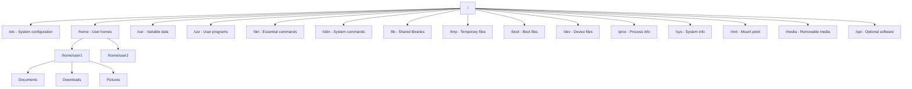

# Ubuntu File Commands

## Introduction

File management is one of the most fundamental skills for working with Ubuntu or any Linux-based operating system. While graphical file managers provide a visual way to work with files, mastering terminal file commands gives you more power, flexibility, and efficiency.

In this guide, we'll explore the essential Ubuntu file commands that every beginner should know. These commands will help you navigate the file system, create, view, modify, and organize your files directly from the terminal.

## Basic Navigation Commands

### pwd - Print Working Directory

The `pwd` command shows your current location in the file system.

```bash
pwd
```

Output example:
```
/home/username
```

### ls - List Files and Directories

The `ls` command displays the contents of the current directory.

```bash
# Basic listing
ls

# List with details (permissions, owner, size, modified date)
ls -l

# List all files including hidden ones (starting with .)
ls -a

# List with human-readable file sizes
ls -lh
```

Output example:
```
$ ls -lh
total 28K
drwxr-xr-x 2 user user 4.0K Mar 10 15:42 Documents
drwxr-xr-x 2 user user 4.0K Mar 10 15:42 Downloads
drwxr-xr-x 2 user user 4.0K Mar 10 15:42 Pictures
-rw-r--r-- 1 user user  12K Mar 10 15:45 example.txt
```

### cd - Change Directory

The `cd` command allows you to navigate between directories.

```bash
# Move to a specific directory
cd Documents

# Move to home directory
cd ~
# or simply
cd

# Move up one directory level
cd ..

# Move to the previous directory
cd -

# Move to an absolute path
cd /etc/nginx
```

## File Creation and Modification

### touch - Create Empty Files

The `touch` command creates a new empty file or updates the timestamp of an existing file.

```bash
# Create a single file
touch file.txt

# Create multiple files
touch file1.txt file2.txt file3.txt
```

### mkdir - Create Directories

The `mkdir` command creates new directories.

```bash
# Create a single directory
mkdir my_folder

# Create multiple directories
mkdir folder1 folder2 folder3

# Create nested directories (parent directories if they don't exist)
mkdir -p parent/child/grandchild
```

### cp - Copy Files and Directories

The `cp` command copies files and directories.

```bash
# Copy a file
cp source.txt destination.txt

# Copy a file to a directory
cp file.txt my_folder/

# Copy multiple files to a directory
cp file1.txt file2.txt my_folder/

# Copy a directory and its contents recursively
cp -r source_directory/ destination_directory/
```

### mv - Move or Rename Files and Directories

The `mv` command moves files and directories or renames them.

```bash
# Rename a file
mv oldname.txt newname.txt

# Move a file to a directory
mv file.txt my_folder/

# Move multiple files to a directory
mv file1.txt file2.txt my_folder/

# Move and rename at the same time
mv file.txt my_folder/newname.txt

# Rename a directory
mv old_directory/ new_directory/
```

### rm - Remove Files and Directories

The `rm` command deletes files and directories. **Be careful with this command as deletions are permanent!**

```bash
# Remove a file
rm file.txt

# Remove multiple files
rm file1.txt file2.txt

# Remove a directory and its contents recursively
rm -r directory/

# Force remove without confirmation
rm -f file.txt

# Recursive and force remove (use with extreme caution!)
rm -rf directory/
```

## File Viewing and Editing

### cat - Concatenate and Display Files

The `cat` command displays the contents of a file.

```bash
cat file.txt
```

Output example:
```
$ cat hello.txt
Hello, Ubuntu!
This is a text file example.
```

### head - Display the Beginning of a File

The `head` command shows the first 10 lines of a file by default.

```bash
# Display first 10 lines
head file.txt

# Display first n lines
head -n 5 file.txt
```

### tail - Display the End of a File

The `tail` command shows the last 10 lines of a file by default.

```bash
# Display last 10 lines
tail file.txt

# Display last n lines
tail -n 5 file.txt

# Follow file updates in real-time (useful for log files)
tail -f /var/log/syslog
```

### less - View Files with Pagination

The `less` command allows you to view files one page at a time, with navigation capabilities.

```bash
less file.txt
```

Navigation in `less`:
- `Space` or `Page Down`: Next page
- `b` or `Page Up`: Previous page
- `/pattern`: Search for pattern
- `n`: Next search result
- `q`: Quit

### nano - Simple Text Editor

The `nano` editor is a beginner-friendly text editor for modifying files.

```bash
nano file.txt
```

Basic nano commands:
- `Ctrl+O`: Save file
- `Ctrl+X`: Exit
- `Ctrl+G`: Help

## File Information and Searching

### file - Determine File Type

The `file` command displays the type of a file.

```bash
file document.pdf
```

Output example:
```
$ file image.jpg
image.jpg: JPEG image data, JFIF standard 1.01
```

### find - Search for Files

The `find` command searches for files and directories in a directory hierarchy.

```bash
# Find files by name in current directory and subdirectories
find . -name "*.txt"

# Find files modified in the last 7 days
find /home/user -type f -mtime -7

# Find files larger than 10MB
find /var -size +10M

# Find empty files
find . -type f -empty
```

Output example:
```
$ find . -name "*.txt"
./notes.txt
./documents/report.txt
./backup/old.txt
```

### grep - Search for Patterns in Files

The `grep` command searches for specified patterns within files.

```bash
# Search for a pattern in a file
grep "ubuntu" file.txt

# Search recursively in all directories
grep -r "function" .

# Search case-insensitively
grep -i "error" log.txt

# Show line numbers
grep -n "TODO" *.js
```

Output example:
```
$ grep -i "ubuntu" notes.txt
Ubuntu is a popular Linux distribution.
I'm learning Ubuntu file commands.
ubuntu terminal is powerful.
```

## File Permissions and Ownership

### chmod - Change File Permissions

The `chmod` command modifies file permissions (read, write, execute).

```bash
# Give execute permission to the owner
chmod u+x script.sh

# Remove write permission from group and others
chmod go-w file.txt

# Set specific permissions using octal notation
chmod 755 script.sh  # rwxr-xr-x
chmod 644 file.txt   # rw-r--r--
```

### chown - Change File Owner and Group

The `chown` command changes the owner and/or group of a file.

```bash
# Change owner
sudo chown newowner file.txt

# Change owner and group
sudo chown newowner:newgroup file.txt

# Change owner recursively for a directory
sudo chown -R newowner directory/
```

## Advanced File Operations

### ln - Create Links

The `ln` command creates links between files.

```bash
# Create a hard link
ln file.txt hardlink

# Create a symbolic (soft) link
ln -s file.txt symlink
ln -s /path/to/directory dir_link
```

### tar - Archive Files

The `tar` command archives multiple files into a single file (often called a tarball).

```bash
# Create a tar archive
tar -cf archive.tar file1 file2 directory/

# Create a compressed tar archive with gzip
tar -czf archive.tar.gz file1 file2 directory/

# Extract files from a tar archive
tar -xf archive.tar

# Extract files from a compressed tar archive
tar -xzf archive.tar.gz
```

### du - Disk Usage

The `du` command shows the disk space used by files and directories.

```bash
# Show disk usage of a directory
du -h directory/

# Show total disk usage summary
du -sh directory/

# Show disk usage of all directories in current location
du -h --max-depth=1
```

Output example:
```
$ du -h --max-depth=1
4.0K    ./Documents
152M    ./Downloads
1.8G    ./Pictures
5.4G    .
```

### df - Disk Free Space

The `df` command shows available and used disk space on the file system.

```bash
# Show all file systems
df

# Show human-readable sizes
df -h
```

Output example:
```
$ df -h
Filesystem      Size  Used Avail Use% Mounted on
/dev/sda1       234G  45G  177G  21% /
/dev/sdb1       932G  81G  804G   9% /home
```

## Practical Examples

### Example 1: Creating a Backup of Important Files

```bash
# Create a directory for backups
mkdir -p ~/backups/$(date +%Y-%m-%d)

# Copy important files to the backup directory
cp -r ~/Documents/important ~/Pictures/family ~/backups/$(date +%Y-%m-%d)/

# Create a compressed archive of the backup
tar -czf ~/backups/backup-$(date +%Y-%m-%d).tar.gz ~/backups/$(date +%Y-%m-%d)/

# Check the size of the backup
du -h ~/backups/backup-$(date +%Y-%m-%d).tar.gz
```

### Example 2: Finding and Deleting Large Files to Free Up Space

```bash
# Find files larger than 100MB
find /home/username -type f -size +100M

# Sort files by size and show the 10 largest files
find /home/username -type f -exec du -h {} \; | sort -rh | head -n 10

# Remove specific large files that are no longer needed
rm /path/to/large/file.iso
```

### Example 3: Organizing Files by Type

```bash
# Create directories for different file types
mkdir -p ~/sorted/{documents,images,videos,archives}

# Move files to appropriate directories based on extension
find ~/Downloads -name "*.pdf" -o -name "*.doc" -o -name "*.txt" | xargs -I {} mv {} ~/sorted/documents/
find ~/Downloads -name "*.jpg" -o -name "*.png" -o -name "*.gif" | xargs -I {} mv {} ~/sorted/images/
find ~/Downloads -name "*.mp4" -o -name "*.avi" -o -name "*.mkv" | xargs -I {} mv {} ~/sorted/videos/
find ~/Downloads -name "*.zip" -o -name "*.tar.gz" -o -name "*.rar" | xargs -I {} mv {} ~/sorted/archives/
```

## File System Structure

Ubuntu, like other Linux distributions, follows the Filesystem Hierarchy Standard (FHS). Understanding this structure helps you navigate the system effectively.



## Summary

Ubuntu file commands are powerful tools for managing your files and directories efficiently from the terminal. In this guide, we covered:

- Basic navigation commands to move around the file system
- Creating and modifying files and directories
- Viewing and editing file contents
- Searching for files and file contents
- Managing file permissions and ownership
- Performing advanced file operations like archiving and linking
- Practical examples for real-world scenarios

Mastering these commands will significantly enhance your productivity in Ubuntu and provide a solid foundation for more advanced Linux skills.

## Additional Resources and Exercises

### Exercises

1. **Navigation Challenge**: Without using a graphical file manager, navigate to `/etc/apt`, list all files, then return to your home directory.

2. **File Creation Project**: Create a directory structure for a web project with folders for HTML, CSS, and JavaScript files. Create sample files in each directory.

3. **Permission Practice**: Create a bash script, make it executable, and run it. Then modify permissions to allow others to execute but not modify it.

4. **Search and Replace**: Use `grep` and other commands to find all instances of a specific word in a set of text files and replace it with another word.

5. **Space Management**: Identify the largest files and directories on your system and create a report showing potential space-saving opportunities.

### Further Learning

- Learn about shell scripting to automate file operations
- Explore more advanced text editors like Vim or Emacs
- Study regular expressions for more powerful searching with grep
- Discover version control systems like Git for tracking file changes