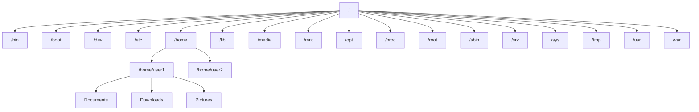

# Ubuntu Directory Commands

## Introduction

Navigating and manipulating directories (folders) is one of the most fundamental skills for working effectively in the Ubuntu Terminal. Unlike graphical file managers, the command line requires specific commands to navigate the filesystem, create directories, and manage file structures. Mastering these commands will significantly enhance your productivity when working with Ubuntu.

The Linux filesystem is organized in a hierarchical tree-like structure, starting from the root directory (`/`). Understanding how to navigate this structure is essential for any Ubuntu user or developer.

## Essential Directory Commands

### Viewing Your Current Location

#### pwd (Print Working Directory)

The `pwd` command shows your current location in the filesystem.

```bash
pwd
```

**Output:**
```
/home/username
```

This tells you that you're currently in the home directory of the user "username".

### Listing Directory Contents

#### ls (List)

The `ls` command displays the contents of the current directory.

```bash
ls
```

**Output:**
```
Documents  Downloads  Music  Pictures  Videos
```

#### Common ls Options

- `ls -l`: Long format listing with detailed information
- `ls -a`: Shows all files (including hidden files that start with a dot)
- `ls -h`: Shows file sizes in human-readable format
- `ls -R`: Lists subdirectories recursively

**Example with multiple options combined:**

```bash
ls -la
```

**Output:**
```
total 92
drwxr-xr-x 17 username username 4096 Mar 10 15:42 .
drwxr-xr-x  3 root     root     4096 Jan  5 09:23 ..
-rw-------  1 username username  220 Jan  5 09:23 .bash_logout
-rw-------  1 username username 3771 Mar  8 11:32 .bashrc
drwx------ 15 username username 4096 Mar  5 10:10 .cache
drwxr-xr-x  4 username username 4096 Feb 22 19:15 Documents
drwxr-xr-x  3 username username 4096 Mar  2 14:30 Downloads
drwxr-xr-x  2 username username 4096 Jan  6 15:12 Music
drwxr-xr-x  2 username username 4096 Jan  6 15:12 Pictures
drwxr-xr-x  2 username username 4096 Jan  6 15:12 Videos
```

### Navigating Between Directories

#### cd (Change Directory)

The `cd` command allows you to navigate between directories.

```bash
cd Documents
```

This command doesn't produce any output when successful, but it changes your current working directory to "Documents".

You can verify the change with `pwd`:

```bash
pwd
```

**Output:**
```
/home/username/Documents
```

#### Special Directory References

- `cd ..`: Move to the parent directory
- `cd ~`: Move to your home directory
- `cd /`: Move to the root directory
- `cd -`: Move to the previous directory you were in

**Example:**

```bash
cd ..
pwd
```

**Output:**
```
/home/username
```

### Creating Directories

#### mkdir (Make Directory)

The `mkdir` command creates new directories.

```bash
mkdir Projects
```

To create a directory with spaces in its name, use quotes:

```bash
mkdir "Web Development"
```

#### Creating Nested Directories

Use the `-p` flag to create parent directories if they don't exist:

```bash
mkdir -p Projects/Python/Experiments
```

This creates the "Projects" directory (if it doesn't exist), then "Python" within it, and finally "Experiments" within "Python".

### Removing Directories

#### rmdir (Remove Directory)

The `rmdir` command removes empty directories.

```bash
rmdir Projects
```

If the directory is not empty, you'll get an error:

```
rmdir: failed to remove 'Projects': Directory not empty
```

#### rm (Remove)

To remove non-empty directories, use `rm` with the `-r` (recursive) flag:

```bash
rm -r Projects
```

**Warning:** Be extremely careful with this command, especially when combined with wildcards or the `-f` (force) option, as it can delete data permanently without confirmation.

For safer deletion, add the `-i` (interactive) flag to get prompted for confirmation:

```bash
rm -ri Projects
```

### Copying Directories

#### cp (Copy)

To copy directories, use `cp` with the `-r` (recursive) flag:

```bash
cp -r Documents Documents_Backup
```

This copies the "Documents" directory and all its contents to a new directory called "Documents_Backup".

### Moving and Renaming Directories

#### mv (Move)

The `mv` command can move directories or rename them:

**Moving a directory:**
```bash
mv Projects /home/username/Documents/
```

This moves the "Projects" directory into the "Documents" directory.

**Renaming a directory:**
```bash
mv Projects ProjectsArchive
```

This renames the "Projects" directory to "ProjectsArchive".

## Directory Structure Visualization

Understanding the Linux directory structure is essential. Here's a simplified diagram of the standard Linux filesystem hierarchy:



## Practical Examples

### Example 1: Setting Up a Project Directory Structure

Let's create a structured directory for a web development project:

```bash
# Navigate to home directory
cd ~

# Create the project directory structure
mkdir -p WebProjects/Portfolio/src/{css,js,images}
mkdir -p WebProjects/Portfolio/docs

# Verify the structure
ls -R WebProjects
```

**Output:**
```
WebProjects:
Portfolio

WebProjects/Portfolio:
docs  src

WebProjects/Portfolio/docs:

WebProjects/Portfolio/src:
css  images  js
```

### Example 2: Organizing Files

Imagine you have downloaded various documents and want to organize them:

```bash
# Create directories for different document types
mkdir -p Documents/{PDFs,Spreadsheets,Presentations}

# Move files to appropriate directories
mv Downloads/*.pdf Documents/PDFs/
mv Downloads/*.xlsx Documents/Spreadsheets/
mv Downloads/*.pptx Documents/Presentations/

# Check the result
ls Documents/PDFs/
```

### Example 3: Creating a Backup

Creating backups of important directories:

```bash
# Create a backup directory with today's date
mkdir ~/Backups/$(date +%Y-%m-%d)

# Copy important directories to the backup location
cp -r ~/Documents ~/Projects ~/Backups/$(date +%Y-%m-%d)/

# Verify the backup
ls -la ~/Backups/$(date +%Y-%m-%d)/
```

## Advanced Directory Commands

### Finding Directories

#### find

The `find` command can locate directories that match specific criteria:

```bash
# Find all directories named "logs" in your home directory
find ~ -type d -name "logs"

# Find directories modified in the last 7 days
find ~ -type d -mtime -7

# Find empty directories
find ~ -type d -empty
```

### Disk Usage

#### du (Disk Usage)

The `du` command shows the disk space used by directories:

```bash
# Show disk usage of the current directory
du -h --max-depth=1
```

**Output:**
```
16K     ./Pictures
24K     ./Music
128K    ./Documents
256K    ./Downloads
4.0M    .
```

## Summary

Directory commands in Ubuntu are essential tools for effective filesystem navigation and management. In this guide, we've covered:

- Viewing your current location with `pwd`
- Listing directory contents with `ls`
- Navigating between directories with `cd`
- Creating new directories with `mkdir`
- Removing directories with `rmdir` and `rm -r`
- Copying directories with `cp -r`
- Moving and renaming directories with `mv`
- Finding directories with `find`
- Checking disk usage with `du`

Mastering these commands will significantly improve your efficiency when working with the Ubuntu Terminal. Practice these commands regularly to build muscle memory and comfort with the command line interface.

## Exercises

1. Create a multi-level directory structure for a fictional project of your choice with at least 5 subdirectories.
2. Navigate through the directory structure you created using relative and absolute paths.
3. Create a backup of the structure with a different name.
4. Use the `find` command to locate specific directories in your structure.
5. Calculate the disk usage of different directories in your home folder.

## Additional Resources

- The `man` command (e.g., `man ls`) provides detailed documentation for any command
- The GNU Coreutils documentation covers most of these commands in detail
- Online Linux command references like Linux Journey or The Linux Command Line book by William Shotts