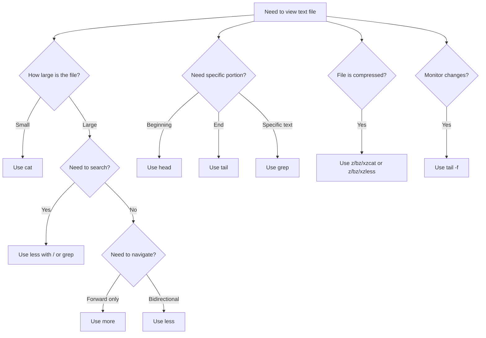

# Ubuntu Text Viewing

## Introduction

Working with text files is a fundamental skill for any programmer or system administrator using Ubuntu. The terminal provides powerful tools for viewing, searching, and analyzing text files without the need for graphical editors. In this guide, we'll explore the most common commands for viewing text files in the Ubuntu terminal, their practical applications, and how to use them effectively.

## Basic Text Viewing Commands

### The `cat` Command

The simplest way to display the contents of a file is using the `cat` command (short for concatenate):

```bash
cat filename.txt
```

**Example:**
```bash
cat hello.txt
```

**Output:**
```
Hello World!
This is a simple text file.
Created for demonstration purposes.
```

**When to use `cat`:**
- For small files that fit on a single screen
- When you need to quickly view the entire content at once
- For concatenating multiple files together

:::tip
For larger files, `cat` will output everything at once which can be overwhelming. In such cases, use `less` or `more` commands described below.
:::

### The `more` Command

The `more` command displays text one screen at a time:

```bash
more filename.txt
```

**Navigation in `more`:**
- Press `Space` to view the next page
- Press `Enter` to advance one line
- Press `q` to quit

**When to use `more`:**
- For files that don't fit on a single screen
- When you need simple forward navigation

### The `less` Command

The `less` command is an improved version of `more` with bidirectional scrolling:

```bash
less filename.txt
```

**Navigation in `less`:**
- Use `↑` and `↓` keys to scroll line by line
- Use `Space` or `Page Down` to go forward one page
- Use `b` or `Page Up` to go back one page
- Press `/` followed by text to search forward
- Press `?` followed by text to search backward
- Press `n` to find the next occurrence
- Press `N` to find the previous occurrence
- Press `q` to quit

**Example:**
```bash
less /var/log/syslog
```

**When to use `less`:**
- For large files like logs
- When you need to search through content
- When you need bidirectional navigation

:::note
The `less` command is one of the most versatile text viewers in Ubuntu. Remember the phrase "less is more" (meaning `less` has more features than `more`).
:::

## Viewing File Portions

### The `head` Command

The `head` command shows the first 10 lines of a file by default:

```bash
head filename.txt
```

You can specify how many lines to display:

```bash
head -n 5 filename.txt
```

**Example:**
```bash
head -n 3 /etc/passwd
```

**Output:**
```
root:x:0:0:root:/root:/bin/bash
daemon:x:1:1:daemon:/usr/sbin:/usr/sbin/nologin
bin:x:2:2:bin:/bin:/usr/sbin/nologin
```

**When to use `head`:**
- To check the beginning of files
- To preview file content
- To extract header information

### The `tail` Command

The `tail` command shows the last 10 lines of a file by default:

```bash
tail filename.txt
```

You can specify how many lines to display:

```bash
tail -n 5 filename.txt
```

**Example:**
```bash
tail -n 3 /var/log/syslog
```

**Output:**
```
Mar 12 21:45:03 ubuntu systemd[1]: Starting Daily apt download activities...
Mar 12 21:45:04 ubuntu systemd[1]: apt-daily.service: Succeeded.
Mar 12 21:45:04 ubuntu systemd[1]: Finished Daily apt download activities.
```

A particularly useful feature of `tail` is the `-f` (follow) option, which continuously displays new lines as they're added to the file:

```bash
tail -f /var/log/syslog
```

**When to use `tail`:**
- To check the end of files
- To monitor log files in real-time with `-f`
- To view the most recent entries

## Advanced Text Viewing

### The `grep` Command

While not strictly a viewing command, `grep` is essential for finding and displaying specific text within files:

```bash
grep "search_term" filename.txt
```

**Example:**
```bash
grep "error" /var/log/syslog
```

**Output:**
```
Mar 12 15:23:42 ubuntu app[1234]: An error occurred during network initialization
Mar 12 16:45:12 ubuntu kernel: [ERROR] Failed to allocate memory
```

**Search options:**
- `-i`: Case-insensitive search
- `-n`: Show line numbers
- `-r`: Recursive search through directories
- `-v`: Show lines that do NOT match

**Example with options:**
```bash
grep -in "warning" /var/log/syslog
```

**Output:**
```
143:Mar 12 14:32:11 ubuntu app[5678]: Warning: Configuration file missing
267:Mar 12 18:15:09 ubuntu kernel: [WARNING] Temperature threshold exceeded
```

### Viewing Compressed Files

Ubuntu provides special commands to view compressed files without explicitly extracting them:

**For .gz files:**
```bash
zcat file.txt.gz
zless file.txt.gz
```

**For .bz2 files:**
```bash
bzcat file.txt.bz2
bzless file.txt.bz2
```

**For .xz files:**
```bash
xzcat file.txt.xz
xzless file.txt.xz
```

**Example:**
```bash
zless /var/log/syslog.1.gz
```

## Practical Examples

### Example 1: Analyzing Log Files

Finding and analyzing error messages in a server log:

```bash
# View the last 100 lines of a log file
tail -n 100 /var/log/apache2/error.log

# Follow new entries in real-time
tail -f /var/log/apache2/access.log

# Search for error messages
grep -i "error" /var/log/apache2/error.log

# Search for a specific IP address
grep "192.168.1.42" /var/log/apache2/access.log
```

### Example 2: Examining Configuration Files

Reviewing and understanding system configuration files:

```bash
# View the SSH server configuration
less /etc/ssh/sshd_config

# Find specific settings in the Apache configuration
grep -n "DocumentRoot" /etc/apache2/sites-available/000-default.conf

# Check the first 20 lines of a config file for comments
head -n 20 /etc/mysql/mysql.conf.d/mysqld.cnf
```

### Example 3: Combining Commands with Pipes

Ubuntu's command-line power comes from combining commands with pipes:

```bash
# Find lines containing "error" and show the last 5
grep "error" /var/log/syslog | tail -n 5

# Count how many warning messages are in a log file
grep -i "warning" /var/log/syslog | wc -l

# Find unique IP addresses in an Apache access log
grep -o '[0-9]\{1,3\}\.[0-9]\{1,3\}\.[0-9]\{1,3\}\.[0-9]\{1,3\}' /var/log/apache2/access.log | sort | uniq
```

## Text Viewing Workflow Diagram

Here's a decision flow for choosing the right text viewing command:



## Summary

Ubuntu terminal provides a comprehensive suite of tools for viewing text files:

- **Basic viewing**: `cat`, `more`, `less`
- **Viewing portions**: `head`, `tail`
- **Searching content**: `grep`
- **For compressed files**: `zcat`, `zless`, etc.

Mastering these commands will significantly enhance your productivity when working with text files in the Ubuntu terminal. Each command has its specific use case, and often they can be combined together using pipes for more powerful text processing.

## Additional Resources

- **Practice Exercises:**
  1. Create a large text file and practice navigating through it with `less`
  2. Monitor a log file in real-time using `tail -f` while performing actions that generate log entries
  3. Use `grep` to find all occurrences of a specific term in your home directory recursively

- **Advanced Topics to Explore:**
  - Text processing with `awk` and `sed`
  - Regular expressions with `grep`
  - Binary file analysis with `hexdump` and `strings`

:::tip Key Takeaway
Learning these text viewing commands is essential as they form the foundation of file interaction in the terminal. Once mastered, you'll find yourself working more efficiently with configuration files, logs, and code in Ubuntu.
:::