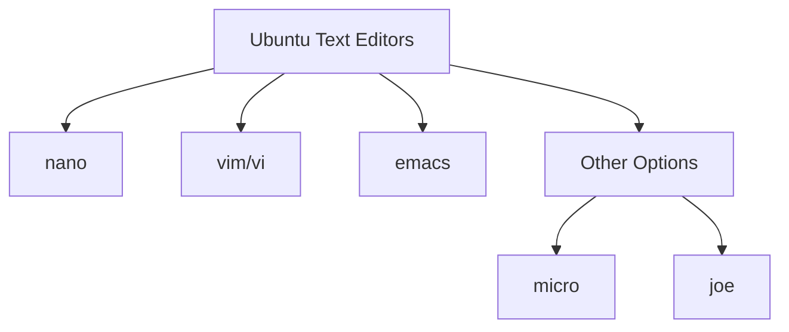

# Ubuntu Text Editing

## Introduction

Text editing is a fundamental skill for any programmer or system administrator working in a Linux environment like Ubuntu. While graphical text editors are available, mastering terminal-based text editors provides several advantages:

- You can work on remote servers where no graphical interface is available
- Terminal editors are lightweight and start instantly
- They can be used in recovery situations when the graphical interface isn't functioning
- They're highly customizable and can boost your productivity significantly

In this guide, we'll explore the most common text editors available in the Ubuntu terminal, focusing on how to create, modify, and save text files efficiently.

## Common Text Editors in Ubuntu

Ubuntu comes with several text editors pre-installed. The most common ones are:



Each editor has its strengths and learning curve:

| Editor | Learning Curve | Features | Best For |
|--------|----------------|----------|----------|
| nano   | Low            | Basic    | Beginners, quick edits |
| vim/vi | High           | Advanced | Power users, programming |
| emacs  | High           | Extensive | Development environments |
| micro  | Low            | Intuitive | Modern alternative to nano |

Let's explore each of these in detail.

## The Nano Editor

Nano is the most beginner-friendly text editor in Ubuntu. It's intuitive and displays keyboard shortcuts at the bottom of the screen.

### Opening Files with Nano

To open a file with nano, simply type:

```bash
nano filename.txt
```

If the file doesn't exist, nano will create it when you save.

### Basic Nano Commands

The interface shows keyboard shortcuts at the bottom. The `^` symbol represents the Ctrl key:

- `Ctrl+G`: Display help
- `Ctrl+O`: Save file ("WriteOut")
- `Ctrl+X`: Exit nano
- `Ctrl+K`: Cut line
- `Ctrl+U`: Paste line
- `Ctrl+W`: Search for text
- `Ctrl+\_`: Go to line number

### Example: Creating a Simple Shell Script with Nano

Let's create a simple "Hello World" shell script:

```bash
nano hello.sh
```

In the editor, type:

```bash
#!/bin/bash
echo "Hello, Ubuntu world!"
```

To save, press `Ctrl+O`, confirm the filename by pressing Enter, then exit with `Ctrl+X`.

To make the script executable and run it:

```bash
chmod +x hello.sh
./hello.sh
```

Output:
```
Hello, Ubuntu world!
```

## The Vim Editor

Vim (Vi IMproved) is a powerful, highly configurable text editor that has a steeper learning curve but offers tremendous productivity benefits once mastered.

### Opening Files with Vim

To open a file with vim:

```bash
vim filename.txt
```

### Vim Modes

Vim's power comes from its different modes:

1. **Normal Mode**: For navigation and commands (default when you open vim)
2. **Insert Mode**: For typing text (enter by pressing `i`)
3. **Visual Mode**: For selecting text (enter by pressing `v`)
4. **Command-line Mode**: For executing commands (enter by pressing `:`)

### Basic Vim Commands

#### Getting In and Out of Vim

- `:q` - Quit (fails if unsaved changes)
- `:q!` - Quit without saving changes
- `:w` - Save
- `:wq` or `ZZ` - Save and quit

#### Switching Modes

- `i` - Enter insert mode at cursor
- `I` - Enter insert mode at beginning of line
- `a` - Enter insert mode after cursor
- `A` - Enter insert mode at end of line
- `Esc` - Return to normal mode from insert mode

#### Navigation in Normal Mode

- `h`, `j`, `k`, `l` - Move left, down, up, right
- `w` - Jump to start of next word
- `b` - Jump to start of previous word
- `0` - Jump to beginning of line
- `$` - Jump to end of line
- `gg` - Go to first line of document
- `G` - Go to last line of document

#### Editing in Normal Mode

- `dd` - Delete (cut) current line
- `yy` - Yank (copy) current line
- `p` - Paste after cursor
- `P` - Paste before cursor
- `u` - Undo
- `Ctrl+r` - Redo

### Example: Editing a Configuration File with Vim

Let's edit a sample configuration file:

```bash
vim sample.conf
```

In normal mode, navigate using the keyboard. Press `i` to enter insert mode and add:

```
# Sample configuration
server_name = ubuntu_server
port = 8080
debug = true
```

Press `Esc` to return to normal mode, then type `:wq` to save and quit.

## The Emacs Editor

Emacs is an extensible, customizable text editor with built-in functions for text editing, project management, and more.

### Opening Files with Emacs

```bash
emacs filename.txt
```

### Basic Emacs Commands

Emacs uses keyboard combinations, often involving the Ctrl key (`C-`) or Alt/Meta key (`M-`):

- `C-x C-f` - Open file
- `C-x C-s` - Save file
- `C-x C-c` - Exit emacs
- `C-g` - Cancel command
- `C-k` - Cut (kill) line
- `C-y` - Paste (yank)
- `C-space` - Begin selection
- `C-w` - Cut selection
- `M-w` - Copy selection
- `C-s` - Search forward
- `C-r` - Search backward

## Choosing the Right Editor for You

- **Nano**: Great for beginners and quick edits
- **Vim**: Excellent for power users who want efficiency
- **Emacs**: Perfect for those who want an extensible environment

## Specialized Text Manipulation Tools

Beyond full-featured text editors, Ubuntu offers specialized command-line tools for text manipulation:

### The `sed` Stream Editor

The `sed` command allows you to filter and transform text:

```bash
# Replace all instances of 'apple' with 'orange' in a file
sed 's/apple/orange/g' fruits.txt
```

### The `awk` Programming Language

`awk` is designed for pattern scanning and processing:

```bash
# Print the first field of each line
awk '{print $1}' data.txt
```

### The `grep` Command

`grep` finds patterns in files:

```bash
# Find all lines containing 'error' in log files
grep 'error' /var/log/*.log
```

## Practical Examples

### Example 1: Editing System Configuration Files

System administrators often need to modify configuration files. For example, to edit the SSH configuration:

```bash
sudo nano /etc/ssh/sshd_config
```

Navigate to the line containing `PermitRootLogin` and change it:

```
PermitRootLogin no
```

Save with `Ctrl+O` and exit with `Ctrl+X`. Then restart the SSH service:

```bash
sudo systemctl restart ssh
```

### Example 2: Creating a Python Script

Let's create a simple Python script using vim:

```bash
vim hello.py
```

Press `i` to enter insert mode and type:

```python
#!/usr/bin/env python3

def greet(name):
    """Return a greeting message"""
    return f"Hello, {name}! Welcome to Ubuntu."

if __name__ == "__main__":
    user_name = input("What's your name? ")
    message = greet(user_name)
    print(message)
```

Press `Esc`, then type `:wq` to save and exit. Make the script executable and run it:

```bash
chmod +x hello.py
./hello.py
```

Example interaction:
```
What's your name? Alice
Hello, Alice! Welcome to Ubuntu.
```

### Example 3: Mass Editing with Vim Macros

Vim macros can automate repetitive tasks. Let's say you have a list of items and want to convert them to a numbered list:

```
apple
banana
cherry
date
```

1. Open the file in vim: `vim fruits.txt`
2. Position cursor at the first line
3. Record a macro by typing `qa` (records to register 'a')
4. Type `I` to insert at beginning of line, type `1. `, press `Esc`
5. Type `j` to move down one line
6. Stop recording by typing `q`

To replay the macro on the next line and increment the number:
- Type `j` to move to the next line
- Type `:s/^/2. /` to add numbering to the second line

Continue this pattern or use more advanced vim features for automation.

## Summary

Text editing in the Ubuntu terminal offers powerful capabilities for both beginners and advanced users:

- **Nano** provides an accessible entry point with visible commands
- **Vim** offers unmatched efficiency once its modal editing paradigm is mastered
- **Emacs** serves as an extensible platform that can grow with your needs
- Specialized tools like **sed**, **awk**, and **grep** complement full editors for specific text processing tasks

Mastering at least one terminal-based text editor is essential for effective work in Linux environments, especially when working with remote servers or system configuration.

## Additional Resources

- Run `vimtutor` in your terminal for an interactive Vim tutorial
- Use `man nano`, `man vim`, or `man emacs` to access the manual pages
- For practicing vim commands: [Vim Adventures](https://vim-adventures.com/)

## Exercises

1. Create a new file using nano and write a brief introduction about yourself.
2. Open an existing configuration file with vim and practice navigating without using arrow keys.
3. Use sed to replace all occurrences of your name in a text file with "REDACTED".
4. Create a simple bash script that uses awk to extract and display specific columns from a CSV file.
5. Compare the experience of editing the same file with nano, vim, and emacs. Which editor feels most comfortable to you and why?