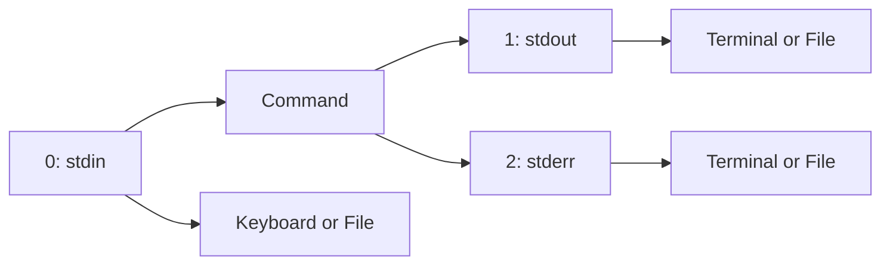

# Ubuntu Redirections

## Introduction

When working with the Ubuntu Terminal, understanding how to control the flow of data is essential for becoming a proficient command-line user. **Redirections** are powerful features that allow you to manipulate where input comes from and where output goes. Instead of just seeing command output on the screen, you can redirect it to files, use files as input, or connect commands together.

In this guide, we'll explore how Ubuntu's shell (Bash) handles three standard data streams and how you can redirect them to suit your needs:

1. **Standard Input (stdin)** - Data fed into commands (keyboard by default)
2. **Standard Output (stdout)** - Normal command output (terminal screen by default) 
3. **Standard Error (stderr)** - Error messages (terminal screen by default)

## Basic Output Redirection

### Redirecting Standard Output (stdout)

To redirect the standard output of a command to a file instead of displaying it on the screen, use the `>` operator:

```bash
ls -la > file_list.txt
```

This command lists all files in the current directory (including hidden files) and saves the output to a file named `file_list.txt` instead of displaying it on screen.

**Important:** The `>` operator will create a new file or **overwrite** an existing file's content without warning. If `file_list.txt` already existed, its previous content would be completely replaced.

### Appending Output to Files

If you want to add output to the end of an existing file without overwriting it, use the `>>` operator:

```bash
echo "New line of text" >> notes.txt
```

This command appends the text "New line of text" to the end of `notes.txt` (or creates the file if it doesn't exist).

**Example: Building a log file**

```bash
echo "Log started on $(date)" > logfile.txt
echo "First operation completed" >> logfile.txt
echo "Second operation completed" >> logfile.txt
cat logfile.txt
```

Output:
```
Log started on Thu Mar 13 10:30:45 EDT 2025
First operation completed
Second operation completed
```

## Redirecting Standard Error (stderr)

Error messages are sent to a separate output stream called stderr (standard error). To redirect error messages to a file, use `2>`:

```bash
find /etc -name "*.conf" 2> errors.txt
```

This command searches for configuration files in `/etc` and redirects any error messages (like "permission denied") to `errors.txt` while still showing successful results on the screen.

The number `2` refers to the file descriptor for standard error.

## Redirecting Both stdout and stderr

### Separate Files

To redirect standard output and standard error to different files:

```bash
find /etc -name "*.conf" > results.txt 2> errors.txt
```

### Same File

To redirect both standard output and error messages to the same file:

```bash
find /etc -name "*.conf" > all_output.txt 2>&1
```

In modern Bash, you can also use a simpler syntax:

```bash
find /etc -name "*.conf" &> all_output.txt
```

## Input Redirection

### Using Files as Input

To use a file as input instead of typing at the keyboard, use the `<` operator:

```bash
sort < unsorted_list.txt
```

This command takes the content of `unsorted_list.txt`, sorts it, and displays the sorted result on screen.

**Practical example: Processing a list of names**

Create a file with unsorted names:
```bash
echo -e "Zack
Amy
John
Lisa" > names.txt
```

Then sort it:
```bash
sort < names.txt
```

Output:
```
Amy
John
Lisa
Zack
```

### Here Documents (`<<`)

A "here document" allows you to include multiple lines of input text directly in your command using the `<<` operator followed by a delimiter word:

```bash
cat << EOF > poem.txt
Roses are red
Violets are blue
Linux is awesome
And so are you
EOF
```

This creates a file called `poem.txt` containing the four lines of text.

### Here Strings (`<<<`)

For shorter input strings, you can use the `<<<` operator:

```bash
grep "hello" <<< "hello world"
```

This searches for "hello" in the provided string "hello world".

## Pipeline Redirection

Pipelines (`|`) allow you to connect the output of one command to the input of another:

```bash
ls -la | grep ".txt"
```

This lists all files, then filters the results to show only those containing ".txt".

**Practical example: Counting files by type**

```bash
find . -type f | grep -o "\.[^\.]*$" | sort | uniq -c | sort -nr
```

This one-liner:
1. Finds all regular files in the current directory and subdirectories
2. Extracts just the file extension 
3. Sorts them
4. Counts unique occurrences
5. Sorts by frequency (most common first)

## Advanced Redirection Techniques

### Discarding Output

To discard output completely (send it to "nowhere"), redirect to `/dev/null`:

```bash
find /etc -name "*.conf" 2>/dev/null
```

This command will show only successful results and silently discard any error messages.

### Swapping stdout and stderr

Sometimes you might want to capture only error messages and ignore successful output:

```bash
find /etc -name "*.conf" 3>&1 1>&2 2>&3 | grep "Permission denied"
```

This complex redirection effectively swaps stdout and stderr, allowing you to pipe only the error messages to `grep`.

### Using tee for Dual Output

The `tee` command allows you to send output to a file while still displaying it on screen:

```bash
ls -la | tee file_list.txt
```

This command lists all files, saves the output to `file_list.txt`, and displays it on the terminal.

## Real-World Examples

### Example 1: Creating a System Backup Log

```bash
#!/bin/bash
echo "Backup started: $(date)" > backup.log
tar -czf backup.tar.gz /home/user/important_data >> backup.log 2>&1
echo "Backup completed: $(date)" >> backup.log
cat backup.log
```

This script creates a compressed backup and logs both normal messages and any errors to the same log file.

### Example 2: Extracting Specific Data from Logs

```bash
grep "ERROR" /var/log/syslog | cut -d':' -f3- | sort | uniq -c > error_summary.txt
```

This command extracts error messages from the system log, processes them to remove timestamps, sorts them, counts occurrences of each unique error, and saves the summary to a file.

### Example 3: Processing Data in a Pipeline

```bash
cat data.csv | grep -v "^#" | cut -d',' -f2,5 | sort | uniq > processed_data.txt
```

This pipeline:
1. Reads a CSV file
2. Removes comment lines (starting with #)
3. Extracts only the 2nd and 5th columns
4. Sorts and removes duplicates
5. Saves the result to a new file

## Redirection Operators Summary

Here's a quick reference guide to the redirection operators we've covered:

| Operator | Description |
|----------|-------------|
| `>` | Redirect stdout to a file (overwrite) |
| `>>` | Redirect stdout to a file (append) |
| `2>` | Redirect stderr to a file (overwrite) |
| `2>>` | Redirect stderr to a file (append) |
| `&>` | Redirect both stdout and stderr to a file (overwrite) |
| `&>>` | Redirect both stdout and stderr to a file (append) |
| `<` | Take input from a file |
| `<<` | Here document (multi-line input) |
| `<<<` | Here string (single-line input) |
| `\|` | Pipe output from one command to another |
| `/dev/null` | Discard output |

## Understanding File Descriptors

In Linux, everything is treated as a file, including input and output streams. Each stream is assigned a file descriptor number:

- 0: stdin (standard input)
- 1: stdout (standard output)
- 2: stderr (standard error)

This explains notation like `2>` (redirect file descriptor 2) and `2>&1` (redirect file descriptor 2 to where file descriptor 1 is going).



## Summary

Redirections are powerful tools in the Ubuntu Terminal that let you control where data comes from and where it goes. By mastering these techniques, you can:

- Save command output to files for later reference
- Handle errors effectively
- Process data from files without manual input
- Chain commands together to create powerful data processing pipelines
- Create more maintainable scripts and automation

With practice, these redirection operators will become second nature and an essential part of your command-line toolkit.

## Exercises

1. Create a script that searches your home directory for large files (over 100MB) and saves the results to a file called `large_files.txt`.

2. Write a command that counts the number of warning and error messages in your system log and saves a summary to a file.

3. Create a pipeline that extracts all unique IP addresses from your Apache access log.

4. Write a command that silently removes all empty directories in your current folder (hint: use `/dev/null` to hide error messages).

5. Create a here document that generates an HTML file with a simple webpage structure.

## Additional Resources

- The Bash manual: Access with `man bash` and look for the "REDIRECTION" section
- [GNU Bash manual online](https://www.gnu.org/software/bash/manual/)
- [Linux Documentation Project: Advanced Bash-Scripting Guide](https://tldp.org/LDP/abs/html/io-redirection.html)