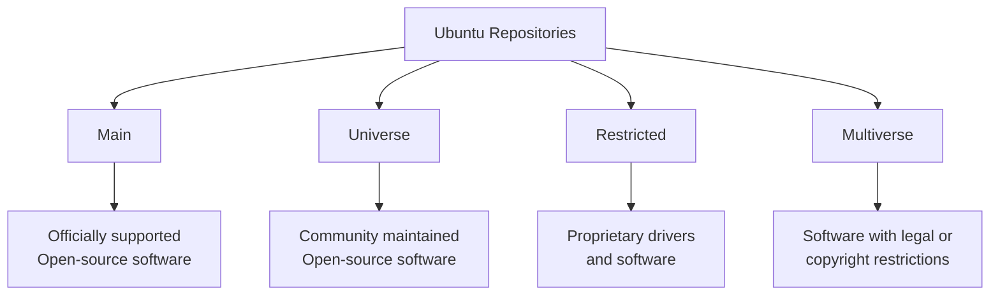

# Ubuntu Package Basics

## Introduction

Package management is a crucial skill for anyone working with Ubuntu or any Debian-based Linux distribution. Unlike traditional software installation methods on other operating systems, Ubuntu uses a centralized package management system that handles software installation, updates, and removal in a consistent and secure way. 

In this guide, we'll explore the fundamentals of Ubuntu package management, including what packages are, how repositories work, and the essential commands you'll need to manage software on your Ubuntu system.

## What is a Package?

In Ubuntu, a package is a compressed archive file containing all the files necessary for a specific application or software component to run. Packages typically include:

- The actual software/application files
- Metadata (information about the package)
- Dependencies (other packages required for it to work)
- Installation scripts
- Configuration files

Ubuntu primarily uses the `.deb` package format, which is the standard for Debian-based distributions.

## Package Repositories

Ubuntu's package management system relies on repositories—centralized storage locations that contain packages and information about them. Think of repositories as app stores for your operating system.

### Main Repository Types

Ubuntu organizes its repositories into four main components:

1. **Main** - Officially supported, open-source software
2. **Universe** - Community-maintained, open-source software
3. **Restricted** - Proprietary drivers and software
4. **Multiverse** - Software with legal or copyright restrictions



### Repository Configuration

Your system's repository information is stored in the `/etc/apt/sources.list` file and in the `/etc/apt/sources.list.d/` directory. These define which repositories your system will use when searching for and installing packages.

You can view your current repository configuration with:

```bash
cat /etc/apt/sources.list
```

Example output:
```
deb http://archive.ubuntu.com/ubuntu/ jammy main restricted
deb http://archive.ubuntu.com/ubuntu/ jammy-updates main restricted
deb http://archive.ubuntu.com/ubuntu/ jammy universe
deb http://archive.ubuntu.com/ubuntu/ jammy-updates universe
# Additional repositories...
```

## Package Management Tools

Ubuntu provides several tools for managing packages. Here are the most important ones:

### APT (Advanced Package Tool)

APT is the high-level package management tool that most users interact with. It resolves dependencies automatically and provides a user-friendly interface to the package management system.

#### Essential APT Commands

**Update Package Lists**

Before installing or upgrading packages, you should update your package lists:

```bash
sudo apt update
```

Output example:
```
Hit:1 http://archive.ubuntu.com/ubuntu jammy InRelease
Get:2 http://archive.ubuntu.com/ubuntu jammy-updates InRelease [119 kB]
Get:3 http://security.ubuntu.com/ubuntu jammy-security InRelease [110 kB]
Reading package lists... Done
Building dependency tree... Done
Reading state information... Done
All packages are up to date.
```

**Install Packages**

To install a package:

```bash
sudo apt install package-name
```

Example: Installing the `htop` system monitor:

```bash
sudo apt install htop
```

Output:
```
Reading package lists... Done
Building dependency tree... Done
Reading state information... Done
The following NEW packages will be installed:
  htop
0 upgraded, 1 newly installed, 0 to remove and 0 not upgraded.
Need to get 180 kB of archives.
After this operation, 454 kB of additional disk space will be used.
Do you want to continue? [Y/n] y
Get:1 http://archive.ubuntu.com/ubuntu jammy/main amd64 htop amd64 3.0.5-7build2 [180 kB]
Fetched 180 kB in 1s (180 kB/s)
Selecting previously unselected package htop.
(Reading database ... 202687 files and directories currently installed.)
Preparing to unpack .../htop_3.0.5-7build2_amd64.deb ...
Unpacking htop (3.0.5-7build2) ...
Setting up htop (3.0.5-7build2) ...
Processing triggers for man-db (2.10.2-1) ...
```

**Upgrade All Packages**

To upgrade all installed packages to their latest versions:

```bash
sudo apt upgrade
```

**Remove Packages**

To remove a package:

```bash
sudo apt remove package-name
```

Example:
```bash
sudo apt remove htop
```

To remove the package along with its configuration files:

```bash
sudo apt purge package-name
```

**Search for Packages**

To search for packages by name:

```bash
apt search keyword
```

Example:
```bash
apt search text-editor
```

Output (partial):
```
Sorting... Done
Full Text Search... Done
gedit/jammy,now 41.0-3 amd64 [installed]
  Text editor for the GNOME desktop environment

mousepad/jammy 0.5.8-1 amd64
  simple Xfce oriented text editor

nano/jammy,now 6.2-1 amd64 [installed]
  small, friendly text editor inspired by Pico
```

**Show Package Information**

To view detailed information about a package:

```bash
apt show package-name
```

Example:
```bash
apt show firefox
```

Output (partial):
```
Package: firefox
Version: 113.0+build2-0ubuntu0.22.04.1
Priority: optional
Section: web
Origin: Ubuntu
Maintainer: Ubuntu Mozilla Team <ubuntu-mozilla@lists.ubuntu.com>
...
```

### DPKG (Debian Package)

DPKG is the lower-level package management tool that works directly with `.deb` package files. Unlike APT, it doesn't resolve dependencies automatically.

**Install a .deb Package File**

If you've downloaded a `.deb` file directly, you can install it with:

```bash
sudo dpkg -i package_file.deb
```

Example:
```bash
sudo dpkg -i google-chrome-stable_current_amd64.deb
```

**List Installed Packages**

To list all installed packages:

```bash
dpkg -l
```

**Check if a Package is Installed**

```bash
dpkg -s package-name
```

Example:
```bash
dpkg -s firefox
```

Output (if installed):
```
Package: firefox
Status: install ok installed
Priority: optional
Section: web
...
```

**List Files Installed by a Package**

To see all files installed by a specific package:

```bash
dpkg -L package-name
```

Example:
```bash
dpkg -L bash
```

Output (partial):
```
/.
/etc
/etc/bash.bashrc
/etc/skel
/etc/skel/.bash_logout
/etc/skel/.bashrc
/etc/skel/.profile
...
```

## Understanding Dependencies

One of the most powerful features of Ubuntu's package management system is how it handles dependencies. When you install a package, the system automatically identifies and installs any other packages that are required.

For example, if you install a complex application like GIMP (GNU Image Manipulation Program), it might require dozens of library packages. APT will handle all of these for you automatically.

```bash
sudo apt install gimp
```

This will show you all the dependencies before asking for confirmation:

```
Reading package lists... Done
Building dependency tree... Done
Reading state information... Done
The following additional packages will be installed:
  gimp-data libbabl-0.1-0 libgegl-0.4-0 libgegl-common libgimp2.0 libmypaint-1.5-1 libmypaint-common
  ...
Suggested packages:
  gimp-data-extras gimp-help-en | gimp-help
The following NEW packages will be installed:
  gimp gimp-data libbabl-0.1-0 libgegl-0.4-0 libgegl-common libgimp2.0 libmypaint-1.5-1 libmypaint-common
  ...
0 upgraded, 43 newly installed, 0 to remove and 0 not upgraded.
Need to get 29.7 MB of archives.
After this operation, 137 MB of additional disk space will be used.
Do you want to continue? [Y/n]
```

## Package Versions and Updates

### Checking for Updates

To check which packages can be upgraded:

```bash
apt list --upgradable
```

Example output:
```
Listing... Done
firefox/jammy-updates,jammy-security 113.0+build2-0ubuntu0.22.04.1 amd64 [upgradable from: 112.0.2+build1-0ubuntu0.22.04.1]
thunderbird/jammy-updates,jammy-security 102.11.0+build1-0ubuntu0.22.04.1 amd64 [upgradable from: 102.10.0+build1-0ubuntu0.22.04.1]
```

### Holding Package Versions

Sometimes you might want to prevent a package from being upgraded. You can "hold" a package at its current version:

```bash
sudo apt-mark hold package-name
```

Example:
```bash
sudo apt-mark hold firefox
```

To release a hold:

```bash
sudo apt-mark unhold package-name
```

## Advanced APT Usage

### Install Specific Package Versions

To install a specific version of a package:

```bash
sudo apt install package-name=version
```

Example:
```bash
sudo apt install nginx=1.18.0-0ubuntu1.4
```

### Clean Up Package Management

To remove downloaded package files (archives):

```bash
sudo apt clean
```

To remove only obsolete package files:

```bash
sudo apt autoclean
```

To remove automatically installed packages that are no longer needed:

```bash
sudo apt autoremove
```

## Adding and Managing PPAs

Personal Package Archives (PPAs) are third-party repositories that allow you to install software not available in the official Ubuntu repositories.

### Adding a PPA

```bash
sudo add-apt-repository ppa:repository-name
```

Example:
```bash
sudo add-apt-repository ppa:ondrej/php
```

After adding a PPA, always update your package lists:

```bash
sudo apt update
```

### Removing a PPA

```bash
sudo add-apt-repository --remove ppa:repository-name
```

## Practical Examples

### Scenario 1: Installing a LAMP Stack

Let's install a basic LAMP (Linux, Apache, MySQL, PHP) stack:

```bash
# Update package lists
sudo apt update

# Install Apache web server
sudo apt install apache2

# Install MySQL database server
sudo apt install mysql-server

# Install PHP and common extensions
sudo apt install php libapache2-mod-php php-mysql

# Restart Apache to load the PHP module
sudo systemctl restart apache2
```

### Scenario 2: Finding and Installing a Text Editor

Let's say you want to find a graphical text editor:

```bash
# Search for text editors
apt search text editor | grep -i gui

# Install Gedit (GNOME's text editor)
sudo apt install gedit

# Or install a more advanced editor like Visual Studio Code
# First, add the Microsoft repository
curl https://packages.microsoft.com/keys/microsoft.asc | gpg --dearmor > microsoft.gpg
sudo mv microsoft.gpg /etc/apt/trusted.gpg.d/microsoft.gpg
sudo sh -c 'echo "deb [arch=amd64] https://packages.microsoft.com/repos/vscode stable main" > /etc/apt/sources.list.d/vscode.list'

# Update and install
sudo apt update
sudo apt install code
```

### Scenario 3: Troubleshooting Broken Dependencies

If you ever encounter broken dependencies:

```bash
# Try to fix broken packages
sudo apt --fix-broken install

# If that doesn't work, try
sudo dpkg --configure -a

# Then update and upgrade
sudo apt update
sudo apt upgrade
```

## Summary

Ubuntu's package management system is powerful, flexible, and user-friendly. By mastering the basics covered in this guide, you'll be able to:

- Install, update, and remove software easily
- Manage repositories and PPAs
- Handle package dependencies
- Troubleshoot common issues

Understanding package management is essential for effectively administering Ubuntu systems and will serve as a foundation for more advanced Linux skills.

## Exercises

To reinforce your learning, try these exercises:

1. Update your package lists and check which packages can be upgraded on your system.
2. Install three different text editors using apt, then remove them.
3. Find and install a terminal-based file manager using package search.
4. Add a PPA for a software you're interested in, install the software, then remove both the software and the PPA.
5. Look at your `/etc/apt/sources.list` file and identify the different repositories enabled on your system.

## Additional Resources

- [Ubuntu Package Management Official Documentation](https://ubuntu.com/server/docs/package-management)
- [Debian Package Management Handbook](https://www.debian.org/doc/manuals/debian-reference/ch02.en.html)
- [APT Command Guide (Linux Manual Pages)](https://manpages.ubuntu.com/manpages/jammy/man8/apt.8.html)
- [Ubuntu Community Help Wiki: AptGet/Howto](https://help.ubuntu.com/community/AptGet/Howto)