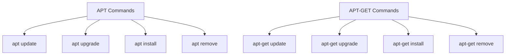

# Ubuntu APT Introduction

## What is APT?

The Advanced Package Tool, commonly known as APT, is a powerful package management system used in Ubuntu and other Debian-based Linux distributions. It simplifies the process of installing, upgrading, configuring, and removing software packages in a coherent and efficient way.

APT works with libraries of pre-compiled software packages and handles dependencies automatically, making software management on Ubuntu straightforward and user-friendly.

## Why APT Matters

Before diving into how to use APT, it's important to understand why it's a critical component of the Ubuntu ecosystem:

- **Centralized Management**: APT provides a central place to search, install, and manage software.
- **Dependency Resolution**: It automatically handles dependencies, ensuring that all required components are installed.
- **Security Updates**: It simplifies the process of keeping your system secure with regular updates.
- **Consistency**: It ensures your system remains in a consistent state during package installations or removals.

## Basic APT Commands

Let's explore the fundamental APT commands that every Ubuntu user should know:

### Updating Package Lists

Before installing or upgrading packages, you should refresh your local package index:

```bash
sudo apt update
```

Output example:
```
Hit:1 http://archive.ubuntu.com/ubuntu jammy InRelease
Get:2 http://security.ubuntu.com/ubuntu jammy-security InRelease [110 kB]
Get:3 http://archive.ubuntu.com/ubuntu jammy-updates InRelease [119 kB]
...
Reading package lists... Done
Building dependency tree... Done
Reading state information... Done
All packages are up to date.
```

### Upgrading Installed Packages

To upgrade all installed packages to their latest versions:

```bash
sudo apt upgrade
```

You'll be prompted to confirm the upgrade:

```
Reading package lists... Done
Building dependency tree... Done
Reading state information... Done
Calculating upgrade... Done
The following packages will be upgraded:
  firefox libc6 python3-pip tzdata
4 upgraded, 0 newly installed, 0 to remove and 0 not upgraded.
Need to get 15.2 MB of archives.
After this operation, 40 KB of additional disk space will be used.
Do you want to continue? [Y/n] 
```

Type `Y` and press Enter to proceed.

### Installing a Package

To install a new software package:

```bash
sudo apt install package_name
```

For example, to install the text editor `nano`:

```bash
sudo apt install nano
```

Output:
```
Reading package lists... Done
Building dependency tree... Done
Reading state information... Done
The following packages will be installed:
  nano
0 upgraded, 1 newly installed, 0 to remove and 0 not upgraded.
Need to get 269 kB of archives.
After this operation, 872 kB of additional disk space will be used.
Do you want to continue? [Y/n]
```

### Removing a Package

To remove an installed package:

```bash
sudo apt remove package_name
```

For example:

```bash
sudo apt remove nano
```

Output:
```
Reading package lists... Done
Building dependency tree... Done
Reading state information... Done
The following packages will be REMOVED:
  nano
0 upgraded, 0 newly installed, 1 to remove and 0 not upgraded.
After this operation, 872 kB disk space will be freed.
Do you want to continue? [Y/n]
```

### Searching for Packages

To search for available packages:

```bash
apt search keyword
```

For example:

```bash
apt search text-editor
```

This will display a list of packages related to text editors available in the repositories.

### Getting Information about a Package

To show detailed information about a package:

```bash
apt show package_name
```

Example:

```bash
apt show nano
```

Output:
```
Package: nano
Version: 6.2-1
Priority: standard
Section: editors
Origin: Ubuntu
...
Description: small, friendly text editor inspired by Pico
 GNU nano is an easy-to-use text editor originally designed as a replacement
 for Pico, the ncurses-based editor from the non-free mailer package Pine.
 ...
```

## The APT Configuration System

APT uses a system of configuration files and directories to manage its operations:

### Repository Sources

Package repositories are defined in the `/etc/apt/sources.list` file and in the `/etc/apt/sources.list.d/` directory. These files tell APT where to look for packages.

You can view your current repository configuration:

```bash
cat /etc/apt/sources.list
```

A typical entry looks like:

```
deb http://archive.ubuntu.com/ubuntu/ jammy main restricted
deb http://archive.ubuntu.com/ubuntu/ jammy-updates main restricted
```

### Understanding APT Repository Components

Ubuntu repositories are organized into different components:

- **Main**: Officially supported software
- **Universe**: Community-maintained software
- **Restricted**: Proprietary device drivers
- **Multiverse**: Software restricted by copyright or legal issues

## Advanced APT Usage

Let's explore some more advanced APT capabilities:

### APT vs apt-get

Traditionally, users worked with `apt-get`, but Ubuntu now recommends using `apt` for common operations. The `apt` command provides a more user-friendly interface with progress bars and color output.

Here's a comparison of equivalent commands:



### Installing Multiple Packages

You can install several packages at once:

```bash
sudo apt install package1 package2 package3
```

### Upgrading a Specific Package

To upgrade only a specific package:

```bash
sudo apt install --only-upgrade package_name
```

### Automatic Cleanup

To remove packages that were automatically installed to satisfy dependencies but are no longer needed:

```bash
sudo apt autoremove
```

### Safe Upgrading

For a more cautious approach to upgrading:

```bash
sudo apt --simulate upgrade
```

This shows what would happen during an upgrade without actually making changes.

## Practical Examples

Let's walk through some common real-world scenarios to see APT in action:

### Example 1: Setting Up a Development Environment

Installing multiple development tools at once:

```bash
sudo apt update
sudo apt install build-essential git python3-dev python3-pip
```

This installs compilation tools, Git for version control, and Python development essentials.

### Example 2: Maintaining Your System

A typical system maintenance routine using APT:

```bash
sudo apt update
sudo apt upgrade
sudo apt autoremove
sudo apt autoclean
```

This updates package lists, upgrades installed packages, removes unnecessary dependencies, and cleans up the local package cache.

### Example 3: Finding and Installing a Specific Type of Software

Let's say you need an image editor but don't know what's available:

```bash
apt search image editor
```

After reviewing the results, you decide to install GIMP:

```bash
sudo apt install gimp
```

## Common Issues and Troubleshooting

### Locked Database

If you see an error about the APT database being locked:

```
E: Could not get lock /var/lib/dpkg/lock-frontend - open (11: Resource temporarily unavailable)
E: Unable to acquire the dpkg frontend lock
```

This usually means another package management process is running. Wait for it to complete or check for stuck processes:

```bash
ps aux | grep -i apt
```

### Broken Packages

To fix broken package installations:

```bash
sudo apt --fix-broken install
```

### Failed Updates

If updates fail due to repository issues:

```bash
sudo apt clean
sudo apt update
```

## Summary

In this guide, we've covered:

- What APT is and why it's important for Ubuntu package management
- Basic commands for updating, installing, and removing packages
- APT configuration and repository system
- Advanced usage scenarios
- Real-world examples
- Common troubleshooting techniques

APT's powerful dependency resolution and streamlined interface make it one of the most valuable tools in the Ubuntu ecosystem. By mastering these basic commands, you'll be well-equipped to manage software on your Ubuntu system efficiently.

## Additional Resources and Exercises

### Further Reading

- The official Ubuntu documentation on APT: [Ubuntu Documentation](https://help.ubuntu.com/community/AptGet/Howto)
- The APT manual: Access via terminal using `man apt`

### Exercises to Practice

1. Update your system's package list and upgrade all installed packages.
2. Search for and install a text editor of your choice.
3. Find out which package provides the `wget` command using `apt show wget`.
4. Examine your system's repository configuration in `/etc/apt/sources.list`.
5. Use `apt depends python3` to see what dependencies the Python 3 package has.

By regularly practicing these commands, you'll become comfortable with Ubuntu's package management system and be able to maintain your system effectively.