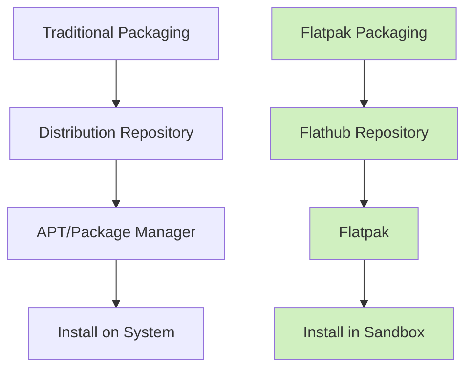

# Ubuntu Flatpak

## Introduction

Flatpak is a next-generation package management system for Linux that addresses many limitations of traditional package managers. It allows you to install applications in a sandboxed environment, separate from your operating system, providing better security, dependency isolation, and cross-distribution compatibility.

In this tutorial, you'll learn how to set up and use Flatpak on Ubuntu, understand its benefits and limitations, and see how it fits into Ubuntu's package management ecosystem.

## What is Flatpak?

Flatpak is a universal package management system for Linux that allows developers to distribute applications directly to users, regardless of their Linux distribution. Unlike traditional package managers (like APT in Ubuntu), Flatpak:

- Runs applications in isolated environments (sandboxes)
- Manages dependencies independently for each application
- Provides access to the latest application versions
- Works consistently across different Linux distributions



## Installing Flatpak on Ubuntu

Let's start by installing Flatpak on your Ubuntu system:

```bash
sudo apt update
sudo apt install flatpak
```

After installing Flatpak, you'll need to add the Flathub repository, which is the main source of Flatpak applications:

```bash
flatpak remote-add --if-not-exists flathub https://flathub.org/repo/flathub.flatpakrepo
```

It's recommended to restart your system after installing Flatpak to ensure all components are properly initialized:

```bash
sudo reboot
```

## Installing Applications with Flatpak

Once Flatpak is set up, you can install applications using the `flatpak install` command:

```bash
flatpak install flathub org.gimp.GIMP
```

This command installs GIMP from the Flathub repository. Let's break down the command:

- `flatpak install`: The basic command to install applications
- `flathub`: The remote repository to install from
- `org.gimp.GIMP`: The application ID (each Flatpak app has a unique ID)

### Example: Installing Visual Studio Code

Here's an example of installing Visual Studio Code using Flatpak:

```bash
flatpak install flathub com.visualstudio.code
```

Expected output:
```
Looking for matches…
Required runtime for com.visualstudio.code/x86_64/stable (runtime/org.freedesktop.Platform/x86_64/22.08) found in remote flathub
Do you want to install it? [Y/n]: Y

com.visualstudio.code permissions:
    ipc                     network                 pulseaudio              wayland                x11
    dri                     file access [1]         dbus access [2]

    [1] home, xdg-config/git, xdg-run/dconf
    [2] ca.desrt.dconf, org.freedesktop.Notifications, org.freedesktop.secrets

        ID                                        Branch      Op      Remote     Download
 1. [✓] org.freedesktop.Platform.GL.default      22.08       i       flathub    137.5 MB / 137.5 MB
 2. [✓] org.freedesktop.Platform                 22.08       i       flathub    203.5 MB / 203.5 MB
 3. [✓] com.visualstudio.code                    stable      i       flathub    240.2 MB / 240.2 MB

Installing 3/3… ████████████████████ 100%  Success!
```

## Running Flatpak Applications

After installation, you can run a Flatpak application in two ways:

1. From the application menu (GNOME, KDE, etc.)
2. Using the command line:

```bash
flatpak run org.gimp.GIMP
```

## Managing Flatpak Applications

### Listing Installed Applications

To view all installed Flatpak applications:

```bash
flatpak list
```

Example output:
```
Name                     Application ID               Version    Branch      Installation
GIMP                     org.gimp.GIMP                2.10.32    stable      system
Visual Studio Code       com.visualstudio.code        1.76.0     stable      system
```

### Updating Applications

To update all installed Flatpak applications:

```bash
flatpak update
```

To update a specific application:

```bash
flatpak update org.gimp.GIMP
```

### Removing Applications

To remove a Flatpak application:

```bash
flatpak uninstall org.gimp.GIMP
```

To remove unused dependencies:

```bash
flatpak uninstall --unused
```

## Understanding Flatpak Runtimes

Flatpak uses "runtimes" which provide the basic dependencies needed by applications. Think of runtimes as shared libraries that multiple applications can use.

Common runtimes include:
- `org.freedesktop.Platform`: Basic desktop libraries
- `org.gnome.Platform`: GNOME libraries
- `org.kde.Platform`: KDE libraries

When you install an application, Flatpak automatically installs the required runtime.

## Flatpak Permissions and Sandboxing

One of Flatpak's key features is its security model. Applications run in sandboxes with limited access to your system. You can control what permissions each app has.

View an application's permissions:

```bash
flatpak info --show-permissions org.gimp.GIMP
```

Example output:
```
ID: org.gimp.GIMP
Name: GIMP
Permissions:
    ipc
    network
    wayland
    x11
    file access [home, xdg-run/dconf, xdg-config/dconf:ro]
    dbus access [ca.desrt.dconf]
```

## Overriding Permissions

You can override the default permissions for installed applications:

```bash
flatpak override --nofilesystem=home org.gimp.GIMP
```

This command removes home directory access for GIMP.

To reset overrides:

```bash
flatpak override --reset org.gimp.GIMP
```

## Flatpak vs. APT (Ubuntu's Native Package Manager)

Let's compare Flatpak with Ubuntu's native package manager, APT:

| Feature | Flatpak | APT |
|---------|---------|-----|
| Sandboxing | Yes (Strong isolation) | No (System-wide installation) |
| Updates | Direct from developers | Through Ubuntu repositories |
| Availability | Latest versions | Versions in Ubuntu repos |
| Dependencies | Self-contained | Shared system-wide |
| Disk Usage | Higher (duplicated libraries) | Lower (shared libraries) |
| Cross-distro | Yes | Ubuntu/Debian only |

## Practical Examples

### Example 1: Installing and Using Firefox via Flatpak

Let's install and configure Firefox using Flatpak:

```bash
# Install Firefox
flatpak install flathub org.mozilla.firefox

# Run Firefox
flatpak run org.mozilla.firefox

# Allow Firefox to access downloads folder only (not entire home)
flatpak override --nofilesystem=home --filesystem=xdg-download org.mozilla.firefox
```

### Example 2: Using Flatpak for Development Tools

Install and use development tools that might require different dependencies:

```bash
# Install Node.js runtime
flatpak install flathub org.freedesktop.Platform.nodejs16

# Install Postman API tool
flatpak install flathub com.getpostman.Postman

# Run Postman
flatpak run com.getpostman.Postman
```

## Integrating with GNOME Software or KDE Discover

On Ubuntu with GNOME, you can integrate Flatpak with the Software Center:

```bash
sudo apt install gnome-software-plugin-flatpak
```

After installation, the GNOME Software Center will show Flatpak applications alongside native APT packages.

## Troubleshooting Common Issues

### Issue: "No such application org.example.App"

This usually means the application ID is incorrect or the app doesn't exist in the configured remotes.

Solution:
```bash
# Search for the correct application name
flatpak search gimp
```

### Issue: "Permission denied" errors

This occurs when an application lacks necessary permissions.

Solution:
```bash
# Grant additional permissions
flatpak override --filesystem=home:ro org.example.App  # Read-only access to home
```

### Issue: High Disk Usage

Flatpak applications can consume more disk space due to their self-contained nature.

Solution:
```bash
# Remove unused runtimes and extensions
flatpak uninstall --unused

# Use the partial option when installing to save space
flatpak install --no-related flathub org.example.App
```

## Summary

Flatpak offers a modern approach to software distribution on Ubuntu and other Linux distributions. Its key advantages include:

- Security through sandboxing
- Access to the latest application versions
- Consistent experience across Linux distributions
- Independence from system libraries

While it uses more disk space than traditional packages, the benefits of isolation and up-to-date software often outweigh this disadvantage. For Ubuntu users, the best approach is often a hybrid one—using APT for system components and Flatpak for desktop applications that benefit from isolation and frequent updates.

## Additional Resources

- [Official Flatpak Documentation](https://docs.flatpak.org/)
- [Flathub: The Flatpak App Store](https://flathub.org/)
- [Flatpak Commandline Reference](https://docs.flatpak.org/en/latest/flatpak-command-reference.html)

## Exercises

1. Install your favorite application using Flatpak and compare it with the APT version if available.
2. Create a custom permission override for a Flatpak application, restricting its access to specific folders only.
3. Explore Flathub and install three applications that aren't available in Ubuntu's standard repositories.
4. Compare the startup time and memory usage of a Flatpak application versus its APT counterpart.
5. Update all your Flatpak applications and observe the update process compared to APT.