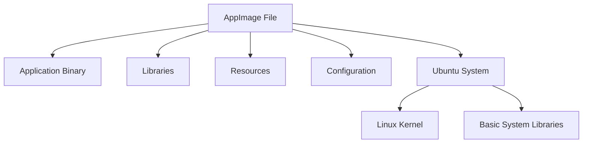

# Ubuntu AppImage

## Introduction

AppImage is a universal software packaging format for Linux that allows developers to distribute their applications in a way that works across many Linux distributions without modification. Unlike traditional package formats like `.deb` (used by Ubuntu) or `.rpm` (used by Fedora), AppImage bundles an application and all its dependencies into a single, self-contained executable file.

Think of an AppImage as a portable application that:
- Doesn't need installation
- Doesn't require administrator privileges
- Runs isolated from the rest of your system
- Works the same way across different Linux distributions

This makes AppImage an excellent choice for trying new software quickly or using applications that aren't available in Ubuntu's official repositories.

## How AppImage Works

AppImage works on a simple principle: bundle everything the application needs within a single file. Here's a visual representation of the AppImage concept:



When you run an AppImage:
1. The file is mounted as a temporary filesystem
2. The application runs from this mounted filesystem
3. When closed, the filesystem is unmounted, leaving no traces behind

## Getting Started with AppImage

### Requirements

To use AppImage on Ubuntu, you need:
- A modern version of Ubuntu (18.04 or newer recommended)
- Basic terminal knowledge
- File execution permissions enabled

### Installing AppImage Support

AppImage doesn't require special installation, but you may want to install the AppImageLauncher tool for better integration:

```bash
sudo add-apt-repository ppa:appimagelauncher-team/stable
sudo apt update
sudo apt install appimagelauncher
```

## Using AppImage Files

### Downloading AppImages

You can download AppImage files from:
- Official project websites
- AppImageHub: [https://appimage.github.io/apps](https://appimage.github.io/apps)
- GitHub releases of various projects

### Making AppImage Files Executable

After downloading an AppImage, you need to make it executable:

```bash
chmod +x ./path/to/your-application.AppImage
```

### Running an AppImage

To run an AppImage, simply execute it like any other program:

```bash
./path/to/your-application.AppImage
```

Example:

```bash
# Download an AppImage (GIMP in this example)
wget https://download.gimp.org/mirror/pub/gimp/v2.10/AppImage/gimp-2.10.30-x86_64.AppImage

# Make it executable
chmod +x gimp-2.10.30-x86_64.AppImage

# Run it
./gimp-2.10.30-x86_64.AppImage
```

### Integration with Desktop Environment

While AppImages can run as standalone applications, you might want to integrate them with your desktop environment for a better experience.

#### Using AppImageLauncher

If you installed AppImageLauncher, it will automatically:
1. Ask if you want to integrate the AppImage when you first run it
2. Create desktop shortcuts
3. Add the application to your application menu

#### Manual Integration

You can manually create a desktop entry by creating a `.desktop` file:

```bash
# Create a directory for your AppImages
mkdir -p ~/Applications

# Move your AppImage there
mv your-application.AppImage ~/Applications/

# Create a desktop entry
cat > ~/.local/share/applications/your-application.desktop << EOF
[Desktop Entry]
Name=Your Application Name
Exec=~/Applications/your-application.AppImage
Icon=application-x-executable
Type=Application
Categories=Utility;
EOF
```

## Practical Examples

### Example 1: Installing and Using GIMP via AppImage

GIMP (GNU Image Manipulation Program) is a popular image editing software. Let's install it as an AppImage:

```bash
# Download GIMP AppImage
wget https://download.gimp.org/mirror/pub/gimp/v2.10/AppImage/gimp-2.10.30-x86_64.AppImage

# Make it executable
chmod +x gimp-2.10.30-x86_64.AppImage

# Run GIMP
./gimp-2.10.30-x86_64.AppImage
```

Output:
```
GIMP will launch with its interface. No installation needed!
```

### Example 2: Using AppImage for Development Tools

Let's try using Visual Studio Code as an AppImage:

```bash
# Download VS Code AppImage
wget https://github.com/VSCodium/vscodium/releases/download/1.77.3.23102/VSCodium-1.77.3.23102-x86_64.AppImage

# Make it executable
chmod +x VSCodium-1.77.3.23102-x86_64.AppImage

# Run VS Code
./VSCodium-1.77.3.23102-x86_64.AppImage
```

### Example 3: Running Multiple Versions of an Application

One advantage of AppImage is the ability to run multiple versions of the same application:

```bash
# Download two different versions of an application (example with Inkscape)
wget https://inkscape.org/gallery/item/36554/Inkscape-1.1.2_2022-05-15_dc2aedaf03-x86_64.AppImage
wget https://inkscape.org/gallery/item/40550/Inkscape-1.2.2_2023-02-27_091e20ef0f-x86_64.AppImage

# Make both executable
chmod +x Inkscape-1.1.2*.AppImage
chmod +x Inkscape-1.2.2*.AppImage

# Run either version as needed
./Inkscape-1.1.2_2022-05-15_dc2aedaf03-x86_64.AppImage
# or
./Inkscape-1.2.2_2023-02-27_091e20ef0f-x86_64.AppImage
```

## Advanced AppImage Usage

### Updating AppImages

Most AppImages don't include automatic update mechanisms. To update an AppImage:

1. Download the new version
2. Replace the old file with the new one
3. Make sure it's executable

Some applications might include built-in update features using the libappimage library.

### Creating Your Own AppImage

While beyond the scope of this beginner guide, you can create your own AppImages using tools like:

```bash
# Install AppImage creation tools
sudo apt install -y appstream-util build-essential desktop-file-utils fakeroot
```

Then use AppImageKit or linuxdeployqt for the actual packaging.

### Command-Line Options

Most AppImages support common command-line options:

```bash
# Run AppImage without mounting
./application.AppImage --no-mount

# Extract the contents without running
./application.AppImage --appimage-extract

# Display AppImage information
./application.AppImage --appimage-offset
```

## Advantages and Disadvantages

### Advantages

- **Portability**: Works across Linux distributions
- **No Installation**: Just download and run
- **No Dependency Conflicts**: Each AppImage contains its own dependencies
- **No Administrator Rights**: Regular users can use AppImages
- **Version Control**: Can keep multiple versions of the same application

### Disadvantages

- **File Size**: AppImages can be larger than traditional packages
- **Updates**: No centralized update mechanism (unless built into the app)
- **Resource Usage**: Multiple AppImages might duplicate common libraries
- **Desktop Integration**: May require additional steps for full integration

## Troubleshooting

### Common Issues and Solutions

#### AppImage Won't Run

If you see "Permission denied":
```bash
# Make sure the file is executable
chmod +x your-application.AppImage
```

If you see "No such file or directory" on a 64-bit AppImage:
```bash
# Install 32-bit compatibility libraries
sudo apt install libc6:i386
```

#### Integration Problems

If the AppImage doesn't appear in your application menu after using AppImageLauncher:
```bash
# Update application database
update-desktop-database ~/.local/share/applications
```

## Summary

AppImage provides a simple, portable way to distribute and use applications on Ubuntu and other Linux distributions. Key points to remember:

1. AppImages are self-contained executable files
2. No installation required - just download, make executable, and run
3. They work across different Linux distributions
4. AppImages are ideal for trying new software or using applications not in official repositories
5. Tools like AppImageLauncher can help with desktop integration

## Additional Resources

- Official AppImage documentation: [https://docs.appimage.org/](https://docs.appimage.org/)
- AppImageHub (directory of available AppImages): [https://appimage.github.io/](https://appimage.github.io/)
- AppImage GitHub repository: [https://github.com/AppImage/AppImageKit](https://github.com/AppImage/AppImageKit)

## Exercises

1. Download and run a popular application like VLC media player as an AppImage.
2. Create desktop integration for an AppImage manually (without AppImageLauncher).
3. Compare the size and launch time of an application installed via apt versus its AppImage version.
4. Try extracting an AppImage to see what's inside using the `--appimage-extract` option.
5. Research how to create a simple AppImage for a basic application.