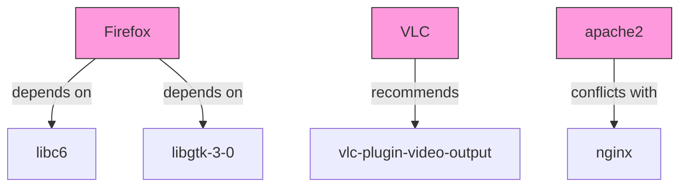

# Ubuntu Dependency Management

## Introduction

When you install software on Ubuntu, you're rarely installing just a single, isolated program. Most applications rely on other software components to function properly. These relationships between packages are called **dependencies**. Understanding how dependencies work in Ubuntu is crucial for effective system management, troubleshooting installation issues, and maintaining a healthy system.

In this guide, we'll explore how Ubuntu handles package dependencies, common dependency-related issues, and the tools available to manage them effectively.

## What Are Package Dependencies?

Dependencies are relationships between software packages where one package requires another to function correctly. In Ubuntu's package management system:

- **Package A depends on Package B**: Package A needs Package B to be installed to work properly
- **Package C recommends Package D**: Package D is suggested but not strictly required
- **Package E conflicts with Package F**: These packages cannot be installed simultaneously

Let's visualize these relationships:



## Types of Dependencies in Ubuntu

Ubuntu's APT (Advanced Package Tool) system recognizes several types of package relationships:

1. **Depends**: Mandatory packages that must be installed
2. **Recommends**: Packages that are highly recommended but not required
3. **Suggests**: Optional packages that might enhance functionality
4. **Conflicts**: Packages that cannot be installed together
5. **Replaces**: Packages that this package replaces
6. **Breaks**: Packages that would break if this package is installed

## Viewing Package Dependencies

You can examine a package's dependencies using several commands:

### Using `apt show`

The `apt show` command displays detailed information about a package, including its dependencies:

```bash
apt show firefox
```

This might output:

```
Package: firefox
Version: 108.0+build2-0ubuntu0.22.04.1
Priority: optional
Section: web
Origin: Ubuntu
...
Depends: lsb-release, libatk1.0-0 (>= 1.12.4), libc6 (>= 2.35), 
  libcairo-gobject2 (>= 1.10.0), libcairo2 (>= 1.10.0), 
  libdbus-1-3 (>= 1.9.14), libdbus-glib-1-2 (>= 0.78), 
  libfontconfig1 (>= 2.12.6), libgcc-s1 (>= 3.0), 
  libgdk-pixbuf-2.0-0 (>= 2.22.0), ...
Recommends: libcanberra0, libdbusmenu-glib4, libdbusmenu-gtk3-4
Suggests: fonts-lyx
...
```

### Using `apt-cache depends`

For a more focused view of just the dependencies:

```bash
apt-cache depends firefox
```

Output:

```
firefox
  Depends: lsb-release
  Depends: libatk1.0-0
  Depends: libc6
  ...
  Recommends: libcanberra0
  Recommends: libdbusmenu-glib4
  ...
  Suggests: fonts-lyx
```

### Using `apt-cache rdepends`

To see reverse dependencies (packages that depend on a specific package):

```bash
apt-cache rdepends libc6
```

This shows which packages rely on the `libc6` library.

## Handling Dependencies During Installation

When you install a package using `apt install`, APT automatically resolves and installs dependencies:

```bash
sudo apt install vlc
```

Example output:

```
Reading package lists... Done
Building dependency tree... Done
Reading state information... Done
The following additional packages will be installed:
  libvlc-bin libvlc5 libvlccore9 vlc-bin vlc-data vlc-plugin-base vlc-plugin-video-output
Suggested packages:
  vlc-plugin-access-extra vlc-plugin-notify vlc-plugin-samba vlc-plugin-skins2 vlc-plugin-video-splitter
  vlc-plugin-visualization
The following NEW packages will be installed:
  libvlc-bin libvlc5 libvlccore9 vlc vlc-bin vlc-data vlc-plugin-base vlc-plugin-video-output
0 upgraded, 8 newly installed, 0 to remove and 0 not upgraded.
Need to get 7,296 kB of archives.
After this operation, 33.2 MB of additional disk space will be used.
Do you want to continue? [Y/n]
```

Notice how APT lists:
- Required dependencies (additional packages)
- Suggested packages (optional)
- Total disk space required

## Dependency Resolution Strategies

By default, APT installs both required dependencies and recommended packages. You can modify this behavior:

### Install Only Required Dependencies

```bash
sudo apt install --no-install-recommends vlc
```

This installs VLC with only mandatory dependencies, resulting in a smaller installation.

### Install with Suggested Packages

```bash
sudo apt install --install-suggests vlc
```

This installs VLC with both recommended and suggested packages.

## Dealing with Dependency Issues

Dependency problems are common in package management. Here are some issues you might encounter:

### 1. Broken Dependencies

When dependencies are missing or incompatible:

```bash
sudo apt install -f
```

This command attempts to fix broken dependencies by installing missing packages or resolving conflicts.

### 2. Dependency Hell

When circular dependencies or complex conflicts occur, you might need to use more advanced techniques:

```bash
sudo apt-get clean
sudo apt-get update
sudo dpkg --configure -a
sudo apt-get install -f
```

### 3. Checking for Broken Packages

To identify broken packages on your system:

```bash
dpkg --audit
```

Or using a graphical tool:

```bash
sudo apt install synaptic
```

Then run Synaptic Package Manager and use the "Broken" filter.

## Advanced Dependency Management Tools

For more complex dependency management, Ubuntu offers several powerful tools:

### 1. `aptitude`

`aptitude` provides more sophisticated dependency resolution than `apt`:

```bash
sudo apt install aptitude
sudo aptitude install package-name
```

`aptitude` offers interactive conflict resolution and can suggest alternative solutions to dependency problems.

### 2. `apt-rdepends`

For recursive dependency analysis:

```bash
sudo apt install apt-rdepends
apt-rdepends firefox
```

This shows the complete dependency tree, including dependencies of dependencies.

### 3. `deborphan`

To find orphaned packages (packages that were installed as dependencies but are no longer needed):

```bash
sudo apt install deborphan
deborphan
```

### 4. `apt autoremove`

To remove automatically installed packages that are no longer needed:

```bash
sudo apt autoremove
```

## Managing Dependencies with APT Configuration

You can customize how APT handles dependencies by modifying its configuration files.

### Editing APT Preferences

Create or edit `/etc/apt/apt.conf.d/10recommends`:

```bash
sudo nano /etc/apt/apt.conf.d/10recommends
```

Add the following to disable installation of recommended packages by default:

```
APT::Install-Recommends "false";
APT::Install-Suggests "false";
```

## Practical Example: Analyzing Firefox Dependencies

Let's walk through analyzing Firefox's dependency structure:

```bash
# Install firefox if not already installed
sudo apt install firefox

# Check direct dependencies
apt-cache depends firefox | grep Depends | head -10

# Check size of all dependencies
apt-cache depends firefox | grep Depends | wc -l

# Find a specific dependency
apt-cache depends firefox | grep libgtk

# Check what provides a specific dependency
apt-cache search libgtk | grep -i "^libgtk"

# Check what would happen if we removed a dependency
apt-get -s remove libgtk-3-0
```

## Dependency Visualization

For visual learners, you can generate graphs of package dependencies:

```bash
sudo apt install debtree
debtree firefox > firefox_deps.dot
```

You can convert the .dot file to an image using Graphviz:

```bash
sudo apt install graphviz
dot -Tpng firefox_deps.dot -o firefox_deps.png
```

## Summary

Understanding package dependencies in Ubuntu is essential for effective system management. Key points to remember:

- Dependencies define relationships between packages
- APT automatically resolves and installs required dependencies
- You can control which types of dependencies get installed
- Tools like `apt`, `aptitude`, and `deborphan` help manage dependencies
- Fixing dependency issues is an important troubleshooting skill

By mastering dependency management, you'll be better equipped to maintain a clean, functional Ubuntu system and resolve installation problems when they arise.

## Additional Resources

- [Ubuntu Package Management documentation](https://help.ubuntu.com/community/AptGet/Howto)
- [Debian Policy Manual on Dependencies](https://www.debian.org/doc/debian-policy/ch-relationships.html)
- [APT User's Guide](https://www.debian.org/doc/manuals/apt-guide/index.en.html)

## Exercises

1. Use `apt-cache depends` to examine the dependencies of a package you frequently use.
2. Try installing a complex package with and without recommended packages and compare the difference in disk space used.
3. Find and remove orphaned packages on your system using `deborphan`.
4. Create a dependency graph for a small utility package using `debtree`.
5. Practice resolving a broken dependency by intentionally removing a required package and then fixing it with `apt install -f`.